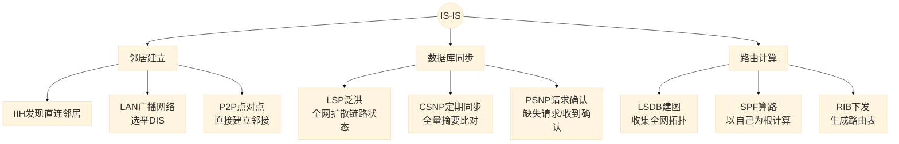
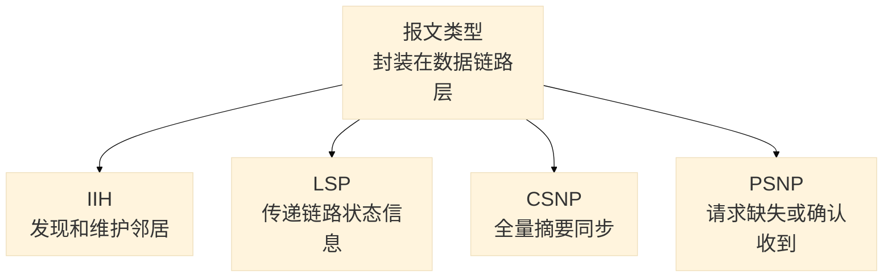
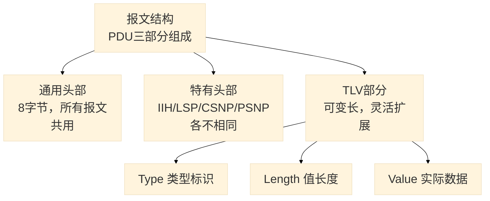
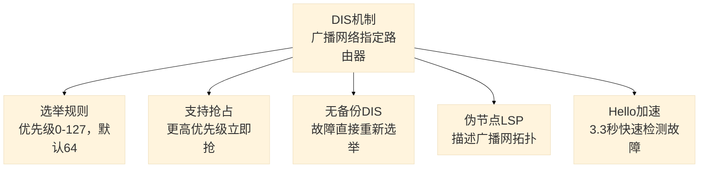
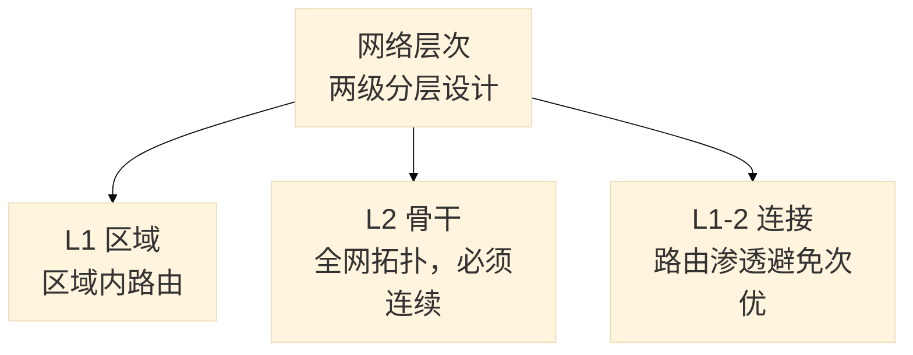
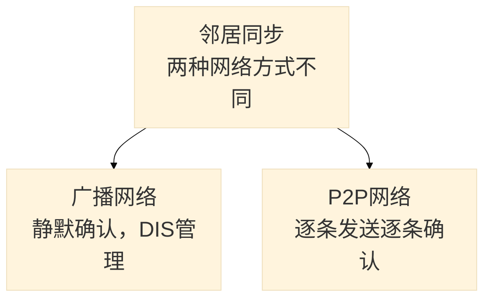

# IS-IS 路由协议知识大纲（未完成版）

### 核心特点： **链路状态路由协议 | 封装在数据链路层 | 运营商骨干网首选**

---

## 知识图谱

### 一、协议核心流程



### 二、报文类型



### 三、报文结构



### 四、DIS 机制



### 五、网络层次



### 六、邻居同步



---

## 一、协议核心流程

IS-IS 做三件事：

1. **邻居建立**：IIH 发现直连邻居，LAN（广播网络，如以太网）选举 DIS，P2P（点对点，如串行链路）直接建立邻接
2. **数据库同步**：LSP 泛洪全网，CSNP 定期同步 LSDB，PSNP 请求缺失 LSP 或确认收到
3. **路由计算**：每台路由器以自己为根运行 SPF 算法，计算无环最短路径树

---

## 二、控制平面 & 转发平面

**控制平面（画地图）**：IIH 建立邻居 → LSP 泛洪 → LSDB 同步 → SPF 计算 → RIB

**转发平面（送快递）**：RIB 下发 FIB → 查表 → 封装二层头 → 硬件转发

---

## 三、网络层次

| 角色 | 功能                                 |
| :--- | :----------------------------------- |
| L1   | 区域内路由，去往外区域走默认路由     |
| L2   | 骨干路由，必须连续                   |
| L1-2 | 连接 L1/L2，支持路由渗透避免次优路径 |

---

## 四、报文类型

| 值   | 报文       | 用途                                    |
| :--- | :--------- | :-------------------------------------- |
| 15   | L1 LAN IIH | L1 广播网络 Hello（多路访问，如以太网） |
| 16   | L2 LAN IIH | L2 广播网络 Hello                       |
| 17   | P2P IIH    | 点对点 Hello（如串行链路）              |
| 18   | L1 LSP     | L1 链路状态信息                         |
| 20   | L2 LSP     | L2 链路状态信息                         |
| 24   | L1 CSNP    | L1 全量 LSP 摘要同步                    |
| 25   | L2 CSNP    | L2 全量 LSP 摘要同步                    |
| 26   | L1 PSNP    | L1 请求缺失 LSP 或确认收到              |
| 27   | L2 PSNP    | L2 请求缺失 LSP 或确认收到              |

---

## 五、报文结构

IS-IS 直接封装在二层，所有 PDU 结构一致：

```
通用头部(8字节) + 特有头部(按类型) + TLV(变长)
```

### 通用头部（8字节）

| 字段                            | 长度 | 说明                                                         |
| :------------------------------ | :--- | :----------------------------------------------------------- |
| 域内路由协议鉴别符              | 1    | 固定 `0x83`                                                  |
| **头部长度 (Length Indicator)** | 1    | **通用头部 + 专用头部的总长度（不含 TLV）**，因 PDU 类型而异（如 LAN IIH 为 27，P2P IIH 为 25，LSP 为 22） |
| 版本/协议 ID 扩展               | 1    | 固定 1                                                       |
| 系统 ID 长度                    | 1    | 通常 0（表示 6 字节）                                        |
| PDU 类型                        | 1    | 区分报文类型                                                 |
| 版本                            | 1    | 固定 1                                                       |
| 保留                            | 1    | 固定 0                                                       |
| 最大区域地址数                  | 1    | 设备支持的最大区域地址数                                     |

> [!NOTE]
> `Length Indicator` **不是固定 8**。它表示固定头部（通用+专用）的总长度，不同 PDU 类型取值不同。在抓包中可以看到的 L2 LAN IIH 的正确值正是8+19=27。

### TLV 三要素

| 字段   | 长度 | 说明           |
| :----- | :--- | :------------- |
| Type   | 1    | 数据类型标识   |
| Length | 1    | Value 字段长度 |
| Value  | 变长 | 实际数据       |

---

## 六、各报文关键字段

### IIH — 发现和维护邻居

- **固定头部总长度**：**27 字节**（8+19）
- **专用头部长度**：19 字节

| 字段          | 说明                                                         |
| :------------ | :----------------------------------------------------------- |
| 电路类型      | L1 / L2 / L1-2，不匹配则无法建立邻居                         |
| **Source ID** | **LAN IIH：7 字节** = System ID (6B) + 伪节点 ID (1B)<br>**P2P IIH：8 字节** = System ID (6B) + Circuit ID (1B) + 填充 (1B) |
| 保持时间      | 邻居存活时间，默认 30s = Hello 间隔 (10s) × 倍数 (3)，**无需协商** |
| PDU 长度      | 整个 IIH 报文总长度                                          |
| 优先级        | 仅广播网，DIS 选举用（0-127，默认 64，0 也参与）             |
| LAN ID        | 仅广播网，DIS 的 System ID (6B) + 伪节点 ID (1B)。抓包中显示为 `SystemID{Designated IS}` |

- DIS 的 Hello 间隔加速到 **3.3s**（普通路由器 10s）
- **常见 TLV**：区域地址(1)、IS邻居(6)、**Padding(8)**（用于 MTU 探测）、认证、P2P三次握手(240)
- **扩展 TLV（了解即可）**：支持的协议(129)、IP 接口地址(132)、重启信令(211)、多拓扑(229)

### LSP — 传递链路状态信息

- **固定头部总长度**：**22 字节**（8+14）
- **专用头部长度**：14 字节

| 字段         | 说明                                     |
| :----------- | :--------------------------------------- |
| **PDU 长度** | 整个 LSP 报文总长度（含 TLV），可变      |
| 剩余生存时间 | 老化倒计时，归零后全网删除               |
| LSP ID       | System ID + 伪节点 ID + 分片号，唯一标识 |
| 序列号       | 无符号 32 位，越大越新                   |
| 校验和       | 内容完整性校验                           |

### CSNP — 全量摘要同步

- **固定头部总长度**：**27 字节**（8+19）
- **专用头部长度**：19 字节

| 字段         | 说明                     |
| :----------- | :----------------------- |
| Source ID    | 发送者 System ID + 00-00 |
| Start LSP ID | 摘要范围起始 LSP ID      |
| End LSP ID   | 摘要范围结束 LSP ID      |

- 每条 LSP 摘要条目 16 字节：剩余生存时间(2) + LSP ID(8) + 序列号(4) + 校验和(2)
- **广播网络**：DIS 每 10s 周期发送
- **P2P 网络**：仅邻接建立时发送一次

### PSNP — 请求或确认

- **固定头部总长度**：**27 字节**（8+19）
- **专用头部长度**：19 字节

结构同 CSNP，只携带需要请求或确认的 LSP 摘要条目。

- **广播网络**：收到 CSNP 发现缺失或序列号过时 → 发送 PSNP 请求
- **P2P 网络**：收到 LSP → 逐条回复 PSNP 作为确认

---

## 七、邻居同步过程

### 广播网络

1. 双方到达 UP 状态 → 互发全量 LSP，采用**静默确认**
2. DIS 选举完成 → 生成伪节点 LSP，描述广播网络拓扑
3. DIS 每 10s 发送 CSNP 进行数据库同步
4. 其他路由器对比后，缺失或过时则发送 PSNP 请求，对应路由器回复 LSP

### P2P 网络

1. 双方到达 UP 状态 → 互发全量 LSP
2. **收到一条 LSP 即回复一条 PSNP 确认**，逐条发送逐条确认
3. 不选举 DIS，无伪节点 LSP
4. 建立时互发一次 CSNP，之后仅发送增量 LSP

---

## 八、DIS 机制

### 选举规则

| 规则       | 说明                                         |
| :--------- | :------------------------------------------- |
| 优先级     | 0-127，默认 64，越大越优先                   |
| 优先级为 0 | 也参与选举（与 OSPF 不同）                   |
| 优先级相同 | 接口 MAC 地址大的当选                        |
| 抢占       | 支持，更高优先级出现立即抢占（与 OSPF 不同） |
| 备份       | 无备份 DIS，故障直接重新选举（与 OSPF 不同） |
| 级别       | L1/L2 分别独立选举                           |
| Hello 间隔 | DIS 加速到 3.3s，快速检测故障                |

### 伪节点

DIS 为广播网络生成的虚拟设备，LSP ID 中伪节点 ID 非 0。用于描述广播网络拓扑，SPF 计算时广播网呈现为星型结构。

### 与 OSPF DR 对比

|            | IS-IS DIS | OSPF DR              |
| :--------- | :-------- | :------------------- |
| 备份       | 无        | 有 BDR               |
| 抢占       | 支持      | 不支持               |
| 优先级为 0 | 参与选举  | 不参与               |
| 邻接关系   | 全互联    | 仅与 DR/BDR 建立邻接 |

---

## 九、华为配置示例

```cisco
isis 1
  network 49.0001.0000.0000.0001.00   # NET
  is-level level-2
  cost-style wide

interface GigabitEthernet0/0/0
  isis enable

interface GigabitEthernet0/0/1
  isis dis-priority 120
```

### 常用查看命令

```cisco
display isis peer                     // 查看邻居，Circuit ID 字段可识别 DIS
display isis lsdb verbose             // 查看 LSDB，查找伪节点 LSP
display isis interface verbose        // 查看 DIS 选举详情
```

