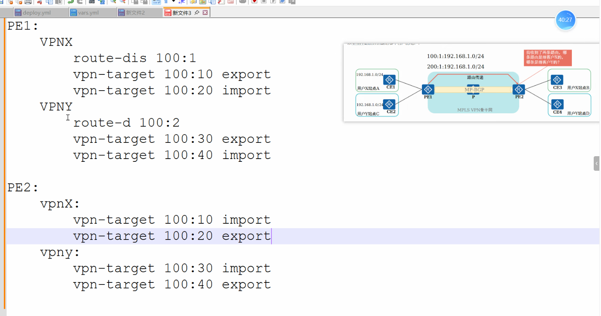

# DAY14: MPLS_VPN相关概念和相关配置

## 一、MPLS 基础

### 1.1 基本概念

**CE（Customer Edge）**：用户端设备，连接运营商网络，用于传递和接收路由。

**PE（Provider Edge）**：运营商边缘设备，是 MPLS VPN 骨干网的边界。一面为不同用户提供 VPN 接入服务，另一面接入 MPLS VPN 骨干网。

**P（Provider）**：运营商核心设备，只负责公网高速转发，不处理私网路由。


### 1.2 MPLS 与 LDP 基础配置

#### 配置原则

- **边缘设备（Ingress/Egress）**：只需在连接 MPLS 网络的接口开启 LDP。
- **Transit 设备（P 路由器）**：必须在所有接入 MPLS 网络的接口开启 LDP。

#### 配置命令

```text
# === 全局配置（所有设备） ===
# 配置 LSR ID（使用环回口地址）
[AR1] mpls lsr-id 1.1.1.1

# 全局使能 MPLS
[AR1] mpls

# 全局使能 MPLS LDP（还需在接口下开启）
[AR1] mpls ldp


# === 接口配置 ===
# 边缘设备：只在接入 MPLS 的接口开启
[AR1] interface GigabitEthernet0/0/1
[AR1-GigabitEthernet0/0/1] mpls
[AR1-GigabitEthernet0/0/1] mpls ldp

# Transit 设备：在所有接入 MPLS 的接口开启
[AR2] interface GigabitEthernet0/0/1
[AR2-GigabitEthernet0/0/1] mpls
[AR2-GigabitEthernet0/0/1] mpls ldp
[AR2] interface GigabitEthernet0/0/2
[AR2-GigabitEthernet0/0/2] mpls
[AR2-GigabitEthernet0/0/2] mpls ldp
```


### 1.3 LDP 触发策略

LDP 默认采用 **host 模式**，即**只为 32 位掩码的主机路由（环回口地址）建立 LSP**，目的是控制 LSP 数量，节省设备资源。

若需要为网段路由建立 LSP，可切换为 **ip-prefix 模式**：

```text
[AR1] mpls
[AR1-mpls] lsp-trigger ip-prefix ldp
```


### 1.4 MPLS 转发关键概念

#### LSP 建立与 Token

当一个 LSP 建立成功时，系统会从一个 Tunnel ID 资源池中申请一个空闲 ID。

- **Tunnel ID**：本地概念，用于建立 LSP 的索引。
- **Token**：Tunnel ID 分配成功后，直接被复制为 Token，用于数据平面快速定位转发信息。

> Token 可以理解为"快速转发指针"。当设备收到带标签的 MPLS 报文时，根据标签快速找到对应的 Token，再通过 Token 关联的转发信息（下一跳、出标签等）进行处理，实现高效标签交换。

#### PHP（次末跳弹出）

次末跳弹出机制在华为设备上**默认开启**。由倒数第二跳 P 路由器弹出外层标签，减轻 Egress PE 的处理负担。

#### Transit 设备转发特点

Transit 设备（P 路由器）在转发时**不需要查路由表**，只需查询标签转发表（LFIB），机械地执行标签交换（Swap）即可。


## 二、Overlay 与 Underlay

### 概念

- **Underlay（底层网络）**：物理设备和链路 + 底层路由协议（OSPF/IS-IS/LDP）。任务是保证公网 IP 可达。P 路由器只在这层工作，机械地交换外层标签，对私网路由一无所知。
- **Overlay（叠加网络）**：在物理网络之上构建的逻辑网络，通过封装技术（MPLS/VXLAN/GRE）实现。任务是承载私网数据和隔离不同客户。PE 之间通过 MP-BGP 交换私网路由属于这层。

### 关系

**Overlay 依赖 Underlay，但 Underlay 对 Overlay 完全不知情。**

### 打比方

- **Underlay** = 高速公路 + 货车司机（只看转运码送货，不看箱子里是什么）
- **Overlay** = 箱子里的快递 + 收发件人（只管私网路由，不管车怎么开）

### 对应 MPLS VPN

| 层级         | 对应内容                                   |
| :----------- | :----------------------------------------- |
| **Underlay** | P 路由器逐跳交换外层标签，将报文送到 PE    |
| **Overlay**  | PE 之间通过 MP-BGP 交换私网路由 + VPN 标签 |


## 三、MPLS L3VPN 核心原理

### 3.1 路由与转发分离

> **控制平面负责"修路"，转发平面负责"跑数据"。**


### 3.2 控制平面（私网路由传递）

以拓扑 CEA — PEA — P1 — P2 — PEB — CEB，目标网络 192.168.20.0/24 为例：

1. CEA 通过静态路由或 IGP，将 192.168.20.0/24 通告给 PEA。
2. PEA 与 PEB 之间运行 MP-BGP。PEB 将路由导入 VRF，分配内层 VPN 标签（如 1024），通过 MP-BGP 发给 PEA。**P1/P2 不参与私网路由学习。**
3. PEA 在 VRF 路由表中记录：目的 192.168.20.0/24 → 下一跳 PEB → VPN 标签 1024。
4. PEB 将路由下发给 CEB。

**控制平面路径简写：**

```
CEA → PEA（普通路由通告）
PEA → PEB（MP-BGP 分发私网路由 + VPN 标签 1024，P1/P2 不参与）
PEB → CEB（普通路由下发）
```


### 3.3 转发平面（数据包穿越公网）

1. CEA 发送目的 IP 为 192.168.20.1 的纯 IP 报文给 PEA。
2. PEA 查 VRF 路由表，压入两层标签：**外层公网标签（LDP 分发）+ 内层 VPN 标签 1024**。
3. P1 收到报文，只看外层标签，执行 **Swap（标签交换）**，内层标签和 IP 报文不动。
4. P2 执行相同操作。由于 **PHP（次末跳弹出）**，P2 转发前弹出外层标签。
5. PEB 收到 [内层标签 1024][IP报文]，根据内层标签确定 VRF，弹出标签，还原纯 IP 报文，转发给 CEB。
6. CEB 送达目的主机。

**转发平面路径简写：**

```
CEA → PEA（纯 IP 包）
PEA → P1（压入双层标签）
P1 → P2（交换外层标签，内层不动）
P2 → PEB（交换外层标签，弹出外层，内层不动）
PEB → CEB（弹出内层 VPN 标签，还原纯 IP 包）
```


### 3.4 关键点总结

| 要点          | 说明                                                   |
| :------------ | :----------------------------------------------------- |
| 私网路由传递  | 只通过 MP-BGP 在 PE 之间传递，P 路由器完全不参与       |
| P 路由器转发  | 只看外层公网标签，每跳只做 Swap，不看内层标签和私网 IP |
| 外层标签      | 逐跳改变                                               |
| 内层 VPN 标签 | 整个公网传输过程中保持不变，只在 PEB 被终结            |
| PHP           | 倒数第二跳 P 路由器弹出外层标签，减轻 PEB 负担         |
| 核心思想      | 路由与转发分离 = Overlay 与 Underlay 分离              |


## 四、VPN 实例（VRF）：解决地址重叠问题

### 4.1 问题场景

当两个公司的 CE 接到同一个 PE 上，且使用相同的私网 IP 网段时，需要在同一台 PE 上区分两家的路由。


### 4.2 解决方案

#### 第一层：VRF 解决本地路由冲突

VRF（VPN Instance，虚拟路由转发实例）为每个公司创建独立的路由表。路由器默认有一个 Public VRF（即默认的 `dis ip routing-table` 查询的表）。

#### VRF 手动配置步骤

**步骤1：创建 VRF(VPN实例)**

```text
[Huawei] ip vpn-instance CompanyA
[Huawei-vpn-instance-CompanyA] ipv4-family
[Huawei-vpn-instance-CompanyA-af-ipv4] route-distinguisher 100:1
[Huawei-vpn-instance-CompanyA-af-ipv4] vpn-target 100:1 both
[Huawei-vpn-instance-CompanyA-af-ipv4] quit
[Huawei-vpn-instance-CompanyA] quit
```

**步骤2：将连接 CE 的接口绑定到 VRF(VPN实例)**

```text
[Huawei] interface GigabitEthernet0/0/1
[Huawei-GigabitEthernet0/0/1] ip binding vpn-instance CompanyA
[Huawei-GigabitEthernet0/0/1] ip address 10.1.1.1 255.255.255.0
[Huawei-GigabitEthernet0/0/1] quit
```

> 注意：`ip binding vpn-instance` 会清除接口原有的 IP 配置，需要重新配置 IP。

**步骤3：创建私网 IGP（OSPF）并绑定到 VRF(VPN实例)**

```text
[Huawei] ospf 100 vpn-instance CompanyA
[Huawei-ospf-100] area 0.0.0.0
[Huawei-ospf-100-area-0.0.0.0] network 10.1.1.0 0.0.0.255
[Huawei-ospf-100-area-0.0.0.0] quit
[Huawei-ospf-100] quit
```

**验证命令：**

```text
display ip routing-table vpn-instance CompanyA
```


#### 第二层：RD 解决骨干网路由唯一性

VRF 解决了本地路由冲突，但当路由通过 MP-BGP 通告到骨干网时，不同 VPN 的相同 IP 仍会混淆。

**RD（Route Distinguisher）**将 IPv4 路由扩展为 **VPNv4 路由**：

```
VPNv4 路由 = RD + IPv4 前缀（如 100:1:192.168.1.0/24）
```

- 在同一台 PE 上，每个 VRF 必须配置不同的 RD（本地唯一）。
- 在 MP-BGP 域内，**RD + IPv4 前缀必须唯一**。
- 规范做法：整个 MP-BGP 域内为每个 VRF 分配**全局唯一**的 RD（如 `AS号:编号` 格式）。

> **注意**：如果 RD 和 IPv4 前缀完全相同，两条路由在 MP-BGP 中就是同一条路由，会引发冲突。RT 无法解决此问题，必须由 RD 保证唯一性。


#### 第三层：RT 控制路由导入导出

RT（Route Target）决定 VPNv4 路由到达对端 PE 后，**该导入哪个 VRF**。

- **Export Target（出方向）**：发布路由时携带。
- **Import Target（入方向）**：接收路由时匹配，匹配则导入对应 VRF，不匹配则丢弃。

> **RD vs RT 总结**：**RD 做唯一性区分，RT 做分发控制。** RT 不能解决 VPNv4 路由冲突问题。


## 五、RT 配置示例（VPNX / VPNY）

### 5.1 配置逻辑图



```
PE1:
  VPNX: RD 100:1,  Export 100:10,  Import 100:20
  VPNY: RD 100:2,  Export 100:30,  Import 100:40

PE2:
  VPNX: RD 100:3,  Export 100:20,  Import 100:10
  VPNY: RD 100:4,  Export 100:40,  Import 100:30
```


### 5.2 配置命令

**PE1 配置：**

```text
# VPNX
ip vpn-instance VPNX
 ipv4-family
  route-distinguisher 100:1
  vpn-target 100:10 export-extcommunity
  vpn-target 100:20 import-extcommunity

# VPNY
ip vpn-instance VPNY
 ipv4-family
  route-distinguisher 100:2
  vpn-target 100:30 export-extcommunity
  vpn-target 100:40 import-extcommunity

# 绑定接口
interface GigabitEthernet0/0/1
 ip binding vpn-instance VPNX
 ip address 192.168.1.1 255.255.255.0

interface GigabitEthernet0/0/2
 ip binding vpn-instance VPNY
 ip address 172.16.1.1 255.255.255.0
```

**PE2 配置：**

```text
# VPNX
ip vpn-instance VPNX
 ipv4-family
  route-distinguisher 100:3
  vpn-target 100:10 import-extcommunity
  vpn-target 100:20 export-extcommunity

# VPNY
ip vpn-instance VPNY
 ipv4-family
  route-distinguisher 100:4
  vpn-target 100:30 import-extcommunity
  vpn-target 100:40 export-extcommunity

# 绑定接口
interface GigabitEthernet0/0/1
 ip binding vpn-instance VPNX
 ip address 192.168.1.1 255.255.255.0

interface GigabitEthernet0/0/2
 ip binding vpn-instance VPNY
 ip address 172.16.1.1 255.255.255.0
```


### 5.3 路由传递路径

| VPN实例  | PE1 Export | PE2 Import  | PE2 Export | PE1 Import  |
| :------- | :--------- | :---------- | :--------- | :---------- |
| **VPNX** | 100:10 →   | 匹配 100:10 | 100:20 →   | 匹配 100:20 |
| **VPNY** | 100:30 →   | 匹配 100:30 | 100:40 →   | 匹配 100:40 |

VPNX 和 VPNY 使用不同的 RT 值，路由互不泄露。


## 六、MPLS L3VPN 完整配置流程

### 6.1 配置大纲

> **先公网，后私网。公网是"路"，私网是"车"。**

**第一步：打通公网底层（所有设备）**

- 配置接口 IP（环回口作为 LSR-ID）
- 运行 IGP（OSPF/IS-IS），确保环回口互通
- 全局使能 MPLS 和 LDP
- 公网接口下使能 MPLS 和 LDP
- 产出：LDP 邻居建立，LSP 隧道形成

**第二步：创建 VPN 实例（仅 PE）**

- 创建 VRF，配置 RD（全局唯一）
- 配置 RT（控制导入导出）
- 将 CE 接口绑定到 VRF，配置私网 IP
- 产出：每个 VPN 拥有独立路由表

**第三步：建立 MP-BGP 邻居（PE 之间）**

- 使用环回口建立 IBGP 邻居
- 使能 VPNv4 地址族
- 产出：PE 之间可交换私网路由

**第四步：私网路由引入 BGP（PE 上）**

- 将私网路由（OSPF/静态/直连）引入对应 VPN 实例的 BGP
- 产出：私网路由变成 VPNv4 路由，通过 MP-BGP 传递给对端 PE

**第五步：对端 PE 接收并下发**

- 路由匹配 RT → 导入对应 VRF → 下发给 CE
- 产出：两端私网互通

### 6.2 配置流程图

```
公网底层（OSPF + LDP）
        ↓
   PE 创建 VRF
   （RD + RT）
        ↓
  MP-BGP 邻居建立
 （VPNv4 地址族）
        ↓
  私网路由引入 BGP
   （变成 VPNv4）
        ↓
  对端导入对应 VRF
        ↓
     下发给 CE
```


### 6.3 详细配置步骤

拓扑：CE1 — PE1 — P1 — PE2 — CE2，VPN实例：VPNX、VPNY

#### 第一阶段：公网底层

**步骤1：配置设备名称**

```text
system-view
sysname PE1

# 在 P1、PE2 上同样需要配置设备名称，替换为对应主机名即可
```

**步骤2：配置环回口和公网互联接口 IP**

```text
interface LoopBack1
 ip address 1.1.1.1 255.255.255.255
 quit

interface GigabitEthernet0/0/0
 ip address 10.0.12.1 255.255.255.0
 quit

# 在 P1 上同样配置环回口 2.2.2.2 和公网接口 10.0.12.2、10.0.23.1
# 在 PE2 上同样配置环回口 3.3.3.3 和公网接口 10.0.23.2
```

**步骤3：配置 OSPF，保证环回口互通**

```text
ospf 1
 area 0.0.0.0
  network 1.1.1.1 0.0.0.0
  network 10.0.12.0 0.0.0.255
 quit

# 在 P1 上同样配置 OSPF，需宣告 2.2.2.2、10.0.12.0、10.0.23.0 三个网段
# 在 PE2 上同样配置 OSPF，需宣告 3.3.3.3、10.0.23.0 网段
```

**步骤4：全局使能 MPLS 和 LDP**

```text
mpls lsr-id 1.1.1.1
mpls
 mpls ldp
 quit

# 在 P1、PE2 上同样需要全局使能 MPLS 和 LDP，lsr-id 分别改为 2.2.2.2 和 3.3.3.3
```

**步骤5：在公网接口上使能 MPLS 和 LDP**

```text
interface GigabitEthernet0/0/0
 mpls
 mpls ldp
 quit

# 在 P1 上需要在 G0/0/0 和 G0/0/1 两个接口上都使能
# 在 PE2 上需要在 G0/0/0 接口上使能
```

**步骤6：验证公网底层**

```text
# 查看路由表
display ip routing-table

# 查看 LDP 会话状态
display mpls ldp session

# 查看 LSP 信息
display mpls lsp

# 在 P1、PE2 上同样执行验证，确保路由互通且 LDP 会话建立
```


#### 第二阶段：创建 VPN 实例

**步骤7：在 PE 上创建 VRF**

```text
# VPNX
ip vpn-instance VPNX
 ipv4-family
  route-distinguisher 100:1
  vpn-target 100:10 export-extcommunity
  vpn-target 100:20 import-extcommunity
 quit
 quit

# VPNY
ip vpn-instance VPNY
 ipv4-family
  route-distinguisher 100:2
  vpn-target 100:30 export-extcommunity
  vpn-target 100:40 import-extcommunity
 quit
 quit

# 在 PE2 上同样需要创建 VPNX 和 VPNY，但 RT 方向与 PE1 相反：
# VPNX: export 100:20 / import 100:10
# VPNY: export 100:40 / import 100:30
# RD 也必须不同，如 PE2 用 100:3 和 100:4
```

**步骤8：将接口绑定到 VRF**

```text
interface GigabitEthernet0/0/1
 ip binding vpn-instance VPNX
 ip address 192.168.1.1 255.255.255.0
 quit

interface GigabitEthernet0/0/2
 ip binding vpn-instance VPNY
 ip address 172.16.1.1 255.255.255.0
 quit

# 注意：ip binding vpn-instance 会清除接口原有 IP，需重新配置

# 在 PE2 上同样需要将接口绑定 VPN 实例：
# G0/0/1 绑定 VPNX，IP 为 192.168.2.1
# G0/0/2 绑定 VPNY，IP 为 172.16.2.1
```

**步骤9：配置私网 OSPF 绑定到 VRF**

```text
ospf 100 vpn-instance VPNX
 area 0.0.0.0
  network 192.168.1.0 0.0.0.255
 quit

ospf 200 vpn-instance VPNY
 area 0.0.0.0
  network 172.16.1.0 0.0.0.255
 quit

# 在 PE2 上同样配置私网 OSPF：
# ospf 100 vpn-instance VPNX，宣告 192.168.2.0
# ospf 200 vpn-instance VPNY，宣告 172.16.2.0
```


#### 第三阶段：CE 侧基础配置

**步骤10：配置 CE 接口 IP 及内部 Loopback**

```text
system-view
sysname CE1

interface GigabitEthernet0/0/0
 ip address 192.168.1.2 255.255.255.0
 quit

interface GigabitEthernet0/0/1
 ip address 172.16.1.2 255.255.255.0
 quit

interface LoopBack0
 ip address 10.1.1.1 255.255.255.255
 quit

# 在 CE2 上同样需要配置：
# G0/0/0 IP 为 192.168.2.2
# G0/0/1 IP 为 172.16.2.2
# Loopback0 IP 为 10.2.2.2
```

**步骤11：配置 CE 的全局 OSPF**

```text
ospf 100
 area 0.0.0.0
  network 192.168.1.0 0.0.0.255
  network 10.1.1.1 0.0.0.0
 quit

ospf 200
 area 0.0.0.0
  network 172.16.1.0 0.0.0.255
 quit

# 注意：CE 上绝对不要配置 vpn-instance，它在全局路由表中运行

# 在 CE2 上同样配置 OSPF：
# ospf 100 宣告 192.168.2.0 和 10.2.2.2
# ospf 200 宣告 172.16.2.0
```


#### 第四阶段：配置 MP-BGP 邻居

**步骤12：建立 IBGP 邻居，使能 VPNv4 地址族**

PE1：

```text
bgp 100
 router-id 1.1.1.1
 peer 3.3.3.3 as-number 100
 peer 3.3.3.3 connect-interface LoopBack1

 ipv4-family vpnv4
  peer 3.3.3.3 enable
 quit
```

PE2：

```text
bgp 100
 router-id 3.3.3.3
 peer 1.1.1.1 as-number 100
 peer 1.1.1.1 connect-interface LoopBack1

 ipv4-family vpnv4
  peer 1.1.1.1 enable
 quit
```


#### 第五阶段：私网路由引入 BGP

**步骤13：在 BGP 中引入私网路由**

PE1：

```text
bgp 100
 ipv4-family vpn-instance VPNX
  import-route ospf 100
  quit
 ipv4-family vpn-instance VPNY
  import-route ospf 200
  quit
```

PE2：

```text
bgp 100
 ipv4-family vpn-instance VPNX
  import-route ospf 100
  quit
 ipv4-family vpn-instance VPNY
  import-route ospf 200
  quit
```


#### 第六阶段：验证配置

**步骤14-17：验证命令**

```text
# 查看 BGP 邻居状态
display bgp peer

# 查看 VPNv4 路由
display bgp vpnv4 all routing-table

# 查看 VPN 实例路由表
display ip routing-table vpn-instance VPNX
display ip routing-table vpn-instance VPNY

# 测试连通性
ping -vpn-instance VPNX 192.168.2.1
ping -vpn-instance VPNY 172.16.2.1
```


### 6.4 关键注意事项

| 序号 | 注意事项 |
| :--- | :--- |
| 1 | 公网底层（OSPF + LDP）必须提前打通，否则 BGP 邻居无法建立 |
| 2 | RD 在同一台 PE 上必须唯一，不同 PE 可以相同（但建议全局唯一） |
| 3 | RT 控制路由导入导出：Export 发布时携带，Import 接收时匹配 |
| 4 | `ip binding vpn-instance` 会清除接口原有 IP 配置，需重新配置 |
| 5 | CE 上绝对不要配置 `vpn-instance`，它在全局路由表中运行 |
| 6 | VPNX 和 VPNY 使用不同 RT，路由互不泄露 |


### 6.5 配置阶段汇总表

| 阶段 | 步骤 | 涉及设备 | 核心命令 |
| :--- | :--- | :--- | :--- |
| 公网底层 | 1-6 | PE1、P1、PE2 | `sysname`、`interface`、`ip address`、`ospf`、`network`、`mpls lsr-id`、`mpls`、`mpls ldp`、`mpls`（接口下）、`display mpls ldp session` |
| 创建 VPN 实例 | 7-9 | PE1、PE2 | `ip vpn-instance`、`route-distinguisher`、`vpn-target`、`ip binding vpn-instance`、`ospf vpn-instance` |
| CE 侧基础配置 | 10-11 | CE1、CE2 | `sysname`、`interface`、`ip address`、`ospf`（全局，不加 `vpn-instance`） |
| MP-BGP 邻居 | 12 | PE1、PE2 | `bgp`、`router-id`、`peer`、`connect-interface`、`ipv4-family vpnv4`、`peer enable` |
| 引入私网路由 | 13 | PE1、PE2 | `ipv4-family vpn-instance`、`import-route ospf` |
| 验证 | 14-17 | PE1、PE2、CE1、CE2 | `display bgp peer`、`display bgp vpnv4 all routing-table`、`display ip routing-table vpn-instance`、`ping -vpn-instance` |