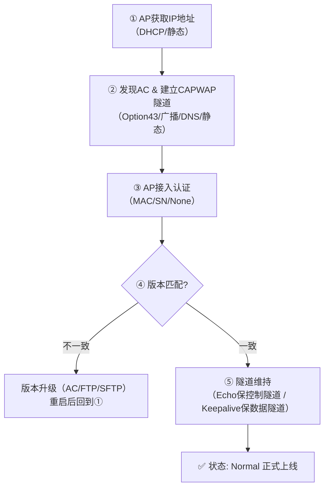

# DAY17： WLAN基础概念和配置

## 一、笔记速览（重点大纲）

- **WLAN是什么**：用无线信号（Wi-Fi/蓝牙/ZigBee等）替代部分或全部线缆的局域网。
- **AP三种形态**：FAT AP自己管自己（家庭路由）；FIT AP靠AC管（企业主流）；云AP靠云端管。
- **AC+FIT核心机制**：通过**CAPWAP隧道**（UDP 5246控/5247数据）互联；数据可走**隧道转发**（过AC）或**本地转发**（不过AC）。
- **无线身份三兄弟**：**BSS**（AP覆盖区）、**BSSID**（AP的MAC）、**SSID**（用户看到的WiFi名）。
- **AP上线五步走**：拿IP → 找AC → 过认证 → 对版本（升级）→ 保隧道（上线）。
- **配置核心三板斧**：**域管理模板**（管合规）、**射频模板**（管信号）、**VAP模板**（管WiFi名+密码），绑到AP组自动下发。
- **进阶必看**：漫游（AC内/间）、安全（WPA2/WPA3/WIDS）、QoS（WMM）、Wi-Fi 6/7新技术。

---

## 二、WLAN基础扫盲（HCIA衔接）

### 2.1 什么是WLAN
- **WLAN（无线局域网）** ：广义上指用无线电波、红外、激光等无线信号来代替有线局域网中部分或全部传输介质的网络。
- **无线 ≠ Wi-Fi**：无线家族还包括蓝牙（短距传文件）、ZigBee（物联网低功耗）、红外（遥控器），但Wi-Fi是WLAN最主流的实现方式。
- **Wi-Fi ≈ 802.11**：在绝大多数实际场景中，Wi-Fi就是指IEEE 802.11系列标准。

### 2.2 AP的三种“胖瘦”形态

| 类型               | 一句话解释                                                   | 典型场景                         |
| ------------------ | ------------------------------------------------------------ | -------------------------------- |
| **FAT AP（胖AP）** | 自身独立完成所有无线管理和接入功能，不需要外部控制器。       | 家庭无线路由器（带路由/NAT功能） |
| **FIT AP（瘦AP）** | 自身“零配置”，所有配置和管理都由**无线控制器（AC）** 统一下发。 | 企业、学校、商场（主流）         |
| **云管理AP**       | 通过互联网连接到云端管理平台，由云平台统一下发配置。         | 连锁门店、多分支机构             |

---

## 三、AC + FIT AP 核心架构

### 3.1 CAPWAP协议（最关键隧道协议）

- **CAPWAP（无线接入点控制和配置协议）** ：AC和AP之间用来建立安全隧道、下发配置、转发数据的专用协议，**基于UDP传输**。
- **两个端口分工明确**：
  - **UDP 5246（控制隧道）**：传管理配置、心跳保活（类似“命令通道”）。
  - **UDP 5247（数据隧道）**：传用户上网业务数据（仅在**隧道转发**模式下使用）。

> 💡 **一句话理解**：CAPWAP隧道就是AC与AP之间挖的一条“专属网线”，命令和业务数据都在里面封装传输。

### 3.2 两种转发模式（必须分清）

| 模式                     | 一句话解释                                                   | 数据路径                 | VLAN需求                                        | 优缺点                             |
| ------------------------ | ------------------------------------------------------------ | ------------------------ | ----------------------------------------------- | ---------------------------------- |
| **隧道转发（集中转发）** | AP把所有用户数据包**整个塞进CAPWAP隧道**发给AC，由AC拆包后转发出去。 | STA → AP → AC → 网络     | **只需管理VLAN**（业务VLAN在隧道内层封装）      | ✅ 安全统一审计；❌ AC压力大、有延迟 |
| **本地转发**             | AP直接把用户数据包**剥掉无线头**，扔给上层交换机/路由器，不过AC。 | STA → AP → 交换机 → 网络 | **需透传业务VLAN**（管理VLAN+业务VLAN都要放行） | ✅ 速度快、AC轻负载；❌ 不便统一管控 |

**端口配置区别（务必理解）** ：

- **隧道模式（AP接交换机）** ：
  ```bash
  # AP发出的管理报文（DHCP/CAPWAP）不带标签，交换机打上PVID 100
  port link-type access
  port default vlan 100
  # 等价写法：用Trunk + PVID 100
  ```
- **本地转发模式**：
  ```bash
  # 必须透传管理VLAN 100和所有业务VLAN（如101,102）
  port link-type trunk
  port trunk allow-pass vlan 100 101 102
  port trunk pvid vlan 100   # AP无标签报文打上管理VLAN标签
  ```

### 3.3 AC组网方式

- **二层组网**：AC和AP在同一个广播域（二层网络），AP通过广播就能发现AC。适合小型网络。
- **三层组网**：AC和AP跨三层网络（不同网段），AP必须借助**DHCP Option 43**、**DNS**或**静态配置**才能找到AC。适合大型网络（一台AC管几百台AP）。

**AC连接方式**：

- **直连组网**：AC串在AP和上行网络之间（像“串联”），AC故障全断网。
- **旁挂组网（主流）** ：AC挂在核心交换机旁边（像“并联”），只处理控制和管理，业务数据交给网络基础设施，AC坏了不影响已有在线用户。

---

## 四、无线信号与“三兄弟”（BSS/SSID/BSSID）

### 4.1 频段特性
- **2.4GHz频段**（2.4~2.4835GHz，总带宽83.5MHz）：穿墙强、覆盖远，但频段窄、干扰多（蓝牙、微波炉、USB 3.0都挤在这）。
- **5GHz频段**（5.15~5.85GHz，可用约900MHz）：频段宽、干扰小、速率快，但穿墙弱。

### 4.2 无线标识三兄弟（务必分清）

| 术语      | 全称             | 一句话解释                                                   | 直观类比                             |
| --------- | ---------------- | ------------------------------------------------------------ | ------------------------------------ |
| **BSS**   | 基本服务集       | 一个AP所覆盖的无线信号范围。                                 | 一个“Wi-Fi信号罩”                    |
| **BSSID** | 基本服务集标识符 | 用AP的**MAC地址**来唯一标识这个BSS。                         | 这个罩子的“身份证号”                 |
| **SSID**  | 服务集标识符     | 用**用户可读的字符串**来表示无线网络名称。                   | 这个罩子的“名字”（如`Company-WiFi`） |
| **VAP**   | 虚拟接入点       | 一个物理AP上虚拟出多个“虚拟AP”，从而支持多个不同的SSID。     | 一台物理AP变出多根“虚拟天线”         |
| **ESS**   | 扩展服务集       | 多个使用**相同SSID**的BSS组合在一起，构成一个连续覆盖的大网络。 | 整栋楼各处都叫同一个“名字”的Wi-Fi    |

> 📝 **漫游**：指STA（手机/电脑）在同一个ESS中从AP1走到AP2，WiFi名字不变且业务不中断。

---

## 五、FIT AP 上线完整流程（HCIP核心五步走）

### 🔑 前置准备（AC必须提前配好）
- **网络互通**：配好DHCP服务器，让AP能拿到IP和AC地址（Option 43）。
- **AP组**：每台AP必须且只能加入一个组，便于批量下发配置。
- **国家码**（域管理模板）：必须指定CN（中国），否则射频发射违规。
- **CAPWAP源接口**：AC上指定一个IP地址，作为CAPWAP隧道的终点。
- **认证方式**：决定用MAC认证、SN认证还是None（测试用）。

### 📋 正式上线五步走



**每一步一句话解释**：

1. **获取IP**：AP上电后通过DHCP获得管理IP，DHCP Option43可顺带告诉它“AC的IP是多少”。
2. **发现AC**：AP用Option43、DNS解析、二层广播或静态配置去找到AC的位置，并三次握手建立CAPWAP隧道。
3. **认证准入**：AP发送`Join Request`（携带MAC/SN），AC回复`Join Response`，校验AP是否在白名单中（否则拒绝）。
4. **版本升级**（可选）：若AP当前固件版本与AC要求不符，自动从AC或FTP/SFTP服务器下载新固件，重启后重走流程。
5. **隧道维持**：上线后定期互发**Echo**（控隧道）和**Keepalive**（数据隧道）报文，一旦超时未回应就自动重建隧道，实现网络自愈。

---

## 六、WLAN模板体系（配置核心，层层嵌套）

AC通过“套模板”的方式批量管理AP，就像给AP发一套配置套餐。

### 6.1 必配“三件套”（按依赖顺序配置）

| 模板                  | 一句话解释                                                   | 配什么内容                                                   |
| --------------------- | ------------------------------------------------------------ | ------------------------------------------------------------ |
| **① 域管理模板**      | 告诉AP你在哪个国家干活，决定哪些信道和功率合法。             | `country-code cn`                                            |
| **② 射频模板**        | 调整AP“天线”的物理参数，决定信号质量。                       | 信道（如6）、功率（如20dBm）、频宽（20/40/80MHz）            |
| **③ VAP模板（核心）** | 决定用户搜到的WiFi名和怎么连上去，是**最终生效的业务模板**。 | 它内部嵌套了：SSID模板（名字）+ 安全模板（密码/加密）+ 转发模式 + 业务VLAN |

> 💡 **VAP模板的内部结构**：`VAP模板` = `SSID模板`（叫啥名）+ `安全模板`（WPA2-PSK/AES/密码）+ `转发模式`（tunnel/local）+ `业务VLAN`（数据打哪个标签）。

### 6.2 其他选配模板（用到再配）

| 模板           | 一句话解释                                    |
| -------------- | --------------------------------------------- |
| **AP系统模板** | 管AP自身系统设置，如管理VLAN、日志存放位置。  |
| **WIDS模板**   | 开启非法AP检测和反制，防“蹭网”和“钓鱼Wi-Fi”。 |
| **定位模板**   | 配合室内定位系统，计算终端物理位置。          |
| **Mesh模板**   | 用于AP之间无线组网（无需网线互联）的场景。    |

**配置优先级**：直接针对单台AP的手工配置 > AP组模板配置 > 系统默认配置。

---

## 七、实验配置速查（附逐句解释）


### 📐 规划

- **管理VLAN 100**：AP拿地址、建CAPWAP隧道用。
- **业务VLAN 101**：用户上网数据归属。
- **互联VLAN 102**：LSW1和AR1路由器互联。
- **集中转发**：业务数据经AC转发。

### 🔧 LSW1（三层交换机）配置
```bash
vlan batch 100 101 102

# AP接入端口：Access模式，打上管理VLAN 100标签
int g0/0/1
 port link-type access
 port default vlan 100
#int g0/0/2相同配置


# AC互联端口：Trunk模式，放行管理VLAN和业务VLAN
int g0/0/3
 port link-type trunk
 port trunk allow-pass vlan 100 101

# AR互联端口：access模式，和路由交互，为102 vlan
int g0/0/4
 port link-type access
 port default vlan 102
 
# DHCP给AP分配管理IP（地址池在Vlanif101）
dhcp enable
int Vlanif101
 ip add 10.23.101.1 24
 dhcp select interface   # 给AP分配/24网段的地址

int Vlanif102
 ip add 11.1.1.1 30 #和AR1互联，路由 

# 默认路由指向AR1
ip route-static 0.0.0.0 0.0.0.0 0 11.1.1.2
```

### 🔧 AC1（无线控制器）配置
```bash
vlan batch 100 101
int g0/0/1
 port link-type trunk
 port trunk allow-pass vlan 100 101


# 给AC自己的管理VLAN配IP并开启DHCP（给自身用的，也可做备用）
dhcp enable
int Vlanif100
 ip add 10.23.100.1 24
 dhcp select interface

# 指定CAPWAP隧道源接口（必须配，否则AP不知道找哪个IP建隧道）
capwap source interface Vlanif100

wlan
# 先改纳管模式（先no后mac或sn，保证上线完毕再改）
 ap auth-mode no-auth

 ap-group name group1

 # ① 域管理模板（国家码中国）
 regulatory-domain-profile name group1
  country-code cn

 # ② SSID模板（WiFi名字）
 ssid-profile name group1
  ssid wlan-test

 # ③ 安全模板（加密方式+密码）
 security-profile name group1
  security wpa-wpa2 psk pass-phrase Huawei@123 aes

 # ④ VAP模板（集大成者）
 vap-profile name group1
  forward-mode tunnel              # 集中转发
  service-vlan vlan-id 101         # 业务VLAN 101
  security-profile group1
  ssid-profile group1

 # ⑤ 把VAP模板绑定到AP组的射频上（2.4G和5G分别绑）
 ap-group name group1
  regulatory-domain-profile group1
  vap-profile group1 wlan 1 radio 0   # radio 0 = 2.4G射频
  vap-profile group1 wlan 1 radio 1   # radio 1 = 5G射频
 # 若AP为三射频型号（如AP4051TN），可额外配置：
 # vap-profile group1 wlan 1 radio 2   # radio 2 = 第二个5G或6G射频（仅三射频AP支持）
```

### 🔧 AR1（出口路由器）配置
```bash
int g0/0/0
 ip add 11.1.1.2 30
ip route-static 0.0.0.0 0 11.1.1.1   # 默认路由回指LSW1（或指向公网下一跳）
int LoopBack0
 ip add 100.100.100.100 32            # 作为远端测试目标
```
### 🔧 AP配置

```bash
#AC1
wlan
	ap-id 0 #使用连接的id进入管理页面
		ap-name AP1 #改名
        ap-group group1 #加入group1组以应用之前的配置
```


### ✅ 验证

```bash
display ap all          # 看AP状态是否为“Normal”
display vap ssid wlan-test  # 看VAP是否生效
STA> ping 100.100.100.100   # 用户侧能通，证明全网调通

#此时记得把模式改为更安全的模式
wlan
 ap auth-mode sn-auth
```

---

## 八、拓展进阶（HCIP-WLAN必须掌握）

### 8.1 漫游技术
- **漫游**：STA在同一ESS中跨AP移动并保持业务不中断。
- **AC内漫游**：STA在**同一个AC**管辖的AP之间移动，HAC=FAC，最简单。
- **AC间漫游**：STA在不同AC之间移动，需要AC间建立隧道并组成**漫游组**。
  - **HAC（家乡AC）** ：STA首次关联的AC。
  - **FAC（外地AC）** ：STA漫游后关联的AC。
- **802.11r快速漫游**：减少漫游时的认证握手延迟，提升语音/视频体验。

### 8.2 WLAN安全体系
- **空口加密三阶段**：OPEN（无加密）→ WEP（淘汰）→ WPA/TKIP（过时）→ **WPA2/AES-CCMP（当前主流）** → **WPA3/SAE（新一代）** 。
- **WIDS（无线入侵检测）/WIPS（无线入侵防御）** ：检测并反制非法AP、泛洪攻击、欺骗攻击，自动加入黑名单。
- **CAPWAP DTLS加密**：给AC和AP之间的隧道再套一层加密，防止管理流量被窃听。

### 8.3 WLAN QoS（服务质量）
- **QoS目的**：让语音、视频等**时延敏感**的业务优先获得传输机会。
- **WMM（Wi-Fi多媒体）** ：802.11e标准，将数据分为4个优先级队列（语音>视频>尽力而为>背景），高优先级数据优先抢占总线。

### 8.4 Wi-Fi 6（802.11ax）核心新技术
| 新技术       | 一句话解释                                                   |
| ------------ | ------------------------------------------------------------ |
| **OFDMA**    | 把信道细分成多个子载波，同一时刻可给多个终端同时发数据（不再排队轮流等）。 |
| **MU-MIMO**  | 多根天线同时给多个不同终端发数据，提升并发能力。             |
| **1024-QAM** | 更高阶调制，每个符号能承载更多比特，速率更高。               |
| **BSS着色**  | 给不同AP的信号涂上“颜色”，AP能识别并忽略同色干扰，提升密集场景效率。 |

### 8.5 Wi-Fi 7（802.11be）亮点
- **320MHz频宽**（Wi-Fi 6仅160MHz）、**4096-QAM**、**多链路操作（MLO）** ——同时利用2.4/5/6GHz多个频段聚合传输。

### 8.6 可靠性技术（AC冗余）
- **双链路冷备**：主AC故障，备AC接管AP。
- **N+1备份**：多台AP共享一台备用AC。
- **AC间隧道**：漫游组内AC通过CAPWAP互连，同步STA信息。

### 8.7 网络规划三板斧
- **信道规划**：2.4GHz用1、6、11三个互不重叠的信道。
- **功率规划**：保证全覆盖的同时，尽量降低功率以减少同频干扰。
- **容量规划**：根据终端密度（如会议室/礼堂）增加AP数量，而非依赖单AP高功率。

---

## 九、HCIP-WLAN 高频考点速记卡

| 考点模块       | 核心要点                                 | 一句话助记                                                  |
| -------------- | ---------------------------------------- | ----------------------------------------------------------- |
| **CAPWAP**     | UDP 5246（控制）/ 5247（数据）           | “命令走46，数据走47”                                        |
| **转发模式**   | 隧道（过AC） vs 本地（不过AC）           | “隧道安全慢，本地快但散”                                    |
| **上线流程**   | IP → 发现 → 认证 → 升级 → 维持           | “找门、验身、换新装、报平安”                                |
| **模板三件套** | 域管理 → 射频 → VAP                      | “先定规矩（国家），再调天线（射频），最后给名和密码（VAP）” |
| **漫游**       | AC内（简单） vs AC间（需HAC/FAC/漫游组） | “在家串门容易，跨小区要物业拉群”                            |
| **Wi-Fi 6**    | OFDMA + MU-MIMO + 1024-QAM + BSS着色     | “多路并发、高效调制、涂色防干扰”                            |

---

> 🎯 **结语**：WLAN核心就是**AC管AP、CAPWAP传隧道、模板配业务、漫游保移动**。建议结合实验环境多做几次配置练习，反复验证转发模式切换、模板绑定和AP上线流程，以加深对原理的理解。理论与实践并重，才能更扎实地掌握HCIP-WLAN的部署要点。