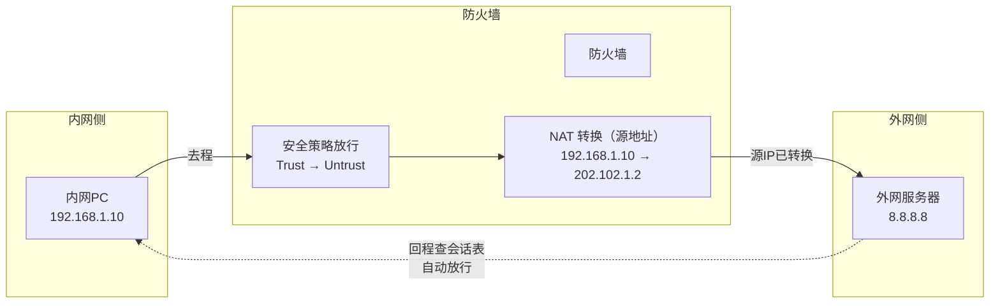
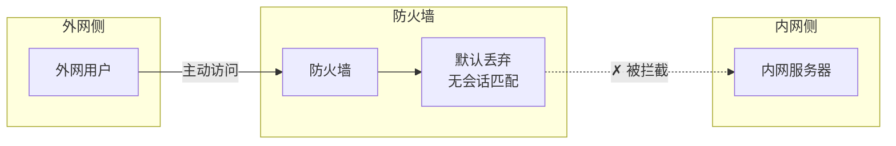
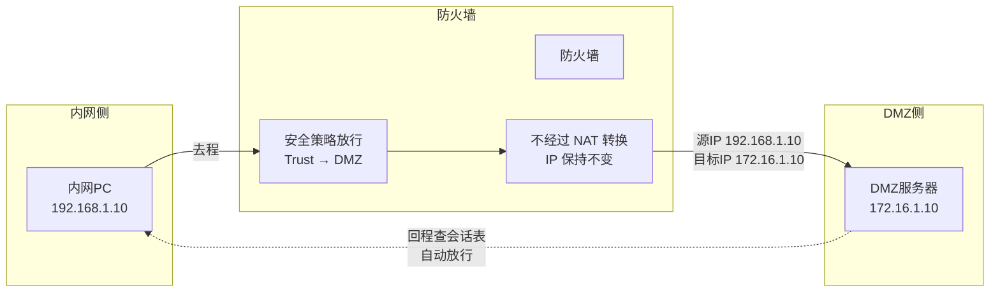
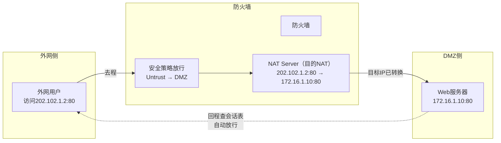
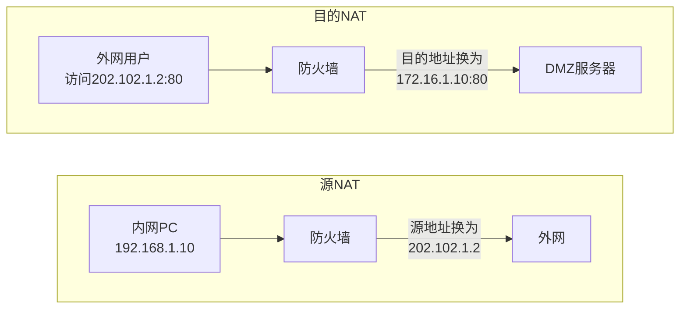

# DAY19：防火墙概念基础


### 防火墙基础

防火墙属于网络安全设备，通过配置策略拒绝非授权访问，保护网络安全。


### Zone（区域）

华为防火墙只使用区域（Zone），不采用优先级数值做策略判断。表中的安全级别仅供与其他厂商设备对接时参考，华为自身策略完全基于区域身份，不依赖优先级数字。

| 区域    | 安全级别    | 说明                                                         |
| :------ | :---------- | :----------------------------------------------------------- |
| Local   | 100（最高） | 防火墙自身，设备发出的流量或发往设备的流量                   |
| Trust   | 85          | 通常对应内网，受信任程度高                                   |
| DMZ     | 50          | 隔离区，放置对外服务器（Web/邮件），允许外网访问但限制对内网访问 |
| Untrust | 5（最低）   | 通常对应外网（互联网），完全不可信                           |


### 防火墙默认规则（华为USG体系）

1. 区域之间默认不通（所有跨区域流量，默认拒绝）
2. 接口默认不加入区域（需手动将接口划入区域）
3. 区域内部默认互通（同区域接口间流量，默认放行）
4. 管理口 G0/0/0 默认在 Trust 区域，且开启 HTTPS/SSH
5. G0/0/0 默认 IP 为 192.168.0.1/24
6. 业务接口（G0/0/1~7）默认无IP、无区域、全封（service-manage全关）
7. 安全策略默认行为：未匹配的流量默认拒绝（隐含拒绝）
8. Local → 其他区域 默认允许（但需路由可达）
9. 其他区域 → Local 默认拒绝（访问防火墙自身需单独放行）


### 发展历史

**第一代：包过滤防火墙**

基于ACL过滤，不检查会话状态，易被地址欺骗绕过。

**第二代：代理防火墙**

代理用户请求，安全性高，但处理速度慢，需为每种应用开发代理服务。

**第三代：状态检测防火墙**

检查会话状态，动态分析TCP/UDP会话，处理速度快且安全性高。

**第四代：统一威胁管理（UTM）防火墙**

集成入侵检测、防病毒、URL过滤等功能，但多功能同时运行性能下降。

**第五代：下一代防火墙（NGFW）**

解决UTM性能问题，可基于用户、应用、内容进行精细化管控。


### USG6000管理口特性

G0/0/0 是默认管理口：

- 默认IP：192.168.0.1/24
- 默认开启：HTTPS / SSH，可用于WEB-SSH访问管理
- 默认在 Trust 区域

业务口 G0/0/1~7：默认无IP、无区域、全封（service-manage全关）

一般连接防火墙的设备从 G0/0/1 开始接入，G0/0/0 保留用于管理。


### 接口划入区域

接口加入区域后才能被安全策略管理，空接口不处理任何流量。

```text
system-view
firewall zone untrust
add interface GigabitEthernet 1/0/1
```


### 安全策略 vs 服务管理

| 对比项   | security-policy                         | service-manage                               |
| :------- | :-------------------------------------- | :------------------------------------------- |
| 作用     | 管穿墙而过的流量（终点在防火墙背后）    | 管访问防火墙本机IP的流量（终点是防火墙接口） |
| 配置位置 | 系统视图                                | 接口视图                                     |
| 默认状态 | Trust→Untrust默认允许；其他方向默认拒绝 | 除G0/0/0外，所有接口默认全封                 |

**安全策略模板：**

```text
security-policy
rule name local_to_untrust_icmp
source-zone local
destination-zone untrust
service icmp
action permit
```

**服务管理模板：**

```text
interface GigabitEthernet 1/0/1
service-manage ping permit
// 其他选项：https / ssh / snmp
```


### NAT放行逻辑

NAT只负责改地址，放行流量靠安全策略，两者缺一不可。


### 会话表机制

防火墙的单向策略能保证回程流量放行，靠的是会话表。

第一个数据包到达防火墙时，防火墙检查安全策略，判断是否允许通过。如果允许，防火墙在会话表中创建一条记录（包含源IP、源端口、目标IP、目标端口、协议等信息）。后续回程数据包到达时，防火墙不再重新匹配安全策略，而是直接查会话表，只要匹配上已有记录就无条件放行。

这就是“首包检测 + 状态检测机制”——只检测第一个包，后续往返流量靠会话表维持，相当于为这条连接建立了一个临时通道。安全策略只需要配置去程方向的规则，回程流量自动处理。


### DMZ区域

DMZ（非军事区）用来放服务器，既不属于Trust也不属于Untrust。

正常情况下外部访问DMZ，DMZ不会主动访问外部，所以DMZ默认禁止主动访问其他区域。


### 区域间的规则

**内网访问外网（上网）**

配置安全策略 + 源NAT策略（easy-ip）

- 安全策略放行 Trust → Untrust
- NAT转换内网私有IP为公网IP

**外网访问内网**

默认拦截，无需额外配置。

**内网访问服务器**

仅配置安全策略放行流量，不需要NAT。

- 安全策略放行 Trust → DMZ

**外网访问服务器（发布服务）**

配置安全策略 + 目的NAT（NAT Server，即端口映射）

- 安全策略放行 Untrust → DMZ
- NAT Server将公网IP:端口映射到服务器内网IP:端口

对比：

| 场景                | 安全策略           | NAT类型               |
| :------------------ | :----------------- | :-------------------- |
| 内网→外网（上网）   | 放行 Trust→Untrust | 源NAT（easy-ip）      |
| 外网→服务器（发布） | 放行 Untrust→DMZ   | 目的NAT（NAT Server） |

本质都是“安全策略 + NAT”，但NAT的方向相反，一个转源地址（谁发起的），一个转目的地址（要访问谁）。

用 Mermaid 流程图来表示，文本渲染更清晰，方便你直接放进支持 Mermaid 的编辑器里：

### 场景1：内网 → 外网（上网）




### 场景2：外网 → 内网（默认拦截）




### 场景3：内网 → DMZ 服务器




### 场景4：外网 → DMZ（发布服务）




### NAT方向对比




### 整体逻辑对比

| 场景              | 安全策略        | NAT方向   | 转换内容             |
| :---------------- | :-------------- | :-------- | :------------------- |
| 内网→外网（上网） | Trust → Untrust | 源NAT     | 转换发起方（源IP）   |
| 外网→DMZ（发布）  | Untrust → DMZ   | 目的NAT   | 转换接收方（目标IP） |
| 内网→DMZ          | Trust → DMZ     | 不需要NAT | 不转换               |
| 外网→内网         | 无              | 无        | 默认拦截             |

**场景一：防火墙自身Ping外网（Local→Untrust）**

接口划入Untrust → 配IP → 安全策略放行Local→Untrust ICMP → 默认路由

```text
firewall zone untrust
add interface GigabitEthernet 1/0/1

interface GigabitEthernet 1/0/1
ip address 202.102.1.2 255.255.255.0

security-policy
rule name local_to_untrust
source-zone local
destination-zone untrust
service icmp
action permit

ip route-static 0.0.0.0 0.0.0.0 202.102.1.1
```

**场景二：内网（Trust）访问外网（Untrust）**

接口划入Trust + 配IP → 安全策略放行Trust→Untrust → NAT策略 → 默认路由

```text
firewall zone trust
add interface GigabitEthernet 1/0/0

interface GigabitEthernet 1/0/0
ip address 192.168.1.1 255.255.255.0

security-policy
rule name trust_to_untrust
source-zone trust
destination-zone untrust
source-address 192.168.1.0 24
action permit

nat-policy
rule name to_internet
source-zone trust
destination-zone untrust
source-address 192.168.1.0 24
action source-nat easy-ip

ip route-static 0.0.0.0 0.0.0.0 202.102.1.1
```

**场景三：外网访问DMZ服务器**

接口划入DMZ + 配IP → 安全策略放行Untrust→DMZ → NAT Server（端口映射）

```text
firewall zone dmz
add interface GigabitEthernet 1/0/2

interface GigabitEthernet 1/0/2
ip address 172.16.1.1 255.255.255.0

security-policy
rule name untrust_to_dmz
source-zone untrust
destination-zone dmz
destination-address 172.16.1.10 32
action permit

interface GigabitEthernet 1/0/1
nat server protocol tcp global 202.102.1.2 80 inside 172.16.1.10 80
```

> 注：如果公网IP是PPPoE动态获取的，将 `global 202.102.1.2 80` 改为 `global current-interface 80`。

内网访问DMZ不需要NAT，只需要安全策略放行Trust→DMZ即可。


### 常用命令

```text
display firewall zone untrust              // 查看区域成员
display security-policy rule name xxx      // 查看策略命中次数
display firewall session table             // 查看会话和NAT转换后的IP
display ip routing-table                   // 查看路由表
```


### Ping通场景速查

| 需求                   | 配置                                   |
| :--------------------- | :------------------------------------- |
| 防火墙自己Ping外网     | security-policy放行 Local→Untrust ICMP |
| 别人Ping通防火墙接口IP | service-manage ping permit             |


### 核心记忆

安全策略管“路过”，service-manage管“到达”；业务接口默认封，手动放行才能通。

接口配IP → 划入区域 → 安全策略 → NAT策略 → 默认路由。


配置的核心逻辑遵循：**接口配IP → 划入区域 → 配置路由 → 配置安全策略 → （如需上网/发布则配置NAT） → 配置服务管理（可选）**。

------

### 第一部分：防火墙正常配置步骤大纲（通用流程）

无论是内网上网还是发布服务器，都遵循以下五步法：

1. **基础环境准备（接口与IP）**
   - 将业务接口（如 G1/0/1）配置IP地址。
   - 将接口加入对应的安全区域（Trust/Untrust/DMZ）。
2. **路由可达（Routing）**
   - 配置默认路由或回程路由，保证防火墙知道数据包怎么扔出去。
3. **安全策略放行（Security-policy）**
   - 配置源区域 → 目的区域的放行规则（核心：管“路过”）。
4. **地址转换策略（NAT-policy，按需配置）**
   - **上网**：配置源NAT（Easy-IP），转换内网源地址。
   - **发布服务器**：配置NAT Server（目的NAT），转换公网目的地址。
5. **服务管理放行（Service-manage，按需配置）**
   - 如果需要外部Ping通或HTTPS管理防火墙本机IP，在接口下放行对应服务（管“到达”）。

------

### 第二部分：分场景详细配置大纲与命令集

#### 场景A：内网（Trust）访问外网（Untrust）—— 普通上网

**适用情况**：内网PC需要浏览网页、刷视频。

| 步骤                | 配置对象            | 核心命令（配置视图）                                         |
| :------------------ | :------------------ | :----------------------------------------------------------- |
| **1. 接口与区域**   | Trust口 & Untrust口 | `interface G1/0/0` `ip address 192.168.1.1 255.255.255.0` `firewall zone trust` `add interface G1/0/0`  `interface G1/0/1` `ip address 202.102.1.2 255.255.255.0` `firewall zone untrust` `add interface G1/0/1` |
| **2. 路由**         | 默认路由            | `ip route-static 0.0.0.0 0.0.0.0 202.102.1.1`                |
| **3. 安全策略**     | Trust → Untrust     | `security-policy` `rule name trust_to_untrust` `source-zone trust` `destination-zone untrust` `source-address 192.168.1.0 24` `action permit` |
| **4. NAT策略**      | 源NAT（Easy-IP）    | `nat-policy` `rule name to_internet` `source-zone trust` `destination-zone untrust` `source-address 192.168.1.0 24` `action source-nat easy-ip` |
| **5. （可选）管理** | 允许内网管理防火墙  | `interface G1/0/0` `service-manage https permit` `service-manage ping permit` |

------

#### 场景B：外网（Untrust）访问DMZ服务器 —— 发布Web服务

**适用情况**：外网用户访问公司官网。

| 步骤                | 配置对象              | 核心命令（配置视图）                                         |
| :------------------ | :-------------------- | :----------------------------------------------------------- |
| **1. 接口与区域**   | Untrust口 & DMZ口     | `interface G1/0/1` `ip address 202.102.1.2 255.255.255.0` `firewall zone untrust` `add interface G1/0/1`  `interface G1/0/2` `ip address 172.16.1.1 255.255.255.0` `firewall zone dmz` `add interface G1/0/2` |
| **2. 路由**         | 默认路由              | `ip route-static 0.0.0.0 0.0.0.0 202.102.1.1`                |
| **3. 安全策略**     | Untrust → DMZ         | `security-policy` `rule name untrust_to_dmz_web` `source-zone untrust` `destination-zone dmz` `destination-address 172.16.1.10 32` `service protocol tcp destination-port 80` `action permit` |
| **4. NAT策略**      | 目的NAT（NAT Server） | **方式一（固定IP）**： `interface G1/0/1` `nat server protocol tcp global 202.102.1.2 80 inside 172.16.1.10 80`  **方式二（PPPoE动态IP）**： `nat server protocol tcp global current-interface 80 inside 172.16.1.10 80` |
| **5. （可选）管理** | 允许外网管理接口      | `interface G1/0/1` `service-manage ping permit`（注意：生产环境谨慎开启HTTPS/SSH管理） |

------

#### 场景C：防火墙自身访问外网（Local → Untrust）

**适用情况**：防火墙需要Ping通外网网关或升级特征库。

| 步骤              | 配置对象                                                     | 核心命令（配置视图）                                         |
| :---------------- | :----------------------------------------------------------- | :----------------------------------------------------------- |
| **1. 接口与区域** | Untrust口配置IP并加入区域                                    | `interface G1/0/1` `ip address 202.102.1.2 255.255.255.0` `firewall zone untrust` `add interface G1/0/1` |
| **2. 路由**       | 默认路由                                                     | `ip route-static 0.0.0.0 0.0.0.0 202.102.1.1`                |
| **3. 安全策略**   | Local → Untrust                                              | `security-policy` `rule name local_to_untrust` `source-zone local` `destination-zone untrust` `service icmp` （或放行http/https等） `action permit` |
| **4. 注意**       | Local到其他区域默认放行，但**回程**（Untrust→Local）默认拒绝。安全策略只需放行去程Local→Untrust，**会话表机制**会自动处理回程放行。 |                                                              |

------

### 第三部分：常用验证与排障大纲

配置完成后，按此顺序排查连通性：

1. **查区域成员**：`display firewall zone untrust` （确认接口加对了）
2. **查路由表**：`display ip routing-table` （确认去程和回程路由都存在）
3. **查安全策略命中**：`display security-policy rule name xxx` （看命中次数有没有增长，没增长说明没匹配上策略）
4. **查会话表（终极确认）**：`display firewall session table` （看是否有双向会话建立，以及NAT转换后的源目IP是否正确）

------

### 第四部分：核心逻辑速查表（大纲总结）

| 需求场景         | 接口区域划分                | 安全策略方向             | NAT类型               | 路由要求           |
| :--------------- | :-------------------------- | :----------------------- | :-------------------- | :----------------- |
| **内网上网**     | G0/0/0→Trust G0/0/1→Untrust | **Trust → Untrust**      | 源NAT（easy-ip）      | 默认路由指向运营商 |
| **外网访问内网** | 默认禁止，**无需配置**      | 无                       | 无                    | 无                 |
| **内网访问DMZ**  | G0/0/0→Trust G0/0/2→DMZ     | **Trust → DMZ**          | **不需要NAT**         | 若跨网段需回程路由 |
| **外网访问DMZ**  | G0/0/1→Untrust G0/0/2→DMZ   | **Untrust → DMZ**        | 目的NAT（NAT Server） | 默认路由指向运营商 |
| **管理防火墙**   | 管理口G0/0/0默认在Trust     | 其他区域→Local需单独配置 | 无                    | 需路由可达管理IP   |

**终极记忆口诀（对应你的笔记）**：

> 接口配IP加区域，路由指向下一级；
> 安全策略管穿墙，NAT按需转方向；
> 服务管理管进门，会话表保来回通。


### 一些WIN10可用的命令

```cmd
// 打开添加硬件向导（一步步点选安装环回适配器）
hdwwiz

// 打开网络适配器面板（看到所有网卡）
ncpa.cpl

// 打开设备管理器（也可在设备管理器里添加环回）
devmgmt.msc

// 查看所有接口名称（配IP前先查名字）
netsh interface ip show interfaces

// 给环回接口配静态IP（假设接口名为"Loopback"）
netsh interface ip set address "Loopback" static 192.168.100.1 255.255.255.0

// 给环回接口再追加一个IP
netsh interface ip add address "Loopback" 192.168.100.2 255.255.255.0

// 启用环回接口
netsh interface set interface "Loopback" enable

// 禁用环回接口
netsh interface set interface "Loopback" disable

// 查看IP配置
ipconfig /all

// 测试连通性
ping 192.168.100.1
```

- `hdwwiz`：打开添加硬件向导，微软官方推荐的环回适配器安装方式。操作路径：手动安装 → 网络适配器 → Microsoft → Microsoft KM-TEST 环回适配器。
- `ncpa.cpl`：打开网络连接面板，可查看所有网卡，但不能添加环回适配器。
- `devmgmt.msc`：打开设备管理器，也可添加环回。操作路径：设备管理器 → 右键计算机名 → 添加过时硬件 → 手动安装 → 网络适配器 → Microsoft → Microsoft KM-TEST 环回适配器。