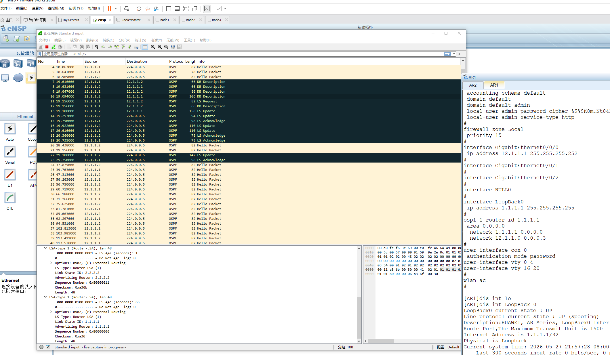

# DAY2: OSPF 详解

## 一、OSPF 基础概念

**区域划分**

- **骨干区域**：**Area 0**，所有非骨干区域必须与其相连。
- **非骨干区域**：除Area 0外的其他区域。
- **特殊区域**：
  - **Stub**（末梢区域）：不接收外部路由，用默认路由替代。
  - **NSSA**（非完全末梢区域）：可引入少量外部路由，同时具备Stub特性。

> 非骨干区域的路由器不需要太多明细路由，几条指向区域内的**默认路由**即可降低边缘路由器负担。

**Router-ID**

- 用于在OSPF域中**唯一标识**一台路由器。

- 也用于**DR/BDR选举**（越大越优先，默认情况下）。

- 配置方式：

  - 推荐**手动指定**：

    ```clike
    ospf 1 router-id 1.1.1.1
    ```

    

  - 未手动配置时**自动选择**：

    1. 选**Loopback接口**中最大的IP地址
    2. 无Loopback则选**物理接口**中最大的IP地址

- 修改Router-ID后需**重置OSPF进程**：

  ```clike
  <Huawei> system-view
  [Huawei] ospf 1 router-id 2.2.2.2
  [Huawei] quit
  <Huawei> reset ospf 1 process
  ```

  

> **注意**：Router-ID写法类似IP，但**不是IP地址**。

------

## 二、OSPF 网络类型

- **广播类型**：自动发现邻居并选举**DR/BDR**，适用于以太网等多路访问网络。
- **NBMA类型**：非广播多路访问，需**手动指定邻居**，不自动发现，如帧中继。
- **点到多点（P2MP）**：将NBMA网络模拟为多条点到点链路，**不需DR/BDR**。
- **点到点（P2P）**：只有两台设备，**无需选举DR/BDR**，串行链路常用。

> 多路访问网络包括**广播类型**和**NBMA类型**。

**通信方式**

- **组播**（1对组）：**224.0.0.5**是OSPF所有路由器的组播地址，启用OSPF的接口都会监听这个地址。
- **广播**（1对全）：指向全F（**255.255.255.255**），域内所有人都要处理。
- **单播**（1对1）：只发给一个目标，其他设备忽略。

> 特殊点：只有**P2P类型**以组播形式发送Hello报文（组播地址224.0.0.5）。

------

## 三、OSPF 报文类型与交互

**五种报文**

1. **Hello**：发现和维护**邻居关系**。
2. **DD**（Database Description）：交换链路状态数据库（**LSDB**）的摘要。
3. **LSR**（Link State Request）：请求特定的**链路状态信息**。
4. **LSU**（Link State Update）：发送详细的**链路状态信息**（LSA）。
5. **LSAck**（Link State Ack）：对收到的LSU进行**确认**。

**报文交互流程**

1. 通过**Hello报文**发现对方，建立邻居或邻接关系。
2. 通过**DD报文**交换LSDB摘要。
3. 发现缺失数据，发送**LSR**请求。
4. 收到LSR后，通过**LSU**发送详细LSA。
5. 收到LSU后，用**LSAck**确认。

> **核心交互顺序**：Hello → DD → LSR → LSU → LSAck

**OSPF报文头部关键字段**

- **Version**：版本号，IPv4为2。
- **Type**：报文类型（1=Hello，2=DD，3=LSR，4=LSU，5=LSAck）。
- **Packet Length**：整个报文长度。
- **Router ID**：发送者唯一标识。
- **Area ID**：所属区域，**同区域才能建立邻居**。
- **Checksum**：校验和，检测传输错误。
- **Auth Type**：认证类型（0=无，1=明文，2=MD5）。
- **Authentication**：认证数据。

------

## 四、邻居关系与状态机

**邻居 vs 邻接**

- **邻居关系**：通过Hello报文发现对方，参数匹配即可建立，是互信初始状态。
- **邻接关系**：在邻居基础上，成功交换DD和LSA，完成**LSDB同步**后的最终状态。

> **关键**：邻居关系停留在**2-way**，邻接关系进入**Full**。

**邻居状态机（8种）**

- 正常路径：**Down → Init → 2-way → Exstart → Exchange → Loading → Full**
- DRother之间停留在**2-way**状态。
- NBMA网络会进入Attempt状态：Down → **Attempt** → Init → 2-way → Exstart → Exchange → Loading → Full

各状态含义：

1. **Down**：初始状态，未收到Hello。
2. **Attempt**：仅NBMA网络，主动发送Hello但未收到回复。
3. **Init**：收到对方的Hello报文。
4. **2-way**：收到Hello中包含自己的Router-ID。如果无需形成邻接（如DRother之间,非DR/BDR），停留在此；否则继续。
5. **Exstart**：协商**主从关系**，确定DD序列号。
6. **Exchange**：交换**DD报文**。
7. **Loading**：交换**LSR/LSU/LSAck**，同步LSA。
8. **Full**：**LSDB完全同步**，邻接关系建立完成。

**建立邻居的必须检查项**

- **Hello/Dead Interval**：默认Hello=10s，Dead=40s（Hello的4倍）。
- **区域ID**必须一致。
- **认证信息**必须匹配。
- **特殊区域标识**（如Stub标志）必须一致。

**加速收敛方法**

- 缩短**Hello间隔**（最小可到1s），Dead Interval随之缩短。
- 修改网络类型为**P2P**，无需选举DR/BDR。
- 部署**BFD**实现毫秒级故障检测。

**故障检测时间**

- 默认Dead Interval=40s，链路中断最多40s发现。
- 最短Hello间隔为1s，Dead=4s，问题可在**4秒内**发现。

> 为了更好的网络质量，无感切换网络，使用**BFD**（毫秒级检测报文）。

------

## 五、DR 与 BDR

**为什么需要DR/BDR**

- 避免广播网络中**全互联的邻接关系**。
- 减少LSA**重复泛洪**，提升网络效率。

**角色与职责**

- **DR**（指定路由器）：唯一，负责与所有DROther建立邻接关系，代表该网络**发送LSA**。
- **BDR**（备份指定路由器）：唯一，监听并备份DR信息，但不主动泛洪LSA。
- **DROther**：非DR/BDR的路由器，只与DR和BDR建立邻接。

> **DR也被称为伪节点**：在SPF计算中，其他路由器只需计算到**伪节点**的路径，而非所有邻居。DR生成**Type-2 LSA**，描述网络中所有相连路由器，避免不必要的泛洪。

**选举规则**

1. 比较**优先级**（Priority），默认=1，范围0-255，越高越优先。
2. 优先级相同则比较**Router-ID**，越大越优先。
3. Priority=0表示**放弃选举**，不参与DR/BDR竞争。

**广播网络中LSA组合**

- **Type-1 LSA**包含：本机接口IP、DR接口IP。
- **Type-2 LSA**包含：Router-ID、掩码。
- **Type-1 + Type-2** 即可确定本机IP、网段、DR信息。

------

## 六、DD同步详细过程

**Exstart状态**

- 交互**空DD报文**，目的：
  - 确定**主从关系**，避免DD序列号冲突。
  - 选举规则：**Router-ID大者为Master**。
  - Master控制DD序列号分配，Slave响应。
- 可选比较接口**MTU**（华为默认不开启）。

> **主从选举**：Router-ID大的路由器成为Master，负责控制序列号。

**Exchange状态**

- **Slave**先向Master发送带摘要的DD报文。
- 序列号使用Master在Exstart阶段确定的初始seq。

**Loading状态**

- **主从关系解除**，双方互相检查LSDB缺失的LSA。
- 缺少则发送**LSR请求** → 对方回复**LSU** → 本机回复**LSAck**确认。
- 同步完成后进入**Full**状态。

**Full状态**

- **LSDB完全同步**，邻接关系建立完成。

------

## 七、OSPF 核心：LSA与SPF计算

**LSA在OSPF中的作用**

- 描述**网段/掩码**（即路由信息）。
- 描述**网络节点**（绘制拓扑）。

**主要LSA类型（IPv4 OSPFv2）**

- **Type-1（Router LSA）**：每台路由器生成，描述本机接口信息，仅在**本区域内泛洪**。
  - 包含本机接口IP、链路类型、Cost等信息，是SPF计算中识别**节点**的基础。
- **Type-2（Network LSA）**：由**DR**生成，描述广播网络中与DR相连的所有路由器。
  - Type-2存在的意义在于**简化拓扑**：广播网络如果全互联，SPF计算需要处理网状关系，很复杂。有了Type-2，DR被抽象成一个**伪节点**，其他路由器只需计算自己到伪节点的路径，SPF算法只看一颗星型拓扑就够了。
  - **Type-1 + Type-2 配合**才能还原完整广播网段信息：Type-1说"我是谁、我连到了DR"，Type-2说"这个网段都有谁"，两者一对就能确定本机IP、所属网段。
- **Type-3（Summary LSA）**：由**ABR**生成，将其他区域的路由信息汇总传递到本区域。
  - 这是区域间路由的关键，ABR把其他区域的路由"翻译"成Type-3注入本区域，实现跨区域通信。
- **Type-4（ASBR Summary LSA）**：由**ABR**生成，描述**ASBR**的位置。
  - 告诉区域内其他路由器"去往外部路由的出入口在哪里"，配合Type-5使用。
- **Type-5（External LSA）**：由**ASBR**生成，描述从**外部引入**的路由。
  - 负责把非OSPF路由（如静态、其他协议）引入OSPF域内泛洪。
- **Type-7（NSSA External LSA）**：在**NSSA区域**内描述外部引入路由，离开NSSA时由ABR转为Type-5。
  - NSSA的特殊之处在于：Stub区域不允许有Type-5，但NSSA允许有限引入外部路由，用Type-7在本区内传递，出区域时再转成Type-5。

**SPF计算流程**

1. 建立**邻居关系**。
2. 各路由器将**LSA放入LSDB**。
3. 基于LSDB运行**SPF算法**，计算最短路径树（SPT），包括：
   - 当前网络有哪些**节点**、所属**区域**。
   - **路由信息**。
   - 路径**Cost**。
   - 到达**ASBR**的路径。
4. 生成**OSPF路由表**。
5. OSPF路由表**提交到IP路由表**。

> **SPF核心**：每台路由器以自己为根，基于LSDB中所有LSA拼出完整的网络拓扑图，然后计算到达每个节点的最短路径，生成路由。Type-1和Type-2负责画出区域内拓扑，Type-3负责跨区域，Type-4+5负责外部路由可达性。

------

## 八、实验示例

```clike
拓扑：R1 --- R2

R1:
interface LoopBack0
 ip address 1.1.1.1 32
interface GigabitEthernet0/0/0
 ip address 12.1.1.1 30
ospf 1 router-id 1.1.1.1
 area 0
  network 1.1.1.1 0.0.0.0
  network 12.1.1.0 0.0.0.3

R2:
interface LoopBack0
 ip address 2.2.2.2 32
interface GigabitEthernet0/0/0
 ip address 12.1.1.2 30
ospf 1 router-id 2.2.2.2
 area 0
  network 2.2.2.2 0.0.0.0
  network 12.1.1.0 0.0.0.3
```

