# DAY2-OSPF邻接建立实验

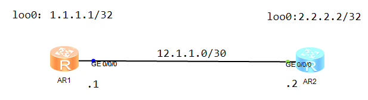

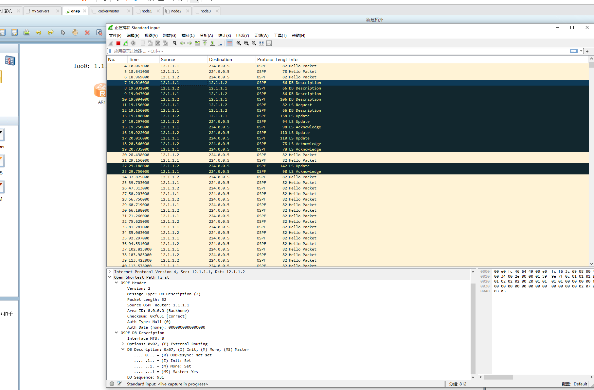

1.Hello（Down->Init->2-way）

双方互发hello包发现对方，告知本机Router-ID和当前DR

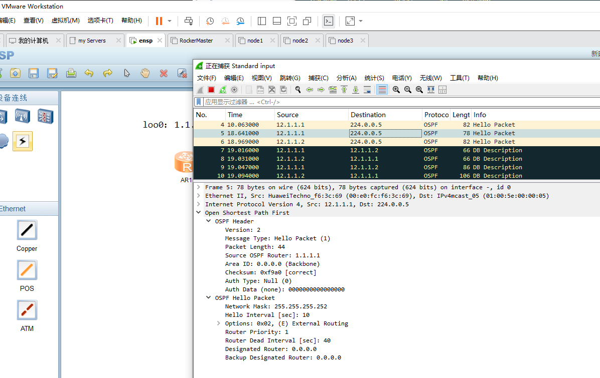

此时会通过Hello报文信息同时进行自动DR/BDR选举，上面看DR/BDR为空，但后续就能看到DR/BDR已经选出，当都收到Hello包后会自动选出，可以看到DR在R2的hello报文中已经指定为R2

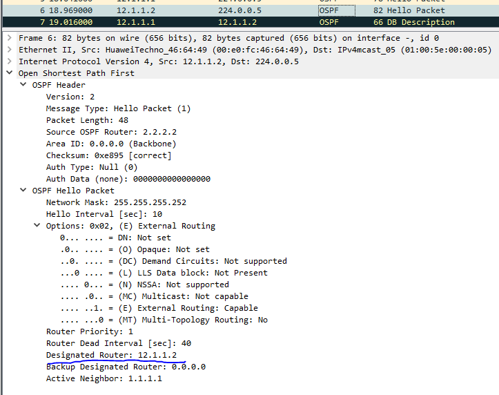

2.接着通过发空DD报文选举Master，可以看到**Master为都置1**(2-Way->ExStart)

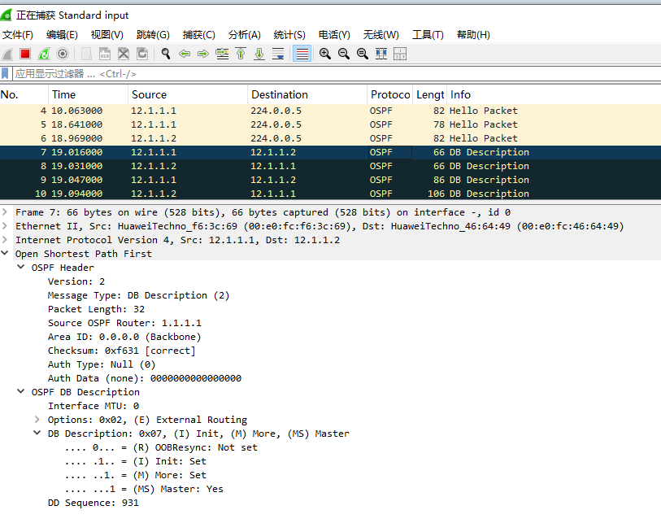

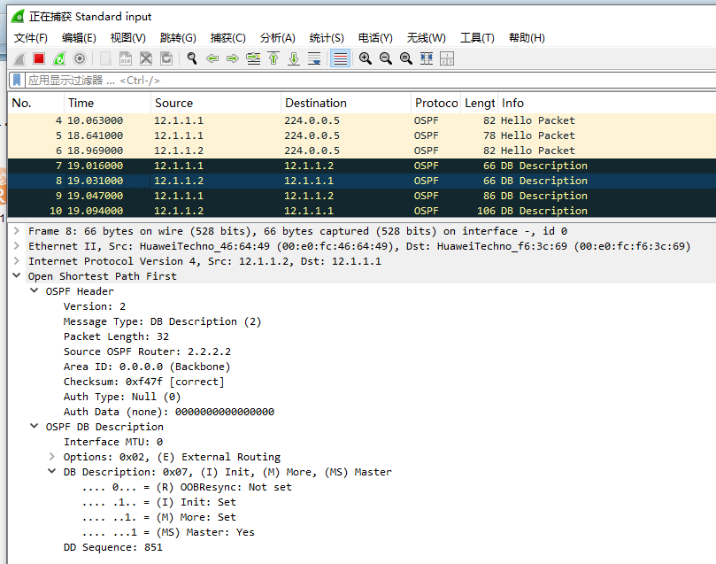

3.因为R2的大，R2为master，并且开始互发DD报文告知对方本机的**LSDB摘要**，可以看到R2收到后还把收到的信息一起发送，标识确认收到。（**隐性确认**）(Exstart->ExChange)

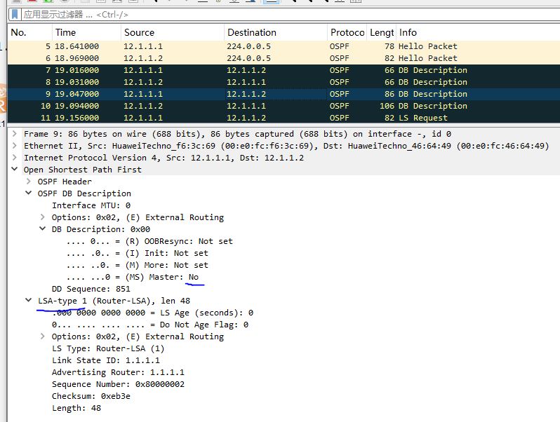

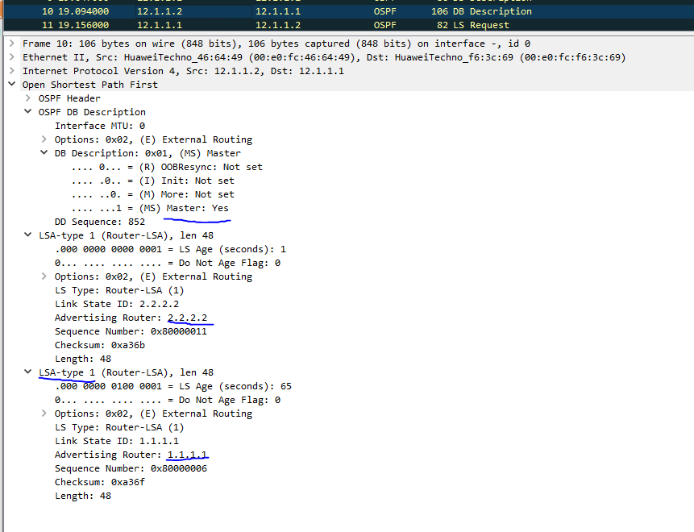

4.收到摘要后开始发送LSR，用以请求缺失或有必要更新的LSA条目，请求自身的信息是为了确认对方有正确的自身的LSA条目信息。(Loading)

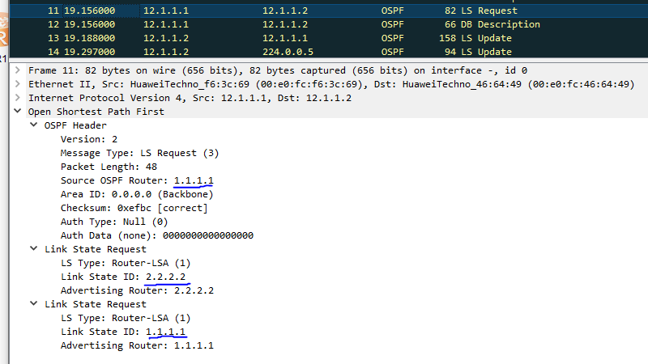

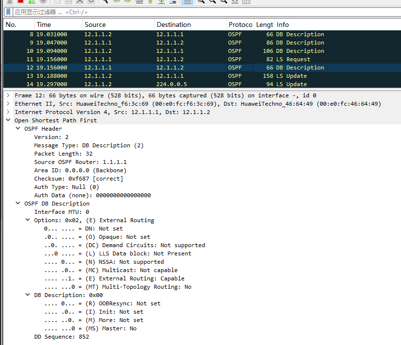

5. 收到请求开始发送LSU告知详细的LSA，并因为R2已经成为DR，所以向全OSPF网发送承载Type2-LSA的LSU，用以通告已知网段和对应有哪些路由。(Loading)
   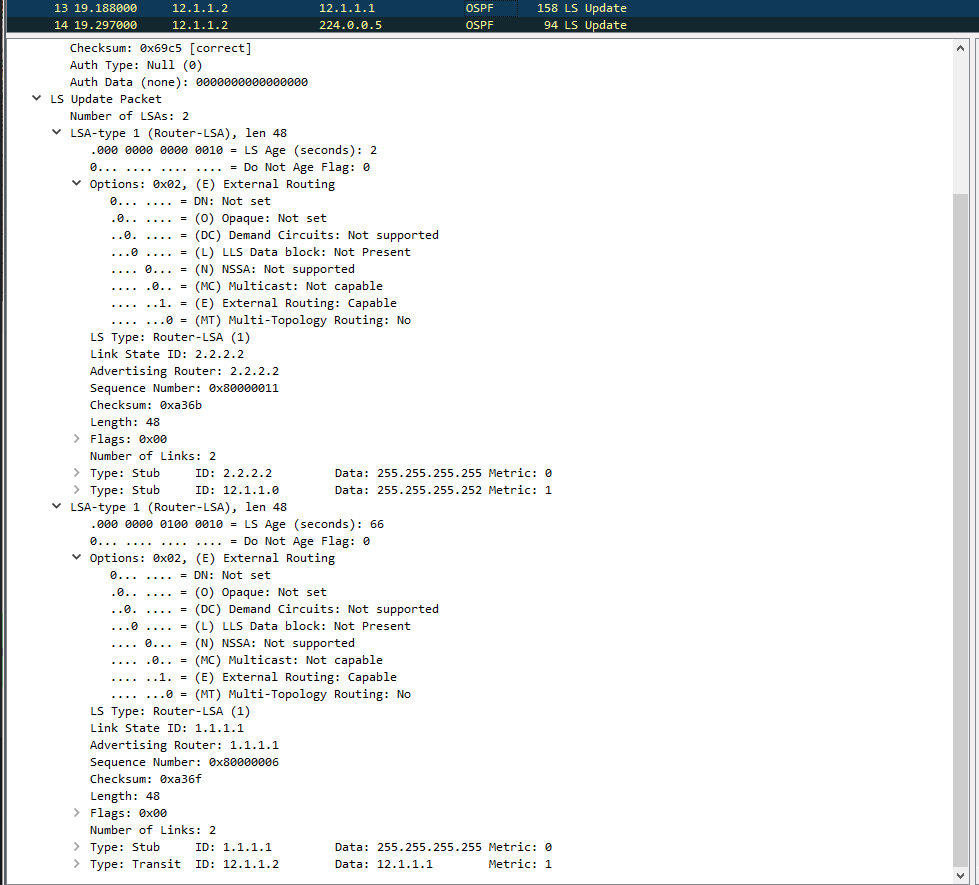

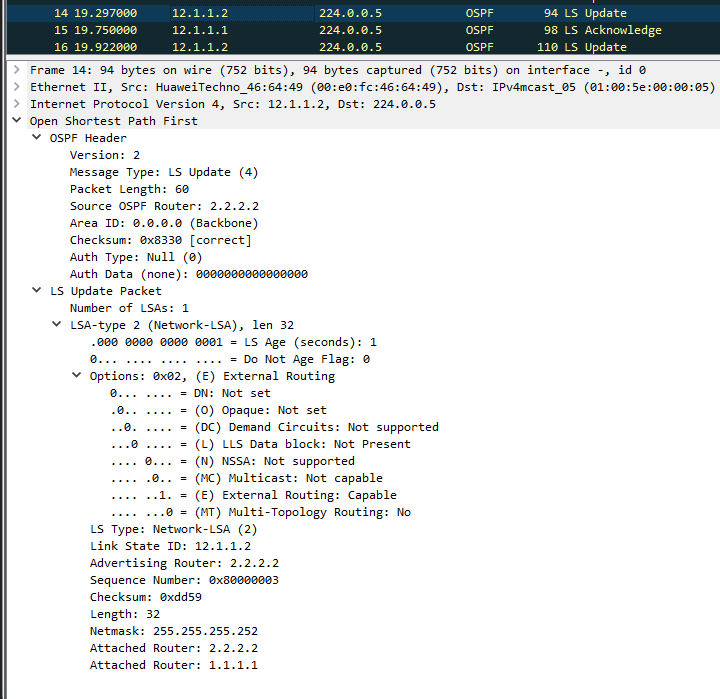

6. R1收到后，15号报文则是R2通过组播回应确认收到信息（Loading）

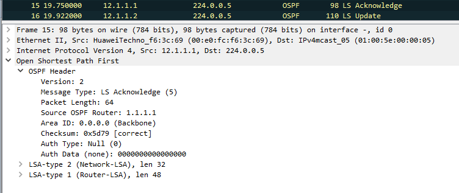

7.16、17号报文则是各路由器开始向OSPF全组发送组播报文，泛洪告知所有路由器自己的LSDB内的全量**Type1-LSA信息**，18、19则是响应LSU的LSAck报文，回应确认收到了信息。（Loading）

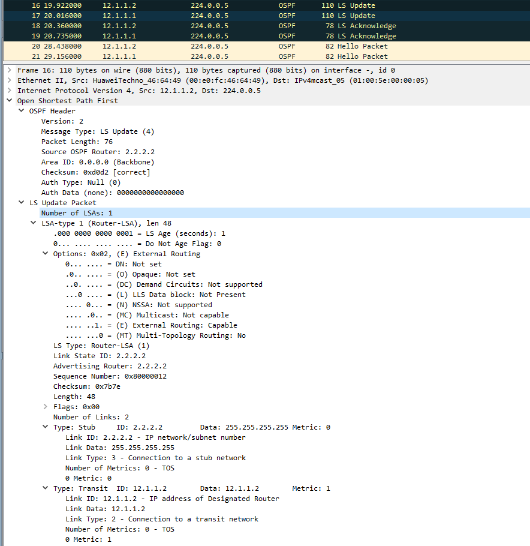

8.DR在所有路由器通告了自身的Type1-LSA信息后，最后向所有OSPF路由组内泛洪一次承载着Type1-LSA+Type2-LSA的LSU，用以让全网路由器确认LSDB数据库信息。（Loading->Full）

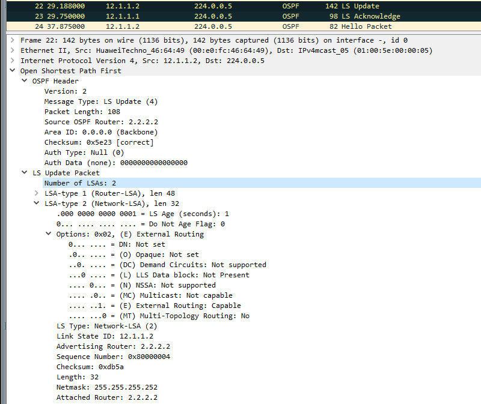