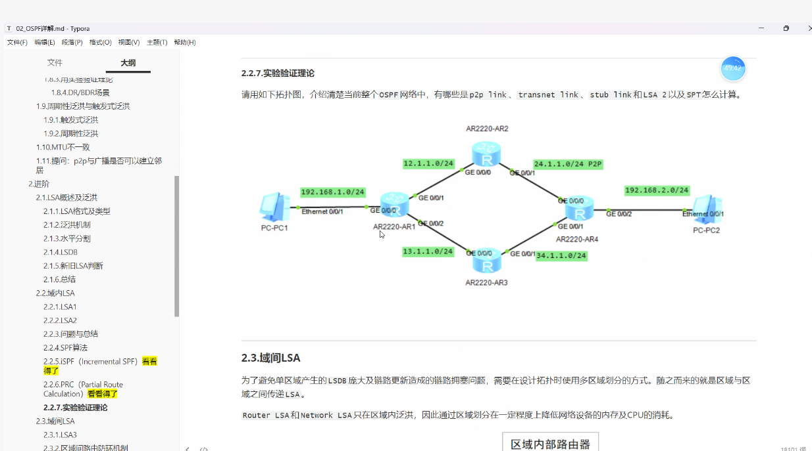
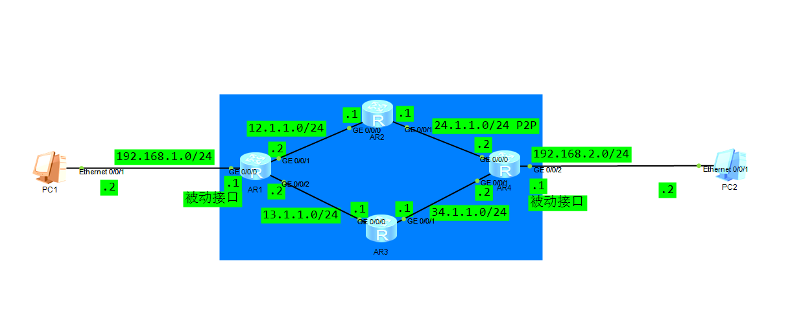

# DAY3-LSA Type1+Type2 实验






此处使用

silent-interface GigabitEthernet g0/0/0

silent-interface GigabitEthernet g0/0/2

将PC1和PC2静默，以优化网络带宽和安全


请用如下拓扑图，介绍清楚当前整个OSPF网络中，有哪些是p2pLink、transnetLink、stubLink和LSA 2以及SPT怎么计算。

因为未指定RID,也未配置loop，自动使用第一个配置的IP作为RID

RID

AR1：192.168.1.1

AR2：12.1.1.1

AR3：13.1.1.1

AR4：24.1.1.2


p2pLink: 

​	24.1.1.0 /24 .2-.1

transnetLink:

​	12.1.1.0/24 .1 .2

​	13.1.1.0/24 .1 .2

​	34.1.1.0/24 .1 .2

stubLink:

​	192.168.1.0/24

​	192.168.2.0/24

Type2 LSA:

​	该拓扑中有三条transnetLink，会各生成一个Type2 LSA，所以会生成如下三个LSA：

​	12.1.1.0/24

​	13.1.1.0/24

​	34.1.1.0/24


SPT如何计算:

​	会先以自己为根，依次加入直连邻居进临时候选表计算开销，只保留最小开销的路径

​	通过Type1 LSA找到网络设备节点，通过Type2LSA得知一个广播网络上的设备连接情况

​	以自身为根，逐步把相邻的节点按照开销大小进行淘汰，选出最小的节点加入树，其余保留在候选表中，并逐步沿着节点延伸出去，直到所有的节点都加入树，就完成了SPT的创建。


​	已知路由器设备：AR1，AR2，AR3，AR4，设备之间路由开销都为1

​	已知主机：PC1，PC2

​	拿AR1为例：

​	1.通过读取自身的Type1 LSA，先将自身作为根加入树，开销为0	

```c'l
AR1
```

​	2.通过Type1 LSA中的条目得知设备数量和开销，并读取对应Type2 LSA 查看设备连接情况，就可以通过找出和根直连的伪节点（Network）连接的路由设备
​	最后找出根邻接的节点为AR2、AR3，将AR2，AR3加入候选表进行计算，并判断路径开销cost，只保留最小开销的路径

​	AR1+AR2=0+1=1

​	AR1+AR3=0+1=1

​	两者相等，都最小，触发ECMP，都加入并都保留

```
AR1
|    \
AR2  AR3	
```

​	3.继续通过读取AR2的Type1 LSA(因为AR2和AR4是P2P连接，没有Type2 LSA)和AR3的Type1/Type2 LSA，相同方法各自添加AR2和AR3邻接的AR4进入候选表，并计算路径开销，只保留最小开销的路径

​	AR1+AR2+AR4=0+1+1=2

​	AR1+AR3+AR4=0+1+1=2

​	两者相等，都最小，也都保留（两个路由随机hash，不会环路，逻辑上就像是一条线）

```
AR1
|    \
AR2  AR3	
|	/
AR4
```

​	4.所有路由都在树上了，SPT树建立完成，最后将叶子节点都挂在直连路由上，PC1挂在AR1上，PC2挂在AR4

```
AR1 —— PC1
|    \
AR2  AR3	
|	/
AR4 —— PC2
```

