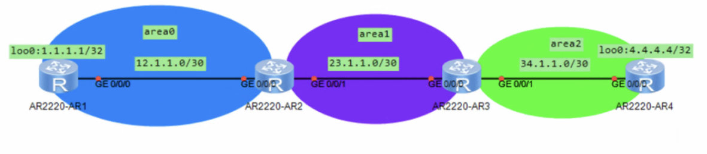
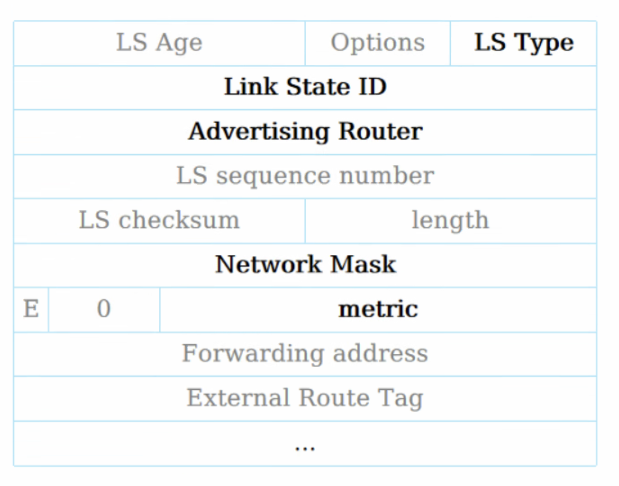

# DAY4-OSPF-VLink-特殊区域详解随笔

### 1.VLink

​	用于解决跨设备连接区域的连接

​	如：

​		连接被隔开的Area 0 

```
Area 0 -- Area 1 （VLink）--Area 0
```

​		连接被隔开的子区域Area 2

```
Area 0 -- Area 1 （VLink）--Area 2
```

​	area0 - area1 - area0

​	承载Vlink的area 1 是被称为Transit Area

​	Transit Area不能是Stub或NSSA

​	传路由使用的是LSA3

​	类似于VPN的机制，不可靠，作为临时方案来使用，长期情况绝对不能使用！




如何配置？

```
ospf 1
 area 1                        # 进入传输区域
  vlink-peer 2.2.2.2           # 指向对端Router ID
```


> 两端都要配，互相指向对方Router ID

如何查看？

```
display ospf vlink
```


> 看 **State** 是否为 **Full**（Full = 连接成功）


### 2.外部LSA



LSA 5 ：

​	**AS External LSA**，由 ASBR 产生，宣告外部网络（就是和外部网络直连的路由器）

​	LS Type：5

​	Link State ID ：外部网络的**网络地址**（目的地）

​	Advertising Router: ASBR（自治系统 边界路由器）的Router ID

​	Network Mask: 该外部路由的掩码

​	metric: ASBR到外部路由的开销

​	

LSA 4：

​	**ASBR-Summary LSA**，由 **ABR** 产生，告诉其他区域“ASBR在哪里”。（区域间的路由产生，告知该怎么到ASBR）

​	LS Type：4

​	Link State ID：ASBR的Router ID（找谁）

​	Advertising Router： ABR的Router ID（谁在指路）

​	Network Mask: 仅保留，无意义

​	metric：ABR到ASBR的开销

LSA4 和LSA5 是相辅相成的，有5才会有4


外部路由引入命令

```
ospf 1
 import-route static          # 引入静态路由
 import-route direct          # 引入直连路由
```

示例

```
ospf 1
 import-route static cost 10 type 1
```

- `cost 10`：设置开销

- `type 1`：外部路由类型（1或2，缺省为2）

- **Type-2**（缺省）：只计算ASBR到外部路由的开销，**不累加**内部路径开销，不可信路由（内部结构简单，不需要选路时，使用），开销和自身路由没有可比性。

  **Type-1**：累加计算，总开销 = **内部开销（到ASBR） + 外部开销（ASBR到目标）**（内网拓扑复杂，需要选路时使用）

  Type1 优先级永远比2高

  对于type2，内部所有的路径都是等价的，因为没有内部开销，无法选路

如何发布默认路由

```
ospf 1
 default-route-advertise always
```

### 查看结果

```
display ospf lsdb ase
display ospf routing
```

域间路由的优先级为10

域外路由的优先级为150


3.特殊区域

对应需要隔离4、5类

OSPF区域分两类：

​	传输区域（Transit Area）：除了承载本区域的流量和链路的流量外还有

​	末梢区域（Stub Area）

Stub

Totally Stub

NSSA

Totally NSSA


Totally Stub会没有多台ABR的域内传输路由cost值，不能选路ABR

Stub 就可以选路 （多台ABR情况）

NSSA 和Totally NSSA 区别和Stub的区别一样（单台ABR或无视选路情况）


NSSA 相当于 可以引入外部的路由并可以多台ABR选路的Stub，有3类LSA的明细（多台ABR情况）

Totally NSSA 相当于 可以引入外部的路由并忽略选路的Stub，忽略3类LSA，仅一条（单台ABR或无视选路情况）


当从普通模式切换到特殊区域时，会导致路由重建邻居，出现网络震荡，断网卡顿情

Stub区域：

​	ABR 不向外部传输路由

​	不能是骨干区域

​	所有区域内路由都必须配置为Stub

​	不能引入也不能接受AS外部路由

​	虚连接不能穿越Stub区域

NSSA区域：

​	可以引入外部路由

​	LSA类型为7，这个LSA不能传播出区域

​	ABR可以把LSA 7的路由转换为LSA 5类型发给主区域（area 0）

​	

```
ospf 1
 area 1 
 	nssa #就可以部署末梢NSSA区域
 	nssa no-summary #就可以部署完全末梢NSSA区域
```

​	


4.选路

​	1.区域内路由

​	2.区域间路由

​	3.外部路由Type1（E1） 

​	4.外部路由Type2（E2） 

​	5.NSSA路由Type1（N1）

​	6.NSSA路由Type2（N2）

​	多条同类型会比较cost

​	同类型和同cost 进行负载均衡

​	同类型和同cost，且有多个ABR将某个外部路由传入该路由器时，优先区域号大的，假如某外部路由连接area0和area2，会优先area2


默认default-route-advertise和0.0.0.0/0的默认路由指向外网时，出现故障

default-route-advertise 可以利用OSPF的动态特性，会把默认的静态外部路由变为ASBR的外部路由（LSA 5）

```
ip route-static 0.0.0.0 0 12.1.1.1 #指向外网路由
ospf 1
	default-route-advertise #直接下发默认路由，是作为一个外部路由加入ospf网络
	default-route-advertise always #强制下发默认路由，无论存不存在，是作为一个外部路由加入ospf网络
```

只要路由出现问题，外网断了，OSPF网络可以得知，内部会自动删除该网络，作为管理员就能在其他路由器上看到该路由条目消失了，但如果配置了always或是只在其他路由上配置静态，出现问题，该条目还是存在

所以应该配置OSPF下发默认路由，这样可以把该路由加入OSPF网络，可以内部动态路由选路，也方便管理

