# DAY4：VLink 、特殊区域实验

### 一、VLink

#### 1. VLink实验一：area 0被分割，使用虚连接将其连接

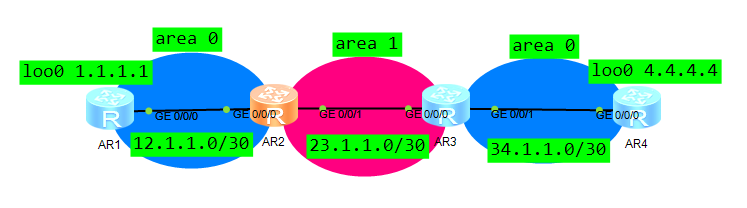

AR1

```
interface GigabitEthernet0/0/0
 ip address 12.1.1.1 255.255.255.252 
interface LoopBack0
 ip address 1.1.1.1 255.255.255.255 
#
ospf 1 router-id 1.1.1.1 
 area 0.0.0.0 
  network 1.1.1.1 0.0.0.0 
  network 12.1.1.0 0.0.0.3 
```

AR2

```

interface GigabitEthernet0/0/0
 ip address 12.1.1.2 255.255.255.252 
interface GigabitEthernet0/0/1
 ip address 23.1.1.1 255.255.255.252 
interface LoopBack0
 ip address 2.2.2.2 255.255.255.255 
#
ospf 1 router-id 2.2.2.2 
 area 0.0.0.0 
  network 2.2.2.2 0.0.0.0 
  network 12.1.1.0 0.0.0.3 
 area 0.0.0.1 
  network 23.1.1.0 0.0.0.3 
  vlink-peer 3.3.3.3
```

AR3

```

interface GigabitEthernet0/0/0
 ip address 23.1.1.2 255.255.255.252 
interface GigabitEthernet0/0/1
 ip address 34.1.1.1 255.255.255.252 
interface LoopBack0
 ip address 3.3.3.3 255.255.255.255 
#
ospf 1 router-id 3.3.3.3 
 area 0.0.0.0 
  network 3.3.3.3 0.0.0.0 
  network 34.1.1.0 0.0.0.3 
 area 0.0.0.1 
  network 23.1.1.0 0.0.0.3 
  vlink-peer 2.2.2.2
```

AR4

```
interface GigabitEthernet0/0/0
 ip address 34.1.1.2 255.255.255.252 
interface LoopBack0
 ip address 4.4.4.4 255.255.255.255 
#
ospf 1 router-id 4.4.4.4 
 area 0.0.0.0 
  network 4.4.4.4 0.0.0.0 
  network 34.1.1.0 0.0.0.3 
```

结果

可以看到AR2-AR3互建邻居为FULL

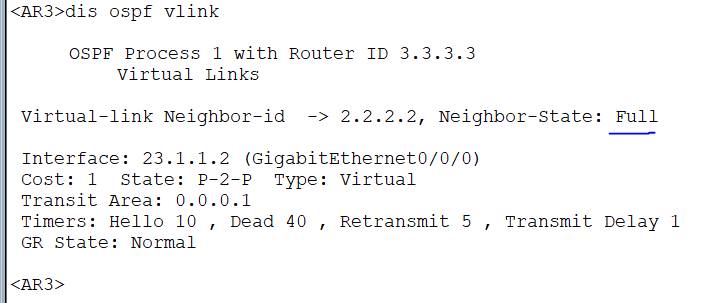

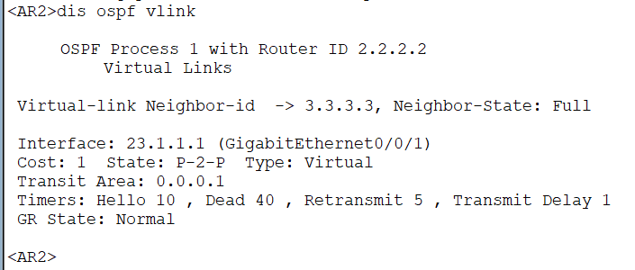


#### 2.VLink实验二：区域2、3都需要Vlink到area0

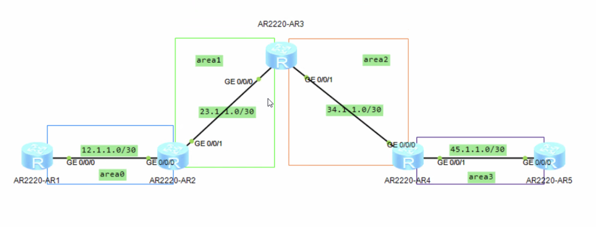

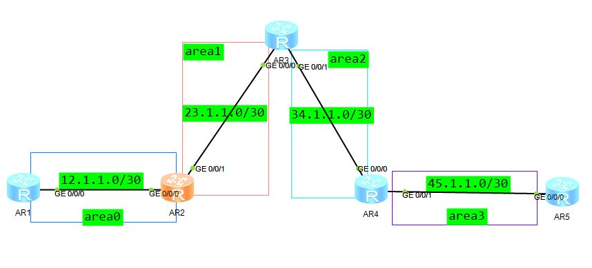

AR1

```
interface GigabitEthernet0/0/0
 ip address 12.1.1.1 255.255.255.252 
interface LoopBack0
 ip address 1.1.1.1 255.255.255.255 
#
ospf 1 router-id 1.1.1.1 
 area 0.0.0.0 
  network 1.1.1.1 0.0.0.0 
  network 12.1.1.0 0.0.0.3 

```

AR2

```
interface GigabitEthernet0/0/0
 ip address 12.1.1.2 255.255.255.252 
interface GigabitEthernet0/0/1
 ip address 23.1.1.1 255.255.255.252 
interface LoopBack0
 ip address 2.2.2.2 255.255.255.255 
#
ospf 1 router-id 2.2.2.2 
 area 0.0.0.0 
  network 2.2.2.2 0.0.0.0 
  network 12.1.1.0 0.0.0.3 
 area 0.0.0.1 
  network 23.1.1.0 0.0.0.3 
  vlink-peer 3.3.3.3
```

AR3

```
interface GigabitEthernet0/0/0
 ip address 12.1.1.2 255.255.255.252 
interface GigabitEthernet0/0/1
 ip address 23.1.1.1 255.255.255.252 
interface LoopBack0
 ip address 2.2.2.2 255.255.255.255 
#
ospf 1 router-id 2.2.2.2 
 area 0.0.0.0 
  network 2.2.2.2 0.0.0.0 
  network 12.1.1.0 0.0.0.3 
 area 0.0.0.1 
  network 23.1.1.0 0.0.0.3 
  vlink-peer 3.3.3.3
```

AR4

```
interface GigabitEthernet0/0/0
 ip address 34.1.1.2 255.255.255.252 
interface GigabitEthernet0/0/1
 ip address 45.1.1.1 255.255.255.252 
interface LoopBack0
 ip address 4.4.4.4 255.255.255.255 
#
ospf 1 router-id 4.4.4.4 
 area 0.0.0.2 
  network 4.4.4.4 0.0.0.0 
  network 34.1.1.0 0.0.0.3 
  vlink-peer 3.3.3.3
 area 0.0.0.3 
  network 45.1.1.0 0.0.0.3 
```

AR5

```
interface GigabitEthernet0/0/0
 ip address 34.1.1.2 255.255.255.252 
interface GigabitEthernet0/0/1
 ip address 45.1.1.1 255.255.255.252 
interface LoopBack0
 ip address 4.4.4.4 255.255.255.255 
#
ospf 1 router-id 4.4.4.4 
 area 0.0.0.2 
  network 4.4.4.4 0.0.0.0 
  network 34.1.1.0 0.0.0.3 
  vlink-peer 3.3.3.3
 area 0.0.0.3 
  network 45.1.1.0 0.0.0.3 
```

结果

可以看到AR2-AR3，AR3-AR4互建邻居为FULL

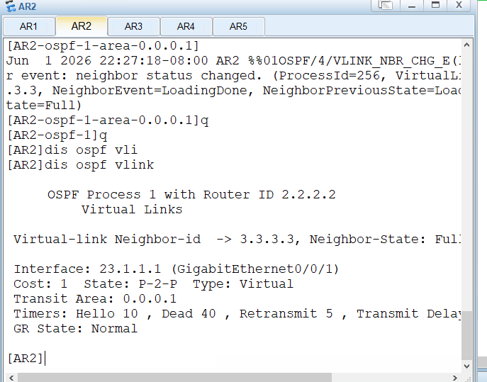

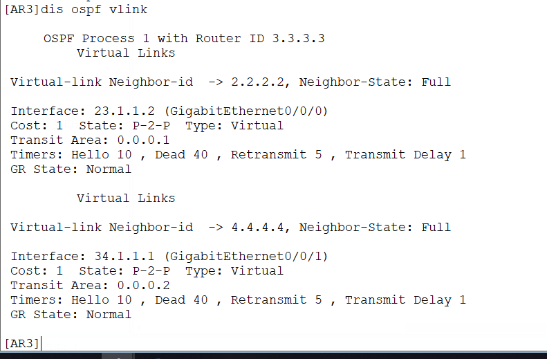

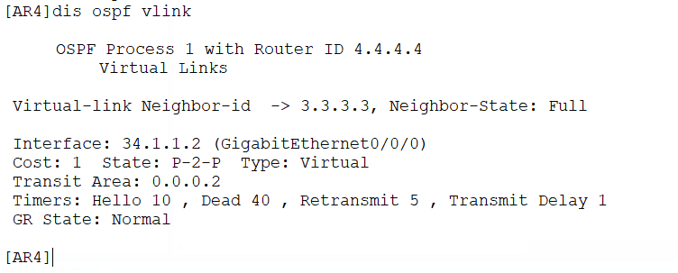


### 二、特殊区域

#### 1.实验一：STUB


AR1

```
interface GigabitEthernet0/0/0
 ip address 12.1.1.1 255.255.255.252 
interface LoopBack0
 ip address 1.1.1.1 255.255.255.255 
#
ospf 1 router-id 1.1.1.1 
 area 0.0.0.1 
  network 1.1.1.1 0.0.0.0 
  network 12.1.1.0 0.0.0.3 
```

AR2

```
interface GigabitEthernet0/0/0
 ip address 12.1.1.2 255.255.255.252 
interface GigabitEthernet0/0/1
 ip address 23.1.1.1 255.255.255.252 
interface LoopBack0
 ip address 2.2.2.2 255.255.255.255 
#
ospf 1 router-id 2.2.2.2 
 area 0.0.0.0 
  network 2.2.2.2 0.0.0.0 
  network 23.1.1.0 0.0.0.3 
 area 0.0.0.1 
  network 12.1.1.0 0.0.0.3 
```

AR3

```
interface GigabitEthernet0/0/0
 ip address 23.1.1.2 255.255.255.252 
interface GigabitEthernet0/0/1
 ip address 34.1.1.1 255.255.255.252 
interface LoopBack0
 ip address 3.3.3.3 255.255.255.255 
#
ospf 1 router-id 3.3.3.3 
 area 0.0.0.0 
  network 3.3.3.3 0.0.0.0 
  network 23.1.1.0 0.0.0.3 
 area 0.0.0.2 
  network 34.1.1.0 0.0.0.3 
  stub 
```

AR4

```
interface GigabitEthernet0/0/0
 ip address 34.1.1.2 255.255.255.252 
interface LoopBack0
 ip address 4.4.4.4 255.255.255.255 
#
ospf 1 router-id 4.4.4.4 
 area 0.0.0.2 
  network 4.4.4.4 0.0.0.0 
  network 34.1.1.0 0.0.0.3 
  stub 
```


可以看到有默认路由和路由明细

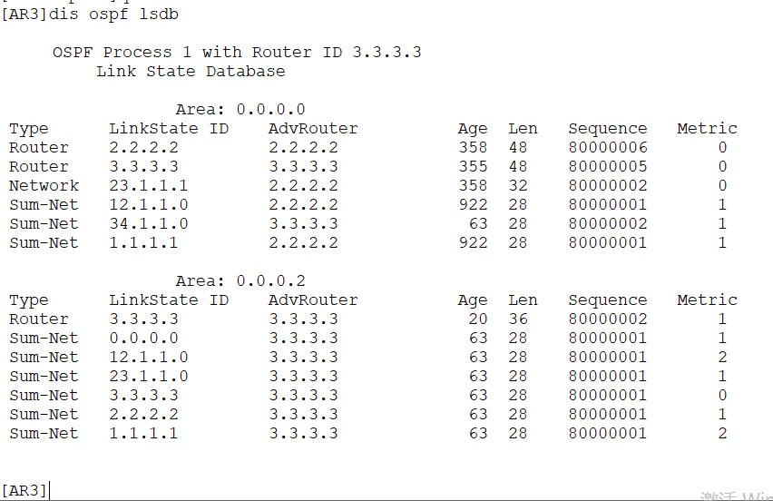

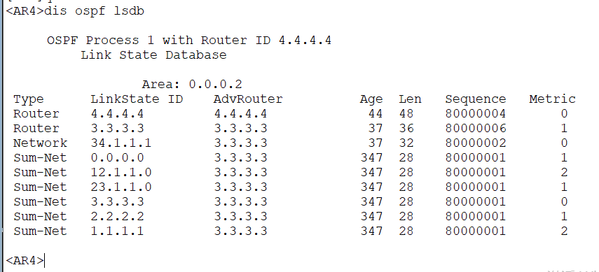

#### 2.实验二：Totally Stub


AR1 - AR2 - AR3 - AR4 大部分和之前相同

AR3

```
ospf 1 router-id 3.3.3.3 
 area 0.0.0.0 
  network 3.3.3.3 0.0.0.0 
  network 23.1.1.0 0.0.0.3 
 area 0.0.0.2 
  network 34.1.1.0 0.0.0.3 
  stub no-summary
```

AR4

```
ospf 1 router-id 4.4.4.4 
 area 0.0.0.2 
  network 4.4.4.4 0.0.0.0 
  network 34.1.1.0 0.0.0.3 
  stub no-summary
```

可以看到有默认路由，路由明细没有了

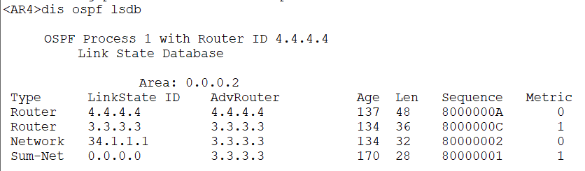

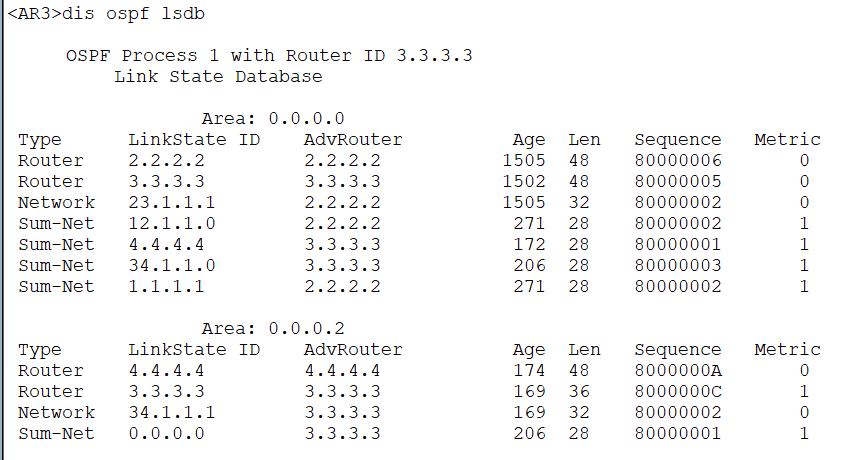

#### 3.实验三：NSSA


AR1 - AR2 - AR3 - AR4 大部分和之前相同

AR3

```
ospf 1 router-id 3.3.3.3 
 area 0.0.0.0 
  network 3.3.3.3 0.0.0.0 
  network 23.1.1.0 0.0.0.3 
 area 0.0.0.2 
  network 34.1.1.0 0.0.0.3 
  nssa
```

AR4

```
ospf 1 router-id 4.4.4.4 
 area 0.0.0.2 
  network 4.4.4.4 0.0.0.0 
  network 34.1.1.0 0.0.0.3 
  nssa
#
interface GigabitEthernet0/0/1
  ip address 45.1.1.1 255.255.255.252 
#
rip 1
 undo summary
 version 2
 network 45.0.0.0
```

AR5

```
interface GigabitEthernet0/0/0
 ip address 45.1.1.2 255.255.255.252 
#
interface LoopBack0
 ip address 5.5.5.5 255.255.255.255 
#
rip 1
 undo summary
 version 2
 network 5.0.0.0
 network 45.0.0.0
```

结果：可以看到所有OSPF路由可以看到出现了两个AS外部路由，并且Area 2内出现了LSA3的默认路由和路由明细、和NSSA类型的路由

AR3（ABR）在Area2（NSSA域）内发送LSA7类型的默认路由指向3.3.3.3，用来过滤外部路由，同时将LSA3的明细也在Area2内传播。AR4把外部路由引入为LSA7类路由，指向自己，交给AR3转换为LSA 5 向area 0传播。

AR2（ABR）会将area0中的LSA5在Area1中传播，并同时生成对应的LSA4，指向AR3（ABR）

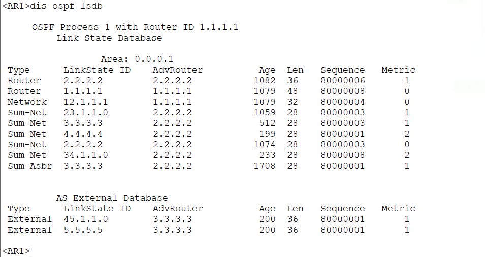

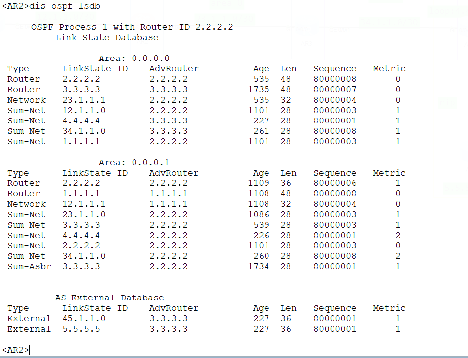

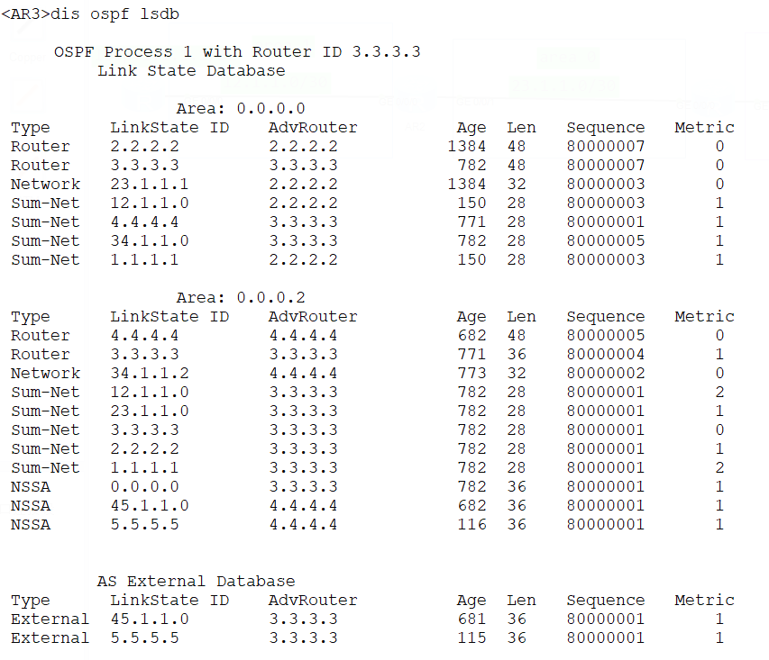

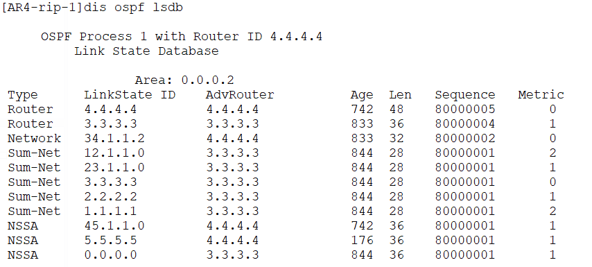

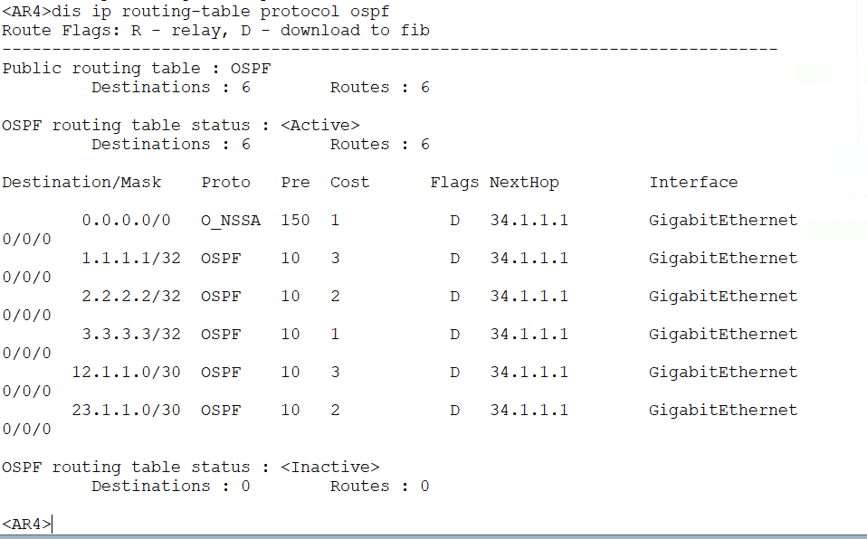

#### 4.实验四：Totally NSSA


配置修改为nssa no-summary


结果可以看到Sum-Net 的LSA3（路由明细）没有了，其他的都相同

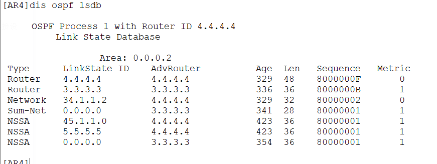

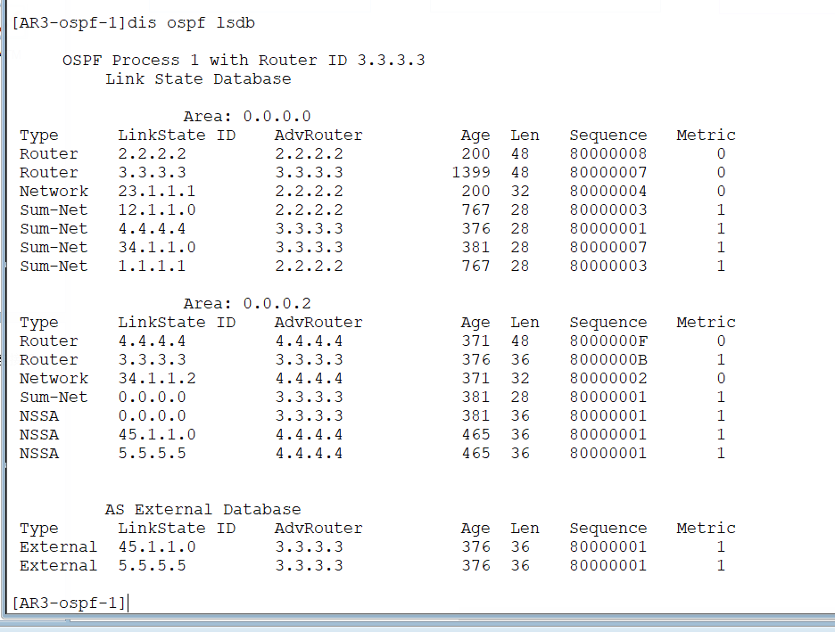