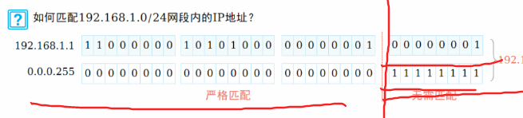

# DAY-7：路由策略与策略路由

## 一、核心概念

### 控制平面 vs 转发平面

**控制平面**负责创建、计算、维护路由，比如配置路由协议、创建路由策略。简单说就是"造路由"。

**转发平面**负责实际转发数据包，比如查 FIB 表转发、PBR 转发。简单说就是"用路由"。

### PBR vs FIB

**FIB（转发信息库）** 就是路由表，基于目的 IP 地址转发。

**PBR（策略路由）** 可以基于源 IP、端口等策略来转发。

**优先级关系**：PBR 高于 FIB。如果数据包匹配了 PBR，就直接按 PBR 转发，不再查路由表；只有没匹配到 PBR 时，才去查 FIB。

## 二、路由匹配工具

### 2.1 访问控制列表（ACL）

**作用**：对报文和路由进行匹配和区分。

**常用范围**：2000-2999，很少用 3000 以上。

**匹配规则**：按顺序逐条匹配，匹配到就退出。每条 rule 中的 permit/deny 只表示"匹配"或"不匹配"，不直接执行最终动作。

**默认行为**：底部有一条隐含的 deny 规则，所有没被匹配的都被拒绝。

**通配符掩码规则**：0 表示该位必须匹配，1 表示该位忽略。

**示例**：

```
rule 5 permit source 1.1.1.0 0.0.0.255
```



这条规则匹配 1.1.1.0/24 这个网段。

**局限性**：ACL 只能匹配网络前缀（IP 地址），不能匹配掩码长度。比如要过滤掉 172.16.0.0/16 但保留 172.16.1.0/24，ACL 做不到，因为前缀相同，ACL 区分不了掩码。

### 2.2 IP 前缀列表（ip-prefix）

**作用**：匹配路由的**前缀**和**掩码长度**。

**优势**：可以精确匹配掩码长度，这是 ACL 做不到的。

**匹配规则**：按顺序逐条匹配，匹配到就退出。

**默认行为**：底部有一条隐含的 deny 规则。

**关键字说明**：

- `le`（less-equal）：掩码长度小于等于指定值
- `ge`（greater-equal）：掩码长度大于等于指定值
- `eq`（equal）：掩码长度等于指定值

**匹配逻辑**（带 ge/le 时）：

分为两步：第一步检查路由网络号前 mask-length 位是否与指定 IP 完全一致；第二步检查路由实际掩码长度是否在 ge 和 le 指定的闭区间内。两个条件同时满足才算匹配。

**写法示例**：

- `permit 172.16.0.0 16` → 只匹配掩码等于 16 的路由
- `permit 172.16.0.0 16 le 24` → 匹配掩码 16 到 24 的路由
- `permit 172.16.0.0 16 ge 24` → 匹配掩码 24 到 32 的路由
- `permit 172.16.0.0 16 ge 20 le 28` → 匹配掩码 20 到 28 的路由
- `permit 0.0.0.0 0` → 仅匹配默认路由
- `permit 0.0.0.0 0 le 32` → 匹配所有路由

⚠️ **易错点**：`permit 10.1.0.0 16 ge 24` 匹配所有前16位为10.1、掩码≥24的路由，包括 10.1.255.0/24。只想匹配 10.1.0.0/24 及其子网，应写 `permit 10.1.0.0 24 ge 24 le 32`。

**典型案例**：路由表中有 172.16.1.0/24、172.16.2.0/24、172.16.0.0/16、172.16.3.0/24。要只过滤掉 /16，保留三个 /24。

使用 ip-prefix 可以这样写：

```
ip ip-prefix test1 deny 172.16.0.0 16
ip ip-prefix test1 permit 0.0.0.0 0 less-equal 32
```


第一条拒绝精确的 /16，第二条允许所有其他路由（掩码 0~32）。这样 /16 被拒绝，三个 /24 被允许。

**隐含规则**：末尾隐含 deny all，只拒绝特定、放行其他时必须加兜底（如上面的 `permit 0.0.0.0 0 le 32`）。

## 三、策略工具

### 3.1 路由策略（route-policy）

**作用**：不仅可以匹配路由，还可以**修改**路由属性，比如 cost、下一跳、路由类型等。

**结构**：由多个 node（节点）组成，每个 node 有编号和动作（permit 或 deny）。

**node 内的规则**：是**与**的关系，一个 node 里的所有 if-match 条件必须全部满足，才算匹配成功。

**node 之间的关系**：按 node 编号从小到大**顺序匹配，匹配到就停止**。如果当前 node 匹配成功，就执行该 node 的动作，不再往下匹配；如果当前 node 匹配失败，才继续下一个 node。

**默认行为**：如果所有 node 都没匹配上，路由被拒绝（隐含 deny）。

⚠️ **易错点**：deny 节点匹配成功后，apply 子句不会被执行。因为路由已被拒绝，修改属性无意义。

**基本语法**：

```
route-policy <名称> <permit/deny> node <编号>
 if-match <条件>      ← 匹配条件（可写多条，不写则匹配所有）
 apply <修改动作>     ← 修改属性（可写多条，不写则不修改）
```

**示例**：

```
route-policy test1 permit node 10
 if-match ip-prefix test1
```


- 创建一个名为 test1 的路由策略
- 节点 10，动作是 permit
- 匹配条件：引用名为 test1 的 ip-prefix 列表

## 四、应用工具（Filter-Policy）

**作用**：在 IGP 协议（OSPF / RIP / IS-IS）中**直接过滤路由**，不修改属性。

| 对比         | Filter-Policy         | Route-Policy    |
| :----------- | :-------------------- | :-------------- |
| 作用         | 过滤路由（允许/拒绝） | 匹配 + 修改属性 |
| 能否修改属性 | ❌ 不能                | ✅ 能（apply）   |

**OSPF 中的应用**：

| 命令                   | 位置          | 作用               |
| :--------------------- | :------------ | :----------------- |
| `filter-policy import` | OSPF 进程视图 | 过滤接收的路由     |
| `filter-policy export` | OSPF 进程视图 | 过滤发布的外部路由 |
| `filter-policy export` | OSPF 区域视图 | ABR 过滤区域间路由 |

⚠️ **OSPF 核心考点**：`filter-policy import` **不过滤 LSA**！

| 行为             | 说明                      |
| :--------------- | :------------------------ |
| LSA 是否被过滤   | ❌ 不过滤，LSA 仍进入 LSDB |
| 路由是否进路由表 | ✅ 过滤，不加入路由表      |

原理：工作在 SPF 计算之后、路由加入路由表之前。

## 五、四个工具的对比

**ACL**：只能匹配报文和路由，不能修改属性，也不能匹配掩码长度。

**ip-prefix**：只能匹配路由，不能修改属性，但能匹配掩码长度（这是它的核心优势）。

**route-policy**：既能匹配也能修改，功能最强大。匹配掩码长度时可以引用 ip-prefix 来配合。

**filter-policy**：IGP 专用，只过滤路由不修改属性；OSPF 中 import 不过滤 LSA（核心重点）。

## 六、一句话速记

- **控制平面**：造路由
- **转发平面**：用路由
- **PBR**：比路由表优先级高，匹配就用，不查表
- **ACL**：只能匹配前缀，不能匹配掩码；末尾隐含 deny any
- **ip-prefix**：能匹配掩码长度（le/ge/eq）；末尾隐含 deny all
- **route-policy**：能匹配也能改，node 内"与"，node 间"顺序匹配，命中即停"；deny 不执行 apply；末尾隐含 deny all，记得加兜底
- **filter-policy**：IGP 专用（OSPF/RIP/IS-IS）；只过滤不改；OSPF import 不过滤 LSA
- **默认行为**：ACL、ip-prefix、route-policy 都默认 deny

## 七、经典面试题

**Q1：OSPF 的 `filter-policy import` 能否阻止 LSA 进入 LSDB？**

不能。只过滤 SPF 计算后的路由，LSA 仍进入 LSDB。

**Q2：ACL 和 IP-Prefix 的核心区别？**

ACL 只能匹配 IP 范围，不能匹配掩码；IP-Prefix 能同时匹配 IP + 掩码。

**Q3：Route-Policy 中 deny 节点匹配成功后，apply 子句会不会执行？为什么？**

A：不会执行。因为 deny 节点的动作是"拒绝路由"，路由已经被丢弃了，再修改它的属性没有任何意义。
