# DAY5：报文认证-路由汇总-ISIS基础配置实验

### 一、OSPF 

#### 1.报文认证

接口认证

使用后面的拓扑来测试

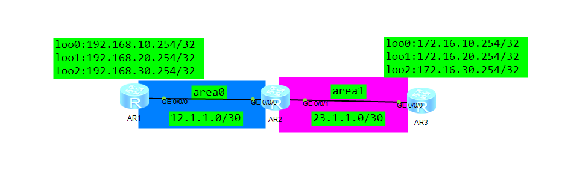

配置简易认证，并加密配置

```
[AR1-GigabitEthernet0/0/0]ospf authentication-mode simple cipher 123123
```

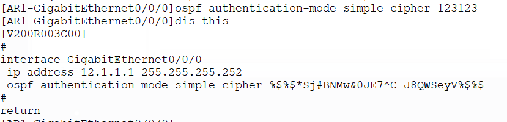

可以看到明文密码，因为使用的是simple模式

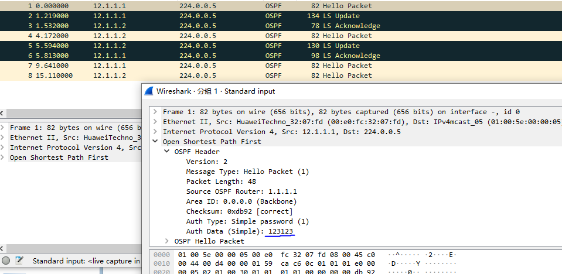

域间路由认证

在指定域的视图中配置，所有同域内接口都要配置，

md5后的1是key的ID，常用来进行无缝切换ospf密码，可以创建2号密码后，都配置完毕，就可以删除1号进行清除

KeyID、密码和模式要求直连邻居一致，可以同域不同链路不一致的情况，但要保证同域下直连邻居双方是一致的

```
[AR2-ospf-1-area-0.0.0.1]authentication-mode md5 1 cipher 123123
```

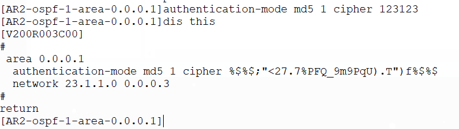

可以抓包看到，使用的是处理过的密钥数据，和对应的密钥id

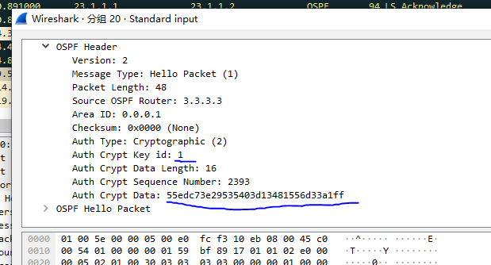

#### 2.路由汇总

##### 域间汇总

基础配置

AR1

```
interface LoopBack 0
 ip address 192.168.10.1 255.255.255.0
 ospf network-type broadcast
interface LoopBack 1
 ip address 192.168.20.1 255.255.255.0
 ospf network-type broadcast
interface LoopBack 2
 ip address 192.168.30.1 255.255.255.0
 ospf network-type broadcast
interface GigabitEthernet 0/0/0
 ip address 12.1.1.1 255.255.255.252
ospf 1 router-id 1.1.1.1
 area 0
  network 12.1.1.0 0.0.0.3
  network 192.168.10.0 0.0.0.255
  network 192.168.20.0 0.0.0.255
  network 192.168.30.0 0.0.0.255
```

AR2

```
interface GigabitEthernet 0/0/0
 ip address 12.1.1.2 255.255.255.252
interface GigabitEthernet 0/0/1
 ip address 23.1.1.1 255.255.255.252
ospf 1 router-id 2.2.2.2
 area 0
  network 12.1.1.0 0.0.0.3
 area 1
  network 23.1.1.0 0.0.0.3
```

AR3

```
interface GigabitEthernet 0/0/0
 ip address 23.1.1.2 255.255.255.252
ospf 1 router-id 3.3.3.3
 area 1
  network 23.1.1.0 0.0.0.3
```

可以看到没配置之前是有三条路由的

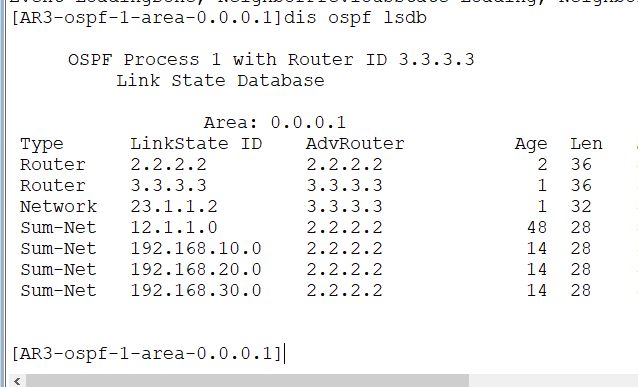

```
#AR2
ospf 1 router-id 2.2.2.2
 area 0
  abr-summary 192.168.0.0 255.255.224.0
```

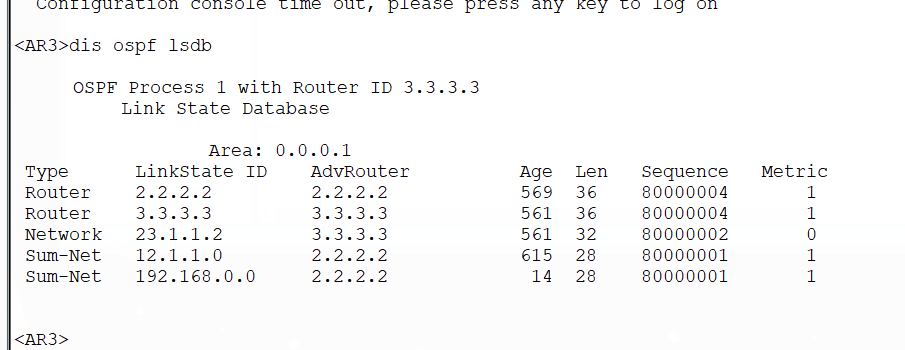

##### 域外路由汇总

基础配置忽略和上面差不多

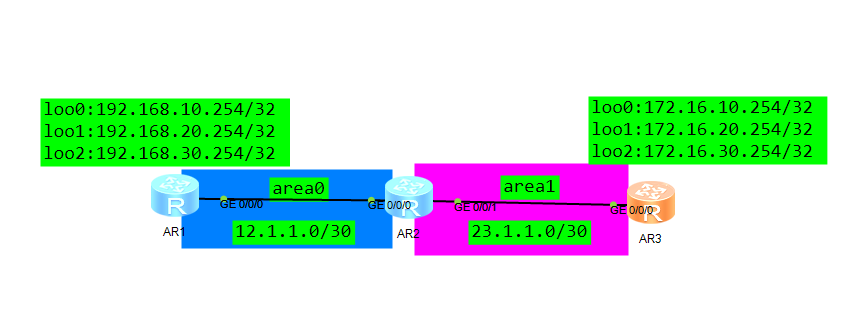

只需要使用重发布命令导入直连路由来生成域外路由用于测试

```
ospf 1
	import-route direct
```


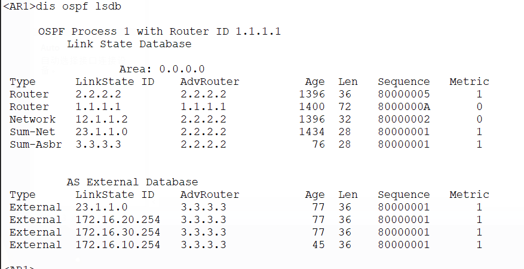

```
[AR3-ospf-1]asbr-summary 172.16.0.0 255.255.0.0 #使用asbr-summary命令聚合路由
```

再看就没有了

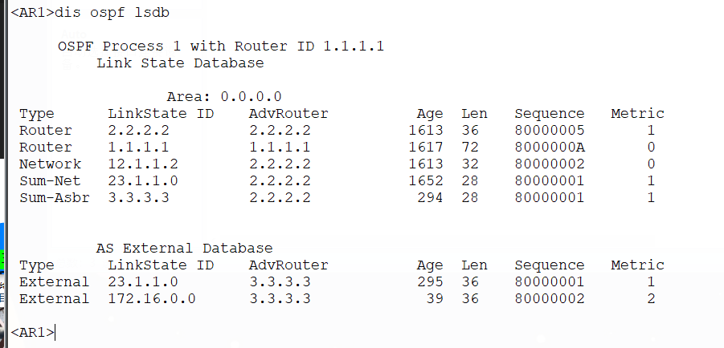

### 二、ISIS


#### 1.isis基础配置

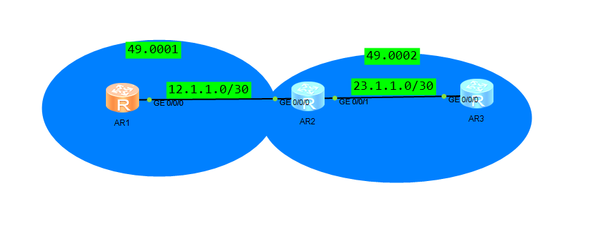

R1（Level 2,区域号为49.0001，SID为0.0.1）

```
#
isis 1
 is-level level-2
 cost-style wide #配置宽cost，解决默认cost配置narrow过小只有1-63的问题
 auto-cost enable #自动计算cost，避免默认为10影响选路
 network-entity 49.0001.0000.0000.0001.00 #配置NET地址标识设备
#
interface GigabitEthernet0/0/0
 ip address 12.1.1.1 255.255.255.252 
 isis enable 1 #启用isis路由协议
#
interface LoopBack0
 ip address 1.1.1.1 255.255.255.255 
 isis enable 1 #别忘启用在回环口上
#
```

R2（Level 1-2,区域号为49.0002，SID为0.0.2）

```
isis 1
 cost-style wide
 auto-cost enable
 network-entity 49.0002.0000.0000.0002.00
#
interface GigabitEthernet0/0/0
 ip address 12.1.1.2 255.255.255.252 
 isis enable 1
#
interface GigabitEthernet0/0/1
 ip address 23.1.1.1 255.255.255.252 
 isis enable 1
#
interface LoopBack0
 ip address 2.2.2.2 255.255.255.255 
 isis enable 1
```

R3（Level 1,区域号为49.0002，SID为0.0.3）

```
isis 1
 is-level level-1
 cost-style wide
 auto-cost enable
 network-entity 49.0002.0000.0000.0003.00
#
interface GigabitEthernet0/0/0
 ip address 23.1.1.2 255.255.255.252 
 isis enable 1
#
interface LoopBack0
 ip address 3.3.3.3 255.255.255.255 
 isis enable 1
```


结果

可以看到成功建立了邻居，并且cost值也被自动计算了

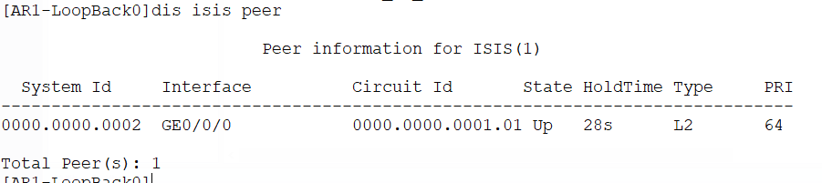

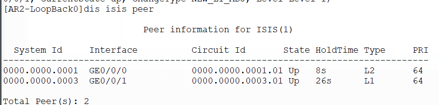

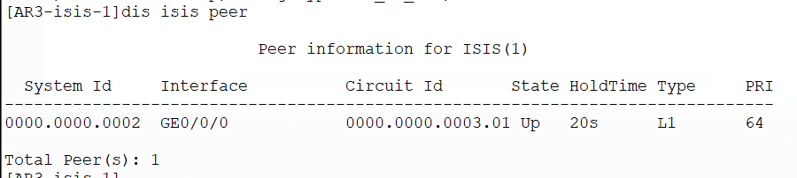

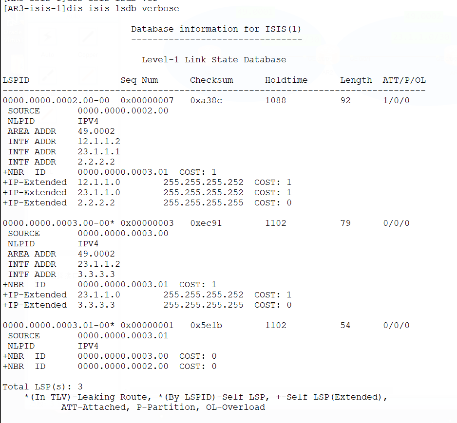