# DAY9：BGP邻居建立实验

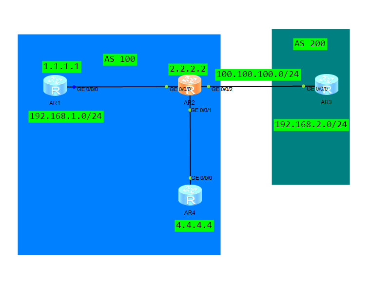

拓扑如上

AS 100内使用IS-IS进行互通

bgp配置如下

```
#AS100
#R1
bgp 100
 router-id 1.1.1.1
 peer 2.2.2.2 as-number 100 
 peer 2.2.2.2 connect-interface LoopBack0
ipv4-family unicast
  network 192.168.1.0 

#R2
bgp 100
 router-id 2.2.2.2
 peer 1.1.1.1 as-number 100 
 peer 1.1.1.1 connect-interface LoopBack0
 peer 4.4.4.4 as-number 100 
 peer 4.4.4.4 connect-interface LoopBack0
 peer 100.100.100.102 as-number 200 

#R4
bgp 100
 router-id 4.4.4.4
 peer 2.2.2.2 as-number 100 
 peer 2.2.2.2 connect-interface LoopBack0


#AS200
#R3
bgp 200
 peer 100.100.100.101 as-number 100 
ipv4-family unicast
  network 192.168.2.0 

```

邻居建立结果

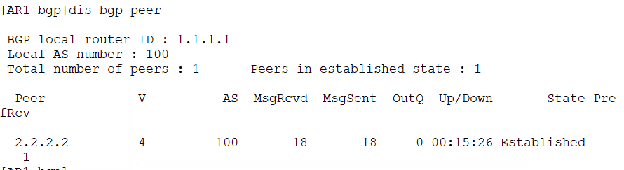

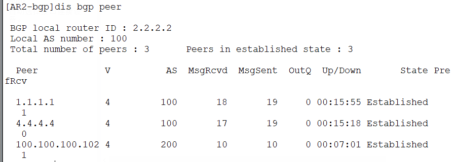

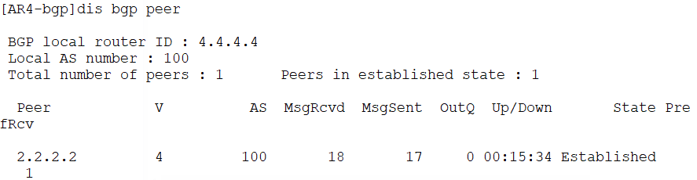

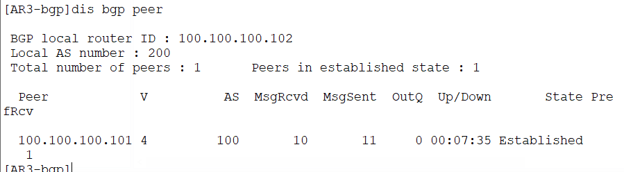

路由传播情况

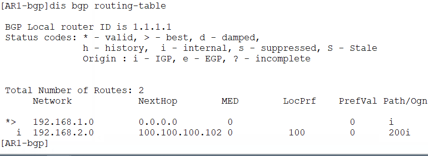

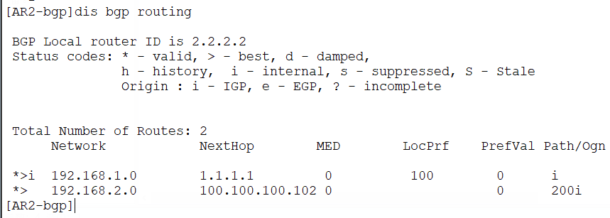

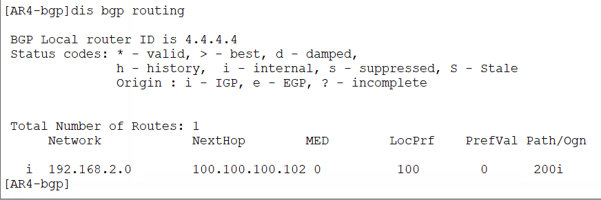

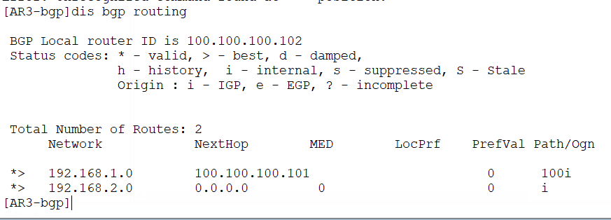

可以看到由于水平分割的防护机制，处在AS100但不与AR1建立IBGP邻居的AR4就收不到来自AR1的宣告路由

还有在AR1和AR4上192.168.2.0网络是不正常且不可达的，路由无效

可以先通过增加配置来传播路由

```
#AS100
#R1
bgp 100
 peer 4.4.4.4 as-number 100 
 peer 4.4.4.4 connect-interface LoopBack0
 

#R4
bgp 100
 peer 1.1.1.1 as-number 100 
 peer 1.1.1.1 connect-interface LoopBack0
```

配置后，可以看到路由被传播到AR4了

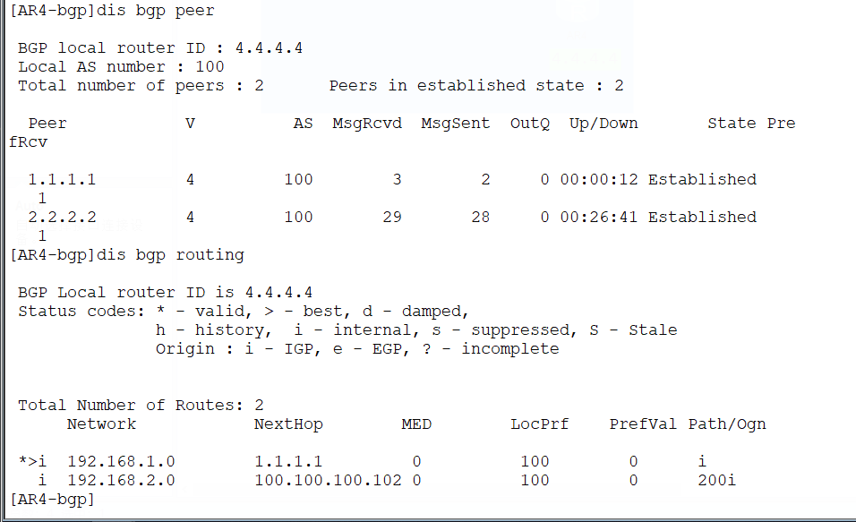

可以在AR2上增加配置使外部网络宣告的路由在IBGP之间有效（边界路由器）

使用 next-hop-local 修改EBGP路由的下一跳为本bgp路由的接口地址

```
[AR2-bgp]peer 1.1.1.1 next-hop-local
[AR2-bgp]peer 4.4.4.4 next-hop-local
#刷新
refresh bgp all export
```

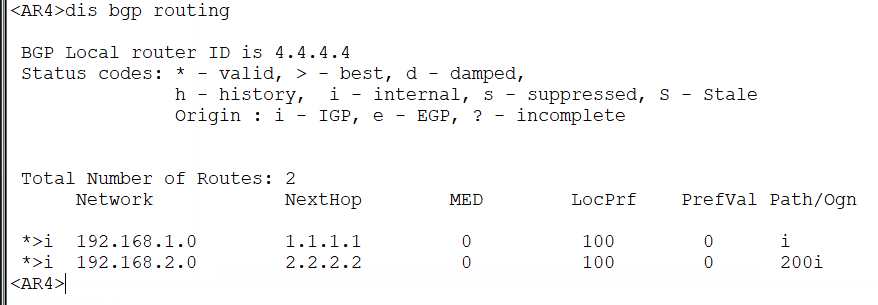

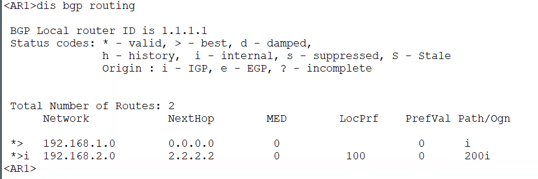

可以看到已经有效了
