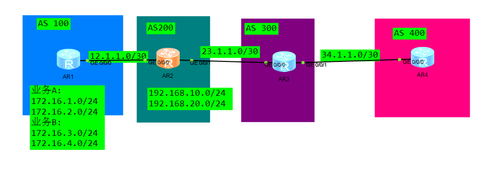
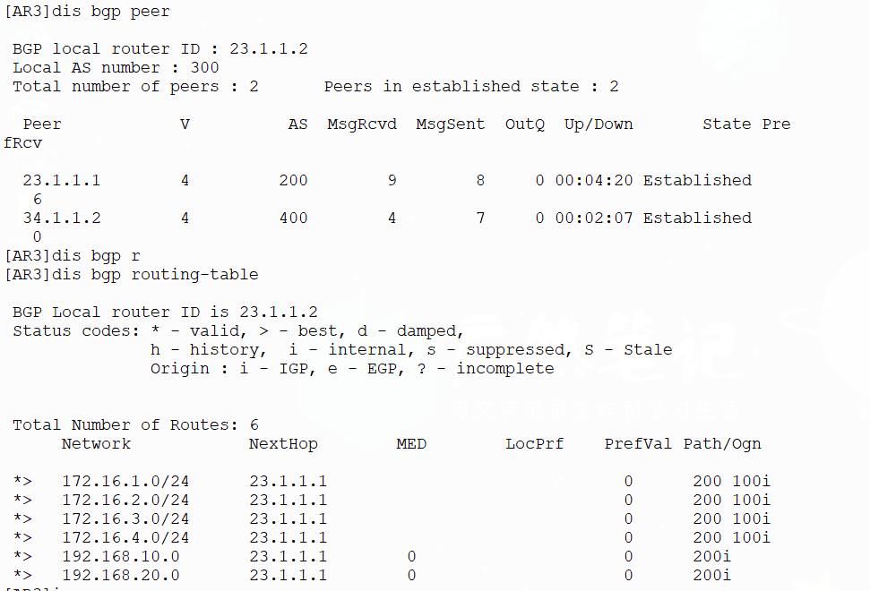
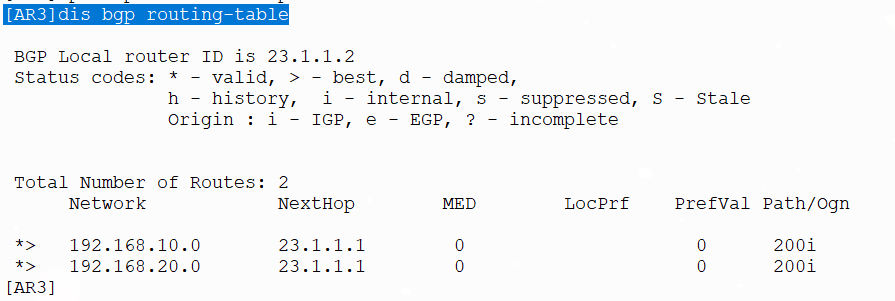

# DAY10：AS路径过滤器实验



基础配置忽略，拓扑如上

现要在R3上配置BGP路由过滤实现不接受AS100的路由
现有路由和邻居如下



```
#过滤配置
[AR3]ip as-path-filter 1 deny  _100$ #_匹配任意开头，$标记 100为结尾，限制100结尾的AS_Path
[AR3]ip as-path-filter 1 permit .* #放行其他路由
[AR3]bgp 300
[AR3-bgp]peer 23.1.1.1 as-path-filter 1 import  #应用到BGP的邻居入方向
```



应用后结果如上，来自AS100的路由都被清除了。