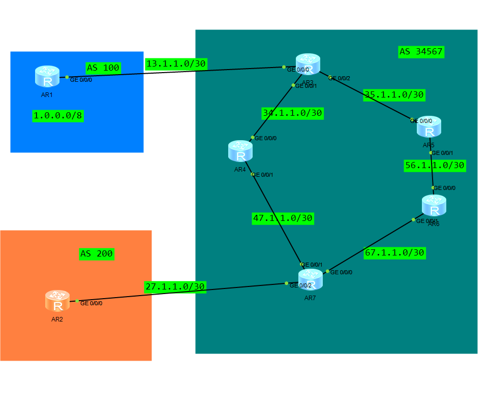
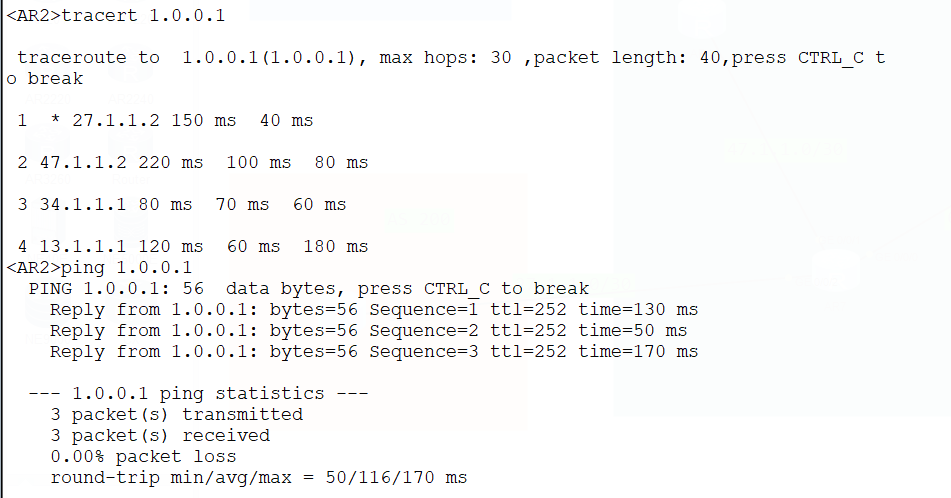

# DAY10：BGP路由黑洞实验



拓扑如上，现正常配置isis 使AS 34567内部互通，AR3和AR3使用回环口建立IBGP邻居，AR1和AR3，AR2和AR7建立EBGP邻居，AR1上有1.0.0.0/8网段直连并宣告进入BGP路由中。

现有问题：AR2和AR1无法ping通

如何产生的问题？

AR3-AR7是通过跨设备连接的，AR4、5、6都是不运行BGP协议的，收到数据不知道1.0.0.0/8网络在哪，不认识也无法识别BGP路由。

如何解决？

将BGP路由引入ISIS，AR2-AR1路径就打通了

```
#AR3
ip ip-prefix 1 index 10 permit 1.0.0.0 8

route-policy net1 permit node 10 
 if-match ip-prefix 1 
 
isis 1
 import-route bgp route-policy net1 
```

新的问题来了还是不通？

因为找不到回程路由，AR1不认识AR2的网络，无法回应来自27.1.1.0/30的ICMP请求

而且因为AR7和AR2直连，直接引入直连路由不一定有效，可能因为直连路由优先级比BGP路由高导致被忽略，不过应该在不被覆盖的情况下还是可以用的。

所以这里使用先在AR7把27.1.1.0/30网络上引入ISIS中，然后在到AR3上把ISIS路由中的27.1.1.0/30 network宣告进入BGP路由。

```
#AR7
ip ip-prefix dir index 10 permit 27.1.1.0 30

route-policy dir27 permit node 10 
 if-match ip-prefix dir
#引入ISIS
isis 1
 import-route direct level-1 route-policy dir27 
```

```
#AR3
bgp 34567
 ipv4-family unicast
  network 27.1.1.0 255.255.255.252 
```

现在就可以通了

