# DAY11 路由汇总实验


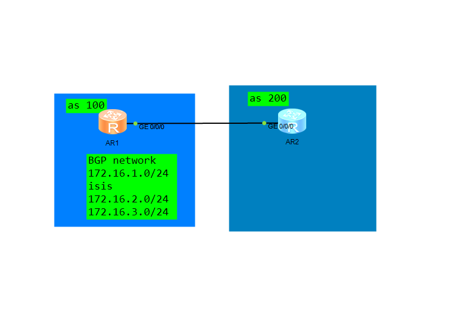

172.16.1.0/24由BGP network宣告引入

172.16.2.0/24

172.16.3.0/24由BGP从isis引入

### 自动汇总

汇总前

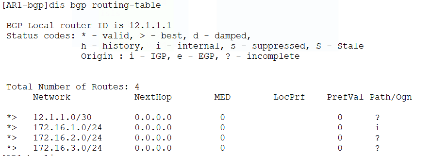

```
[AR1]bgp 100
[AR1-bgp]ipv4-family unicast 
[AR1-bgp-af-ipv4]summary automatic 

```

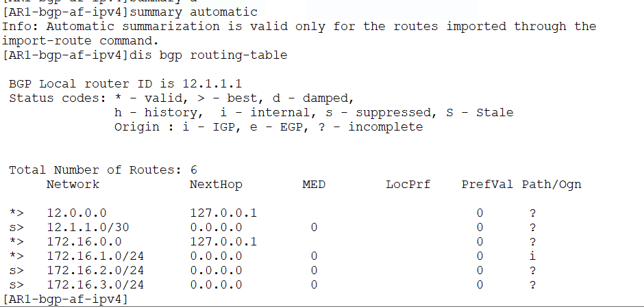

可以看到汇总后所有被import引入的可汇总路由被自动汇总了，并且明细路由也被抑制了，而network宣告的不受影响没有被抑制


### 增加R2BGP network宣告172.16.4.0/24

### 手动汇总

```
bgp 100
 aggregate 172.16.0.0 16
```

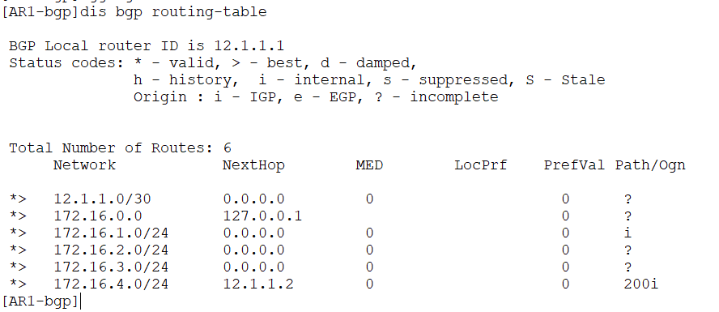

可以看到汇总创建了但明细路由没有被抑制

### 手动汇总并抑制明细路由

额外使用`detail-suppressed`参数抑制明细路由（翻译就为 细节-抑制）

```
	aggregate 172.16.0.0 16 detail-suppressed
```

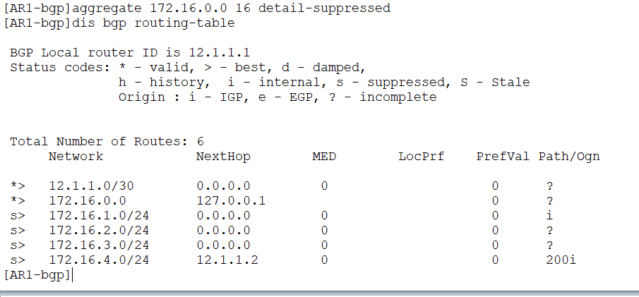

可以看到被汇总的所有明细都被抑制了，并且由network宣告的都被汇总抑制了，同时看下图，AS-Path是有属性的，现在被清除了，说明默认不能保留AS-path

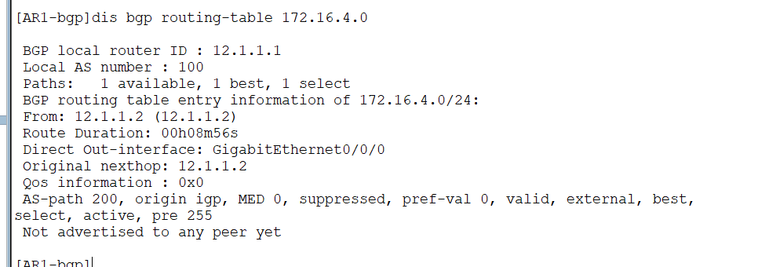

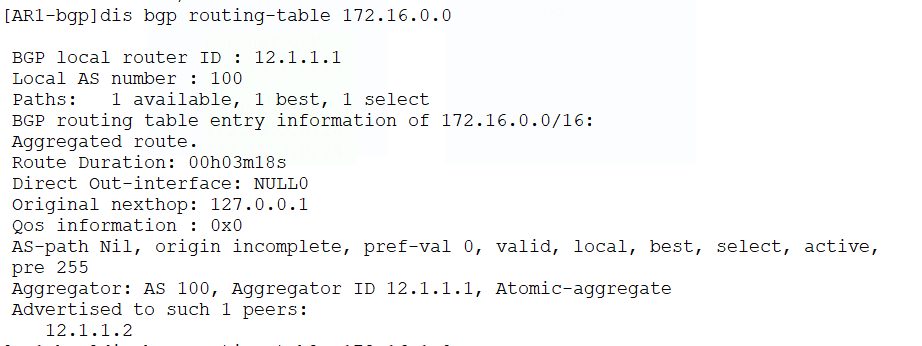

### 抑制明细路由并保留AS-path

额外使用`as-set`参数使AS-path改变格式为as-set，以保留AS-path的原始信息

```
aggregate 172.16.0.0 16 detail-suppressed as-set
```

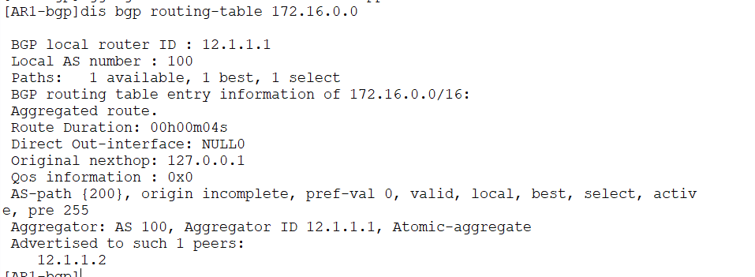

可以看到 200 显示出来了


### 抑制指定明细路由并保留AS-path

如果想只抑制某些路由，保留其他的，可以使用suppress-policy来应用策略

```
ip ip-prefix yiZhi1 permit 172.16.1.0 24
route-policy yiZhi1 permit node 10
 if-match ip-prefix yiZhi1
 
bgp 100
 aggregate 172.16.0.0 16 as-set detail-suppressed suppress-policy yiZhi
```

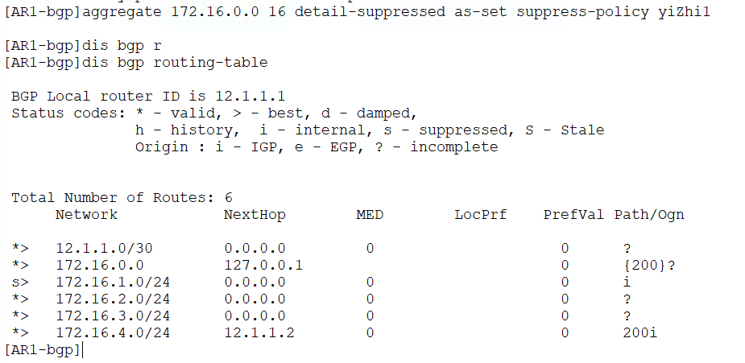

结果可以看到只有指定的被抑制了


### 绑定汇总路由到指定路由（当指定路由消失，汇总消失）

当想设置某些路由特别重要，只要其消失，该汇总就应该消失，我们可以将这些路由匹配为汇总的源路由

并且可以和`detail-suppressed`联动，只将其指定的路由抑制（没加该参数默认不会抑制）

```
[AR1]ip ip-prefix test1 permit 172.16.3.0 24
[AR1]route-policy test1 permit node 10
[AR1-route-policy] if-match ip-prefix test1

bgp 100
	aggregate 172.16.0.0 255.255.0.0 origin-policy test1
```

不加抑制参数

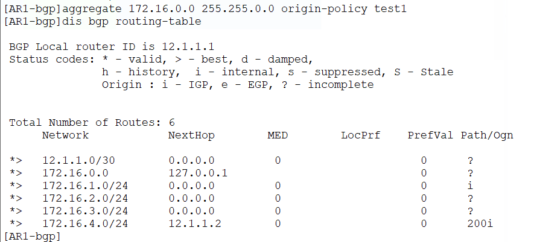

加抑制参数

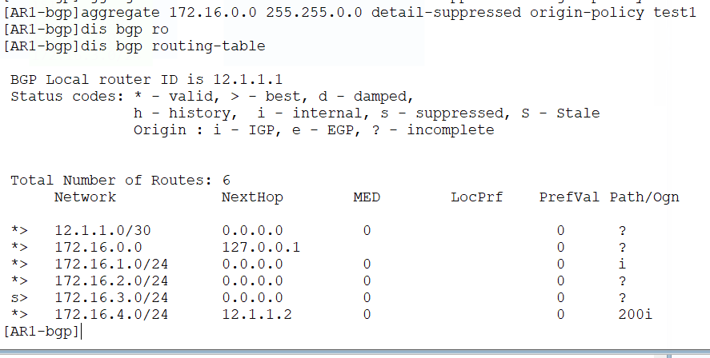


### 设置汇总路由的路径属性

可以通过策略和`attribute-policy`(属性策略)参数组合使用来设置某些参数，比如BGP汇总路由的MED

```
route-policy test2 permit node 10
 apply cost 120

bgp 100
 aggregate 172.16.0.0 16 detail-suppressed attribute-policy test2
```

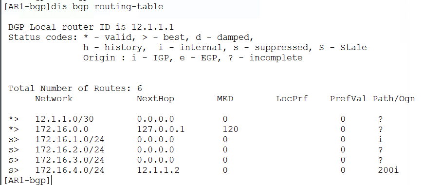

可以看到汇总路由的MED被指定为120了