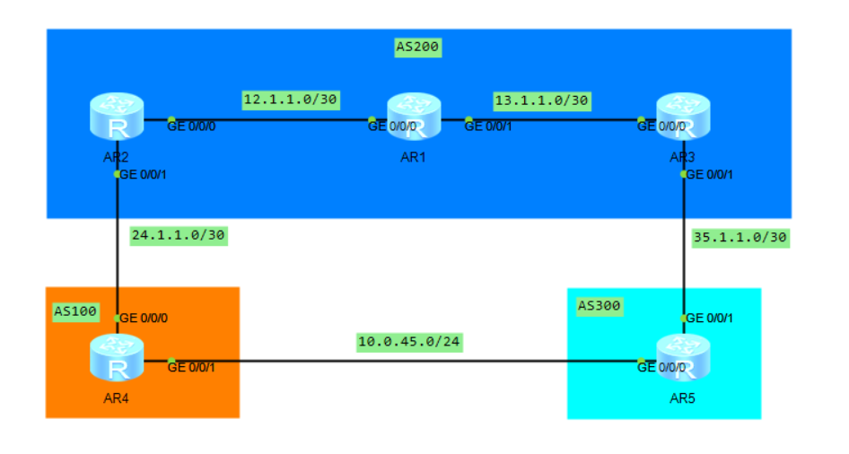

# DAY12：BGP选路实验

> **对应规则**：BGP 11条选路规则验证实验
> **拓扑参考**：如下图（涉及AR1~AR5，AS 100/200/300等）
> **环境说明**：华为设备（eNSP），所有实验均基于同一张BGP互联拓扑



## 实验一：通过修改 Preferred_Value 进行选路

**适用规则**：规则1（PV越大越优）  
**修改方向**：仅本地有效，只能在入方向（import）修改

**目标**：使原本因Router-ID较大未被优选的AR3路由变为优选。

**配置步骤**（在AR1上操作）：

```bash
# 1. 定义匹配前缀
[AR1] ip ip-prefix test1 permit 10.0.45.0 24

# 2. 创建路由策略（设置PV值）
[AR1] route-policy test1 permit node 10
[AR1-route-policy] if-match ip-prefix test1
[AR1-route-policy] apply preferred-value 1000
[AR1-route-policy] quit

# 3. 在BGP中调用（针对邻居AR3的入方向）
[AR1] bgp 200
[AR1-bgp] peer 3.3.3.3 route-policy test1 import
```

**验证**：`display bgp routing-table 10.0.45.0 24` 查看选路状态，优选路由的PV值最大。


## 实验二：通过修改 Local_Preference 进行选路

**适用规则**：规则2（Local_Pref越大越优）  
**修改方向**：通常在出方向（export）或入方向（import）均可，仅在IBGP内传递。

### 方法一：在AR3的出方向配置（推荐）

```bash
[AR3] ip ip-prefix test1 permit 10.0.45.0 24
[AR3] route-policy test1 permit node 10
[AR3-route-policy] if-match ip-prefix test1
[AR3-route-policy] apply local-preference 200
[AR3-route-policy] quit
[AR3] route-policy test1 permit node 20   # 放行其他所有路由（默认拒绝）
[AR3-route-policy] quit

[AR3] bgp 200
[AR3-bgp] peer 1.1.1.1 route-policy test1 export
```

### 方法二：在AR1的入方向配置（备选）

```bash
[AR1] ip ip-prefix test1 permit 10.0.45.0 24
[AR1] route-policy test1 permit node 10
[AR1-route-policy] if-match ip-prefix test1
[AR1-route-policy] apply local-preference 300
[AR1-route-policy] quit
[AR1] route-policy test1 permit node 20
[AR1-route-policy] quit

[AR1] bgp 200
[AR1-bgp] peer 2.2.2.2 route-policy test1 import
```

**验证**：在IBGP邻居上查看路由，Local_Pref值大的被优选。


## 实验三：本地始发路由优先验证

**适用规则**：规则3（本地始发 > 从对等体学习）  
**本地始发优先级**：手工汇总 > 自动汇总 > network > import-route

| 场景  | 操作                                                    | 结果                           |
| ----- | ------------------------------------------------------- | ------------------------------ |
| 场景1 | 多台路由器同时宣告同一路由                              | 本地宣告（自己产生的）路由最优 |
| 场景2 | 同一路由器同时使用`network`和`import-route`引入相同路由 | `network`宣告的路由更优        |
| 场景3 | 手动汇总与自动汇总同时存在                              | **手动汇总**更优               |

**示例配置（验证场景2）** ：

```bash
# 在R2上先配置一条静态路由
[R2] ip route-static 100.100.100.0 24 NULL 0

# 分别使用两种方式引入（实际测试时建议分步验证）
[R2] bgp 200
[R2-bgp] network 100.100.100.0 24          # 此方式产生的Origin为IGP
[R2-bgp] import-route static               # 此方式产生的Origin为Incomplete
# 若同时存在，network路由会被优选
```


## 实验四：AS_Path 最短优选验证

**适用规则**：规则4（AS_Path越短越优）  
**修改方向**：出方向添加AS号（加长路径会降权）。

**目标**：在AR2上看到两条去往 10.0.45.0/24 的路由，通过加长其中一条的AS_Path使其不被优选。

**配置步骤**（在AR2上操作）：

```bash
# 1. 匹配路由
[AR2] ip ip-prefix as_path permit 10.0.45.0 24

# 2. 路由策略：追加AS号（加长路径）
[AR2] route-policy as_path permit node 10
[AR2-route-policy] if-match ip-prefix as_path
[AR2-route-policy] apply as-path 400 additive   # 在前面追加AS 400
[AR2-route-policy] quit

# 3. 针对邻居AR1出方向调用
[AR2] bgp 200
[AR2-bgp] peer 1.1.1.1 route-policy as_path export
```

**验证**：`display bgp routing-table 10.0.45.0 24`，AS_Path较短的路由被优选。


## 实验五：Origin 属性优选验证

**适用规则**：规则5（IGP > EGP > Incomplete）

**配置思路**：
- 在 **R2** 上通过 `network` 宣告 100.100.100.0/24 → Origin为 **IGP**
- 在 **R4** 上通过 `import-route` 引入同一条 100.100.100.0/24 → Origin为 **Incomplete**

**配置示例**：

```bash
# R2配置（network宣告）
[R2] ip route-static 100.100.100.0 24 NULL 0
[R2] bgp 200
[R2-bgp] network 100.100.100.0 24

# R4配置（import引入）
[R4] ip route-static 100.100.100.0 24 NULL 0
[R4] bgp 100
[R4-bgp] import-route static
```

**验证**：在R3上查看去往 100.100.100.0/24 的路由，R2（Origin: IGP）的路由会被优选。


## 实验六：MED 值优选验证

**适用规则**：规则6（MED越小越优）  
**修改方向**：出方向（export）修改。

**目标**：R4和R5同时向AS 200宣告 10.0.45.0/24，通过调整MED值让R5的路由被优选。

**配置步骤**：

```bash
# -------- AR4配置（MED设为200，较不优）--------
[AR4] ip ip-prefix med permit 10.0.45.0 24
[AR4] route-policy med permit node 10
[AR4-route-policy] if-match ip-prefix med
[AR4-route-policy] apply cost 200
[AR4-route-policy] quit
[AR4] route-policy med permit node 20   # 放行其他路由
[AR4-route-policy] quit

[AR4] bgp 100
[AR4-bgp] peer 24.1.1.1 route-policy med export


# -------- AR5配置（MED设为100，更优）--------
[AR5] ip ip-prefix med permit 10.0.45.0 24
[AR5] route-policy med permit node 10
[AR5-route-policy] if-match ip-prefix med
[AR5-route-policy] apply cost 100
[AR5-route-policy] quit
[AR5] route-policy med permit node 20
[AR5-route-policy] quit

[AR5] bgp 300
[AR5-bgp] peer 35.1.1.1 route-policy med export
```

**验证**：在AR3上查看路由，MED值更小（100）的AR5路径被优选。


## 实验七：路由类型优选（EBGP vs IBGP）

**适用规则**：规则7（EBGP路由 > IBGP路由）

**场景模拟**：当其他选路条件相同时，来自EBGP邻居的路由优于来自IBGP邻居的路由。

**配置模拟思路**（在R1上操作）：

```bash
# 1. 在R1上新加一条静态路由（模拟外部路由）
[AR1] ip route-static 172.16.1.0 24 NULL 0

# 2. 用network宣告（保证Origin一致，避开规则5干扰）
[AR1] bgp 200
[AR1-bgp] network 172.16.1.0 24

# 此时观察该路由：
# - 若从EBGP邻居（如AR4）学习到相同路由，EBGP路径会被优选
# - 若从IBGP邻居（如AR2）学习到相同路由，IBGP路径被比下去
```

**验证**：`display bgp routing-table` 查看路由类型标记，EBGP路由的优选优先级更高。


## 实验八：Next_Hop 的 IGP 度量值优选

**适用规则**：规则8（到Next_Hop的IGP度量值越小越优）

**操作方式**：修改底层OSPF的Cost值，影响BGP下一跳的可达性度量。

**配置示例**（在AR1上操作）：

```bash
# 进入AR1连接AR2的接口（假设为G0/0/0），修改OSPF开销
[AR1] interface GigabitEthernet0/0/0
[AR1-GigabitEthernet0/0/0] ospf cost 100   # 改大此开销，使经过此路径变差
```

**效果**：
- 若存在两条BGP路由，下一跳分别指向R2和R3。
- OSPF到R3下一跳的Cost更小，则对应BGP路由被优选。

**验证**：`display bgp routing-table` 查看最优路径的下一跳，并通过 `display ospf routing` 确认Cost值。


## 实验九：负载分担配置

**适用规则**：规则1~8完全相同 **且 AS_Path也须完全相同** 时，方可开启负载分担。

### 前提条件（全部满足才可负载分担）

1. Preferred_Value 相同
2. Local_Preference 相同
3. 同为聚合或同为非聚合路由
4. **AS_Path长度相同 + 内容完全相同** ← **关键！**
5. Origin 类型相同
6. MED 值相同
7. 同为 EBGP 或同为 IBGP
8. IGP Metric（到 Next_Hop）相同

### 为什么配了负载分担但不生效？

> **根因**：AR1 学习到的两条 10.0.45.0/24 路由，其 **AS_Path 内容不完全相同**（例如一条经过 AS 100，另一条经过 AS 300），导致规则4判定为不匹配，负载分担无法生效。

### 解决方案：强制覆盖 AS_Path 使其完全相同

**配置步骤**（在 AR3 上操作）：

```bash
# 1. 匹配需要负载分担的路由前缀
[AR3] ip ip-prefix load permit 10.0.45.0 24

# 2. 路由策略：将 AS_Path 强制覆盖为统一值 "100"
[AR3] route-policy load permit node 10
[AR3-route-policy] if-match ip-prefix load
[AR3-route-policy] apply as-path 100 overwrite
# 系统提示：The AS-Path lists of routes to which this route-policy is applied will be overwritten.
[AR3-route-policy] quit

# 3. 放行其他路由（必须配置，否则默认拒绝所有）
[AR3] route-policy load permit node 20
[AR3-route-policy] quit

# 4. 在BGP中调用（对邻居AR1出方向生效）
[AR3] bgp 200
[AR3-bgp] peer 1.1.1.1 route-policy load export
[AR3-bgp] quit
```

### 开启负载分担（AR3上配置）

```bash
[AR3] bgp 200
[AR3-bgp] maximum load-balancing ibgp 2   # IBGP负载分担，最大链路数2
# 若针对EBGP，命令为：maximum load-balancing ebgp 2
```

### 验证结果

- `display bgp routing-table 10.0.45.0 24` 查看，两条路由的 AS_Path 均被覆盖为 `100`，条件满足。
- `display ip routing-table 10.0.45.0 24` 查看 IP 路由表，目标网段存在两条下一跳，负载分担生效。
- `display bgp routing-table` 查看 BGP 路由表，两条路由均显示为 **Best**（最优）。

### 补充说明：`overwrite` vs `additive`

| 参数                          | 效果                                | 使用场景                                        |
| ----------------------------- | ----------------------------------- | ----------------------------------------------- |
| `apply as-path 100 overwrite` | **覆盖**原有AS_Path，强制设为指定值 | 需要强制多条路由AS_Path完全一致时（如负载分担） |
| `apply as-path 400 additive`  | **追加**AS号到原有AS_Path之前       | 需要降低某条路由优先级时（加长路径）            |

> ⚠️ **注意**：`overwrite` 会丢失原有AS路径信息，在真实生产环境中可能引起环路风险，请谨慎使用，建议仅在实验或明确可控场景下操作。


## 附：选路验证通用排查命令

```bash
# 1. 查看指定路由的详细选路过程
display bgp routing-table 10.0.45.0 24 verbose

# 重点关注输出中的：
# - "Best: Yes/No" 是否为最优
# - "Preference Value / Local Preference / MED" 各项属性值
# - "Best reason" 未被优选的详细原因（如下一跳不可达、AS环路等）

# 2. 查看BGP路由概要（快速对比多条路径）
display bgp routing-table
```