# DAY14：MPLS VPN基础配置实验

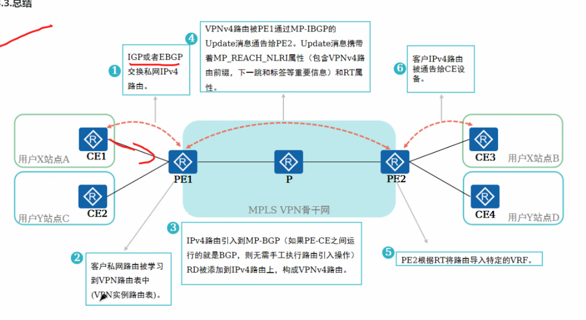

## 实验参考拓扑如上图

实际我的拓扑（不太会做，请见谅）

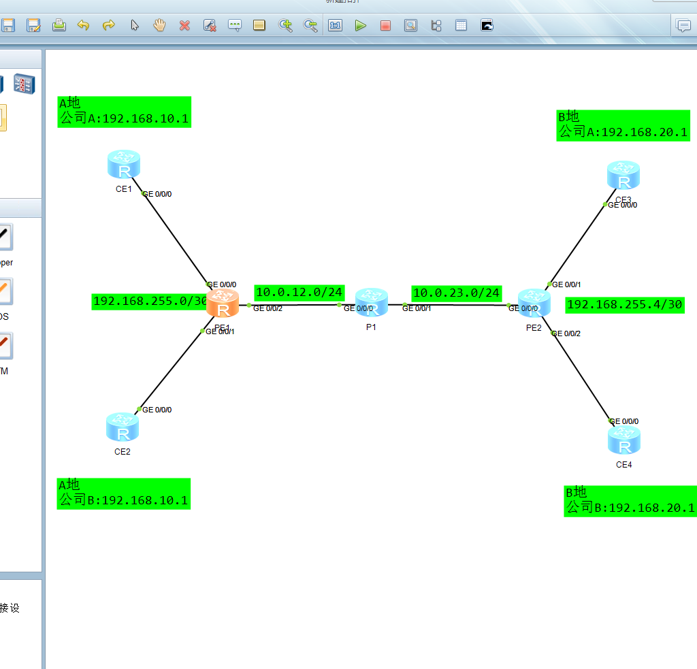

### MPLS L3VPN 跨站点互通配置

#### 组网拓扑

```
CE1 ─── PE1 ─── P1 ─── PE2 ─── CE3
CE2 ─── PE1                  PE2 ─── CE4
```

- **VPN 实例**：VPNA（CE1-CE3）、VPNB（CE2-CE4）
- **公网底层**：OSPF + MPLS LDP
- **私网协议**：OSPF（CE ↔ PE）+ MP-BGP VPNv4（PE ↔ PE）

### 全网 IP 地址规划表

| 设备 | 接口      | 所属 | IP地址           | 对端                        |
| :--- | :-------- | :--- | :--------------- | :-------------------------- |
| CE1  | G0/0/0    | VPNA | 192.168.255.2/30 | PE1-G0/0/1（192.168.255.1） |
| CE1  | Loopback1 | VPNA | 192.168.10.1/24  | -                           |
| CE2  | G0/0/0    | VPNB | 192.168.255.2/30 | PE1-G0/0/2（192.168.255.1） |
| CE2  | Loopback1 | VPNB | 192.168.10.1/24  | -                           |
| PE1  | Loopback0 | 公网 | 1.1.1.1/32       | -                           |
| PE1  | G0/0/0    | 公网 | 10.0.12.1/24     | P1-G0/0/0（10.0.12.2）      |
| PE1  | G0/0/1    | VPNA | 192.168.255.1/30 | CE1-G0/0/0（192.168.255.2） |
| PE1  | G0/0/2    | VPNB | 192.168.255.1/30 | CE2-G0/0/0（192.168.255.2） |
| P1   | Loopback0 | 公网 | 2.2.2.2/32       | -                           |
| P1   | G0/0/0    | 公网 | 10.0.12.2/24     | PE1-G0/0/0（10.0.12.1）     |
| P1   | G0/0/1    | 公网 | 10.0.23.1/24     | PE2-G0/0/0（10.0.23.2）     |
| PE2  | Loopback0 | 公网 | 3.3.3.3/32       | -                           |
| PE2  | G0/0/0    | 公网 | 10.0.23.2/24     | P1-G0/0/1（10.0.23.1）      |
| PE2  | G0/0/1    | VPNA | 192.168.255.6/30 | CE3-G0/0/0（192.168.255.5） |
| PE2  | G0/0/2    | VPNB | 192.168.255.6/30 | CE4-G0/0/0（192.168.255.5） |
| CE3  | G0/0/0    | VPNA | 192.168.255.5/30 | PE2-G0/0/1（192.168.255.6） |
| CE3  | Loopback1 | VPNA | 192.168.20.1/24  | -                           |
| CE4  | G0/0/0    | VPNB | 192.168.255.5/30 | PE2-G0/0/2（192.168.255.6） |
| CE4  | Loopback1 | VPNB | 192.168.20.1/24  | -                           |

---

### 第一阶段：公网底层

**步骤1：配置设备名称**

```text
# PE1配置
system-view
sysname PE1

# P1、PE2 上同样需要配置设备名称，替换为对应主机名
```

**步骤2：配置环回口和公网互联接口 IP**

```text
# PE1配置
interface Loopback0
 ip address 1.1.1.1 255.255.255.255
 quit

interface GigabitEthernet0/0/0
 ip address 10.0.12.1 255.255.255.0
 quit

# P1配置：Loopback0 = 2.2.2.2/32，G0/0/0 = 10.0.12.2/24，G0/0/1 = 10.0.23.1/24
# PE2配置：Loopback0 = 3.3.3.3/32，G0/0/0 = 10.0.23.2/24
```

**步骤3：配置 OSPF 保证环回口互通**

```text
# PE1配置
ospf 1
 area 0.0.0.0
  network 1.1.1.1 0.0.0.0
  network 10.0.12.0 0.0.0.255
 quit

# P1配置：宣告 2.2.2.2、10.0.12.0、10.0.23.0
# PE2配置：宣告 3.3.3.3、10.0.23.0
```

**步骤4：全局使能 MPLS 和 LDP**

```text
# PE1配置
mpls lsr-id 1.1.1.1
mpls
 mpls ldp
 quit

# P1配置：lsr-id 2.2.2.2
# PE2配置：lsr-id 3.3.3.3
```

**步骤5：在公网接口上使能 MPLS 和 LDP**

```text
# PE1配置
interface GigabitEthernet0/0/0
 mpls
 mpls ldp
 quit

# P1配置：G0/0/0 和 G0/0/1 都需要使能
# PE2配置：G0/0/0 使能
```

**步骤6：验证公网底层**

```text
display ip routing-table
display mpls ldp session
display mpls lsp
```

---

### 第二阶段：创建 VPN 实例

**步骤7：在 PE 上创建 VRF**

```text
# PE1配置
ip vpn-instance VPNA
 ipv4-family
  route-distinguisher 100:1
  vpn-target 100:10 export-extcommunity
  vpn-target 100:20 import-extcommunity
 quit
 quit

ip vpn-instance VPNB
 ipv4-family
  route-distinguisher 100:2
  vpn-target 100:30 export-extcommunity
  vpn-target 100:40 import-extcommunity
 quit
 quit

# PE2配置
ip vpn-instance VPNA
 ipv4-family
  route-distinguisher 100:3
  vpn-target 100:20 export-extcommunity
  vpn-target 100:10 import-extcommunity
 quit
 quit

ip vpn-instance VPNB
 ipv4-family
  route-distinguisher 100:4
  vpn-target 100:40 export-extcommunity
  vpn-target 100:30 import-extcommunity
 quit
 quit
```

**步骤8：将 PE 接口绑定到 VRF（修正IP）**

```text
# PE1配置
interface GigabitEthernet0/0/1
 ip binding vpn-instance VPNA
 ip address 192.168.255.1 255.255.255.252
 quit

interface GigabitEthernet0/0/2
 ip binding vpn-instance VPNB
 ip address 192.168.255.1 255.255.255.252
 quit

# PE2配置
interface GigabitEthernet0/0/1
 ip binding vpn-instance VPNA
 ip address 192.168.255.6 255.255.255.252
 quit

interface GigabitEthernet0/0/2
 ip binding vpn-instance VPNB
 ip address 192.168.255.6 255.255.255.252
 quit

# 注意：ip binding vpn-instance 会清除接口原有 IP，需重新配置
```

**步骤9：配置私网 OSPF 绑定到 VRF**

```text
# PE1配置
ospf 100 vpn-instance VPNA
 area 0.0.0.0
  network 192.168.255.0 0.0.0.3
 quit

ospf 200 vpn-instance VPNB
 area 0.0.0.0
  network 192.168.255.0 0.0.0.3
 quit

# PE2配置
ospf 100 vpn-instance VPNA
 area 0.0.0.0
  network 192.168.255.4 0.0.0.3
 quit

ospf 200 vpn-instance VPNB
 area 0.0.0.0
  network 192.168.255.4 0.0.0.3
 quit
```

---

### 第三阶段：CE 侧基础配置

**步骤10：配置 CE 接口 IP 及 Loopback 模拟私网（修正IP）**

```text
# CE1配置
system-view
sysname CE1

interface GigabitEthernet0/0/0
 ip address 192.168.255.2 255.255.255.252
 quit

interface Loopback1
 ip address 192.168.10.1 255.255.255.0
 ospf network-type broadcast
 quit

# CE2配置
system-view
sysname CE2

interface GigabitEthernet0/0/0
 ip address 192.168.255.2 255.255.255.252
 quit

interface Loopback1
 ip address 192.168.10.1 255.255.255.0
 ospf network-type broadcast
 quit

# CE3配置（修正IP地址）
system-view
sysname CE3

interface GigabitEthernet0/0/0
 ip address 192.168.255.5 255.255.255.252
 quit

interface Loopback1
 ip address 192.168.20.1 255.255.255.0
 ospf network-type broadcast
 quit

# CE4配置
system-view
sysname CE4

interface GigabitEthernet0/0/0
 ip address 192.168.255.5 255.255.255.252
 quit

interface Loopback1
 ip address 192.168.20.1 255.255.255.0
 ospf network-type broadcast
 quit
```

**步骤11：配置 CE 的全局 OSPF**

```text
# CE1配置
ospf 100
 area 0.0.0.0
  network 192.168.255.0 0.0.0.3
  network 192.168.10.0 0.0.0.255
 quit

# CE2配置
ospf 200
 area 0.0.0.0
  network 192.168.255.0 0.0.0.3
  network 192.168.10.0 0.0.0.255
 quit

# CE3配置
ospf 100
 area 0.0.0.0
  network 192.168.255.4 0.0.0.3
  network 192.168.20.0 0.0.0.255
 quit

# CE4配置
ospf 200
 area 0.0.0.0
  network 192.168.255.4 0.0.0.3
  network 192.168.20.0 0.0.0.255
 quit

# 注意：CE 上不要配置 vpn-instance，它在全局路由表中运行
```

---

### 第四阶段：配置 MP-BGP 邻居

**步骤12：建立 IBGP 邻居使能 VPNv4 地址族**

```text
# PE1配置
bgp 100
 router-id 1.1.1.1
 peer 3.3.3.3 as-number 100
 peer 3.3.3.3 connect-interface Loopback0

 ipv4-family vpnv4
  peer 3.3.3.3 enable
 quit

# PE2配置
bgp 100
 router-id 3.3.3.3
 peer 1.1.1.1 as-number 100
 peer 1.1.1.1 connect-interface Loopback0

 ipv4-family vpnv4
  peer 1.1.1.1 enable
 quit
```

---

### 第五阶段：私网路由引入 BGP（OSPF → BGP）

**步骤13：在 BGP 中引入私网路由**

```text
# PE1配置
bgp 100
 ipv4-family vpn-instance VPNA
  import-route ospf 100
  quit
 ipv4-family vpn-instance VPNB
  import-route ospf 200
  quit

# PE2配置
bgp 100
 ipv4-family vpn-instance VPNA
  import-route ospf 100
  quit
 ipv4-family vpn-instance VPNB
  import-route ospf 200
  quit
```

---

### 第六阶段：BGP 路由引入 OSPF（BGP → OSPF）

**步骤14：创建路由策略和前缀列表**

```text
# PE1配置
# VPNA：匹配远端 CE3 的 192.168.20.0/24 和互联网段 192.168.255.4/30
ip ip-prefix PE1-TO-VPNA index 10 permit 192.168.20.0 24
ip ip-prefix PE1-TO-VPNA index 20 permit 192.168.255.4 30

# VPNB：匹配远端 CE4 的 192.168.20.0/24 和互联网段 192.168.255.4/30
ip ip-prefix PE1-TO-VPNB index 10 permit 192.168.20.0 24
ip ip-prefix PE1-TO-VPNB index 20 permit 192.168.255.4 30

route-policy PE1-TO-VPNA permit node 10
 if-match ip-prefix PE1-TO-VPNA
 quit

route-policy PE1-TO-VPNB permit node 10
 if-match ip-prefix PE1-TO-VPNB
 quit

# PE2配置
# VPNA：匹配远端 CE1 的 192.168.10.0/24 和互联网段 192.168.255.0/30
ip ip-prefix PE2-TO-VPNA index 10 permit 192.168.10.0 24
ip ip-prefix PE2-TO-VPNA index 20 permit 192.168.255.0 30

# VPNB：匹配远端 CE2 的 192.168.10.0/24 和互联网段 192.168.255.0/30
ip ip-prefix PE2-TO-VPNB index 10 permit 192.168.10.0 24
ip ip-prefix PE2-TO-VPNB index 20 permit 192.168.255.0 30

route-policy PE2-TO-VPNA permit node 10
 if-match ip-prefix PE2-TO-VPNA
 quit

route-policy PE2-TO-VPNB permit node 10
 if-match ip-prefix PE2-TO-VPNB
 quit
```

**步骤15：在 OSPF 进程中引入 BGP 路由**

```text
# PE1配置
ospf 100 vpn-instance VPNA
 import-route bgp route-policy PE1-TO-VPNA
 quit

ospf 200 vpn-instance VPNB
 import-route bgp route-policy PE1-TO-VPNB
 quit

# PE2配置
ospf 100 vpn-instance VPNA
 import-route bgp route-policy PE2-TO-VPNA
 quit

ospf 200 vpn-instance VPNB
 import-route bgp route-policy PE2-TO-VPNB
 quit
```

---

### 第七阶段：验证配置

**步骤16-19：验证命令**

```text
# 查看 BGP 邻居状态
display bgp peer

# 查看 VPNv4 路由
display bgp vpnv4 all routing-table

# 查看 VPN 实例路由表（PE 上）
display ip routing-table vpn-instance VPNA
display ip routing-table vpn-instance VPNB

# 查看 CE 路由表
display ip routing-table

# 查看 OSPF 引入的路由
display ospf 100 routing

# 测试连通性
# CE1 ping CE3（VPNA）
ping -a 192.168.10.1 192.168.20.1

# CE2 ping CE4（VPNB）
ping -a 192.168.10.1 192.168.20.1

# PE 上测试
ping -vpn-instance VPNA 192.168.20.1
ping -vpn-instance VPNB 192.168.20.1
```

结果图如下

可以看到路由被隔离了

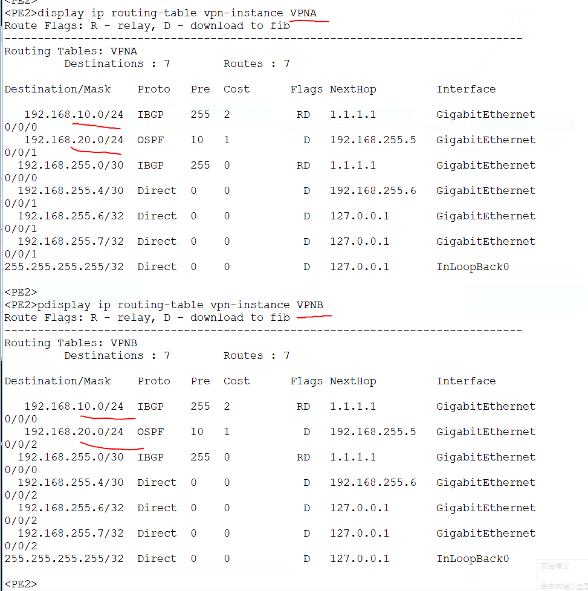

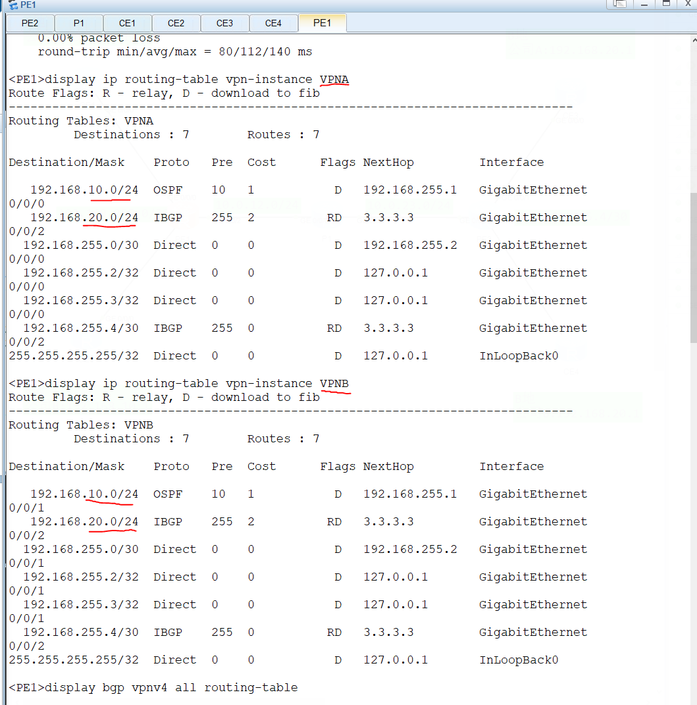

可以看到路由RT生效

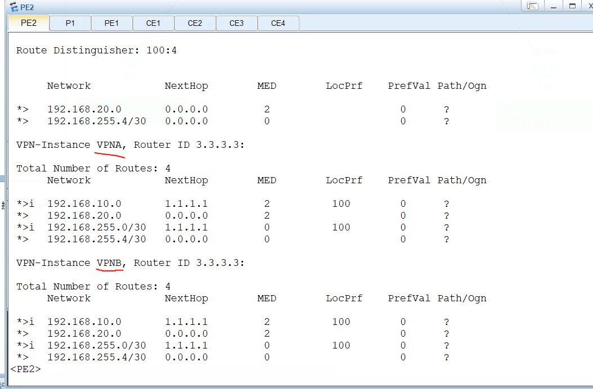

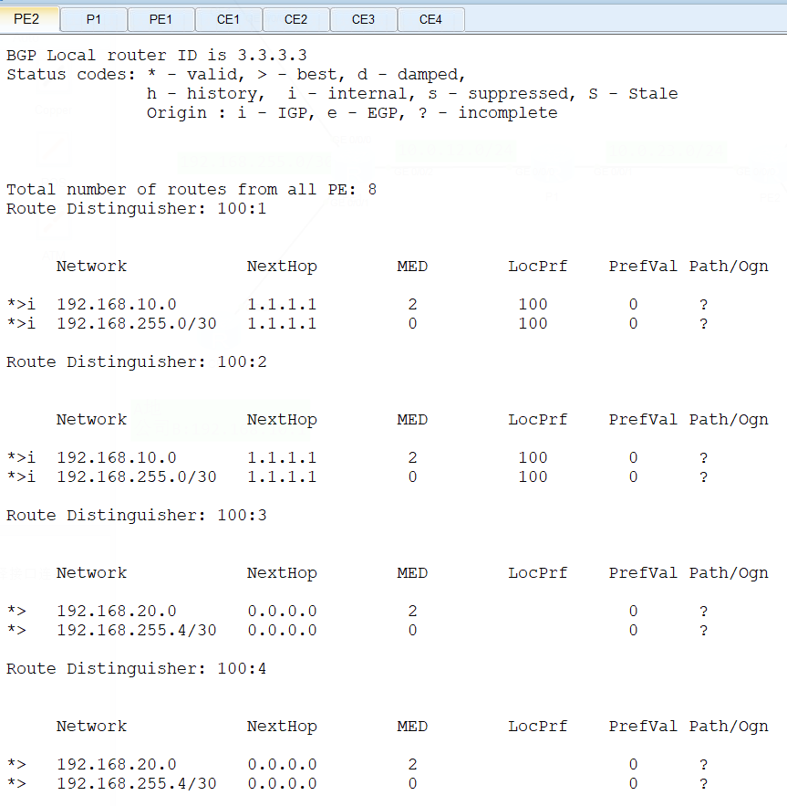

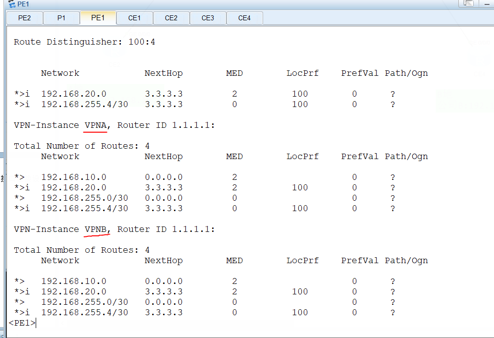

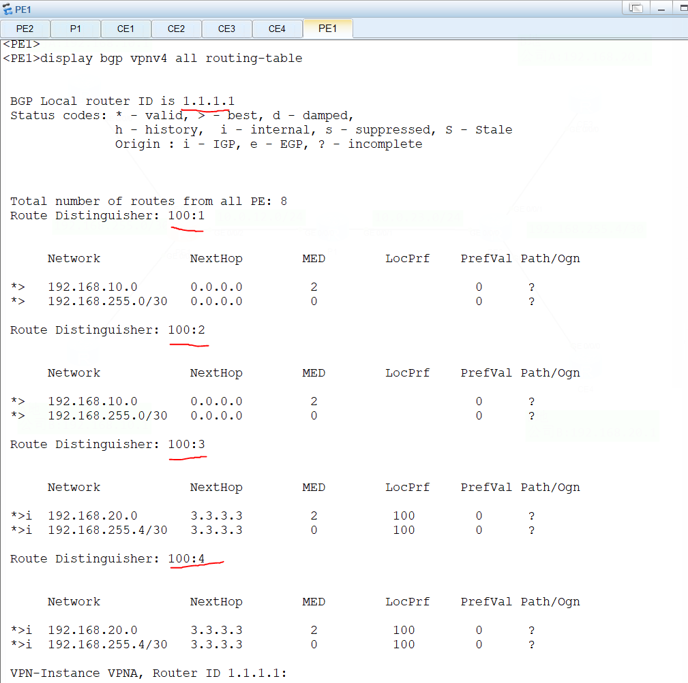

CE可以ping通

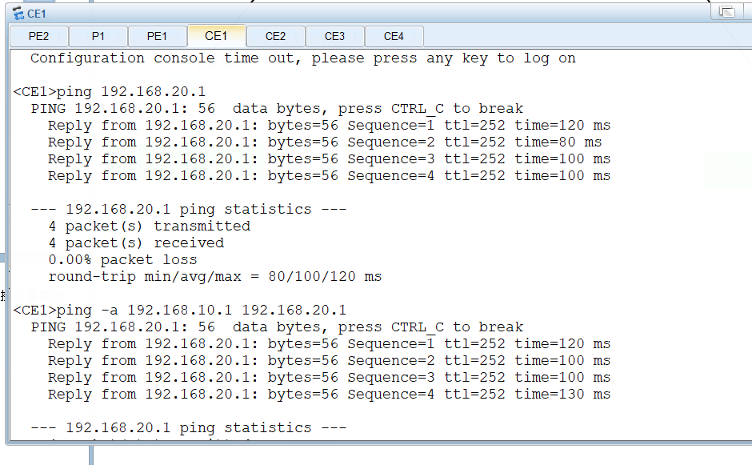

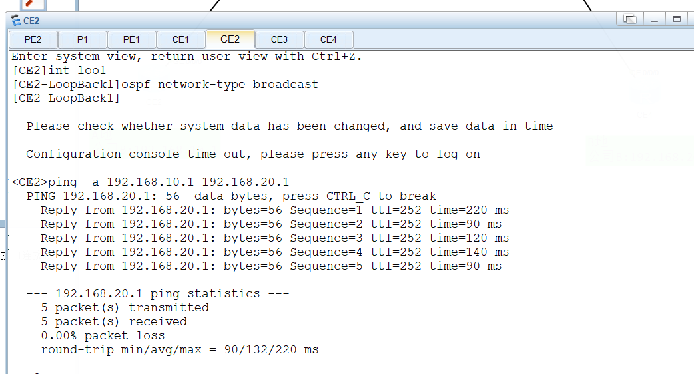

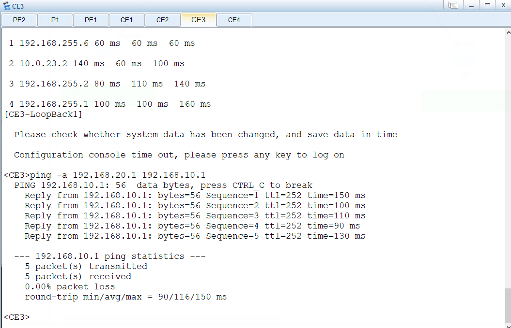

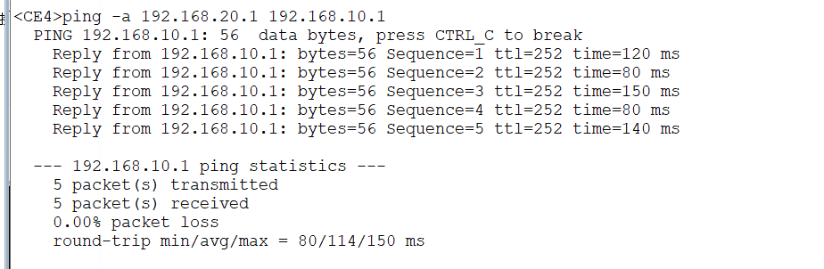

PE测试也通过（虚拟机内ensp有问题，显示字顺序出错，但不影响测试）

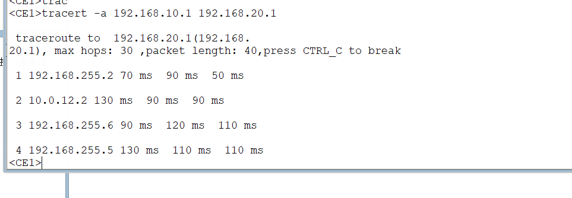

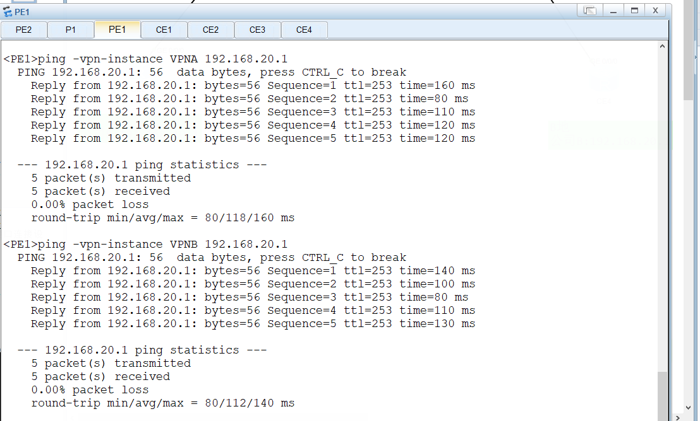

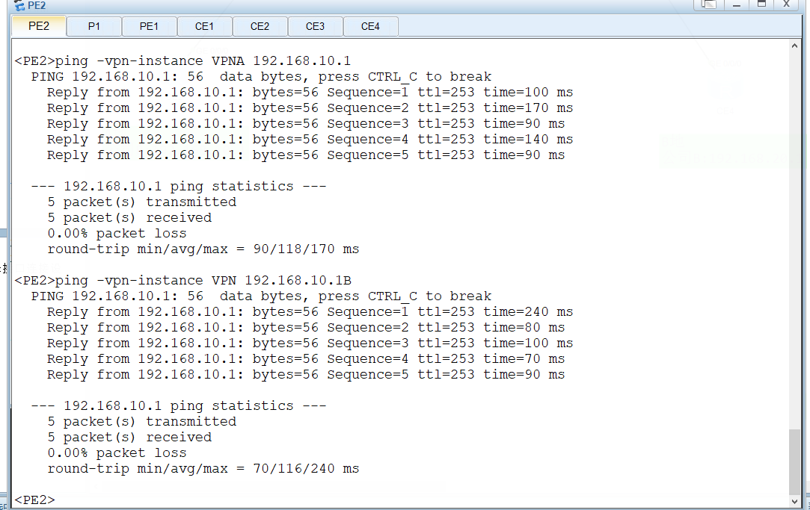

### 关键注意事项

| 序号 | 注意事项                                                     |
| :--- | :----------------------------------------------------------- |
| 1    | 公网底层（OSPF + LDP）必须提前打通，否则 BGP 邻居无法建立    |
| 2    | RD 在同一台 PE 上必须唯一，不同 PE 可以相同（但建议全局唯一） |
| 3    | RT 控制路由导入导出：Export 发布时携带，Import 接收时匹配    |
| 4    | `ip binding vpn-instance` 会清除接口原有 IP 配置，需重新配置 |
| 5    | CE 上不要配置 `vpn-instance`，它在全局路由表中运行           |
| 6    | VPNA 和 VPNB 使用不同 RT，路由互不泄露                       |
| 7    | 第六阶段（BGP → OSPF）是让 CE 学到远端路由的关键，不能省略   |
| 8    | Loopback 接口配置 `ospf network-type broadcast` 确保 OSPF 通告 /24 网段 |
| 9    | 测试连通性时建议使用 `-a` 指定 Loopback 作为源 IP，避免因互联口地址无回程路由导致不通 |


### 配置阶段汇总表

| 阶段          | 步骤  | 涉及设备           | 核心命令                                                     |
| :------------ | :---- | :----------------- | :----------------------------------------------------------- |
| 公网底层      | 1-6   | PE1、P1、PE2       | `sysname`、`interface`、`ip address`、`ospf`、`network`、`mpls lsr-id`、`mpls`、`mpls ldp` |
| 创建 VPN 实例 | 7-9   | PE1、PE2           | `ip vpn-instance`、`route-distinguisher`、`vpn-target`、`ip binding vpn-instance`、`ospf vpn-instance` |
| CE 侧基础配置 | 10-11 | CE1、CE2、CE3、CE4 | `sysname`、`interface`、`ip address`、`ospf network-type broadcast`、`ospf`（全局） |
| MP-BGP 邻居   | 12    | PE1、PE2           | `bgp`、`router-id`、`peer`、`ipv4-family vpnv4`、`peer enable` |
| OSPF → BGP    | 13    | PE1、PE2           | `ipv4-family vpn-instance`、`import-route ospf`              |
| BGP → OSPF    | 14-15 | PE1、PE2           | `ip ip-prefix`、`route-policy`、`import-route bgp route-policy` |
| 验证          | 16-19 | 所有设备           | `display bgp peer`、`display bgp vpnv4 all routing-table`、`display ip routing-table`、`ping -a` |

