# DAY15：MPLSVPN搭建实验

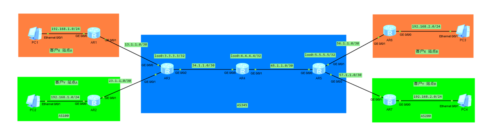

### MPLS L3VPN 跨站点互通配置

#### 组网拓扑

```
PCA1-CE1 ─── PE1 ─── P1 ─── PE2 ─── CE3--- PCA2
PCB1-CE2 ─── PE1                  PE2 ─── CE4--- PCB2
```

### 第一阶段：公网底层

**步骤1：配置设备名称**

```text
# PE1配置
system-view
sysname PE1

# P1、PE2 上同样需要配置设备名称，替换为对应主机名
```

**步骤2：配置环回口和公网互联接口 IP**

```text
# PE1配置
interface Loopback0
 ip address 1.1.1.1 32
 quit

interface GigabitEthernet0/0/0
 ip address 10.0.11.1 30
 quit

# P1配置：Loopback0 = 2.2.2.2/32，G0/0/0 = 10.0.11.2/30，G0/0/1 = 10.0.22.1/30
# PE2配置：Loopback0 = 3.3.3.3/32，G0/0/0 = 10.0.22.2/30
```

**步骤3：配置 ISIS 保证环回口互通**

```text
# PE1配置
isis 1
	is-level level-2
	net 49.0001.0000.0000.0001.00
	cost-style wide	
	auto-cost enable 
int loo0
	isis en
int g0/0/0
	isis en

# P1配置：配置 49.0001.0000.0000.0002.00,g0/0/0、g0/0/1,loopback 0 使能isis
# PE2配置：宣告 49.0001.0000.0000.0003.00,g0/0/0、loopback 0 使能isis
```

**步骤4：全局使能 MPLS 和 LDP**

```text
# PE1配置
mpls lsr-id 1.1.1.1
mpls
 mpls ldp
 quit

# P1配置：lsr-id 2.2.2.2
# PE2配置：lsr-id 3.3.3.3
```

**步骤5：在公网接口上使能 MPLS 和 LDP**

```text
# PE1配置
interface g0/0/0
 mpls
 mpls ldp
 quit

# P1配置：G0/0/0 和 G0/0/1 都需要使能
# PE2配置：G0/0/0 使能
```

**步骤6：验证公网底层**

```text
display ip routing-table
display mpls ldp session
display mpls lsp
```

如下图：可以看到公网ldp成功分配标签并建立标签网络

可以看到公网使用的LDP分配的标签

### 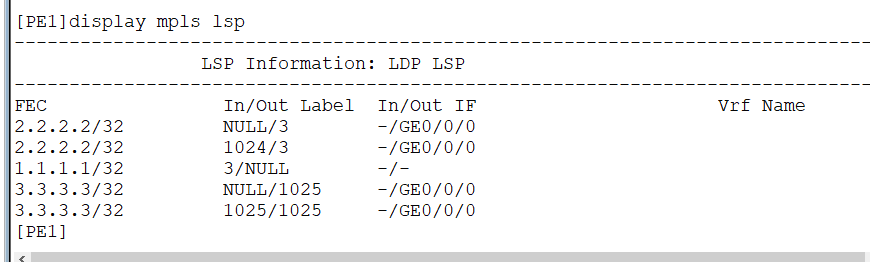

设备两端成功建立连接

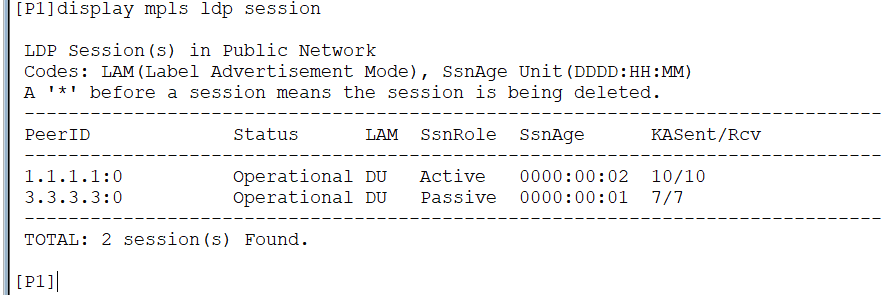

### 第二阶段：创建 VPN 实例

**步骤7：在 PE 上创建 VRF**

> rd值格式一般为：ASN：nn（公网AS号：自定义编号）
>
> rt值一般也推荐如上配置

```text
# PE1配置
ip vpn-instance VPNA
 ipv4-family
  route-distinguisher 100:1
  vpn-target 100:10 export-extcommunity
  vpn-target 100:20 import-extcommunity
 quit
 quit

ip vpn-instance VPNB
 ipv4-family
  route-distinguisher 100:2
  vpn-target 100:30 export-extcommunity
  vpn-target 100:40 import-extcommunity
 quit
 quit

# PE2配置
ip vpn-instance VPNA
 ipv4-family
  route-distinguisher 100:3
  vpn-target 100:20 export-extcommunity
  vpn-target 100:10 import-extcommunity
 quit
 quit

ip vpn-instance VPNB
 ipv4-family
  route-distinguisher 100:4
  vpn-target 100:40 export-extcommunity
  vpn-target 100:30 import-extcommunity
 quit
 quit
```

**步骤8：将 PE 接口绑定到 VRF**

```text
# PE1配置
interface GigabitEthernet0/0/1
 ip binding vpn-instance VPNA
 ip address 192.168.255.2 255.255.255.252
 quit

interface GigabitEthernet0/0/2
 ip binding vpn-instance VPNB
 ip address 192.168.255.1 255.255.255.252
 quit

# PE2配置
interface GigabitEthernet0/0/1
 ip binding vpn-instance VPNA
 ip address 192.168.255.6 255.255.255.252
 quit

interface GigabitEthernet0/0/2
 ip binding vpn-instance VPNB
 ip address 192.168.255.6 255.255.255.252
 quit

# 注意：ip binding vpn-instance 会清除接口原有 IP，需重新配置
```

**步骤9：配置私网 OSPF/BGP/静态 绑定到 VRF**

```text
# PE1配置
ospf 100 vpn-instance VPNA
 area 0.0.0.0
  network 192.168.255.0 0.0.0.3
 quit

bgp 100
	ipv4-family	vpn-instance VPNB
		peer 192.168.255.2 as-number 200
		#peer 192.168.255.2 enable 
# PE2配置
ospf 100 vpn-instance VPNA
 area 0.0.0.0
  network 192.168.255.4 0.0.0.3
 quit

ip route-static vpn-instance VPNB 192.168.20.0 255.255.255.0 192.168.255.5 

```

---

### 第三阶段：CE 侧基础配置

**步骤10：配置 CE 接口 IP 及 私网PC设置**

```text
# CE1配置
system-view
sysname CE1
interface GigabitEthernet0/0/0
 ip address 192.168.255.1 30
 quit

interface GigabitEthernet0/0/1
 ip address 192.168.10.254 24
 quit

# CE2部分配置，和1类似	

# CE3配置
system-view
sysname CE3
interface GigabitEthernet0/0/0
 ip address 192.168.255.5 30
 quit

interface GigabitEthernet0/0/1
 ip address 192.168.20.254 24
 quit

# CE4配置，和3类似

#PCA1，PCB1设置配置IP为192.168.10.1，并设置网关为192.168.10.254
#PCA1，PCB1设置配置IP为192.168.20.1，并设置网关为192.168.20.254
```

**步骤11：配置 CE 的 OSPF/BGP/静态**

```text
# CE1配置
ospf 100
 area 0.0.0.0
  network 192.168.255.0 0.0.0.3
  network 192.168.10.0 0.0.0.255
 quit

# CE2配置
bgp 200
	peer 192.168.255.1 as-number 100
	ipv4-unicast
		network 192.168.10.1 24

# CE3配置
ospf 100
 area 0.0.0.0
  network 192.168.255.4 0.0.0.3
  network 192.168.20.0 0.0.0.255
 quit

# CE4配置
ip route-static 0.0.0.0 0.0.0.0 192.168.255.6

# 注意：CE 上不要配置 vpn-instance，它在全局路由表中运行
```

**步骤12：测试EBGP邻居建立**

```
#PE1查看VPNB实例的BGP邻居
display bgp vpnv4 vpn-instance VPNB peer
#也可以用dis bgp vpnv4 all peer查看全部的
#PE1查看VPNB实例的BGP路由表
display bgp vpnv4 vpn-instance VPNB routing-table

```

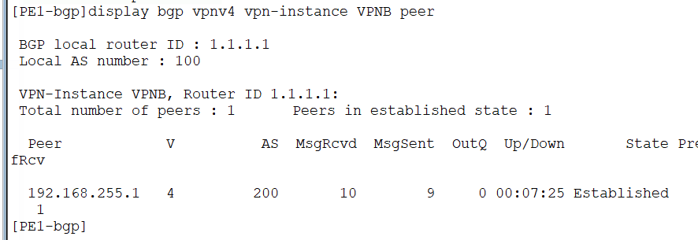

### 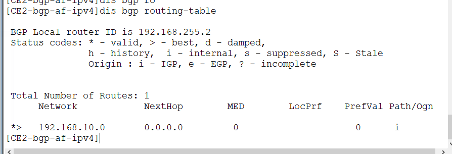

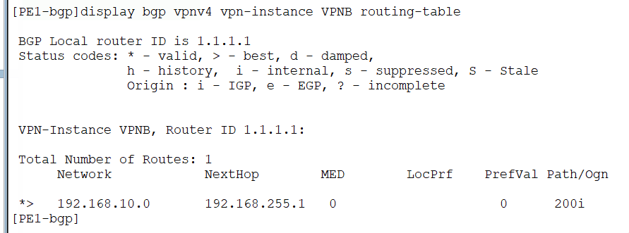

---

### 第四阶段：配置 MP-BGP 邻居

**步骤13：建立 IBGP 邻居使能 VPNv4 地址族**

```text
# PE1配置
bgp 100
 router-id 1.1.1.1
 #关闭自动创建ipv4，我们只用vpnV4
 undo default ipv4-unicast 
 peer 3.3.3.3 as-number 100
 peer 3.3.3.3 connect-interface Loopback0
 ipv4-family vpnv4
  peer 3.3.3.3 enable
 quit

# PE2配置
bgp 100
 router-id 3.3.3.3
 #关闭自动创建ipv4，我们只用vpnV4
 undo default ipv4-unicast 
 peer 1.1.1.1 as-number 100
 peer 1.1.1.1 connect-interface Loopback0

 ipv4-family vpnv4
  peer 1.1.1.1 enable
 quit
```

---

### 第五阶段：私网路由引入 BGP（OSPF → BGP）

**步骤14：在 BGP 中引入私网路由**

```text
# PE1配置
bgp 100
 ipv4-family vpn-instance VPNA
 #正常还是需要使用router-policy筛选指定ip的，不过这里就不操作了
  import-route ospf 100
  quit
#CE2使用EBGP邻居连接，就不需要互相引入路由了

# PE2配置
bgp 100
 ipv4-family vpn-instance VPNA
  import-route ospf 100
  quit
 ipv4-family vpn-instance VPNB
  import-route static 
  quit
```

---

### 第六阶段：BGP 路由引入 OSPF（BGP → OSPF）

**步骤15：在 OSPF 进程中引入 BGP 路由**

```text
# PE1配置
ospf 100 vpn-instance VPNA
 import-route bgp 
 quit

#CE2无需引入

# PE2配置
ospf 100 vpn-instance VPNA
 import-route bgp 
 quit

#CE4无需公转私引入，默认路由足够
```

---

### 第七阶段：验证配置

**步骤16：验证命令**

```text
# 查看 BGP 邻居状态
display bgp peer

# 查看 VPNv4 路由
display bgp vpnv4 all routing-table

# 查看 VPN 实例路由表（PE 上）
display ip routing-table vpn-instance VPNA
display ip routing-table vpn-instance VPNB

# 查看 CE 路由表
display ip routing-table

# 查看 OSPF 引入的路由
display ospf 100 routing

# 测试连通性
#PCA1、PCA2互相ping
#PCB1、PCB2互相ping
# PE 上测试
ping -vpn-instance VPNA 192.168.20.1
ping -vpn-instance VPNB 192.168.20.1
```

结果图如下

PC之间是互通的

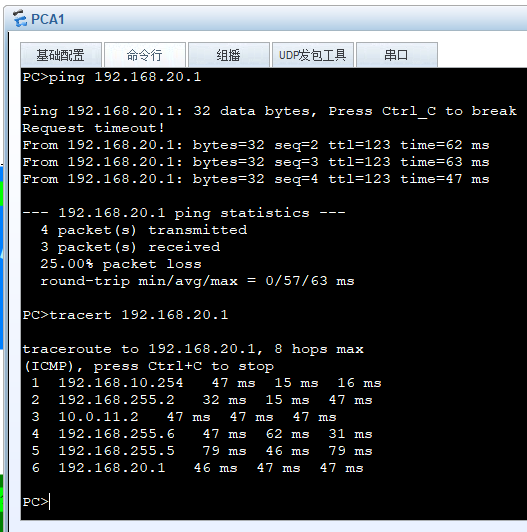

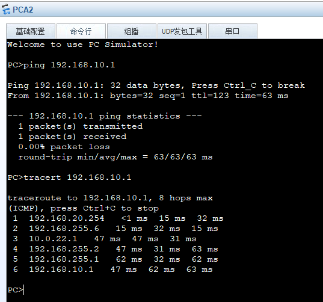

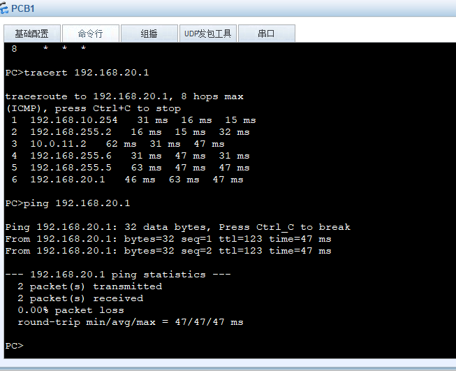

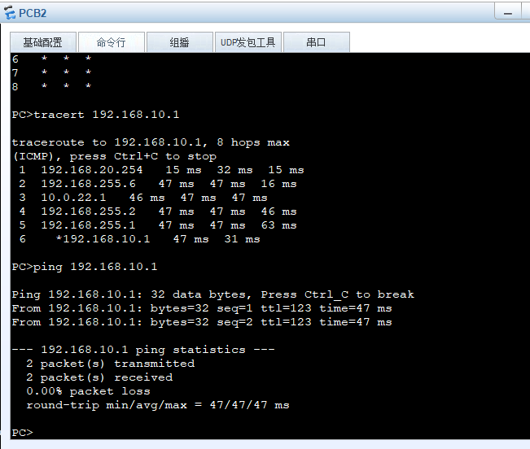

PE上查看路由也都存在

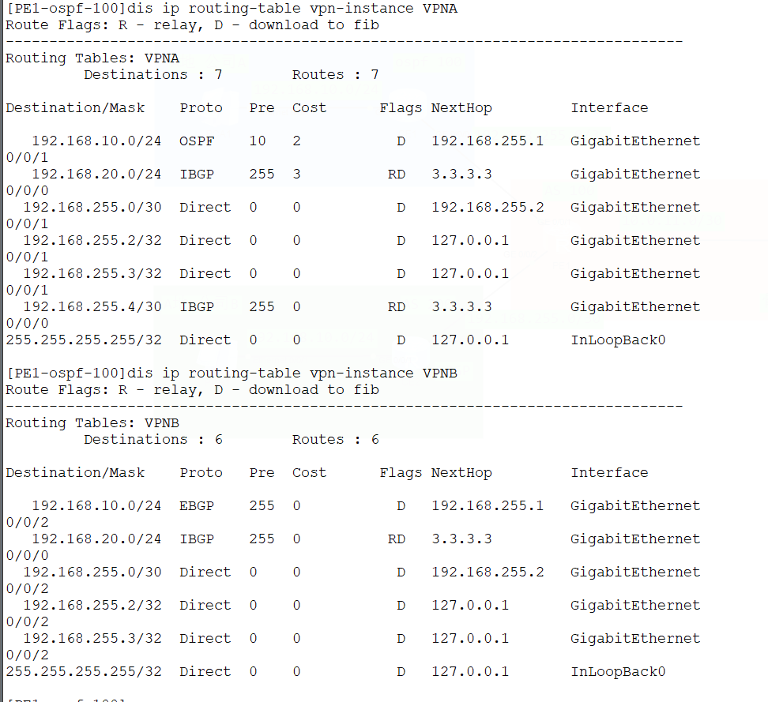

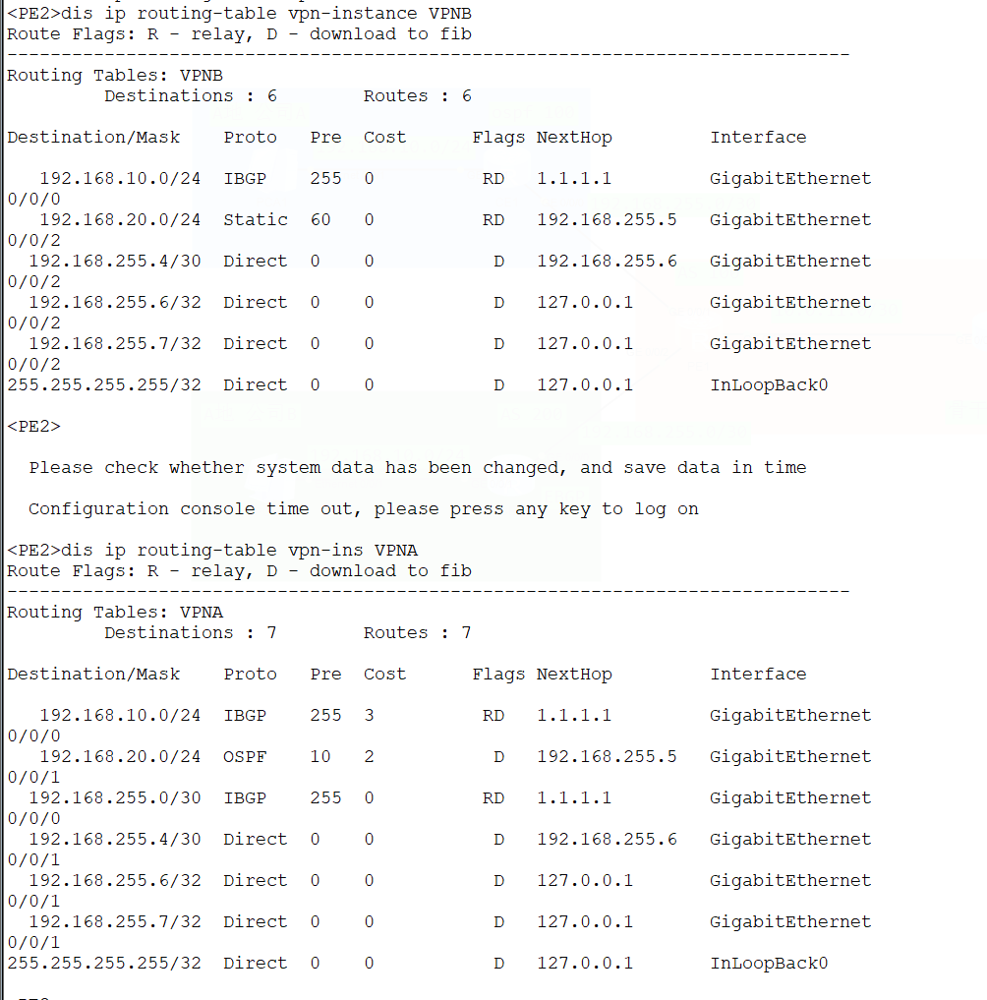
