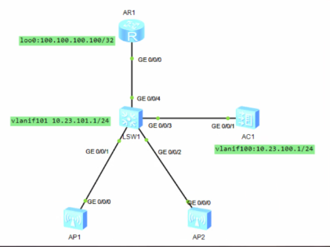
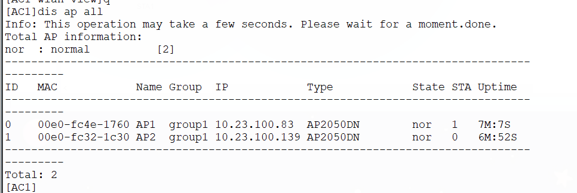
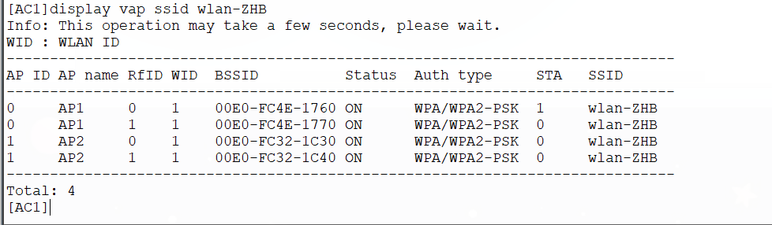
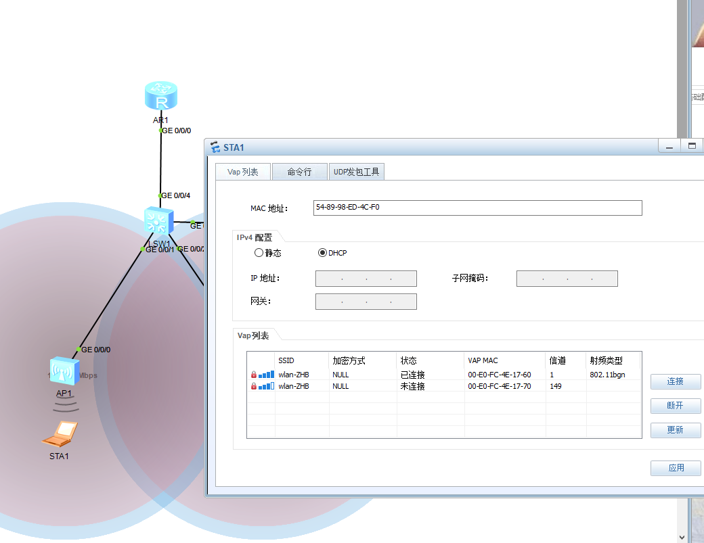
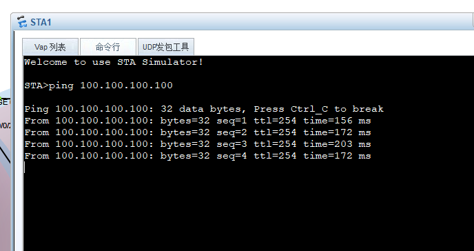
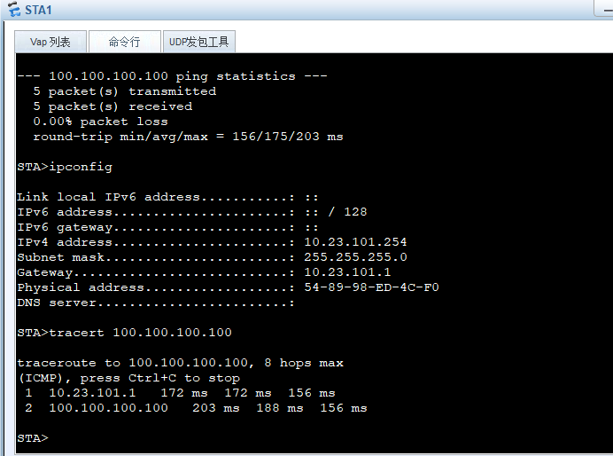

# DAY17：WLAN基础配置实验

参考拓扑



### 📐 规划

- **管理VLAN 100**：AP拿地址、建CAPWAP隧道用。
- **业务VLAN 101**：用户上网数据归属。
- **互联VLAN 102**：LSW1和AR1路由器互联。
- **集中转发**：业务数据经AC转发。

### 🔧 LSW1（三层交换机）配置

```bash
vlan batch 100 101 102

# AP接入端口：Access模式，打上管理VLAN 100标签
int g0/0/1
 port link-type access
 port default vlan 100
#int g0/0/2相同配置


# AC互联端口：Trunk模式，放行管理VLAN和业务VLAN
int g0/0/3
 port link-type trunk
 port trunk allow-pass vlan 100 101

# AR互联端口：access模式，和路由交互，为102 vlan
int g0/0/4
 port link-type access
 port default vlan 102
 
# DHCP给AP分配管理IP（地址池在Vlanif101）
dhcp enable
int Vlanif101
 ip add 10.23.101.1 24
 dhcp select interface   # 给AP分配/24网段的地址

int Vlanif102
 ip add 11.1.1.1 30 #和AR1互联，路由 

# 默认路由指向AR1
ip route-static 0.0.0.0 0.0.0.0 0 11.1.1.2
```

### 🔧 AC1（无线控制器）配置

```bash
vlan batch 100 101
int g0/0/1
 port link-type trunk
 port trunk allow-pass vlan 100 101


# 给AC自己的管理VLAN配IP并开启DHCP（给自身用的，也可做备用）
dhcp enable
int Vlanif100
 ip add 10.23.100.1 24
 dhcp select interface

# 指定CAPWAP隧道源接口（必须配，否则AP不知道找哪个IP建隧道）
capwap source interface Vlanif100

wlan
# 先改纳管模式（先no后mac或sn，保证上线完毕再改）
 ap auth-mode no-auth

 ap-group name group1

 # ① 域管理模板（国家码中国）
 regulatory-domain-profile name group1
  country-code cn

 # ② SSID模板（WiFi名字）
 ssid-profile name group1
  ssid wlan-test

 # ③ 安全模板（加密方式+密码）
 security-profile name group1
  security wpa-wpa2 psk pass-phrase Huawei@123 aes

 # ④ VAP模板（集大成者）
 vap-profile name group1
  forward-mode tunnel              # 集中转发
  service-vlan vlan-id 101         # 业务VLAN 101
  security-profile group1
  ssid-profile group1

 # ⑤ 把VAP模板绑定到AP组的射频上（2.4G和5G分别绑）
 ap-group name group1
  regulatory-domain-profile group1
  vap-profile group1 wlan 1 radio 0   # radio 0 = 2.4G射频
  vap-profile group1 wlan 1 radio 1   # radio 1 = 5G射频
 # 若AP为三射频型号（如AP4051TN），可额外配置：
 # vap-profile group1 wlan 1 radio 2   # radio 2 = 第二个5G或6G射频（仅三射频AP支持）
```

### 🔧 AR1（出口路由器）配置

```bash
int g0/0/0
 ip add 11.1.1.2 30
ip route-static 0.0.0.0 0 11.1.1.1   # 默认路由回指LSW1（或指向公网下一跳）
int LoopBack0
 ip add 100.100.100.100 32            # 作为远端测试目标
```

### 🔧 AP配置

```bash
#AC1
wlan
	ap-id 0 #使用连接的id进入管理页面
		ap-name AP1 #改名
        ap-group group1 #加入group1组以应用之前的配置
```


### ✅ 验证

```bash
display ap all          # 看AP状态是否为“Normal”
display vap ssid wlan-ZHB # 看VAP是否生效
STA> ping 100.100.100.100   # 用户侧能通，证明全网调通

#此时记得把模式改为更安全的模式
wlan
 ap auth-mode sn-auth
```

可以看到两台AP都normal



可以看到两台设备RfID 0/1（2.4G/5G）都上线了



可以看到能ping通100网络





