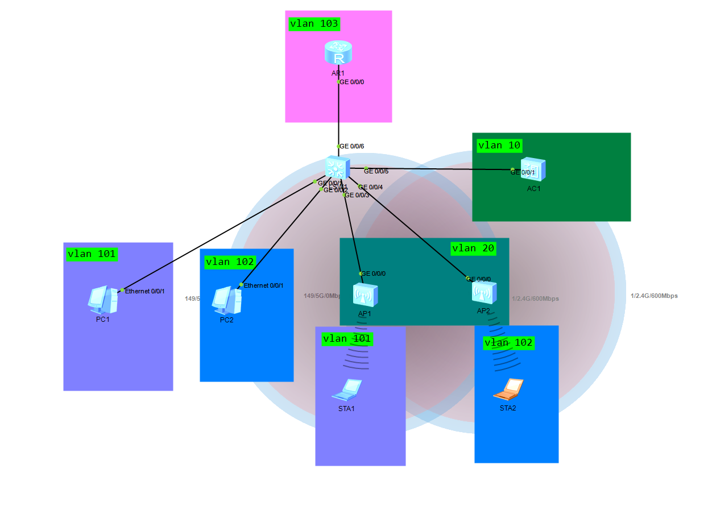
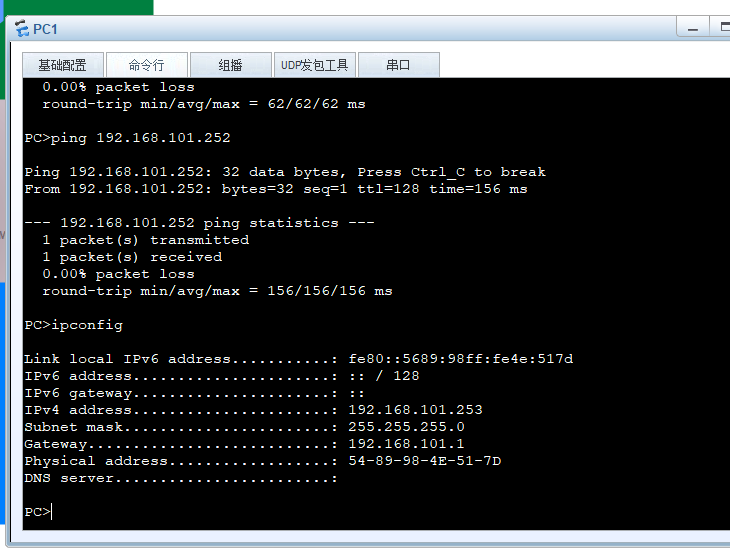
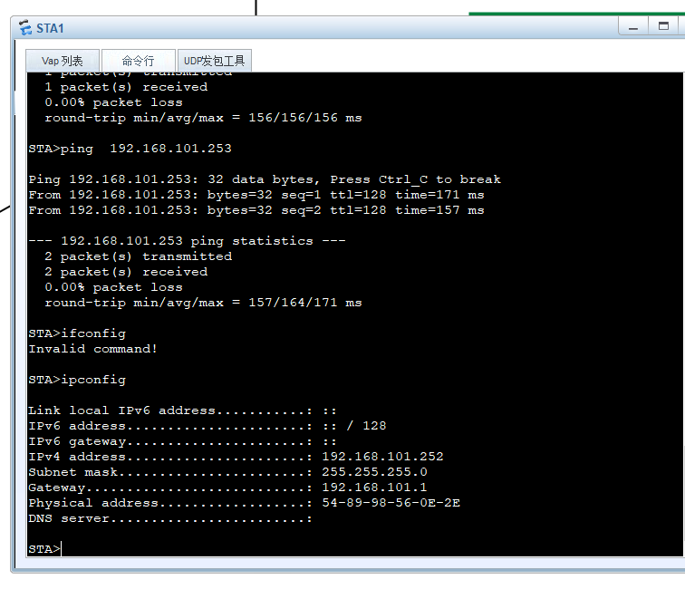
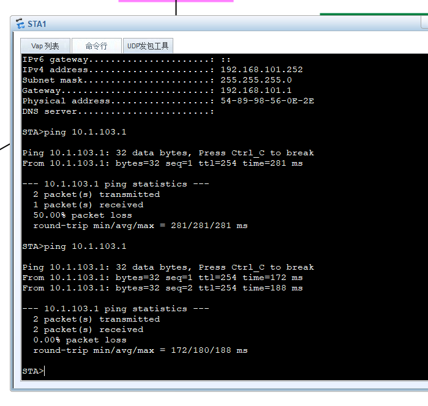
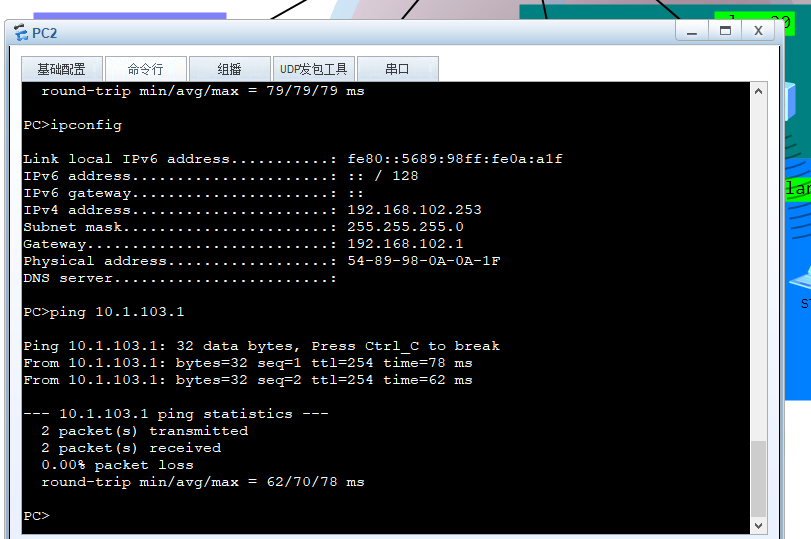
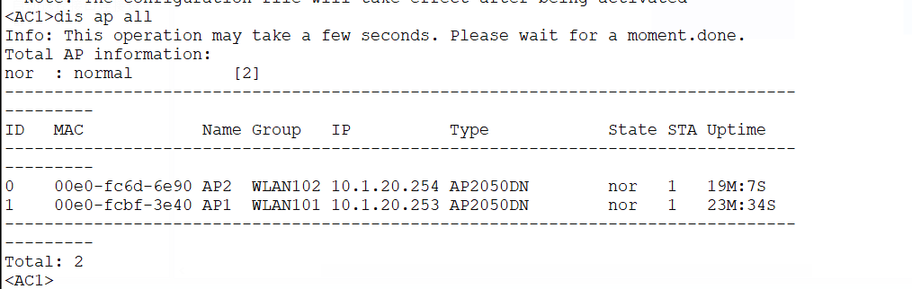

# DAY18：三层无线组网综合实验


## 一、实验拓扑




## 二、实验规划

### 1. 设备互联关系

| 设备 | 接口   | 对端设备 | VLAN           | 说明         |
| ---- | ------ | -------- | -------------- | ------------ |
| LSW1 | G0/0/1 | PC1      | 101            | 有线PC1      |
| LSW1 | G0/0/2 | PC2      | 102            | 有线PC2      |
| LSW1 | G0/0/3 | AP1      | 20(PVID) + 101 | AP1管理+业务 |
| LSW1 | G0/0/4 | AP2      | 20(PVID) + 102 | AP2管理+业务 |
| LSW1 | G0/0/5 | AC1      | 10, 101, 102   | AC互联       |
| LSW1 | G0/0/6 | AR1      | 103            | 出口互联     |

### 2. VLAN网段规划表

| VLAN    | 用途       | 网关地址               | 网段             | DHCP服务器 | 说明                           |
| ------- | ---------- | ---------------------- | ---------------- | ---------- | ------------------------------ |
| VLAN10  | AC管理互联 | LSW1: 10.1.10.2/30     | 10.1.10.0/30     | 无         | AC与交换机点对点互联           |
| VLAN20  | AP管理     | LSW1: 10.1.20.1/24     | 10.1.20.0/24     | LSW1       | AP获取管理地址，Option43指向AC |
| VLAN101 | 业务1      | LSW1: 192.168.101.1/24 | 192.168.101.0/24 | LSW1       | 有线PC1 + 无线WLAN101          |
| VLAN102 | 业务2      | LSW1: 192.168.102.1/24 | 192.168.102.0/24 | LSW1       | 有线PC2 + 无线WLAN102          |
| VLAN103 | 互联       | LSW1: 10.1.103.2/30    | 10.1.103.0/30    | 无         | 交换机与路由器互联             |

### 3. 转发模式

- **隧道转发（集中转发）**：无线业务数据经CAPWAP隧道到AC，由AC转发至核心交换机。


## 三、LSW1（三层交换机）配置

```bash
sysname LSW1
vlan batch 10 20 101 to 103

# ===== 全局DHCP =====
dhcp enable

# ===== 地址池配置 =====
# AP管理地址池（VLAN20），必须带Option43
ip pool vlan20
 gateway-list 10.1.20.1
 network 10.1.20.0 mask 255.255.255.0
 option 43 sub-option 2 ip-address 10.1.10.1   # 告诉AP去AC的地址

# 业务地址池VLAN101（有线PC1 + 无线终端）
ip pool vlan101
 gateway-list 192.168.101.1
 network 192.168.101.0 mask 255.255.255.0

# 业务地址池VLAN102（有线PC2 + 无线终端）
ip pool vlan102
 gateway-list 192.168.102.1
 network 192.168.102.0 mask 255.255.255.0

# ===== 接口配置 =====
# PC1接入端口：Access模式，划入VLAN101
interface GigabitEthernet0/0/1
 port link-type access
 port default vlan 101

# PC2接入端口：Access模式，划入VLAN102
interface GigabitEthernet0/0/2
 port link-type access
 port default vlan 102

# AP1接入端口：Trunk模式，PVID=20（管理VLAN）
interface GigabitEthernet0/0/3
 port link-type trunk
 port trunk pvid vlan 20          # 缺省VLAN为AP管理VLAN
 port trunk allow-pass vlan 20 101 # 放行管理VLAN和业务VLAN

# AP2接入端口：Trunk模式，PVID=20（管理VLAN）
interface GigabitEthernet0/0/4
 port link-type trunk
 port trunk pvid vlan 20
 port trunk allow-pass vlan 20 102

# AC互联端口：Trunk模式，放行管理VLAN和业务VLAN
interface GigabitEthernet0/0/5
 port link-type trunk
 port trunk allow-pass vlan 10 101 to 102

# AR互联端口：Access模式，划入互联VLAN103
interface GigabitEthernet0/0/6
 port link-type access
 port default vlan 103

# ===== VLANIF三层接口 =====
# AC管理互联接口（点对点/30）
interface Vlanif10
 ip address 10.1.10.2 255.255.255.252

# AP管理网关，引用全局地址池
interface Vlanif20
 ip address 10.1.20.1 255.255.255.0
 dhcp select global

# 业务网关VLAN101，引用全局地址池
interface Vlanif101
 ip address 192.168.101.1 255.255.255.0
 dhcp select global

# 业务网关VLAN102，引用全局地址池
interface Vlanif102
 ip address 192.168.102.1 255.255.255.0
 dhcp select global

# 路由器互联接口（点对点/30）
interface Vlanif103
 ip address 10.1.103.2 255.255.255.252

# ===== 路由配置 =====
# 默认路由指向出口路由器AR1
ip route-static 0.0.0.0 0.0.0.0 10.1.103.1
```


## 四、AC1（无线控制器）配置

```bash
sysname AC1
vlan batch 10 101 to 102

# ===== 接口配置 =====
interface GigabitEthernet0/0/1
 port link-type trunk
 port trunk allow-pass vlan 10 101 to 102

# ===== VLANIF三层接口 =====
# AC管理地址（与交换机/30互联）
interface Vlanif10
 ip address 10.1.10.1 255.255.255.252

# 业务VLAN101的SVI（隧道转发必须，AC解封装后通过此接口转发）
interface Vlanif101
 ip address 192.168.101.254 255.255.255.0

# 业务VLAN102的SVI（隧道转发必须）
interface Vlanif102
 ip address 192.168.102.254 255.255.255.0

# ===== 路由配置 =====
# 默认路由指向核心交换机（所有回程流量走交换机）
ip route-static 0.0.0.0 0.0.0.0 10.1.10.2

# ===== CAPWAP源接口 =====
capwap source interface Vlanif10

# ===== WLAN配置 =====
wlan
 # 先开无认证模式，等AP上线后再改安全模式
 ap auth-mode no-auth

 # ① 域管理模板（国家码）
 regulatory-domain-profile name group1
  country-code cn

 # ② SSID模板（WiFi名称）
 ssid-profile name WLAN101
  ssid WLAN101
 ssid-profile name WLAN102
  ssid WLAN102

 # ③ 安全模板（WPA2-PSK加密）
 security-profile name group1
  security wpa-wpa2 psk pass-phrase Huawei@123 aes

 # ④ VAP模板
 # VAP模板WLAN101
 vap-profile name WLAN101
  forward-mode tunnel              # 集中转发
  service-vlan vlan-id 101         # 业务VLAN101
  ssid-profile WLAN101
  security-profile group1

 # VAP模板WLAN102
 vap-profile name wlan102
  forward-mode tunnel              # 集中转发
  service-vlan vlan-id 102         # 业务VLAN102
  ssid-profile WLAN102
  security-profile group1

 # ⑤ AP组配置
 # AP组WLAN101（AP1归属此组）
 ap-group name WLAN101
  regulatory-domain-profile group1
  vap-profile WLAN101 wlan 1 radio 0   # 2.4G射频
  vap-profile WLAN101 wlan 1 radio 1   # 5G射频

 # AP组WLAN102（AP2归属此组）
 ap-group name WLAN102
  regulatory-domain-profile group1
  vap-profile wlan102 wlan 1 radio 0   # 2.4G射频
  vap-profile wlan102 wlan 1 radio 1   # 5G射频

 # ===== AP预注册 =====
 ap-id 0 
  ap-name AP2
  ap-group WLAN102

 ap-id 1 
  ap-name AP1
  ap-group WLAN101
```


## 五、AR1（出口路由器）配置

```bash
sysname AR1

interface GigabitEthernet0/0/0
 ip address 10.1.103.1 255.255.255.252

# 回程路由指向核心交换机
ip route-static 0.0.0.0 0.0.0.0 10.1.103.2

# LoopBack作为远端测试目标
interface LoopBack0
 ip address 100.100.100.100 32
```


## 六、AP上线配置

```bash
# 在AC上配置AP后，AP会自动上线
# 若AP未预注册，可先通过以下命令查看未认证AP记录
display ap unauthorized record

# AP上线后确认状态
display ap all
```


## 七、验证命令

```bash
# 查看AP状态（Normal表示正常上线）
display ap all

# 查看未认证AP连接记录
display ap unauthorized record

# 查看VAP是否生效
display vap ssid WLAN101

# 查看AP获取的管理地址（在交换机上执行）
display ip pool name vlan20 used

# 查看终端获取的业务地址（在交换机上执行）
display ip pool name vlan101 used

# 终端连通性测试
PC1> ping 10.0.103.1   # 有线PC测试外部路由
STA> ping 10.0.103.1   # 无线终端测试外部路由
```

## 八、AP上线后修改认证模式

```bash
wlan
 ap auth-mode sn-auth        # 改为SN认证模式，防止非法AP接入
```

## 结果

可以看到可以互通

 



STA端和PC端均可以ping通外部路由





AC查看AP状态也正常在线


