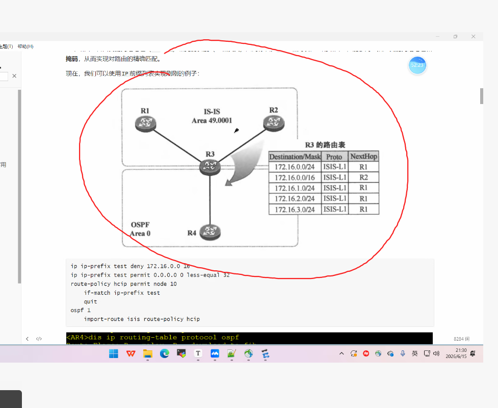
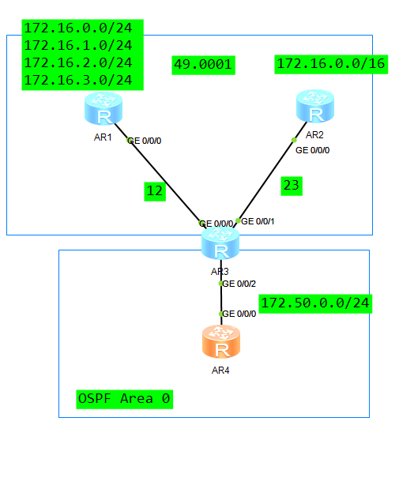
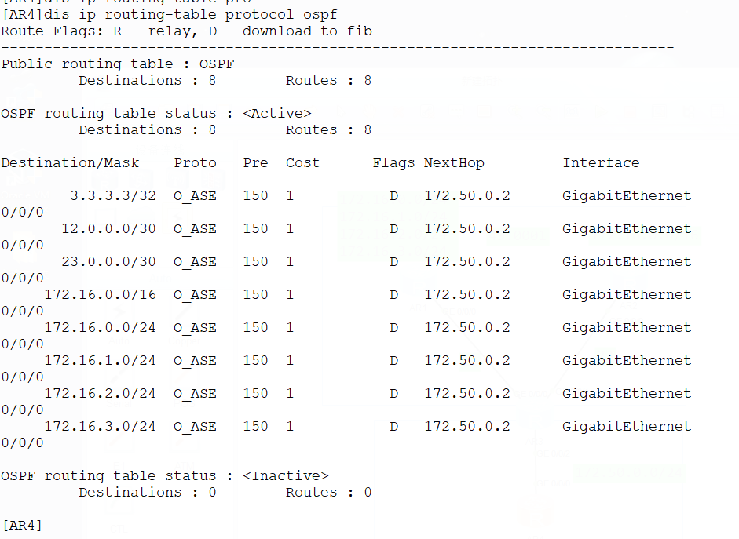
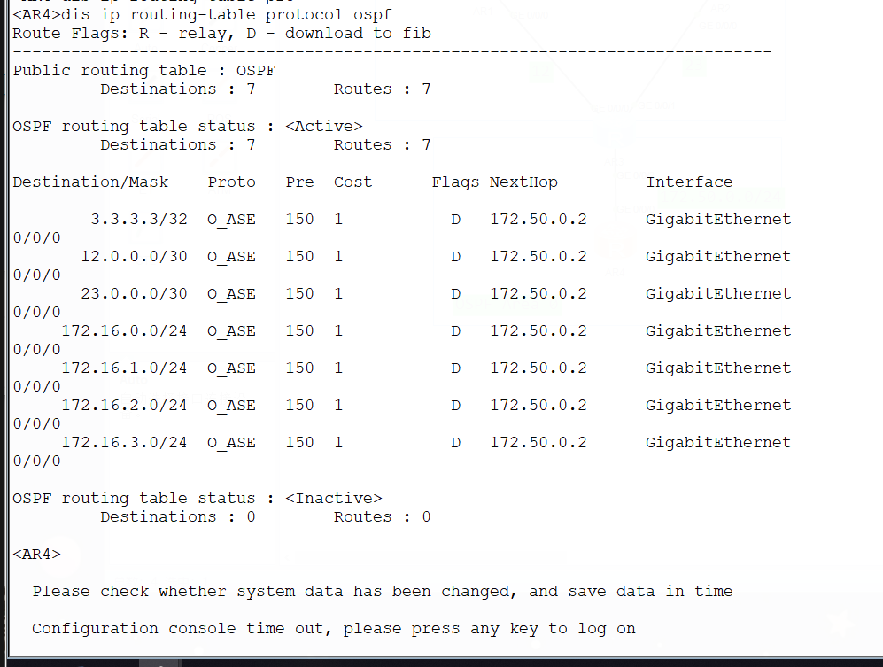

# DAY7：路由策略实验




目标：在OSPF中引入ISIS路由，并剔除掉172.16.0.0/16



基础配置忽略

AR3

```

ip ip-prefix denytoOSPF index 10 permit 172.16.0.0 16 #创建前缀匹配列表
route-policy ISIStoOSPF deny node 10  #创建策略
 if-match ip-prefix denytoOSPF #应用匹配列表
route-policy ISIStoOSPF permit node 20 #添加策略放行


ospf 1 
 import-route isis 1 route-policy ISIStoOSPF #引入ISIS路由进入OSPF并应用策略
```

不应用策略时，AR4路由表



实验结果：如下图所示，应用策略后没有 172.16.0.0/16,已经被过滤掉了

