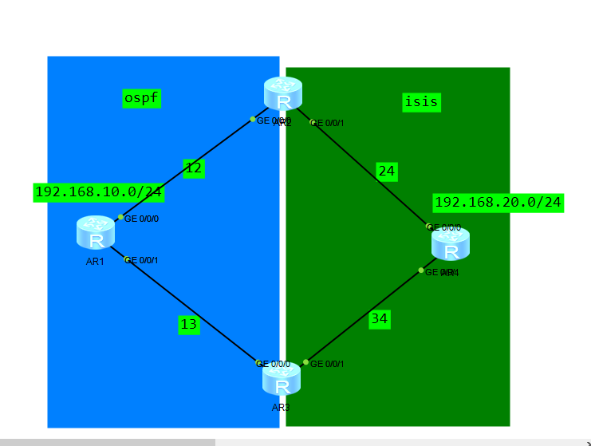
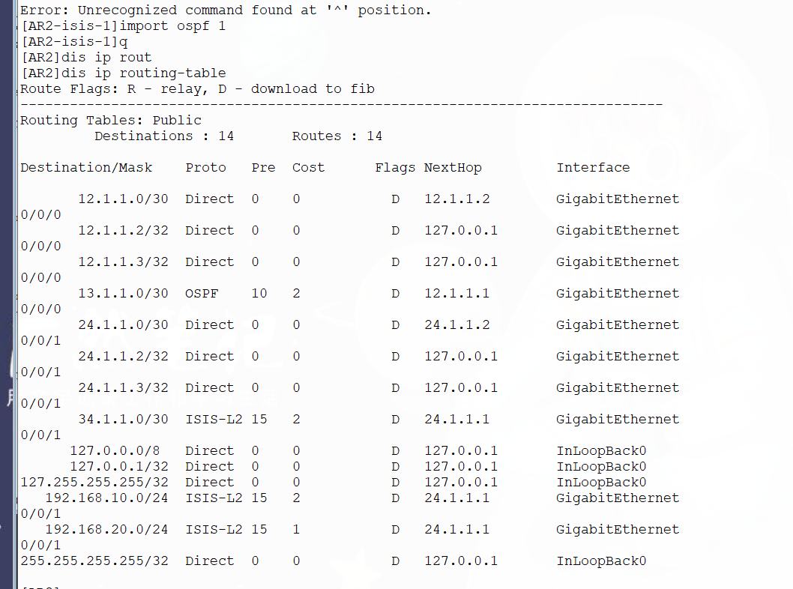
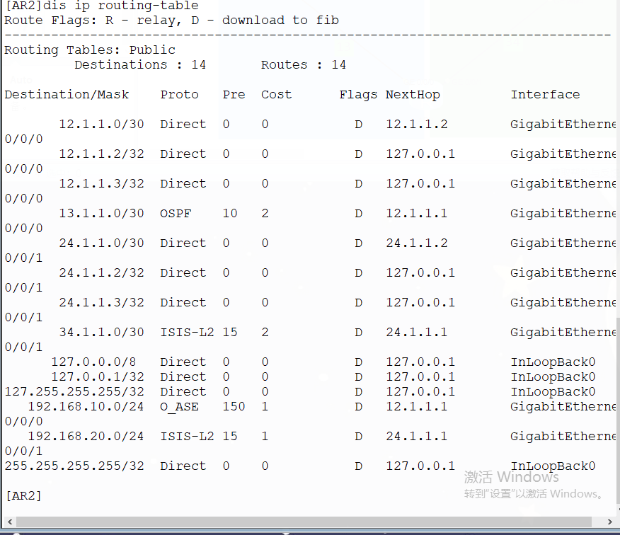

# DAY8 双点双向路由重分布实验



### 拓扑如上

#### 现有问题如下

当AR3双向引入路由后，OSPF区域的192.168.10.0/24这个外部路由，其路由优先级为150，而在ISIS区域，其被引入后变为了ISIS外部路由，优先级为15

现在AR2会出现如下的问题：

因为OSPF区域的外部路由优先级小于ISIS引入的外部路由优先级，150<15

导致整个拓扑出现了异常的次优路由

正常是：AR2-->AR1-->192.168.10.0/24

现在变成了：AR2-->AR4-->AR3-->AR1-->192.168.10.0/24



### 如何解决？

#### 过滤：实现优先级调整

#### 简单过滤：直接在出问题的路由器AR2上配置，两种方法

##### 1.过滤掉次优路由，如：直接过滤掉ISIS内的该路由

```
AR2
# 创建前缀列表，拒绝192.168.10.0/24
ip ip-prefix Deny_192 index 10 deny 192.168.10.0 24
ip ip-prefix Deny_192 index 20 permit 0.0.0.0 0 less-equal 32

# ISIS入方向过滤
isis 1
 filter-policy ip-prefix DENY_192 import
```

```
# 也可以创建route-policy，应用在import-route上
# 复用上面的前缀列表
# 创建路由策略，引用前缀列表
route-policy DENY_ISIS permit node 10
 if-match ip-prefix Deny_192

# 放行其他所有路由
route-policy DENY_ISIS permit node 20

# ISIS 引入 OSPF 时引用策略
isis 1
 import-route ospf 1 route-policy DENY_ISIS
```

结果：AR2不收ISIS发来的192.168.10.0/24，只保留OSPF的，路径恢复正常。

	

##### 2.在OSPF区域中把引入的外部路由优先级调高，如：150改为14

```
# AR2：OSPF外部路由优先级改为14（小于ISIS的15）
route-policy SET_PREF permit node 10
 if-match ip-prefix 192.168.10.0 24
 apply preference 14

ospf 1
 preference ase route-policy SET_PREF #preference ase （ase指外部路由Autonomous System External）
```

结果：OSPF的192.168.10.0/24优先级变为14（小于ISIS的15），OSPF获胜，路径恢复正常：AR2→AR1→192.168.10.0/24。（因为路由表只收录最优路由）

#### 正常的常规过滤：

​	在import的路由上打上tag，在另一个边缘路由过滤掉tag

实验环境重置后，AR3后发布，AR3出现问题

```
#AR2
ip ip-prefix Match_192 index 10 permit 192.168.10.0 24

#AR2在isis中引入OSPF时打上tag
route-policy Set_Tag permit node 10
 if-match ip-prefix Match_192
 apply tag 200

route-policy Set_Tag permit node 20

isis 1
 undo import-route ospf 1
 import-route ospf 1 route-policy Set_Tag
```


```
#AR3在isis上过滤掉被打上Tag200的ISIS外部路由即可
route-policy Filter_Tag deny node 10
 if-match tag 200

route-policy Filter_Tag permit node 20

isis 1
 filter-policy route-policy Filter_Tag import


```

> 因为另一边已经引入了，这个是有问题，2引入后，只有在ISIS的入方向

```
###把过滤应用到import-route，其不会被过滤
ospf 1
 undo import-route isis 1 
 import-route isis 1 route-policy Filter_Tag
```

所以

### 最终解决该问题的环境配置

```
#点1和点2都配置
#打tag
route-policy Set_Tag permit node 10
 apply tag 200
isis 1
 import-route ospf 1 route-policy Set_Tag
#过滤tag
route-policy Filter_Tag deny node 10
 if-match tag 200
route-policy Filter_Tag permit node 20
isis 1
 filter-policy route-policy Filter_Tag import
```

