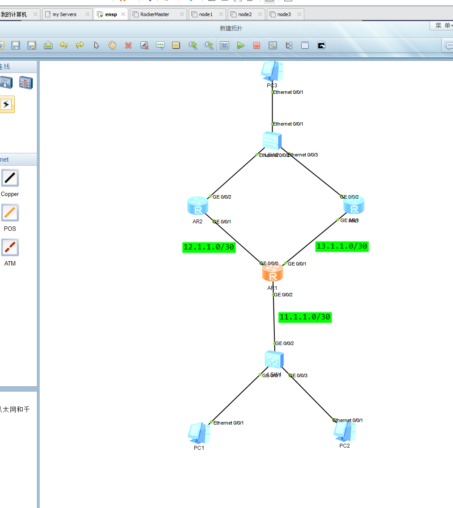
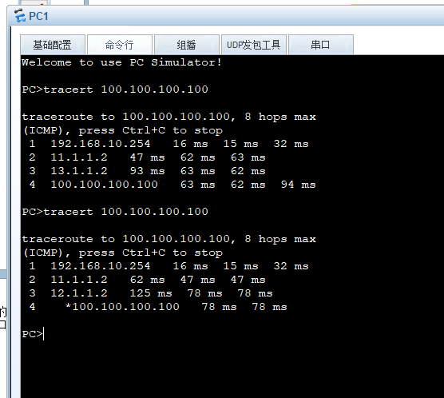
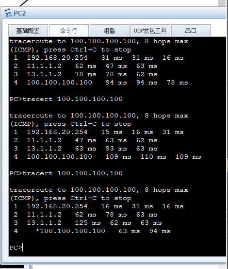
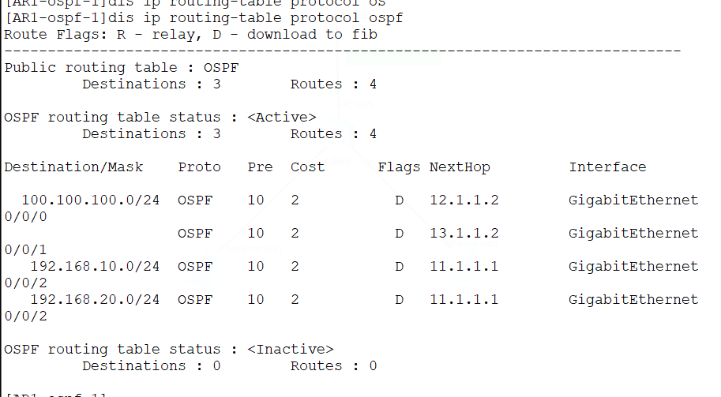
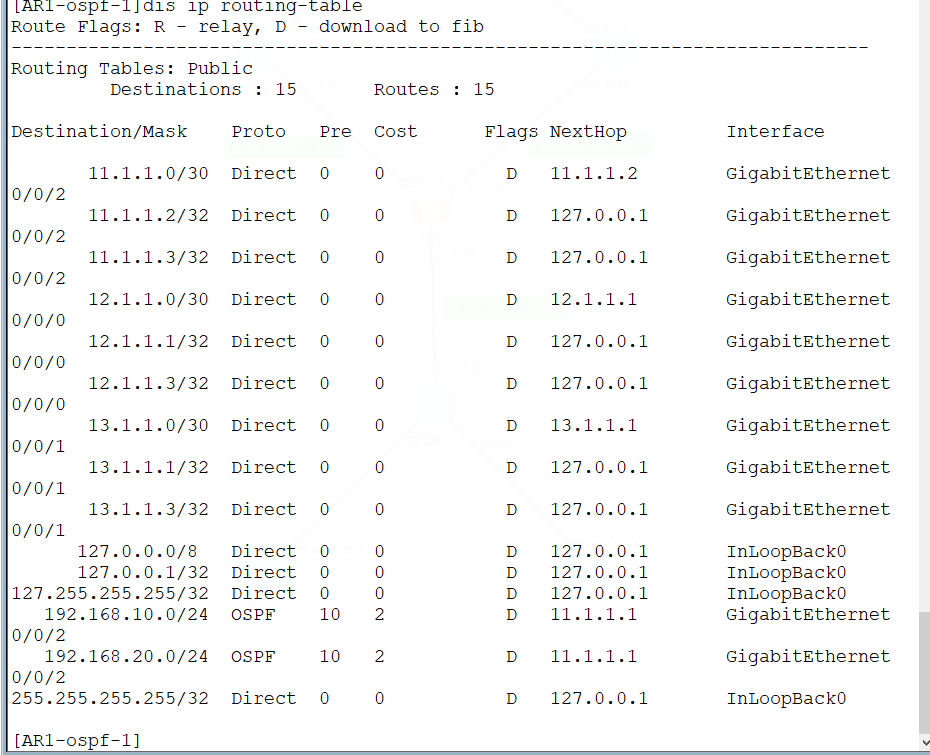
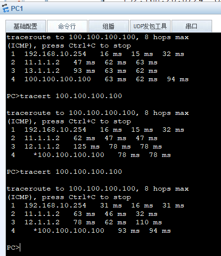
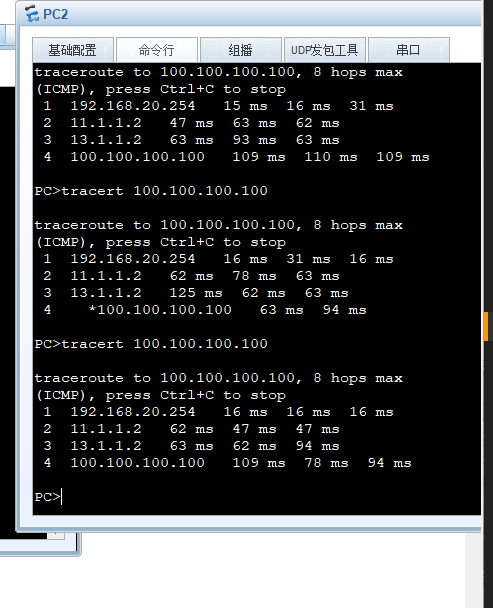

# DAY8:流量过滤-策略路由PBR实验




基础配置忽略

策略路由配置如下：

```
#创建acl匹配两网段
acl name next_ar2 3001  
 rule 5 permit ip source 192.168.10.0 0.0.0.255 destination 100.100.100.100 0 
acl name next_ar3 3002  
 rule 5 permit ip source 192.168.20.0 0.0.0.255 destination 100.100.100.100 0 
#创建流分类，使用acl进行处理
traffic classifier c2 operator or
 if-match acl next_ar3
traffic classifier c1 operator or
 if-match acl next_ar2
#创建流行为，修改下一跳
traffic behavior b2
 redirect ip-nexthop 13.1.1.2
traffic behavior b1
 redirect ip-nexthop 12.1.1.2
#创建流策略，吧分类和对应的行为应用为策略
traffic policy Redirect
 classifier c1 behavior b1
 classifier c2 behavior b2
#在入接口上进行应用策略
interface GigabitEthernet0/0/2
 traffic-policy Redirect inbound
```


策略应用后结果如下，第一次测试为未创建策略，最后一次为创建策略应用后测试，可以看到已经按照10网段对应12.1.1.2，20网段对应13.1.1.2来分流路由路径了。





额外测试，使用filter-policy让AR1去除100.100.100.0/24 网段的路由，再次测试

未配置时，AR1上有net100的路由



```
ip ip-prefix net100 index 10 permit 100.100.100.0 24
#
route-policy banNet100 deny node 10 
 if-match ip-prefix net100 
#
route-policy banNet100 permit node 20 
#
ospf 1 
 filter-policy route-policy banNet100 import
```

可以看到AR1已经没有100网段的路由了



再次测试，依旧正常ping通，证明策略生效




