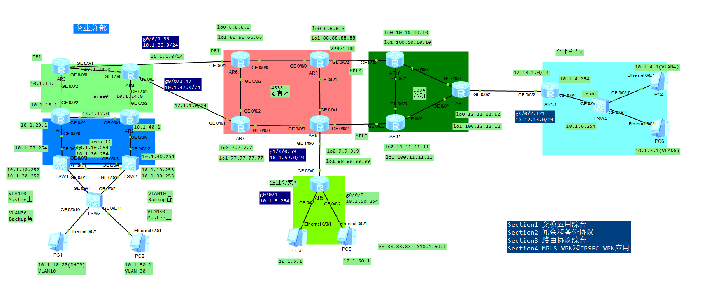
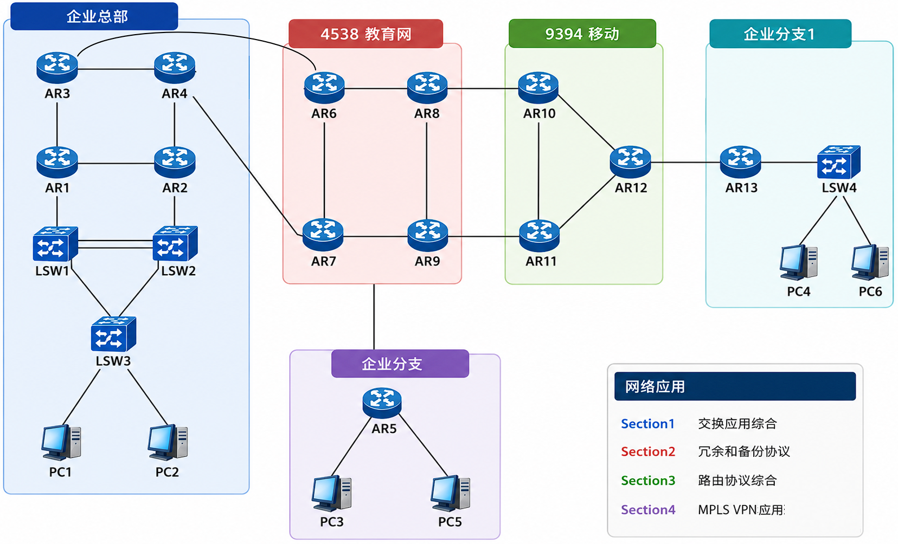
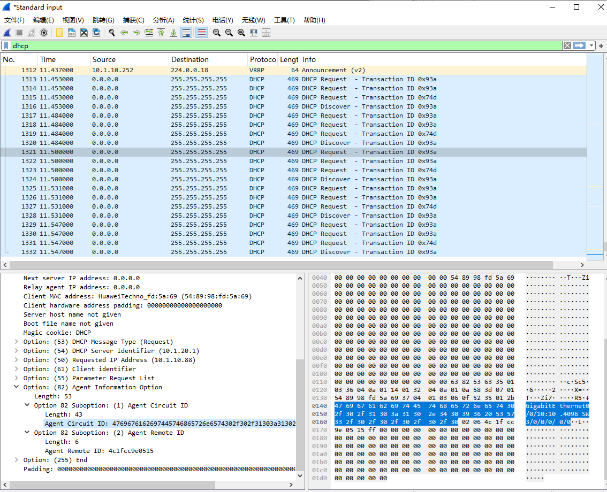

# 综合实验


## 拓扑



## 

拓扑分区：企业总部、4538 教育网、9394 移动、企业分支 1、企业分支 2

网络应用分区：

Section1 交换应用综合

Section2 冗余和备份协议

Section3 路由协议综合

Section4 MPLS VPN 应用

## 第 1 部分 以太网技术 (20 分)

### 1.1 VLAN 和端口模型 (5 分)

请在 SW1 至 SW3 上创建 VLAN10、20、30 和 40

按照下表完成端口模式配置

表格

| 设备 |       接口        |          类型          |      配置       |
| :--: | :---------------: | :--------------------: | :-------------: |
| LSW1 |      GE0/0/1      |         Trunk          |    下联 LSW3    |
| LSW1 | GE0/0/3 - GE0/0/4 | Eth-Trunk 10 ( Trunk ) |    上联 LSW2    |
| LSW1 |     GE0/0/12      |         Access         |    上联 AR1     |
| LSW2 |      GE0/0/2      |         Trunk          |    下联 LSW3    |
| LSW2 | GE0/0/3 - GE0/0/4 | Eth-Trunk 10 ( Trunk ) |    上联 LSW1    |
| LSW2 |     GE0/0/12      |         Access         |    上联 AR2     |
| LSW3 |      GE0/0/1      |         Trunk          |    上联 LSW1    |
| LSW3 |      GE0/0/2      |         Trunk          |    上联 LSW2    |
| LSW3 |     GE0/0/10      |         Access         | VLAN 10 ( PC1 ) |
| LSW3 |     GE0/0/11      |         Access         | VLAN 30 ( PC2 ) |


### **SW1 (LSW1) 配置**

```text
system-view
sysname SW1

# 创建VLAN
vlan batch 10 20 30 40

# 配置Eth-Trunk 10（上联SW2）
interface Eth-Trunk 10
port link-type trunk
port trunk allow-pass vlan 10 30
mode lacp-static
load-balance src-dst-ip
trunkport GigabitEthernet 0/0/3 to 0/0/4
quit

# 配置GE0/0/1（下联SW3）
interface GigabitEthernet 0/0/1
port link-type trunk
port trunk allow-pass vlan 10 30
quit

# 配置GE0/0/12（上联AR1，Access模式，VLAN 20）
interface GigabitEthernet 0/0/12
port link-type access
port default vlan 20
quit
```

---

### **SW2 (LSW2) 配置**

```text
system-view
sysname SW2

# 创建VLAN
vlan batch 10 20 30 40

# 配置Eth-Trunk 10（上联SW1）
interface Eth-Trunk 10
port link-type trunk
port trunk allow-pass vlan 10 30
mode lacp-static
load-balance src-dst-ip
trunkport GigabitEthernet 0/0/3 to 0/0/4
quit

# 配置GE0/0/2（下联SW3）
interface GigabitEthernet 0/0/2
port link-type trunk
port trunk allow-pass vlan 10 30
quit

# 配置GE0/0/12（上联AR2，Access模式，VLAN 40）
interface GigabitEthernet 0/0/12
port link-type access
port default vlan 40
quit
```

---

### **SW3 (LSW3) 配置**

```text
system-view
sysname SW3

# 创建VLAN
vlan batch 10 20 30 40

# 配置GE0/0/1（上联SW1）
interface GigabitEthernet 0/0/1
port link-type trunk
port trunk allow-pass vlan 10 30
quit

# 配置GE0/0/2（上联SW2）
interface GigabitEthernet 0/0/2
port link-type trunk
port trunk allow-pass vlan 10 30
quit

# 配置GE0/0/10（连接PC1，VLAN 10）
interface GigabitEthernet 0/0/10
port link-type access
port default vlan 10
quit

# 配置GE0/0/11（连接PC2，VLAN 30）
interface GigabitEthernet 0/0/11
port link-type access
port default vlan 30
quit
```


### 配置链路聚合 (5 分)

结合 1.1 部分在 SW1 和 SW2 (3、4 口) 之间完成部署

链路聚合模式采用静态 LACP 方式

负载均衡模式为基于源目 MAC

```sh
# SW1
interface Eth-Trunk 10
mode lacp-static
load-balance src-dst-mac
trunkport GigabitEthernet 0/0/3 to 0/0/4
port link-type trunk
port trunk allow-pass vlan 10 30
quit

#SW2
interface Eth-Trunk 10
mode lacp-static
load-balance src-dst-mac
trunkport GigabitEthernet 0/0/3 to 0/0/4
port link-type trunk
port trunk allow-pass vlan 10 30
quit
```


### 1.3 生成树第 1 部分 (5 分)

请使用 802.1s 标准完成本部分需求

区域名为 Ender

修订版本号为 10

实例 10 中包括了 vlan10 和 20, 其他 VLAN 在实例 30 中

SW1 为实例 10 的根，为实例 30 的备份根

SW2 为实例 30 的根，为实例 10 的备份根


```
#802.1s代表的是mstp
# SW1 配置
text
system-view
sysname SW1

# 创建VLAN（如果还没创建）
vlan batch 10 20 30 40

# 配置MSTP区域
stp region-configuration
region-name Ender
revision-level 10
instance 10 vlan 10 20
instance 30 vlan 30 40
active region-configuration
quit

# 配置STP模式为MSTP
stp mode mstp

# 配置根桥角色
# 实例10：根桥
stp instance 10 root primary
# 实例30：备份根
stp instance 30 root secondary

# 全局启用STP（默认已启用，保险起见）
stp enable
```

SW2 配置

```
# 创建VLAN
vlan batch 10 20 30 40

# 配置MSTP区域（必须与SW1完全一致）
stp region-configuration
region-name Ender
revision-level 10
instance 10 vlan 10 20
instance 30 vlan 30 40
active region-configuration
quit

# 配置STP模式为MSTP
stp mode mstp

# 配置根桥角色
# 实例30：根桥
stp instance 30 root primary
# 实例10：备份根
stp instance 10 root secondary

# 全局启用STP
stp enable
```

SW3 配置

```
# 创建VLAN
vlan batch 10 20 30 40

# 配置MSTP区域（必须与SW1/SW2完全一致）

stp region-configuration
region-name Ender
revision-level 10
instance 10 vlan 10 20
instance 30 vlan 30 40
active region-configuration
quit

# 配置STP模式为MSTP
stp mode mstp

# SW3不需要配置根桥角色，作为普通交换机即可
# 全局启用STP
stp enable
```


### 1.4 STP 第 2 部分 (5 分)

在接入交换机 SW3 全局配置边缘端口特性

在边缘端口上收到 BPDU 时关闭该接口，且保证拓扑中的接口正常工作

配置 err-disable 的自动恢复间隔时间为 200 秒

SW1 和 SW2 连接路由器接口开启边缘端口


```
# SW1
# 将连接路由器的接口（GE0/0/12）配置为边缘端口
interface GigabitEthernet 0/0/12
stp edged-port enable
quit
```

```
# SW2
# 将连接路由器的接口（GE0/0/12）配置为边缘端口
interface GigabitEthernet 0/0/12
stp edged-port enable
quit
```

```
# SW3

#要先在所有接入交换机的接口关闭边缘端口在全局配置边缘端口，不然trunk口也会被自动关闭
#若误操作，可以先shutdown后配置，再启用端口刷新状态
interface GigabitEthernet 0/0/1
	stp edged-port disable
interface GigabitEthernet 0/0/2
	stp edged-port disable	

# 全局配置边缘端口（所有Access端口自动变为边缘端口）
stp edged-port default

# 配置BPDU保护（全局开启）
stp bpdu-protection

# 配置err-disable自动恢复
error-down auto-recovery cause bpdu-protection interval 200

```

## 第 2 部分 网络常用特性 (12 分)

### 2.1 网关冗余备份 (7 分)

在业务 VLAN10 中:

SW1 作为业务 VLAN10 的转发交换机，SW2 作为业务 VLAN10 的备份交换机以确保流量不产生次优转发路径

业务主机的网关为 10.1.10.254

主设备上抢占时延 10 秒钟

主设备跟踪 10.1.20.254 到 10.1.20.1 的 IP 可达性，且检测时间为毫秒级

如该会话出现故障，则主设备失去转发角色

终端主机获得网关的 ARP 为 0000-5e00-010a

在业务 VLAN30 中

确保生成树的根和该 vlan 的转发设备为同一设备

终端 2 的网关为 10.1.30.254

主设备跟踪上联物理接口 (g0/0/12), 如该接口出现故障则失去转发角色


```
#要求跟踪可达性检测为毫秒级，这里就是要使用bfd了
#指定mac末尾为0a，也就是vrid为10=0a

#SW1 配置会话监听
bfd
bfd 1 bind peer-ip 10.1.20.1 source-ip 10.1.20.254 auto
  commit
  quit

interface Vlanif20
  ip address 10.1.20.254 255.255.255.0
  quit

interface Vlanif10
  ip address 10.1.10.252 255.255.255.0
  vrrp vrid 10 virtual-ip 10.1.10.254
  vrrp vrid 10 priority 110
  vrrp vrid 10 preempt-mode delay 10
  vrrp vrid 10 track bfd-session session-name 1 reduced 20
  quit

interface Vlanif30
  ip address 10.1.30.252 255.255.255.0
  vrrp vrid 30 virtual-ip 10.1.30.254
  vrrp vrid 30 priority 100
  quit
```

```
#R1
bfd 1 bind peer-ip 10.1.20.254 source-ip 10.1.20.1 auto
  commit
  quit
```

```
#SW2
bfd

interface Vlanif40
  ip address 10.1.40.254 255.255.255.0
  quit

interface Vlanif10
  ip address 10.1.10.253 255.255.255.0
  vrrp vrid 10 virtual-ip 10.1.10.254
  vrrp vrid 10 priority 100
  quit

interface Vlanif30
  ip address 10.1.30.253 255.255.255.0
  vrrp vrid 30 virtual-ip 10.1.30.254
  vrrp vrid 30 priority 110
  vrrp vrid 30 track interface GigabitEthernet0/0/12 reduced 20
  quit 
```


### 2.2 动态主机控制协议 (5 分)

PC1 采用 DHCP 方式获得地址、网关等信息

R1 的 g0/0/0 为 DHCP 服务器，分配 10.1.10.0/24 的网络，网关地址 10.1.10.254,dns 为 8.8.8.8, 备份 dns 为 114.114.114.114, 域名为[ender.com](https://link.wtturl.cn/?target=https%3A%2F%2Fender.com&scene=im&aid=497858&lang=zh), 排除 VRRP 设备的 2 个真实 IP

PC1 获得地址固定为 10.1.10.88

SW1 为 DHCP 代理设备

在 SW3 连接终端的接口开启插入 Option82 的功能，请自行抓包观察 DHCP Option82


```
# R1（DHCP 服务器 + 回程路由）
dhcp enable

ip pool vlan10
  network 10.1.10.0 mask 255.255.255.0
  gateway-list 10.1.10.254
  dns-list 8.8.8.8 114.114.114.114
  domain-name ender.com
  excluded-ip-address 10.1.10.252 10.1.10.253
  static-bind ip-address 10.1.10.88 mac-address 5489-98FD-5A69
  quit

interface GigabitEthernet0/0/0
  ip address 10.1.20.1 255.255.255.0
  dhcp select global
  quit

#回程路由，不然主机收不到dhcp的回包
ip route-static 10.1.10.0 255.255.255.0 10.1.20.254
```

```
#SW1（DHCP 中继）
dhcp enable

interface Vlanif10
  dhcp select relay
  dhcp relay server-ip 10.1.20.1
  quit
```

```
#SW3（DHCP Snooping + Option82）
dhcp enable
dhcp snooping enable
dhcp snooping enable vlan 10

interface GigabitEthernet0/0/1
  dhcp snooping trusted
  quit

interface GigabitEthernet0/0/2
  dhcp snooping trusted
  quit

interface GigabitEthernet0/0/10
  dhcp snooping enable
  dhcp option82 insert enable
  quit
```

抓包分析

可以看到主机PC1所连接的接口被记录了下来，作用是为DHCP服务器精确定位客户端的物理接入位置，不需要查 MAC 表。



## 第 3 部分 动态路由协议 (30 分)

### 3.1 部署 OSPF 的常规区域 (10 分)

各设备的 OSPF 路由器 ID 为各自的环回接口 0

部署 OSPF 的区域 12 (蓝色部分),R1、R2、SW1、SW2 的环回接口 0 都运行在区域 12 中

完成所有设备的邻居关系，除了 VLAN10 和 VLAN30 的业务 VLAN, 其他互联接口都不需要 DR 的选举过程

VLAN10 和 VLAN30 的业务 VLAN 不能建立邻居关系，且相互不发送 OSPF 的 Hello 报文

在区域 12 中完成和 BFD 的联动，以快速检测 OSPF 的邻居故障 (连接区域 0 接口不运行 BFD)

区域 12 中不接受除了自身区域引入的外部路由，把 SW1 的环回接口 10 (10.10.10.10, 请自行创建) 引入到 OSPF

SW1 和 SW2 不能接收到 R3 和 R4 的环回接口 0 的明细路由，同时可以收到 3 类 LSA 形成的 OSPF 默认路由去访问外部网络

在区域 12 的 R1 和 R2 互联链路配置认证类型代码为 2 的认证方式，密码为 qytang, 保证该链路上邻居可以正常建立


```
要处理接口不进行DR选举，就需要把ospf网络类型切换为p2p

不接受除了自身区域引入的外部路由，
```


### R1

```text
system-view

# 环回接口0 — OSPF Router-ID
interface LoopBack0
  ip address 1.1.1.1 255.255.255.255
  quit

# g0/0/0 → SW1 (Area 12)，IP已在VRRP部分配置
# p2p: 与SW1 Vlanif20两端一致，抑制DR选举
interface GigabitEthernet0/0/0
  ip address 10.1.20.1 255.255.255.0
  ospf network-type p2p
  quit

# g0/0/1 → R2 (Area 12互联)
# p2p: 路由器互联，两端都是p2p
# MD5认证: 类型代码2，密码qytang
interface GigabitEthernet0/0/1
  ip address 10.1.12.1 255.255.255.0
  ospf network-type p2p
  ospf authentication-mode md5 1 cipher qytang
  quit

# g0/0/2 → R3 (Area 0)
# p2p: 抑制DR选举
# bfd block: 需求要求连接区域0的接口不运行BFD
interface GigabitEthernet0/0/2
  ip address 10.1.13.1 255.255.255.0
  ospf network-type p2p
  ospf bfd block
  quit

# OSPF进程
# bfd all-interfaces enable: 区域12全局开启BFD联动
# area 12 nssa no-summary: ABR端配置Totally NSSA，下发3类默认路由并过滤区域间明细
# area 0: 骨干区域，连接R3
ospf 1 router-id 1.1.1.1
  bfd all-interfaces enable
  area 12
    nssa no-summary
    network 1.1.1.1 0.0.0.0
    network 10.1.20.0 0.0.0.255
    network 10.1.12.0 0.0.0.255
  area 0
    network 10.1.13.0 0.0.0.255
  quit
```

### R2

```text
system-view

# 环回接口0 — OSPF Router-ID
interface LoopBack0
  ip address 2.2.2.2 255.255.255.255
  quit

# g0/0/0 → SW2 (Area 12)，IP已在VRRP部分配置
# p2p: 与SW2 Vlanif40两端一致，抑制DR选举
interface GigabitEthernet0/0/0
  ip address 10.1.40.1 255.255.255.0
  ospf network-type p2p
  quit

# g0/0/1 → R1 (Area 12互联)
# p2p + MD5认证，与R1 g0/0/1对称
interface GigabitEthernet0/0/1
  ip address 10.1.12.2 255.255.255.0
  ospf network-type p2p
  ospf authentication-mode md5 1 cipher qytang
  quit

# g0/0/2 → R4 (Area 0)
# p2p + bfd block
interface GigabitEthernet0/0/2
  ip address 10.1.24.2 255.255.255.0
  ospf network-type p2p
  ospf bfd block
  quit

# OSPF进程
# bfd all-interfaces enable: 区域12全局开启BFD联动
# area 12 nssa no-summary: ABR端配置Totally NSSA
# area 0: 骨干区域，连接R4
ospf 1 router-id 2.2.2.2
  bfd all-interfaces enable
  area 12
    nssa no-summary
    network 2.2.2.2 0.0.0.0
    network 10.1.40.0 0.0.0.255
    network 10.1.12.0 0.0.0.255
  area 0
    network 10.1.24.0 0.0.0.255
  quit
```

### SW1

```text
system-view

# 环回接口0 — OSPF Router-ID
interface LoopBack0
  ip address 11.11.11.11 255.255.255.255
  quit

# 环回接口10 — 需求要求引入到OSPF的外部路由
interface LoopBack10
  ip address 10.10.10.10 255.255.255.255
  quit

# Vlanif20 → R1 (Area 12)，IP已在VRRP部分配置
# p2p: 与R1 g0/0/0两端一致，抑制DR选举
interface Vlanif20
  ip address 10.1.20.254 255.255.255.0
  ospf network-type p2p
  quit

# ACL仅匹配Loopback10的地址
# 确保import-route direct只引入10.10.10.10，不引入其他直连网段
acl number 2000
  rule permit source 10.10.10.10 0
  quit

# 路由策略绑定ACL
route-policy import-loopback10 permit node 10
  if-match acl 2000
  quit

# OSPF进程
# bfd all-interfaces enable: 区域12全局开启BFD
# import-route direct route-policy: 仅引入Loopback10作为7类LSA外部路由
# area 12 nssa: 非ABR端只配nssa，不加no-summary
# silent-interface: 业务VLAN不发送Hello，不建立邻居
ospf 1 router-id 11.11.11.11
  bfd all-interfaces enable
  import-route direct route-policy import-loopback10
  area 12
    nssa
    network 11.11.11.11 0.0.0.0
    network 10.1.10.0 0.0.0.255
    network 10.1.20.0 0.0.0.255
    network 10.1.30.0 0.0.0.255
  quit

  silent-interface Vlanif10
  silent-interface Vlanif30
```

### SW2

```text
system-view

# 环回接口0 — OSPF Router-ID
interface LoopBack0
  ip address 22.22.22.22 255.255.255.255
  quit

# Vlanif40 → R2 (Area 12)，IP已在VRRP部分配置
# p2p: 与R2 g0/0/0两端一致，抑制DR选举
interface Vlanif40
  ip address 10.1.40.254 255.255.255.0
  ospf network-type p2p
  quit

# OSPF进程
# bfd all-interfaces enable: 区域12全局开启BFD
# area 12 nssa: 非ABR端只配nssa
# silent-interface: 业务VLAN不发送Hello，不建立邻居
ospf 1 router-id 22.22.22.22
  bfd all-interfaces enable
  area 12
    nssa
    network 22.22.22.22 0.0.0.0
    network 10.1.10.0 0.0.0.255
    network 10.1.30.0 0.0.0.255
    network 10.1.40.0 0.0.0.255
  quit

  silent-interface Vlanif10
  silent-interface Vlanif30
```


### 3.2 部署 OSPF 骨干区域网络 (6 分)

R1、R2、R3、R4 属于骨干区域，负责快速转发数据以及连接互联网和其他分支网络，R3 和 R4 环回接口 0 运行在区域 0

R3、R4 下发 5 类 LSA 生成的默认路由，以便于 OSPF 域内的设备得到默认路由，该默认路由在 OSPF 域内的开销值累加，默认路由的命令不能出现 always 参数

在区域 0 开启认证类型代码为 1 的认证，密码为 ender


### R1

```text
# 进入OSPF进程，在Area 0下添加认证（在3.1基础上补充Area 0认证）
ospf 1
  area 0
    authentication-mode simple plain ender
    quit
  quit
```

### R2

```text
#（在3.1基础上补充Area 0认证）
ospf 1
  area 0
    authentication-mode simple plain ender
    quit
  quit
```

### R3（完整配置）

```text

system-view

# 环回接口0 — OSPF Router-ID，运行在区域0
interface LoopBack0
  ip address 3.3.3.3 255.255.255.255
  quit

# g0/0/0 → R4 (Area 0)
# p2p: 与R4 g0/0/0两端一致，抑制DR选举
interface GigabitEthernet0/0/0
  ip address 10.1.34.3 255.255.255.0
  ospf network-type p2p
  quit


# g0/0/2 → R1 (Area 0)
# p2p: 与R1 g0/0/2两端一致，抑制DR选举
interface GigabitEthernet0/0/2
  ip address 10.1.13.3 255.255.255.0
  ospf network-type p2p
  quit

# g0/0/1 → R6 (AS4538互联)
# 不在OSPF中，仅配IP，3.3用于EBGP建邻
interface GigabitEthernet0/0/1
  ip address 36.1.1.3 255.255.255.0
  quit

# 静态默认路由，指向R6
# 需求要求不能使用always参数，必须先有真实默认路由才能用default-route-advertise下发
ip route-static 0.0.0.0 0.0.0.0 36.1.1.6

# OSPF进程
# area 0 authentication-mode simple plain ender: 认证类型代码1(明文)，密码ender
# default-route-advertise type 1: 下发5类LSA默认路由，类型1(E1)使开销在域内累加，不加always
ospf 1 router-id 3.3.3.3
  default-route-advertise type 1
  area 0
    authentication-mode simple plain ender
    network 3.3.3.3 0.0.0.0
    network 10.1.13.0 0.0.0.255
    network 10.1.34.0 0.0.0.255
    quit
  quit
```

### R4

```text
system-view

# 环回接口0 — OSPF Router-ID，运行在区域0
interface LoopBack0
  ip address 4.4.4.4 255.255.255.255
  quit

# g0/0/0 → R3 (Area 0)
# p2p: 与R3 g0/0/0两端一致，抑制DR选举
interface GigabitEthernet0/0/0
  ip address 10.1.34.4 255.255.255.0
  ospf network-type p2p
  quit


# g0/0/2 → R3 (Area 0)
# p2p: 与R3 g0/0/2两端一致，抑制DR选举
interface GigabitEthernet0/0/2
  ip address 10.1.24.4 255.255.255.0
  ospf network-type p2p
  quit

# g0/0/1 → R7 (AS4538互联)
# 不在OSPF中，仅配IP，3.3用于EBGP建邻
interface GigabitEthernet0/0/1
  ip address 47.1.1.4 255.255.255.0
  quit

# 静态默认路由，指向R7
ip route-static 0.0.0.0 0.0.0.0 47.1.1.7

# OSPF进程
# 认证、默认路由下发，与R3对称
ospf 1 router-id 4.4.4.4
  default-route-advertise type 1
  area 0
    authentication-mode simple plain ender
    network 4.4.4.4 0.0.0.0
    network 10.1.24.0 0.0.0.255
    network 10.1.34.0 0.0.0.255
    quit
  quit
```

### 3.3 部署教育网的运营商骨干网络 (6 分)

请配置 AS4538 中的 IGP 请使用 OSPF 协议，各设备的环回接口 0 为 BGP 的更新源地址，请全部运行在 OSPF 区域 0

R8、R9 和其他 BGP 对等体建立 IBGP 邻居关系，R8 和 R9 之间也配置为 IBGP 邻居，R6、R7 仅仅和 R8、R9 建立 IBGP 邻居关系，请保证路由正常更新

ASBR (R8 和 R9) 针对所有的 IBGP 邻居实施下一跳本地，以保证下一跳可达，ASBR 采用直连路由 和 AS9394 建立 EBGP 邻居

所有设备通告自身的环回接口 1 (该接口为业务网络),R6 和 R7 产生连接客户 (R3 和 R4) 的业务网络

```text
# R6: AS4538教育网客户接入路由器
# lo0=6.6.6.6(BGP更新源/OSPF RID), lo1=66.66.66.66(业务网络)
# g0/0/0→R8(68.1.1.0/24), g0/0/1→R3(36.1.1.0/24,已有), g0/0/2→R7(67.1.1.0/24)
# OSPF Area0: lo0 + 互联链路
# BGP AS4538: IBGP仅与R8/R9建邻(用lo0), network lo1 + 客户网络36.1.1.0/24

system-view
sysname R6

interface LoopBack0
  ip address 6.6.6.6 255.255.255.255
  quit

interface LoopBack1
  ip address 66.66.66.66 255.255.255.255
  quit

interface GigabitEthernet0/0/0
  ip address 68.1.1.6 255.255.255.0
  quit

interface GigabitEthernet0/0/1
  ip address 36.1.1.6 255.255.255.0
  quit

interface GigabitEthernet0/0/2
  ip address 67.1.1.6 255.255.255.0
  quit

ospf 1 router-id 6.6.6.6
  area 0
    network 6.6.6.6 0.0.0.0
    network 68.1.1.0 0.0.0.255
    network 67.1.1.0 0.0.0.255
    quit
  quit

bgp 4538
  router-id 6.6.6.6
  peer 8.8.8.8 as-number 4538
  peer 8.8.8.8 connect-interface LoopBack0
  peer 9.9.9.9 as-number 4538
  peer 9.9.9.9 connect-interface LoopBack0
  network 66.66.66.66 255.255.255.255
  network 36.1.1.0 255.255.255.0
  quit
```

```text
# R7: AS4538教育网客户接入路由器
# lo0=7.7.7.7(BGP更新源/OSPF RID), lo1=77.77.77.77(业务网络)
# g0/0/0→R9(79.1.1.0/24), g0/0/1→R4(47.1.1.0/24,已有), g0/0/2→R6(67.1.1.0/24)
# OSPF Area0: lo0 + 互联链路
# BGP AS4538: IBGP仅与R8/R9建邻(用lo0), network lo1 + 客户网络47.1.1.0/24

system-view
sysname R7

interface LoopBack0
  ip address 7.7.7.7 255.255.255.255
  quit

interface LoopBack1
  ip address 77.77.77.77 255.255.255.255
  quit

interface GigabitEthernet0/0/0
  ip address 79.1.1.7 255.255.255.0
  quit

interface GigabitEthernet0/0/1
  ip address 47.1.1.7 255.255.255.0
  quit

interface GigabitEthernet0/0/2
  ip address 67.1.1.7 255.255.255.0
  quit

ospf 1 router-id 7.7.7.7
  area 0
    network 7.7.7.7 0.0.0.0
    network 79.1.1.0 0.0.0.255
    network 67.1.1.0 0.0.0.255
    quit
  quit

bgp 4538
  router-id 7.7.7.7
  peer 8.8.8.8 as-number 4538
  peer 8.8.8.8 connect-interface LoopBack0
  peer 9.9.9.9 as-number 4538
  peer 9.9.9.9 connect-interface LoopBack0
  network 77.77.77.77 255.255.255.255
  network 47.1.1.0 255.255.255.0
  quit
```

```text
# R8: AS4538教育网ASBR + 唯一的路由反射器(RR)
# lo0=8.8.8.8(BGP更新源/OSPF RID), lo1=88.88.88.88(业务网络)
# g0/0/0→R6(68.1.1.0/24), g0/0/1→R9(89.1.1.0/24), g0/0/2→R10(EBGP,8.10.1.0/24)
# OSPF Area0: lo0 + 内部互联(不含EBGP链路8.10.1.0/24)
# BGP AS4538:
#   R8是唯一RR, R6/R7/R9全部为RR-Client
#   所有IBGP邻居配next-hop-local → EBGP路由下一跳改为自身lo0(8.8.8.8), 通过OSPF可达
#   EBGP: 用lo0(8.8.8.8)作为源, peer指向R10的直连接口(8.10.1.10), 配ebgp-max-hop
#   R10侧用直连接口作为源, peer指向8.8.8.8, 需静态路由到8.8.8.8
#   8.10.1.10是直连的, R8不需要额外静态路由

system-view
sysname R8

interface LoopBack0
  ip address 8.8.8.8 255.255.255.255
  quit

interface LoopBack1
  ip address 88.88.88.88 255.255.255.255
  quit

interface GigabitEthernet0/0/0
  ip address 68.1.1.8 255.255.255.0
  quit

interface GigabitEthernet0/0/1
  ip address 89.1.1.8 255.255.255.0
  quit

interface GigabitEthernet0/0/2
  ip address 8.10.1.8 255.255.255.0
  quit

ospf 1 router-id 8.8.8.8
  area 0
    network 8.8.8.8 0.0.0.0
    network 68.1.1.0 0.0.0.255
    network 89.1.1.0 0.0.0.255
    quit
  quit

bgp 4538
  router-id 8.8.8.8
  peer 6.6.6.6 as-number 4538
  peer 6.6.6.6 connect-interface LoopBack0
  peer 6.6.6.6 next-hop-local
  peer 6.6.6.6 reflect-client
  peer 7.7.7.7 as-number 4538
  peer 7.7.7.7 connect-interface LoopBack0
  peer 7.7.7.7 next-hop-local
  peer 7.7.7.7 reflect-client
  peer 9.9.9.9 as-number 4538
  peer 9.9.9.9 connect-interface LoopBack0
  peer 9.9.9.9 next-hop-local
  peer 9.9.9.9 reflect-client
  peer 8.10.1.10 as-number 9394
  peer 8.10.1.10 connect-interface LoopBack0
  peer 8.10.1.10 ebgp-max-hop 2
  network 88.88.88.88 255.255.255.255
  quit
```

```
# R9: AS4538教育网ASBR(RR-Client, 非RR)
# lo0=9.9.9.9(BGP更新源/OSPF RID), lo1=99.99.99.99(业务网络)
# g0/0/0→R7(79.1.1.0/24), g0/0/1→R8(89.1.1.0/24), g0/0/2→R11(EBGP,9.11.1.0/24)
# OSPF Area0: lo0 + 内部互联(不含EBGP链路9.11.1.0/24)
# BGP AS4538:
#   R9是R8的RR-Client, 自身不配reflect-client
#   所有IBGP邻居配next-hop-local → EBGP路由下一跳改为自身lo0(9.9.9.9), 通过OSPF可达
#   EBGP: 用lo0(9.9.9.9)作为源, peer指向R11的直连接口(9.11.1.11), 配ebgp-max-hop
#   R11侧用直连接口作为源, peer指向9.9.9.9, 需静态路由到9.9.9.9
#   9.11.1.11是直连的, R9不需要额外静态路由

system-view
sysname R9

interface LoopBack0
  ip address 9.9.9.9 255.255.255.255
  quit

interface LoopBack1
  ip address 99.99.99.99 255.255.255.255
  quit

interface GigabitEthernet0/0/0
  ip address 79.1.1.9 255.255.255.0
  quit

interface GigabitEthernet0/0/1
  ip address 89.1.1.9 255.255.255.0
  quit

interface GigabitEthernet0/0/2
  ip address 9.11.1.9 255.255.255.0
  quit

ospf 1 router-id 9.9.9.9
  area 0
    network 9.9.9.9 0.0.0.0
    network 79.1.1.0 0.0.0.255
    network 89.1.1.0 0.0.0.255
    quit
  quit

bgp 4538
  router-id 9.9.9.9
  peer 6.6.6.6 as-number 4538
  peer 6.6.6.6 connect-interface LoopBack0
  peer 6.6.6.6 next-hop-local
  peer 7.7.7.7 as-number 4538
  peer 7.7.7.7 connect-interface LoopBack0
  peer 7.7.7.7 next-hop-local
  peer 8.8.8.8 as-number 4538
  peer 8.8.8.8 connect-interface LoopBack0
  peer 8.8.8.8 next-hop-local
  peer 9.11.1.11 as-number 9394
  peer 9.11.1.11 connect-interface LoopBack0
  peer 9.11.1.11 ebgp-max-hop 2
  network 99.99.99.99 255.255.255.255
  quit
```


### 3.4 部署运营商骨干 BGP AS9394 (8 分)

请配置 AS9394 中的 IGP 请使用 ISIS 协议，各设备的环回接口 0 为 BGP 的更新源地址，请全部运行在 ISIS Level2

AS9394 内的 R10、R11、R12 两两之间建立 IBGP 邻居关系，请保证路由正常更新

ASBR 上 R10 针对所有的 IBGP 邻居实施下一跳本地，以保证 BGP 的下一跳可达

ASBR 上 R11 把 AS 之间的静态路由引入到 ISIS 协议，以保证 BGP 的下一跳可达

ASBR 采用环回接口和 AS4538 建立 EBGP 邻居

所有设备引入自身的环回接口 1 (该接口为业务网络),R12 产生连接客户 (R13) 的业务网络


```text
# R10: AS9394移动网络ASBR + 路由反射器(RR)
# lo0=10.10.10.10(BGP更新源/ISIS RID), lo1=100.10.10.10(业务网络)
# g0/0/0→R12(12.10.1.0/24), g0/0/1→R11(11.10.1.0/24), g0/0/2→R8(EBGP,8.10.1.0/24)
# ISIS Level-2: lo0 + 内部互联(不含EBGP链路8.10.1.0/24)
# BGP AS9394:
#   R10是唯一RR, R11/R12为RR-Client
#   配next-hop-local → 从EBGP学到的路由传给IBGP时下一跳改为自身lo0(10.10.10.10), 通过ISIS可达
#   EBGP: 用直连接口g0/0/2(8.10.1.10)作为源, peer指向R8的lo0(8.8.8.8), 配ebgp-max-hop
#   静态路由到8.8.8.8用于EBGP建邻
#   network lo1(业务网络)

system-view
sysname R10

interface LoopBack0
  ip address 10.10.10.10 255.255.255.255
  isis enable 1
  quit

interface LoopBack1
  ip address 100.10.10.10 255.255.255.255
  quit

interface GigabitEthernet0/0/0
  ip address 12.10.1.10 255.255.255.0
  isis enable 1
  quit

interface GigabitEthernet0/0/1
  ip address 11.10.1.10 255.255.255.0
  isis enable 1
  quit

interface GigabitEthernet0/0/2
  ip address 8.10.1.10 255.255.255.0
  quit

ip route-static 8.8.8.8 255.255.255.255 8.10.1.8

isis 1
  is-level level-2
  network-entity 49.0001.0010.0010.0010.00
  quit

bgp 9394
  router-id 10.10.10.10
  peer 11.11.11.11 as-number 9394
  peer 11.11.11.11 connect-interface LoopBack0
  peer 11.11.11.11 next-hop-local
  peer 11.11.11.11 reflect-client
  peer 12.12.12.12 as-number 9394
  peer 12.12.12.12 connect-interface LoopBack0
  peer 12.12.12.12 next-hop-local
  peer 12.12.12.12 reflect-client
  peer 8.8.8.8 as-number 4538
  peer 8.8.8.8 connect-interface GigabitEthernet0/0/2
  peer 8.8.8.8 ebgp-max-hop 2
  network 100.10.10.10 255.255.255.255
  quit
```


```text
# R11: AS9394移动网络ASBR(RR-Client, 非RR)
# lo0=11.11.11.11(BGP更新源/ISIS RID), lo1=100.11.11.11(业务网络)
# g0/0/0→R10(11.10.1.0/24), g0/0/1→R12(11.12.1.0/24), g0/0/2→R9(EBGP,9.11.1.0/24)
# ISIS Level-2: lo0 + 内部互联(不含EBGP链路9.11.1.0/24)
# BGP AS9394:
#   R11是R10的RR-Client, 不配reflect-client
#   不配next-hop-local, 靠引入静态路由到ISIS解决下一跳可达
#   EBGP: 用直连接口g0/0/2(9.11.1.11)作为源, peer指向R9的lo0(9.9.9.9), 配ebgp-max-hop
#   静态路由到9.9.9.9: 1)用于EBGP建邻 2)引入ISIS让R10/R12到达BGP下一跳9.9.9.9
#   R9用lo0(9.9.9.9)作为EBGP源, R11收到的EBGP路由下一跳是9.9.9.9
#   R11不配next-hop-local, 传给R10/R12时下一跳保持9.9.9.9
#   R10/R12通过ISIS学到9.9.9.9/32, 下一跳可达, 路由有效
#   network lo1(业务网络)

system-view
sysname R11

interface LoopBack0
  ip address 11.11.11.11 255.255.255.255
  isis enable 1
  quit

interface LoopBack1
  ip address 100.11.11.11 255.255.255.255
  quit

interface GigabitEthernet0/0/0
  ip address 11.10.1.11 255.255.255.0
  isis enable 1
  quit

interface GigabitEthernet0/0/1
  ip address 11.12.1.11 255.255.255.0
  isis enable 1
  quit

interface GigabitEthernet0/0/2
  ip address 9.11.1.11 255.255.255.0
  quit

ip route-static 9.9.9.9 255.255.255.255 9.11.1.9

ip ip-prefix as-link permit 9.9.9.9 32

route-policy isis-import permit node 10
  if-match ip-prefix as-link
  quit

isis 1
  is-level level-2
  network-entity 49.0001.0011.0011.0011.00
  import-route static route-policy isis-import
  quit

bgp 9394
  router-id 11.11.11.11
  peer 10.10.10.10 as-number 9394
  peer 10.10.10.10 connect-interface LoopBack0
  peer 12.12.12.12 as-number 9394
  peer 12.12.12.12 connect-interface LoopBack0
  peer 9.9.9.9 as-number 4538
  peer 9.9.9.9 connect-interface GigabitEthernet0/0/2
  peer 9.9.9.9 ebgp-max-hop 2
  network 100.11.11.11 255.255.255.255
  quit
```


```text
# R12: AS9394移动网络内部路由器 + 客户接入(RR-Client)
# lo0=12.12.12.12(BGP更新源/ISIS RID), lo1=100.12.12.12(业务网络)
# g0/0/0→R10(12.10.1.0/24), g0/0/1→R11(11.12.1.0/24), g0/0/2→R13(12.13.1.0/24,客户链路)
# ISIS Level-2: lo0 + 内部互联(不含客户链路12.13.1.0/24)
# BGP AS9394:
#   R12是R10的RR-Client, 不配reflect-client
#   不配next-hop-local(R12不是ASBR, 不从EBGP学路由)
#   network lo1(业务网络) + 客户网络12.13.1.0/24

system-view
sysname R12

interface LoopBack0
  ip address 12.12.12.12 255.255.255.255
  isis enable 1
  quit

interface LoopBack1
  ip address 100.12.12.12 255.255.255.255
  quit

interface GigabitEthernet0/0/0
  ip address 12.10.1.12 255.255.255.0
  isis enable 1
  quit

interface GigabitEthernet0/0/1
  ip address 11.12.1.12 255.255.255.0
  isis enable 1
  quit

interface GigabitEthernet0/0/2
  ip address 12.13.1.12 255.255.255.0
  quit

isis 1
  is-level level-2
  network-entity 49.0001.0012.0012.0012.00
  quit

bgp 9394
  router-id 12.12.12.12
  peer 10.10.10.10 as-number 9394
  peer 10.10.10.10 connect-interface LoopBack0
  peer 11.11.11.11 as-number 9394
  peer 11.11.11.11 connect-interface LoopBack0
  network 100.12.12.12 255.255.255.255
  network 12.13.1.0 255.255.255.0
  quit
```

### 3.5 部署企业网络接入互联网 (5 分)

在企业总部的边缘配置 NAT 技术，使得业务 VLAN10,30 可以访问互联网，比如 88.88.88.88

在企业分支 1 内，PC4 属于 VLAN4, 请开启边缘端口，网关为 10.1.4.254,SW4 连接路由器采用 trunk 链路

在分支的边缘设备 R13 上配置 NAT, 使得 PC4 可以接入互联网，访问 88.88.88.88


```text
# R3（企业总部边缘 NAT）
# 3.5 企业总部边缘NAT: 使VLAN10/VLAN30可以访问互联网(如88.88.88.88)
# NAT在R3出接口g0/0/1(连R6/AS4538)上做, 将内网地址转换为36.1.1.3

# ACL匹配VLAN10和VLAN30的源地址
acl 3000
  rule permit ip source 10.1.10.0 0.0.0.255
  rule permit ip source 10.1.30.0 0.0.0.255
  quit

# 在出接口g0/0/1上配置NAT outbound, Easy IP方式转换为接口地址
interface GigabitEthernet0/0/1
  nat outbound 3000
  quit
```

```text
# R4（企业总部边缘 NAT）
# 3.5 企业总部边缘NAT: 与R3对称, 在g0/0/1(连R7/AS4538)上做
# 将VLAN10/VLAN30内网地址转换为47.1.1.4

acl 3000
  rule permit ip source 10.1.10.0 0.0.0.255
  rule permit ip source 10.1.30.0 0.0.0.255
  quit

interface GigabitEthernet0/0/1
  nat outbound 3000
  quit
```

```text
# SW4（企业分支 1 交换机）
# 3.5 企业分支1接入交换机
# g0/0/1→R13(trunk), g0/0/2→PC4(access VLAN4, 边缘端口)
# PC4属于VLAN4, 网关10.1.4.254在R13上

system-view
sysname SW4

vlan batch 4

interface GigabitEthernet0/0/1
  port link-type trunk
  port trunk allow-pass vlan 4
  quit

interface GigabitEthernet0/0/2
  port link-type access
  port default vlan 4
  stp edged-port enable
  quit

stp enable
```

```text
# R13（企业分支 1 边缘路由器）

# 3.5 企业分支1边缘路由器
# g0/0/1→SW4(trunk, VLAN4), g0/0/2→R12(12.13.1.0/24)
# 子接口g0/0/1.4终结VLAN4, IP=10.1.4.254(PC4网关)
# NAT在g0/0/2出接口上做, 将VLAN4地址转换为12.13.1.13
# 默认路由指向R12(12.13.1.12), 通过BGP到达互联网

system-view
sysname R13

# g0/0/1物理接口, 不配IP, 通过子接口终结VLAN
interface GigabitEthernet0/0/1
  quit

# 子接口g0/0/1.4, VLAN4, PC4网关
interface GigabitEthernet0/0/1.4
  dot1q termination vid 4
  ip address 10.1.4.254 255.255.255.0
  arp broadcast enable
  quit

# g0/0/2 → R12, 12.13.1.0/24
interface GigabitEthernet0/0/2
  ip address 12.13.1.13 255.255.255.0
  quit

# ACL匹配VLAN4源地址
acl 3000
  rule permit ip source 10.1.4.0 0.0.0.255
  quit

# NAT outbound, Easy IP方式转换为g0/0/2接口地址
interface GigabitEthernet0/0/2
  nat outbound 3000
  quit

# 默认路由指向R12
ip route-static 0.0.0.0 0.0.0.0 12.13.1.12
```

### PC4 配置（eNSP 中手动配置）

```
IP: 10.1.4.100
掩码: 255.255.255.0
网关: 10.1.4.254
```


## 第 4 部分 企业互联部分

### 4.1 使用运营商专网完成企业总部和企业分支 2 的通信 (10 分)

在本部分需要在总部和分支 2 之间实施服务质量更高的 MPLS VPN

R3、R4 和 R5 作为企业网接入专线的边缘设备，R3、R4 和 R5 同 LER 设备之间使用 OSPF 协议进行部署，总部设备需要得到 10.1.5.0/24 的业务网络

PE 上不允许关闭默认的 VPN 收发策略，R8 作为 VPNv4 的 RR, 其他 PE 之间不允许建立 VPNv4 邻居

骨干网的 RD 和 RT 都采用 AS:NN 结构，本例中为 4538:99


```text
# R6（PE1）
# R6 4.1 MPLS VPN 完整增量配置
# 角色: PE1, 连接CE-R3
# MPLS骨干接口: g0/0/0(→R8), g0/0/2(→R7) 使能LDP
# VRF: VPN, RD=4538:99, RT=4538:99(必须同时配import和export)
# PE-CE子接口: g0/0/1.36(10.1.36.6) 绑VRF, 与R3建OSPF进程2
# BGP: 追加vpnv4(只peer R8) + vpn-instance引入ospf2
# 注意: PE保持默认policy vpn-target开启, 不做undo

# MPLS全局使能, lsr-id用lo0
mpls lsr-id 6.6.6.6
mpls
mpls ldp
quit

# 骨干接口使能MPLS LDP
interface GigabitEthernet0/0/0
  mpls
  mpls ldp
  quit

interface GigabitEthernet0/0/2
  mpls
  mpls ldp
  quit

# VPN实例: RD + RT(import和export都必须配, 漏任何一个都会导致路由不通)
ip vpn-instance VPN
  ipv4-family
    route-distinguisher 4538:99
    vpn-target 4538:99 export-ext-community
    vpn-target 4538:99 import-ext-community
    quit
  quit

# PE-CE子接口, 绑定VRF, dot1q终结VLAN36
interface GigabitEthernet0/0/1.36
  dot1q termination vid 36
  ip binding vpn-instance VPN
  ip address 10.1.36.6 255.255.255.0
  arp broadcast enable
  quit

# PE-CE OSPF进程2, 绑定VRF, 引入BGP下发远端VPN路由给CE
ospf 2 vpn-instance VPN
  import-route bgp
  area 0
    network 10.1.36.0 0.0.0.255
    quit
  quit

# BGP追加: vpnv4只与R8建邻(R8为RR), vpn-instance引入ospf2上传CE路由
bgp 4538
  ipv4-family vpnv4
    peer 8.8.8.8 enable
    quit
  ipv4-family vpn-instance VPN
    import-route ospf 2
    quit
  quit
```

```text
# R7（PE2）
# R7 4.1 MPLS VPN 完整增量配置
# 角色: PE2, 连接CE-R4
# MPLS骨干接口: g0/0/0(→R9), g0/0/2(→R6) 使能LDP
# VRF: VPN, RD=4538:99, RT=4538:99(import+export都配)
# PE-CE子接口: g0/0/1.47(10.1.47.7) 绑VRF, 与R4建OSPF进程2

mpls lsr-id 7.7.7.7
mpls
mpls ldp
quit

interface GigabitEthernet0/0/0
  mpls
  mpls ldp
  quit

interface GigabitEthernet0/0/2
  mpls
  mpls ldp
  quit

ip vpn-instance VPN
  ipv4-family
    route-distinguisher 4538:99
    vpn-target 4538:99 export-ext-community
    vpn-target 4538:99 import-ext-community
    quit
  quit

interface GigabitEthernet0/0/1.47
  dot1q termination vid 47
  ip binding vpn-instance VPN
  ip address 10.1.47.7 255.255.255.0
  arp broadcast enable
  quit

ospf 2 vpn-instance VPN
  import-route bgp
  area 0
    network 10.1.47.0 0.0.0.255
    quit
  quit

bgp 4538
  ipv4-family vpnv4
    peer 8.8.8.8 enable
    quit
  ipv4-family vpn-instance VPN
    import-route ospf 2
    quit
  quit
```

```text
# R9（PE3）
# R9 4.1 MPLS VPN 完整增量配置
# 角色: PE3(连接CE-R5), 兼ASBR(3.4已配, 不变)
# MPLS骨干接口: g0/0/0(→R7), g0/0/1(→R8) 使能LDP
# VRF: VPN, RD=4538:99, RT=4538:99(import+export都配)
# PE-CE子接口: g1/0/0.59(10.1.59.9) 绑VRF, 与R5建OSPF进程2

mpls lsr-id 9.9.9.9
mpls
mpls ldp
quit

interface GigabitEthernet0/0/0
  mpls
  mpls ldp
  quit

interface GigabitEthernet0/0/1
  mpls
  mpls ldp
  quit

ip vpn-instance VPN
  ipv4-family
    route-distinguisher 4538:99
    vpn-target 4538:99 export-ext-community
    vpn-target 4538:99 import-ext-community
    quit
  quit

# g1/0/0为连接R5的物理口, 子接口g1/0/0.59终结VLAN59
interface GigabitEthernet1/0/0.59
  dot1q termination vid 59
  ip binding vpn-instance VPN
  ip address 10.1.59.9 255.255.255.0
  arp broadcast enable
  quit

ospf 2 vpn-instance VPN
  import-route bgp
  area 0
    network 10.1.59.0 0.0.0.255
    quit
  quit

bgp 4538
  ipv4-family vpnv4
    peer 8.8.8.8 enable
    quit
  ipv4-family vpn-instance VPN
    import-route ospf 2
    quit
  quit
```

```text
# R8（P + VPNv4 RR）
# R8 4.1 MPLS VPN 完整增量配置
# 角色: P设备(纯标签转发) + VPNv4 RR
# 无CE直连, 不需要VRF, 不需要RT
# MPLS骨干接口: g0/0/0(→R6), g0/0/1(→R9) 使能LDP
# BGP: 追加vpnv4地址族, R6/R7/R9全部为reflect-client
# 关键: RR无VRF, 必须undo policy vpn-target, 否则拒收所有VPNv4路由

mpls lsr-id 8.8.8.8
mpls
mpls ldp
quit

interface GigabitEthernet0/0/0
  mpls
  mpls ldp
  quit

interface GigabitEthernet0/0/1
  mpls
  mpls ldp
  quit

bgp 4538
  ipv4-family vpnv4
    undo policy vpn-target
    peer 6.6.6.6 enable
    peer 6.6.6.6 reflect-client
    peer 7.7.7.7 enable
    peer 7.7.7.7 reflect-client
    peer 9.9.9.9 enable
    peer 9.9.9.9 reflect-client
    quit
  quit
```

```text
# R3（CE1）
# R3 4.1 MPLS VPN 完整增量配置
# 角色: CE1(企业总部侧)
# 既有公网OSPF进程1, 又有VPN侧OSPF进程2
# 子接口: g0/0/1.36(10.1.36.3) 与PE-R6建OSPF进程2
# 路由引入: 把公网进程1的业务路由引入进程2传给VPN, 过滤默认路由
# 注意: g0/0/1主接口(36.1.1.3)是公网链路, 子接口g0/0/1.36是VPN链路, 共用一根物理线

# 子接口g0/0/1.36, CE侧不绑VRF, dot1q终结VLAN36
interface GigabitEthernet0/0/1.36
  dot1q termination vid 36
  ip address 10.1.36.3 255.255.255.0
  arp broadcast enable
  quit

# 过滤默认路由: node10 deny默认路由, node20 permit其余所有
ip ip-prefix default-route permit 0.0.0.0 0

route-policy ospf1-to-ospf2 deny node 10
  if-match ip-prefix default-route
  quit
route-policy ospf1-to-ospf2 permit node 20
  quit

# OSPF进程2(VPN侧), 引入进程1路由(过滤默认路由后), 与R6进程2建邻
ospf 2 router-id 10.1.36.3
  import-route ospf 1 route-policy ospf1-to-ospf2
  area 0
    network 10.1.36.0 0.0.0.255
    quit
  quit
```

```text
# R4（CE2）
# R4 4.1 MPLS VPN 完整增量配置
# 角色: CE2(企业总部侧), 与R3对称
# 子接口: g0/0/1.47(10.1.47.4) 与PE-R7建OSPF进程2
# 路由引入: 把公网进程1业务路由引入进程2, 过滤默认路由

interface GigabitEthernet0/0/1.47
  dot1q termination vid 47
  ip address 10.1.47.4 255.255.255.0
  arp broadcast enable
  quit

ip ip-prefix default-route permit 0.0.0.0 0

route-policy ospf1-to-ospf2 deny node 10
  if-match ip-prefix default-route
  quit
route-policy ospf1-to-ospf2 permit node 20
  quit

ospf 2 router-id 10.1.47.4
  import-route ospf 1 route-policy ospf1-to-ospf2
  area 0
    network 10.1.47.0 0.0.0.255
    quit
  quit
```

```text
# R5 4.1 MPLS VPN 完整配置(首次配置, 3.x未涉及R5)
# 角色: CE3(企业分支2), 不需要VRF(VRF是PE-R9的事)
# g0/0/1接PC3作为业务网络网关(10.1.5.0/24), 总部需要得到此网段
# g0/0/0.59子接口与PE-R9建OSPF, 通告业务网络+PE-CE链路
# g0/0/0物理口此时不配IP, 4.2再用

system-view
sysname R5

#--- lo0: OSPF RID ---
interface LoopBack0
  ip address 5.5.5.5 255.255.255.255
  quit

#--- g0/0/0物理口: 4.1不配IP, 4.2配公网IP+NAT ---
interface GigabitEthernet0/0/0
  quit

#--- g0/0/0.59: PE-CE VPN链路, 不绑VRF, 普通OSPF ---
interface GigabitEthernet0/0/0.59
  dot1q termination vid 59
  ip address 10.1.59.5 255.255.255.0
  arp broadcast enable
  quit

#--- g0/0/1: PC3网关, 业务网络10.1.5.0/24 ---
interface GigabitEthernet0/0/1
  ip address 10.1.5.254 255.255.255.0
  quit

#--- 普通OSPF进程1, 通告业务网络+PE-CE链路, 与R9进程2(VRF)建邻 ---
ospf 1 router-id 5.5.5.5
  area 0
    network 10.1.5.0 0.0.0.255
    network 10.1.59.0 0.0.0.255
    quit
  quit
```


### 4.2 部署分支网络接入总部以及接入互联网 (8 分)

在 R5 上存在两个独立的网络，1) 需要访问总部的业务子网 (通过子接口 g0/0/0.59 的 MPLS VPN 访问总部);2) 需要访问互联网的办公网络 (涉及 g0/0/0 和 PC5 所在子网 10.1.50.0/24)

在 R5 上仅仅允许 10.1.50.0/24 访问互联网 (比如 88.88.88.88), 请使用基本 ACL 完成该部分对应配置

```text
# R5 4.2 办公网络接入互联网 增量配置
# 在4.1基础上追加, 不改动4.1的VPN配置
# 两个独立网络:
#   10.1.5.0/24(PC3) → 走VPN明细路由访问总部(4.1已通)
#   10.1.50.0/24(PC5) → 走默认路由+公网NAT上网(本部分)
# ACL仅匹配10.1.50.0/24, 保证10.1.5.0/24不被NAT, 只走VPN

#--- g0/0/0配公网IP(全局), 作为办公网络访问互联网的出口 ---
interface GigabitEthernet0/0/0
  ip address 59.1.1.5 255.255.255.0
  nat outbound 2000
  quit

#--- g0/0/2接PC5, 作为10.1.50.0/24办公网络网关 ---
interface GigabitEthernet0/0/2
  ip address 10.1.50.254 255.255.255.0
  quit

#--- 基本ACL, 仅匹配办公网络10.1.50.0/24 ---
acl 2000
  rule permit source 10.1.50.0 0.0.0.255
  quit

#--- 默认路由指向R9公网IP, 办公流量走公网 ---
# VPN流量走OSPF学到的总部明细路由, 优先于默认路由, 不受影响
ip route-static 0.0.0.0 0.0.0.0 59.1.1.9
```

```text
# R9 4.2 公网链路 增量配置
# g1/0/0物理口配公网IP(全局), 与R5公网链路对接
# 与g1/0/0.59子接口(VRF)共用物理线, 互不干扰
# BGP通告59.1.1.0/24, 让AS4538其他设备学到回程路由

#--- g1/0/0物理口配公网IP(全局) ---
interface GigabitEthernet1/0/0
  ip address 59.1.1.9 255.255.255.0
  quit

#--- BGP通告公网链路网段, 保证回程路由可达 ---
bgp 4538
  network 59.1.1.0 255.255.255.0
  quit
```

### 4.3 域间 MPLS VPN 互访 (可选)

为了使得企业分支 1 和总部中的终端通信 (PC6 与 PC1 以及 PC6 与 PC2), 请配置域间 MPLS VPN, 使得 R8 和 R10 之间，R9 和 R11 之间建立 VPNv4 的 EBGP 邻居关系

请自行设计 AS9394 的 RT 值，以保证后续数据通信


```text
# SW4（增量）
# 4.3 SW4增量: 为PC6接入追加VLAN6
# g0/0/1上联R13 trunk追加vlan6, g0/0/11接PC6 access vlan6
vlan batch 6

interface GigabitEthernet0/0/1
  port trunk allow-pass vlan 6
  quit

interface GigabitEthernet0/0/11
  port link-type access
  port default vlan 6
  quit
```


```text
# R13（CE，增量）
# 4.3 R13 CE增量: PC6接入 + VPN链路到PE-R12
# g0/0/1.6: PC6网关(VLAN6)
# g0/0/2.1213: VPN链路(与3.5公网g0/0/2共用物理线), CE侧不绑VRF
# 静态路由: 去往总部PC1/PC2网段指向PE-R12
interface GigabitEthernet0/0/1.6
  dot1q termination vid 6
  ip address 10.1.6.254 255.255.255.0
  arp broadcast enable
  quit

interface GigabitEthernet0/0/2.1213
  dot1q termination vid 1213
  ip address 10.12.13.13 255.255.255.0
  arp broadcast enable
  quit

ip route-static 10.1.10.0 255.255.255.0 10.12.13.12
ip route-static 10.1.30.0 255.255.255.0 10.12.13.12
```


```text
# R12（PE，完整增量）
# 4.3 R12 PE完整增量: AS9394侧PE, 连接CE-R13
# 3.4中R12是普通路由器, 4.3变为PE
# MPLS LDP: lsr-id=12.12.12.12, 骨干g0/0/0(→R10)+g0/0/1(→R11)
# VRF: RD=9394:99, export 9394:99, import 9394:99+4538:99(跨域收AS4538路由)
# PE-CE: g0/0/2.1213绑VRF, VRF静态路由指向R13
# BGP: vpnv4 peer R10(RR), vpn-instance引入静态路由上传PC6网段
mpls lsr-id 12.12.12.12
mpls
mpls ldp
quit

interface GigabitEthernet0/0/0
  mpls
  mpls ldp
  quit

interface GigabitEthernet0/0/1
  mpls
  mpls ldp
  quit

ip vpn-instance VPN
  ipv4-family
    route-distinguisher 9394:99
    vpn-target 9394:99 export-extcommunity
    vpn-target 9394:99 import-extcommunity
    vpn-target 4538:99 import-extcommunity
    quit
  quit

interface GigabitEthernet0/0/2.1213
  dot1q termination vid 1213
  ip binding vpn-instance VPN
  ip address 10.12.13.12 255.255.255.0
  arp broadcast enable
  quit

ip route-static vpn-instance VPN 10.1.6.0 255.255.255.0 10.12.13.13

bgp 9394
  ipv4-family vpnv4
    peer 10.10.10.10 enable
    quit
  ipv4-family vpn-instance VPN
    import-route static
    quit
  quit
```


```text
# R10（RR + ASBR，增量）
# 4.3 R10 RR+ASBR增量: AS9394侧, 连接R8(EBGP)
# 3.4已配普通BGP IPv4+ISIS, 4.3追加MPLS LDP+VPNv4
# MPLS LDP: g0/0/0(→R12)+g0/0/1(→R11)+g0/0/2(→R8,EBGP链路)
# BGP vpnv4: RR无VRF必须undo policy vpn-target
#   IBGP R11/R12: reflect-client+next-hop-local
#   EBGP R8: 3.4已配peer 8.8.8.8, 这里enable vpnv4
mpls lsr-id 10.10.10.10
mpls
mpls ldp
quit

interface GigabitEthernet0/0/0
  mpls
  mpls ldp
  quit

interface GigabitEthernet0/0/1
  mpls
  mpls ldp
  quit

interface GigabitEthernet0/0/2
  mpls
  mpls ldp
  quit

bgp 9394
  ipv4-family vpnv4
    undo policy vpn-target
    peer 11.11.11.11 enable
    peer 11.11.11.11 reflect-client
    peer 11.11.11.11 next-hop-local
    peer 12.12.12.12 enable
    peer 12.12.12.12 reflect-client
    peer 12.12.12.12 next-hop-local
    peer 8.8.8.8 enable
    quit
  quit
```


```text
# R11（ASBR，增量）
# 4.3 R11 ASBR增量: AS9394侧, 连接R9(EBGP)
# 3.4已配普通BGP IPv4+ISIS, 4.3追加MPLS LDP+VPNv4
# MPLS LDP: g0/0/0(→R10)+g0/0/1(→R12)+g0/0/2(→R9,EBGP链路)
# BGP vpnv4: ASBR无VRF必须undo policy vpn-target
#   IBGP R10: next-hop-local(EBGP路由传给R10时下一跳改为11.11.11.11)
#   EBGP R9: 3.4已配peer 9.9.9.9, 这里enable vpnv4
mpls lsr-id 11.11.11.11
mpls
mpls ldp
quit

interface GigabitEthernet0/0/0
  mpls
  mpls ldp
  quit

interface GigabitEthernet0/0/1
  mpls
  mpls ldp
  quit

interface GigabitEthernet0/0/2
  mpls
  mpls ldp
  quit

bgp 9394
  ipv4-family vpnv4
    undo policy vpn-target
    peer 10.10.10.10 enable
    peer 10.10.10.10 next-hop-local
    peer 9.9.9.9 enable
    quit
  quit
```


```text
# R8（RR + ASBR，增量）
# 4.3 R8 RR+ASBR增量: AS4538侧, 连接R10(EBGP)
# 4.1已配VPNv4(RR for R6/R7/R9)+MPLS LDP(g0/0/0+g0/0/1)
# 4.3追加: g0/0/2使能LDP + 静态路由到R10 lo0 + VPNv4追加EBGP和next-hop-local
# next-hop-local: 把EBGP学到的AS9394路由传给R6/R7/R9时, 下一跳改为8.8.8.8
interface GigabitEthernet0/0/2
  mpls
  mpls ldp
  quit

ip route-static 10.10.10.10 255.255.255.255 8.10.1.10

bgp 4538
  ipv4-family vpnv4
    peer 6.6.6.6 next-hop-local
    peer 7.7.7.7 next-hop-local
    peer 9.9.9.9 next-hop-local
    peer 8.10.1.10 enable
    quit
  quit
```


```text
# R9（PE + ASBR，增量）
# 4.3 R9 PE+ASBR增量: AS4538侧, 连接R11(EBGP)
# 4.1已配VPNv4(peer R8)+VRF(RD=4538:99,RT=4538:99)+MPLS LDP(g0/0/0+g0/0/1)
# 4.3追加: g0/0/2使能LDP + 静态路由到R11 lo0
#          VRF追加import-rt 9394:99(收AS9394的PC6路由)
#          VPNv4追加peer R8 next-hop-local + EBGP peer R11 enable
interface GigabitEthernet0/0/2
  mpls
  mpls ldp
  quit

ip route-static 11.11.11.11 255.255.255.255 9.11.1.11

ip vpn-instance VPN
  ipv4-family
    vpn-target 9394:99 import-extcommunity
    quit
  quit

bgp 4538
  ipv4-family vpnv4
    peer 8.8.8.8 next-hop-local
    peer 9.11.1.11 enable
    quit
  quit
```


```text
# R6 / R7（PE，增量）
# 4.3 R6/R7 PE增量: VRF追加import-rt 9394:99
# 接收AS9394域的PC6路由(10.1.6.0/24)
# R6/R7自身路由仍export 4538:99, 不需要export 9394:99
ip vpn-instance VPN
  ipv4-family
    vpn-target 9394:99 import-extcommunity
    quit
  quit
```


```text
# R3 / R4（CE，增量 — 回程路由引入 + 防环路）
# 4.3 R3/R4 CE增量: 双向import-route引入VPN远端路由, 带防环路过滤
# ospf2-to-ospf1(进程2→进程1): 只允许VPN远端路由(10.1.5.0/24+10.1.6.0/24)
# ospf1-to-ospf2(进程1→进程2): deny默认路由+deny VPN远端路由, 防止环路
#   ※VPN远端路由从进程2→进程1→进程2环回会导致PE VRF学到错误路由
#    (OSPF外部路由preference 150优于BGP 255), 包在PE间死循环
# R3和R4都需要配, 内容完全相同

ip ip-prefix default-route index 10 permit 0.0.0.0 0
ip ip-prefix vpn-remote index 10 permit 10.1.5.0 24
ip ip-prefix vpn-remote index 20 permit 10.1.6.0 24

route-policy ospf1-to-ospf2 deny node 10
  if-match ip-prefix default-route
  quit
route-policy ospf1-to-ospf2 deny node 15
  if-match ip-prefix vpn-remote
  quit
route-policy ospf1-to-ospf2 permit node 20
  quit

route-policy ospf2-to-ospf1 permit node 10
  if-match ip-prefix vpn-remote
  quit
route-policy ospf2-to-ospf1 deny node 20
  quit

ospf 1
  import-route ospf 2 route-policy ospf2-to-ospf1
  quit
```

## PC6

```text
IP: 10.1.6.100
掩码: 255.255.255.0
网关: 10.1.6.254
```

