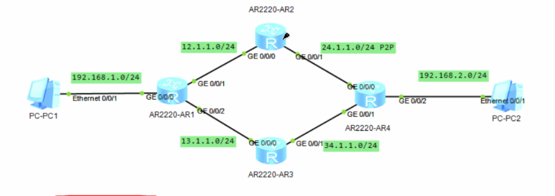

# DAY3：OSPF详解-LSA-VLink-特殊区域

一、OSPF的更新方式

​	1.触发式泛洪：

​		链路发生变化

​		新路由加入网络

​		现有LSA的序列号更新（手动重置OSPF进程、LSA条目老化）

​		收到邻居的LSR需要回复

​		特点：

​			立即响应（毫秒级）

​			增量更新：只发变化的LSA（非全量）

​			目标明确：224.0.0.5、224.0.0.6

​	2.周期性泛洪：

​		默认30分钟（RFC 2328规定）

​		与网络状态变化无关，是预防性的维护机制

​		特点：

​			全量刷新

​			防老化机制

​			携带特殊标记

​		


LSA条目老化：LSA在一定时间（如3600秒）后更新一次，但是更新方式是LSA所属的路由做周期性的泛洪


​	3.MTU不一致

​		华为的OSPF默认不检查MTU。

​		若检查，MTU值在ExStart阶段的空DBD报文内

​		对端MTU小于本端，对方收到会直接丢掉

​		这种不一致的情况会MTU较大的卡在Exchange，小的卡在ExStart


当OSPF网络内接口网络类型不一致，一边P2P，一边广播，能建立邻居，但无法互传路由，因为两边的LSA类型和字段都不一致，标准不一致导致会无法识别加入路由表。（如p2p没有DR/BDR）


二、LSA详解

​	1.LSA（Link-State Advertisement）链路状态通告

​	描述网络拓扑

​	同步LSDB（同步路由）

​	支持分层设计（分类型实现OSPF的区域之间的路由隔离和汇总）


​	2.

​	Type3 LSA ：会将总区域（area 0）内的路由汇总到ABR上告知其他区域路由（非明细路由），也就是把区域内路由映射到ABR上，其他区域想访问，直接会路由到对应的ABR路由上（因为没有必要，它只能通过访问ABR才能访问总区域）

​	Type5 LSA ：告知OSPF网络ASBR上的外部路由，但这个不包含到达ASBR的路由信息

​	Type4 LSA ：辅助5类LSA，告知如何到达ASBR的路由信息

​	Type7 LSA ：特殊区域禁止使用Type5，但可以引入外部路由，所以使用7类传播外部路由，但仅限NSSA区域有效，要传播路由出区域时，会在ABR上转换为Type5再传播出去。

​	3.

​	stub：可以设置的特殊区域，阻止一切外部路由

​	作用就是防止外部的明细路由进来，因为如果放外部路由进来，假如有上千条路由，但实际上只是走内部网络，只需要路由到ABR，就完全不需要知道细节，只需要默认走ABR就行了，仅需要寥寥几条路由就完成数据传输了。

​	nssa：阻止type5的特殊区域，但放行type7

​	作用：还是为了隔离大部分路由，但可以引入部分外部路由，但此时外部路由为特殊外部路由，LSA为7类，只能在当前区域传播的LSA，当其传播出去时，会从ABR转为type5发出去。


​	LSA内部信息介绍：

​	如Link-State ID：与设备相关，为Router-ID，与接口相关，为IP


​	


三、泛洪机制

​	1.泛洪范围

​	2.确认机制

​	3.传播方式

​	一般情况下，收到泛洪报文，会直接在其他接口泛洪出去，即从哪收不从哪发，这个机制叫水平分割，但有特殊的点，DR和BDR之间会互发，会出现从哪收从哪发的情况。

​	


四、LSA数量

​	一类数量：和设备数量相关

​	（一台路由器只有一条1类LSA，一条LSA里包含该路由器所有启用了OSPF的接口（链路）信息）

​	二类数量：和广播类型链路（网段）数量相关


VLink（虚拟连接）：当一个区域在物理上被分割了，但可以通过配置VLink将两个不直连的区域来连接为一个逻辑上的完整区域。


五、Link类型（四种）

域内LSA（1类、2类）	

1类LSA（Router LSA）用于描述路由器在某区域内的接口信息，每条链路（Link）包含类型、Link ID和Data。共有四种Link类型：

- **P2P**：描述点到点连接（如串口）。
  - Link ID = 邻居路由器的Router ID
  - Data = 本端接口IP地址
- **TransNet**：描述广播多路访问网段（如以太网），属于拓扑信息。
  - Link ID = DR的接口IP地址（华为） / DR的接口ID（思科）
  - Data = 本端接口IP地址
- **StubNet**：描述末梢网段（如Loopback或只连主机的网段，没有邻居）。
  - Link ID = 该网段的IP地址/子网号
  - Data = 该网段的网络掩码
- **Virtual**：描述虚链接。
  - Link ID = 邻居路由器的Router ID
  - Data = 本端接口IP地址

**作用**：其他路由器通过这些信息，可以计算出到达该路由器及其连接网段的最优路径。


不太明白，打个比方

**1类LSA是路由器写给区域其他同伴的自我介绍信。信的正文是一个“接口清单”，每个接口对应一条“Link”。**

- **Link的类型决定了这封信要怎么写：**
  - **P2P** (点到点)：“我连着对面的**那台路由器**。” -> **Link ID = 邻居路由器的名字 (Router ID)**
  - **TransNet** (广播网)：“我连着这个以太网，这个网的**老大是DR**。” -> **Link ID = 老大的IP地址 (DR Interface IP)**
  - **StubNet** (末梢网)：“我身上挂着一个**网段**。” -> **Link ID = 这个网段的网络号**
  - **Virtual** (虚链接)：“我通过虚链路连着**那台路由器**。” -> **Link ID = 邻居路由器的名字 (Router ID)**
- **不管是哪种Link类型，目的都一样：让其他路由器能根据你描述的信息，画出网络的拓扑图。**

可以参考下面的路由的1类LSA信息

```
<AR1>dis ospf lsdb router 

	 OSPF Process 1 with Router ID 1.1.1.1
		         Area: 0.0.0.0
		 Link State Database 

  Type      : Router
  Ls id     : 2.2.2.2
  Adv rtr   : 2.2.2.2  
  Ls age    : 35 
  Len       : 60 
  Options   :  E  
  seq#      : 80000020 
  chksum    : 0x7247
  Link count: 3
   * Link ID: 2.2.2.2      
     Data   : 255.255.255.255 
     Link Type: StubNet      
     Metric : 0 
     Priority : Medium
   * Link ID: 12.1.1.2     
     Data   : 12.1.1.2     
     Link Type: TransNet     
     Metric : 1
   * Link ID: 12.1.2.2     
     Data   : 12.1.2.2     
     Link Type: TransNet     
     Metric : 1

  Type      : Router
  Ls id     : 1.1.1.1
  Adv rtr   : 1.1.1.1  
  Ls age    : 1467 
  Len       : 48 
  Options   :  E  
  seq#      : 8000000e 
  chksum    : 0x9377
  Link count: 2
   * Link ID: 1.1.1.1      
     Data   : 255.255.255.255 
     Link Type: StubNet      
     Metric : 0 
     Priority : Medium
   * Link ID: 12.1.1.2     
     Data   : 12.1.1.1     
     Link Type: TransNet     
     Metric : 1

  Type      : Router
  Ls id     : 3.3.3.3
  Adv rtr   : 3.3.3.3  
  Ls age    : 44 
  Len       : 48 
  Options   :  E  
  seq#      : 80000004 
  chksum    : 0x8179
  Link count: 2
   * Link ID: 3.3.3.3      
     Data   : 255.255.255.255 
     Link Type: StubNet      
     Metric : 0 
     Priority : Medium
   * Link ID: 12.1.2.2     
     Data   : 12.1.2.1     
     Link Type: TransNet     
     Metric : 1
 
<AR1>
```


**2类LSA（Network LSA）**

- **产生者**：MA网段的DR
- **传播范围**：仅在本区域
- **作用**：描述一个MA网段上连接了哪些路由器
- **关键字段**：
  - Link State ID = DR的接口IP
  - Advertising Router = DR的Router ID
  - Mask = 网段掩码
  - Attached Router = 该网段上所有邻居的Router ID（列表）
- **数量** = 区域内MA网段数量
- **配合1类**：1类说“我连了哪个DR”，2类说“这个DR下挂了哪些设备”

参考信息

```
<AR1>dis ospf lsdb network

	 OSPF Process 1 with Router ID 1.1.1.1
		         Area: 0.0.0.0
		 Link State Database 


  Type      : Network
  Ls id     : 12.1.2.2
  Adv rtr   : 2.2.2.2  
  Ls age    : 534 
  Len       : 32 
  Options   :  E  
  seq#      : 80000002 
  chksum    : 0x39f5
  Net mask  : 255.255.255.252
  Priority  : Low
     Attached Router    2.2.2.2
     Attached Router    3.3.3.3

  Type      : Network
  Ls id     : 12.1.1.2
  Adv rtr   : 2.2.2.2  
  Ls age    : 158 
  Len       : 32 
  Options   :  E  
  seq#      : 8000000c 
  chksum    : 0xcb62
  Net mask  : 255.255.255.252
  Priority  : Low
     Attached Router    2.2.2.2
     Attached Router    1.1.1.1
 
<AR1>
```


OSPF的p2p类型网络不需要画拓扑，就只需要知道和对端之间的网络


SPF算法

​	计算选路时不优先考虑cost值，优先考虑LSA的type，

​	**1类/2类（区域内） > 3类（区域间） > 5类（AS外部） > 7类（NSSA外部）**


域间LSA

3类LSA

​	一个网段就有一个3类LSA

​	当ABR发现某路由表条目不可达，就会发送一个对应的Age为3600秒 的3类LSA，也就是主动老化掉该路由信息

​	3类LSA的数量

​	cost值计算


ISPF

PRC


