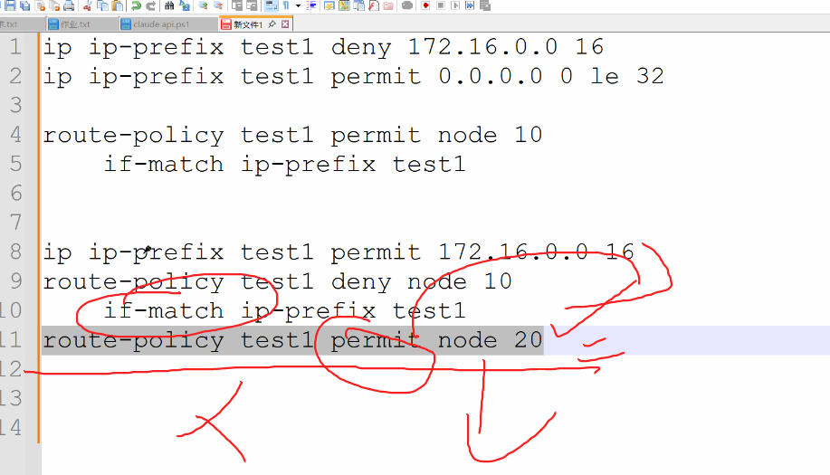
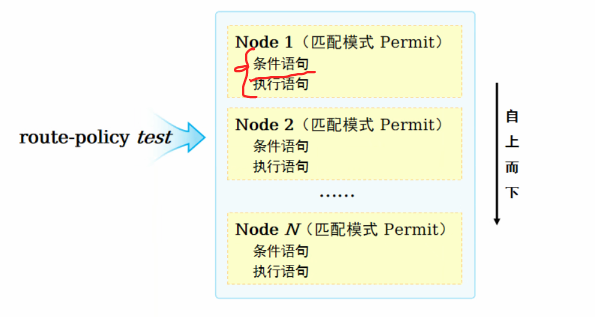

# 路由策略和策略路由

控制平面和转发平面

创建路由、配置路由处于控制平面

使用路由、通过路由表转发处于转发平面


PBR（策略路由）和FIB（转发信息库，路由表）

可以使用PBR控制路由转发的路径，其优先级高于FIB，如果匹配到PBR，就会直接转发，忽略FIB


### 1.路由匹配工具

#### 1.1访问控制列表（ACL）

acl工具可以对报文和路由进行匹配和区分

这里的permit和deny的意义只有匹配和不匹配

acl会按顺序进行匹配，匹配到就退出

常用的只有2000-3000，很少用到3000以上

```
rule 5 permit source 1.1.1.0 0.0.0.255
```

这里的通配符掩码0.0.0.255的0，是每一个置0的二进制位对应的网络号要完全匹配，用于匹配前置

也就是置0为匹配，1表示无需匹配


默认最底部有一个通配的deny规则用于兜底


#### 1.2 IP前缀列表 （ip-prefix）

acl可以进行一些简单的过滤，但某些特殊的过滤就不能处理了，比如

```
已有
172.16.1.0/24
172.16.2.0/24
172.16.0.0/16
172.16.3.0/24
要过滤掉
172.16.0.0/16
```

acl只能匹配路由的前缀，而不能过滤指定的掩码

先匹配16 会导致全部被deny，因为网络前缀全部相同，而且acl不能过滤掩码

所以需要使用可以匹配掩码的`ip-prefix`

可以先deny再permit

```
ip ip-prefix test1 deny 172.16.0.0 16
ip ip-prefix test1 permit 0.0.0.0 less-equal 32
```

le：less-equal 


### 总结表

| 命令写法                           | 匹配的掩码长度 |
| :--------------------------------- | :------------- |
| `permit 172.16.0.0 16`             | **等于 16**    |
| `permit 172.16.0.0 16 le 24`       | **16 到 24**   |
| `permit 172.16.0.0 16 ge 24`       | **24 到 32**   |
| `permit 172.16.0.0 16 ge 20 le 28` | **20 到 28**   |




### 2.策略工具

#### route-policy

这个是一个策略工具，用于匹配和修改

node 内规则是与的关系，要自上而下匹配

node 之间是或的关系，匹配到就停止

和ACL、IP-Prefix一样，默认都是deny，拒绝的规则




