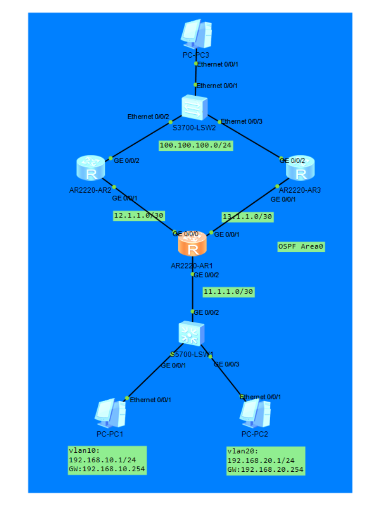

# DAY-8 

filter-policy	

可以限制路由表的路由进入，但无法限制LSA的发布，也就是import-route路由引入这种行为，会导致其他域内邻居知道该路由，但自己没有

### 双点双向路由重分布


当一台路由器处于两个路由域的交界处时，可以通过双向重发布路由实现互通，这种叫做---单点双向路由重分布

而两台路由器处于交界处时，都双向重发布，这种叫做---**双点双向路由重分布**

作业：


当一个点的路由引入了OSPF的外部路由，其路由的优先级为150，其被加入ISIS中会被ISIS的规则识别为外部路由，优先级为15，这样就出现一个问题，另一个点的路由会知道一个OSPF中引入的外部路由，其优先级为150，另一个ISIS引入的OSPF的外部路由，优先级为15，因为两边的优先级规则不匹配，出现了更远的次优路径的路由反而被设置为了优先的路由

OSPF外部：150 < ISIS 引入OSPF的外部路由：15

实际最短路径是150这条


过滤：实现优先级调整

简单过滤：直接在出问题的路由器上配置，两种方法

​	1.过滤掉次优路由，如：直接过滤掉ISIS内的该路由

​	2.把引入的正常路由优先级调高，如：150改为14

正常的常规过滤：

​	在import的路由上打上tag，在另一个边缘路由过滤掉tag

### 常规过滤：打Tag + 过滤Tag

**场景**：AR2把OSPF路由引入IS-IS时打Tag 100，AR3把IS-IS引入OSPF时过滤掉Tag 100。

**第一步：AR2（OSPF → ISIS，打Tag）**

bash

```
route-policy SET_TAG permit node 10
 apply tag 100

isis 1
 import-route ospf 1 route-policy SET_TAG
```


**第二步：AR3（ISIS → OSPF，过滤Tag）**

bash

```
route-policy FILTER_TAG deny node 10
 if-match tag 100

route-policy FILTER_TAG permit node 20

ospf 1
 import-route isis 1 route-policy FILTER_TAG
```


**作用**：A引入时贴Tag，B引入时看到Tag扔掉，防止路由回馈和环路。

### 最终解决该问题的环境配置

```
#点1和点2都配置
#打tag
route-policy Set_Tag permit node 10
 apply tag 200
isis 1
 import-route ospf 1 route-policy Set_Tag
#过滤tag
route-policy Filter_Tag deny node 10
 if-match tag 200
route-policy Filter_Tag permit node 20
isis 1
 filter-policy route-policy Filter_Tag import
```


### 策略路由PBR

本地PBR用于控制路由走向

当路由表指向一条路径时，或无路径指向时，可以通过acl匹配目标地址，控制数据的转发指向，指定数据的下一跳走哪。

> 注意！：这种方式只是指定了下一条，但没有指定出接口，PBR执行时任然会递归查询路由表找到出接口

#### 流分类（Classifier）

**一句话**：从一堆数据里挑出你想要的那部分。

**比喻**：保安认人——"穿红衣服的站左边"。

**怎么挑**：看数据包的源IP、目的IP、端口号、协议类型、VLAN ID、优先级标记等。

**注意**：流分类只负责"挑"，不负责"处理"。

**命令**：
```bash
traffic classifier c_192
 if-match source-ip 192.168.1.0 24
```

**常用匹配条件**：
```bash
if-match source-ip 10.0.0.0 24        # 源IP
if-match destination-ip 10.0.0.0 24   # 目的IP
if-match protocol tcp                 # 协议类型
if-match tcp-port destination-port 80 # 目的端口
if-match vlan-id 100                  # VLAN ID
```

#### 流行为（Behavior）

**一句话**：对挑出来的数据做什么动作。

**比喻**：决定怎么处理——"穿红衣服的走VIP通道，穿蓝衣服的拦住"。

**常见动作**：允许、拒绝、限速、整形、重标记优先级、重定向。

**注意**：流行为只负责"做什么动作"，不关心"对谁做"。

**命令**：
```bash
traffic behavior b_deny
 deny
```

**常用动作**：
```bash
permit                        # 允许
deny                          # 拒绝
car cir 1000                  # 限速1000kbps
gts cir 1000                  # 整形1000kbps
remark dscp 46                # 重标记优先级
redirect ip-nexthop 10.0.0.1  # 重定向
```

#### 流策略（Policy）

**一句话**：把"挑什么"和"做什么"绑到一起，贴在接口上生效。

**比喻**：把"穿红衣服的走VIP通道"这条规定贴到门口执行。

**为什么需要这一步**：光有分类不知道如何处理，光有行为不知道对谁做，两者绑在一起才算完整规则。一个策略可以绑多组规则，按优先级依次匹配。

**命令**：
```bash
traffic policy p_block
 classifier c_192 behavior b_deny
```


## 应用接口

**命令**：
```bash
interface GigabitEthernet0/0/1
 traffic-policy p_block inbound
```
`inbound` = 入方向，`outbound` = 出方向。


## 完整配置示例

场景：把来自 192.168.1.0/24 的所有数据包丢掉。

```bash
# 1. 建流分类
traffic classifier c_192
 if-match source-ip 192.168.1.0 24

# 2. 建流行为
traffic behavior b_deny
 deny

# 3. 建流策略
traffic policy p_block
 classifier c_192 behavior b_deny

# 4. 贴接口
interface GigabitEthernet0/0/1
 traffic-policy p_block inbound
```


## 配置顺序

> **分类 → 行为 → 策略 → 贴接口**

顺序不能乱，因为后面的要引用前面的。


## 验证命令

```bash
display traffic classifier user-defined   # 查看流分类
display traffic behavior user-defined     # 查看流行为
display traffic policy user-defined       # 查看流策略
display qos policy interface              # 查看接口执行情况
```


## 删除配置

```bash
interface GigabitEthernet0/0/1
 undo traffic-policy p_block inbound      # 先从接口移除
undo traffic policy p_block               # 再删策略
undo traffic behavior b_deny              # 再删行为
undo traffic classifier c_192             # 最后删分类
```


## 容易踩的坑

- 以为流分类就是流策略 → 不对，流分类只是"挑"，流策略才是完整规则
- 只配分类和行为，忘了建策略去绑 → 白配了，不生效
- 策略里多个规则顺序搞反 → 按序号从小到大匹配，序号小的优先
- 应用到接口时方向弄错 → 入方向还是出方向，效果完全不同


## 一句话收官

> **流分类是挑出来，流行为是怎么管，流策略是绑起来贴上去。配置顺序：分类→行为→策略→贴接口。**


作业

LSW2：100.100.100.254

AR2：100.100.100.1

​	12.1.1.1

AR3：100.100.100.2

​	13.1.1.1

AR1：单臂路由

​     12.1.1.2

​	13.1.1.2

​	192.168.10.254

​	192.168.20.254


PC1：vlan 10

PC2：Vlan 20




acl怎么判断接口是im（进）还是ex（出）

路由收到该数据包的行为是入还是出，决定了配置import还是export

数据从该接口进入，就配置import

数据从该接口出去，就配置export


配置方法

