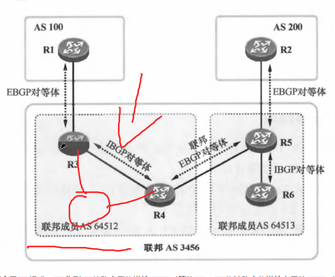
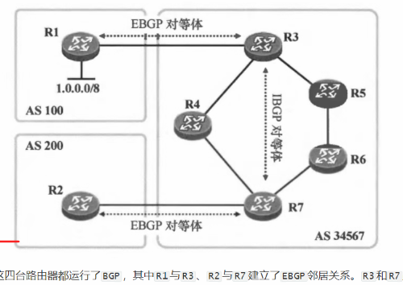
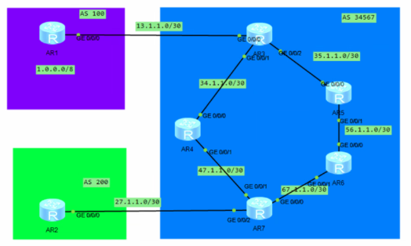

# BGP基础-2随笔


路径属性：可以存储路由来源、经过的路由、AS区域等信息。

AS_Path实际上是一个所经过路由AS区域的列表，最早经过的在最右边，依次在开头加入，即最右侧为该路由的始发AS地址号。

例如：AS_Path:200 100 ，100就是发出该路由的区域AS号。

#### AS Path的三个作用：

1. **实现EBGP防环**：当BGP路由器收到包含自身AS号的路由时，直接丢弃，防止路由环路。
2. **用于路由过滤和路径控制**：通过匹配AS_PATH中的AS号，灵活控制路由的接收、发布及路径长短。
3. **用于择优选路**：AS_PATH是BGP选路规则中重要的参考指标之一（路径越短越优）。

#### BGP注入路由的方式有三种：

1.Network

2.import-route

3.聚合路由（路由汇总）


#### network和import-route两种注入路由的方式对应路由用起来都差不多，但network在路径属性上会略优于import-route

IGP路由

基本上都是从零到有的生成路由

BGP路由

与IGP不同，BGP不生产路由，其只搬运路由，例如在BGP中使用network宣告路由时，该路由一定是在当前本地路由表中的。


#### BGP路由的通告原则：

1.BGP通过network宣告、import-route等生成路由，发布时只会发布最优（Best）且有效（valid）的路由

2.从EBGP获得的路由会发布给所有对等体。

3.路由黑洞：因为BGP内部邻居建立通过了非BGP路由区域，导致BGP路由经过这个虚拟链路时，其不认识也不知道BGP路由，所以找不到转发路径，导致在此处被丢弃。


水平分割：

指从IBGP对等体获取的BGP路由，不会在发送给其他IBGP对等体。（即IBGP路由不会传播其他IBGP路由发布的条目）

这样可以解决环路问题，但会破坏路由的连贯性，解决方法：

1.可以使用回环口全部建立两两连接的对等体，每台设备建立n-1个邻居（全互联）（基本不用，太繁琐且基础了）

2.使用路由反射器（RR）：（也就是把所有需要该路由的路由器设置为客户，有路由就给它们转发）

​	作为一台RR：

- **从一台客户端收到IBGP路由**，会给到所有的客户端和非客户端（即反射给所有邻居）。
- **从一台非客户端收到IBGP路由**，会给到所有的**客户端**，但**不会**给到其他非客户端（遵循IBGP水平分割原则，避免环路）。

3.联邦（Confederation）

​	也被称作联盟，大致概念是在大AS中划分小AS，在内部划分区域，让小区域之间形成联邦EBGP对等体关系，就像美国联邦一样，看起来是一个整体，内部却是分开的。

​	联邦EBGP内部有水平分割也可以使用全互联或RR进行解决。

​	联邦EBGP在内部会使用联邦EBGP的as号写入as path 来解决EBGP的环路问题。

最好使用RR来解决水平分割问题，联邦会创建联邦AS号（大AS）和联邦成员AS号（小AS），如果要修改会停机，非常麻烦，所以现在和全互联一样，基本不用。




#### 路由黑洞



因为在IBGP路由之间是进行的虚拟连接的邻居，中间设备没有运行BGP，导致外部的EBGP的路由R1无法达R2，R2无法pingR1，在R4或者R6就被抛弃了，但将EBGP的路由R1引入到R4和R6的互联协议中，此时R2可以到到R1，但R2无法回程到R1，network进行宣告路由



是先引入ISIS，再从ISIS引入BGP，避免路由引入无效，是这样理解的吗

是的


同步规则：为了规避路由黑洞引入的规则。是指当一台路由器从IBGP学习到一条路由时，必须在IGP协议中同时学到该路由才能转发给EBGP邻居。即要求IBGP路由和IGP路由同步。

就例如上面的R1的10.0.0.0/8路由，R3从R1的BGP学到，开启同步规则后，R7并不能收到该路由，因为R3认为IGP协议如ISIS中没有该路由，未满足同步规则的条件，不允许转发路由，只有在引入到IGP路由协议中，R7才能学习到路由，从而转发给R2。

不过正常不用，开启命令

```
synchronization
```


BGP的RID

Router-id
可以手动设置

自动选择优先使用回环口地址，其次接口地址


BGP的TTL

EBGP的TTL正常为1，因为正常推荐使用直连的接口建立，如果用回环口或跨设备，可以修改为255,不修改ttl会直接导致包走一跳就丢失，设置命令

peer 2.2.2.2 ebgp-max-hop 255


### 路径属性


BGP路径属性的概念

BGP路径属性的作用

BGP路径属性分为两大类：

公认：所有路由器可识别的路径属性。

​	分两类：

​	公认必遵：BGP使用Update报文通告路由更新时必须携带的实现。

​	公认任意：不要求Update报文更新时必须携带的路径属性。

可选：可选属性不要求所有路由器识别。

​	分两类：

​	可选过渡：当BGP路由该路径属性不认识时，仍然会接受该更新，并在需要通告该路由时携带该路径属性。

​	可选非过渡：当BGP路由不认识该路径属性时，会忽略携带该路径属性的更新，并不会通告给其他对等体。


### 路径属性（Path Attributes）

**路径属性在报文中的样子：**
BGP报文（如Update报文）中，路径属性以**TLV（Type-Length-Value）**格式呈现。每个属性包含：

- **Type（2字节）**：标识属性类型（如AS_Path = 2）。

- **Flags（1字节）**：标识属性类别（公认/可选、必遵/非必遵、可传递/不可传递）。

- **Length（2字节）**：属性值长度。

- **Value（可变）**：具体属性内容（如AS号列表）。

  例如：

  ```
  BGP UPDATE
    ├─ Path Attributes
    │   ├─ AS_PATH (Type 2)
    │   │   ├─ Flags: 0x40 (公认必遵)
    │   │   ├─ Length: 6
    │   │   └─ Value
    │   │       ├─ Segment Type: AS_SEQUENCE (有序)
    │   │       ├─ Segment Length: 3 (3个AS号)
    │   │       ├─ AS 100 (0x0064)  ← 最近，转发该路由给本机的区域
    │   │       ├─ AS 300 (0x012c)
    │   │       └─ AS 200 (0x00c8)  ← 最远，路由始发区域
    │   ├─ ORIGIN (Type 1): IGP
    │   ├─ NEXT_HOP (Type 3): 10.0.1.1
    │   └─ MED (Type 4): 50
    └─ NLRI: 192.168.0.0/24
  ```

  

------

#### 1. AS_Path

**作用**：防环 + BGP选路（路径越短越优）。

**属性类别**：公认必遵（Well-known Mandatory），所有BGP Update中必须携带。

**关键行为**：

- 当路由在**IBGP**邻居间传递时，**不改变**AS_Path（不追加AS号）。
- 当路由**发往EBGP**邻居时，路由器会在AS_Path列表的**最前面（左侧）**压入自己的AS号。
- 传递方向：`AS 300 ← 100 ← 200 ← 400`（左侧为最近邻，右侧为源发AS）。
- **选路规则**：BGP仅将**最短AS_Path**且有效的路由放入路由表。

**AS_Path类型**（两种）：

| 类型                     | 说明                                                         | 表示方式                                                     |
| :----------------------- | :----------------------------------------------------------- | :----------------------------------------------------------- |
| **AS_SEQUENCE**（默认）  | 有序列表，按路由经过的AS顺序排列，从左到右依次为最近到最远。 | `200 100 400`                                                |
| **AS_SET**（聚合时使用） | 无序集合，聚合路由器将**被聚合子路由的AS号**放入`{}`内，不区分顺序；聚合路由器自身的AS号放在`{}`外左侧。 | `300 {100, 200}` （表示聚合点在AS 300，被聚合的路由分别来自AS 100和200） |

------

#### AS-Path Filter（AS路径过滤器）

**概念**：
一种基于AS_Path属性内容（AS号序列）进行路由过滤或策略控制的工具。

**功能**：

- **过滤路由**：允许或拒绝包含特定AS号或符合特定AS路径模式的路由。
- **匹配路由**：在路由策略（Route-Policy）中作为`if-match`条件，用于控制选路、修改属性或设置Community等。
- **防环辅助**：在特定场景（如跨域VPN）中，通过检测AS号重复来防止环路。

**使用方法**：

1. **定义过滤器**（创建AS路径过滤列表）：
   - 使用命令 `ip as-path-filter {filter-name | number} {permit | deny} regular-expression`。
   - 例如：`ip as-path-filter 1 permit ^100_`（允许所有以AS 100开头的路径）。
2. **在路由策略中调用**：
   - 在Route-Policy中通过 `if-match as-path-filter 1` 进行匹配。
3. **在BGP邻居配置中直接调用**（部分设备支持）：
   - 使用 `peer x.x.x.x filter-policy as-path-filter import` 对从该邻居接收的路由进行过滤。

**所用正则表达式（常用元字符）**：

| 元字符 | 含义                                        | 示例      | 匹配说明                          |
| :----- | :------------------------------------------ | :-------- | :-------------------------------- |
| `^`    | 匹配字符串开始（最左侧AS）                  | `^100`    | 路径以100开头（路由来自AS 100）   |
| `$`    | 匹配字符串结束（最右侧AS）                  | `100$`    | 路径以100结尾（路由目标是AS 100） |
| `_`    | 匹配AS号的边界（空格、逗号、括号、行首/尾） | `_100_`   | 匹配独立AS号100，不匹配1001       |
| `.`    | 匹配任意单个字符                            | `1.0`     | 匹配110、120等                    |
| `*`    | 匹配前面的字符0次或多次                     | `100*`    | 匹配10、100、1000等               |
| `+`    | 匹配前面的字符1次或多次                     | `100+`    | 匹配100、1000等                   |
| `|`    | 逻辑或                                      | `100|200` | 匹配包含100或200                  |
| `[ ]`  | 匹配括号内任意一个字符                      | `[12]00`  | 匹配100或200                      |
| `( )`  | 分组                                        | `(100)+`  | 匹配100、100100等                 |

> **常用正则技巧**：
>
> - 匹配空路径（本地始发路由）：`^$`
> - 匹配包含AS 100的路径（任意位置）：`_100_`
> - 匹配AS号以1开头的路径：`^1`
> - 匹配AS路径长度为1的路由：`^[0-9]+$`

例如：1.1.1.1的会转发给本机来自AS100的路由，需要过滤

```
ip as-path-filter denyAs100 deny _100$ #匹配并拒绝来自100的路由
ip as-path-filter denyAs100 permit .* #放行其他路由
bgp 100
	peer 1.1.1.1 as-path-filter denyAs100 import #过滤来自邻居1.1.1.1的BGP路由
```

