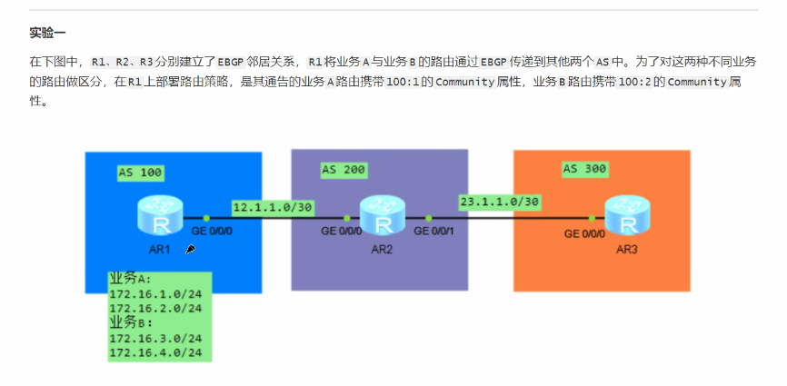

# DAY11：BGP路由基础-路径属性-汇总-复位-防环随笔

### 一、BGP常见路径属性

#### 1. AS_Path（公认必遵）（详见DAY10笔记）

**作用**：防环 + BGP选路（路径越短越优）。

**属性类别**：公认必遵（Well-known Mandatory），所有BGP Update中必须携带。

#### 2. Origin属性（公认必遵）

用于描述BGP的路由来源。

存在三种，标记/类型如下：

1. **i / IGP** —— 如果是network命令注入或aggregate聚合生成的路由，标记为 `i`
2. **e / EGP** —— 通过EGP协议（如EGPv2，现已几乎不用）引入的路由，标记为 `e`
3. **? / incomplete** —— 通过其他方式（如import-route引入的直连/静态/IGP路由）注入的路由，标记为 `?`

#### 3.Next_Hop属性（公认必遵）

用于指定到达目标网络的下一跳地址。

- 当路由器学习到路由，必须要有指定的明细路由地址，才会允许发布。
- 当路由器收发路由时：
  - 路由器向**EBGP**发布路由时，会修改下一跳为与对端建立BGP邻居关系的接口地址。
  - 路由器向**IBGP**发布路由时，会修改下一跳为与对端建立BGP邻居关系的接口地址。
  - 路由器学习到EBGP路由后向IBGP对等体发布时，会**不修改** Next_Hop 值。

#### 4.Local_Preference属性（公认自愿）

用于告知AS中的路由器，那条路径是通往AS外的首选路径（路由选路）。

- 值越大越优先，默认缺省为100。
- 其在IBGP内部路由会在路由条目上携带，且只会在IBGP对等体内传播（因为是用于引导离开AS的），不会携带发往EBGP。
- 可以在边界路由器上的 **import** 方向使用路由策略修改 Local_Preference 的值，来提高或降低EBGP路由的路径优先级。

#### 5.Community属性（可选过渡）

在BGP中过滤路由，可以用AS_Path限制某路由的路由进入路由表，但要精细某些路由的限制，比如某路由器上的生成路由，办公路由放行，就可以使用Community给路由打标记，而且不需要指定网络前缀和掩码来匹配路由来执行策略进行限制了。

Community属性长度为32bit，有两种形式：

1. 十进制整数。
2. `AA:NN` 格式，其中 `AA` 表示 `AS` 号，`NN` 是自定义的编号。

有一些默认的团体属性值：

| 团体属性名称            | 团体属性号              | 说明                                                         |
| :---------------------- | :---------------------- | :----------------------------------------------------------- |
| **Internet**            | 0 (0x00000000)          | 设备在收到具有此属性的路由后，可以向任何BGP对等体发送该路由。缺省情况下，所有的路由都属于Internet团体。 |
| **No_Advertise**        | 4294967042 (0xFFFFFFFE) | 设备收到具有此属性的路由后，将不向任何BGP对等体发送该路由。  |
| **No_Export**           | 4294967041 (0xFFFFFFFD) | 设备收到具有此属性的路由后，将不向AS外发送该路由。           |
| **No_Export_Subconfed** | 4294967043 (0xFFFFFFFB) | 设备收到具有此属性的路由后，将不向AS外发送该路径，也不向AS内其他子AS发布此路由。 |

##### 如何打Community标签

首先要告知给其他BGP对等体时，必须要指定宣告给邻居才行，并且在传播路径上所有的BGP路由器都要指定邻居宣告，不然缺省情况下是不会传播该属性的：

```
peer <邻居接口地址> advertise-community
```


##### 单个打标签方法（不常用）：

指定给单个路由时，创建策略，使用network宣告，并应用策略即可：

```
route-policy comm1 permit node 10 
	apply community 100:2

bgp 100
	network 172.16.1.0 24 router-policy comm1   # 使用network应用策略来给网络打上标签
```


##### 常用打标签方法：

例如：要将172.16.1.0/24网络的设备路由打上团体属性标签，并引入BGP路由中：

```
# 先建ip-prefix
ip ip-prefix comm1 permit 172.16.1.0 24

# 创建策略应用团体属性
route-policy comm1 permit node 10 
	if-match ip-prefix comm1
	apply community 100:2

# 应用到import方向，筛选并打上标签
bgp 100
	import-route direct route-policy comm1
```


##### 如何使用标签进行过滤（使用community-filter标签过滤器）

**1. 过滤仅允许某标签路由：**

```
# 创建标签过滤器，先设置permit，后面策略就要deny，反之相反
# 设置匹配100:2，并进行匹配
ip community-filter FromR1 permit 100:2

# 匹配过滤掉指定业务路由，并放行其他
route-policy FromR1 deny node 10
	if-match community-filter Com2
route-policy FromR1 permit node 20

bgp 200
	peer 12.1.1.1 route-policy FromR1 import 
```


**2. 修改发布给其他路由的路由团体属性标签，添加一个标签：**

```
# 设置匹配100:1，并进行匹配
ip community-filter Com1 permit 100:1

route-policy com1 permit node 10
	if-match community-filter Com1
	apply community no-export additive   # 这里必须打上additive，不写会直接覆盖原有的标签

bgp 200
	peer 12.1.1.1 route-policy ToR3 import 
```


**3. 直接使用ip-prefix和filter-policy来应用到过滤条件上（不使用route-policy）：**

```
# 创建IP前缀列表，过滤掉指定业务路由，但要记得放行其他路由
ip ip-prefix FromR1-Prefix deny 192.168.1.0 24
ip ip-prefix FromR1-Prefix permit 0.0.0.0 0 less-equal 32

# 在BGP视图下针对R1的路由应用过滤
bgp 200
	peer 12.1.1.1 filter-policy ip-prefix FromR1-Prefix import
```





#### 6.MED属性（可选非过渡）

在EBGP之间使用，用于有多条指向同一网段的路由，其他条件相同的情况下，可以使用MED来进行比较，**越小越优先**（类似Cost值）。

- 用于向外部EBGP对等体指出进入本地AS的首选路径，有多个入口时，AS可以使用MED影响选路。
- 缺省情况下，只有当路由来自**同一个相邻的AS**时，BGP才会进行MED属性的比较。可以通过 `compare-different-as-med` 命令，使BGP路由器在收到不同AS号的EBGP邻居通告的相同前缀和掩码的路由通过MED属性进行比较。
- MED值默认使用内部承载IBGP的IGP协议的路由Cost值，如OSPF中某路由Cost为100，其传播出去的MED就为100，若为静态/直连，就为0，从其他EBGP学习的路由传播出去默认是没有MED的（即MED值默认是不可传递的）。

#### 7.Atomic_Aggregate属性（公认自愿）

用于**出错检查**。

最常见的故障就是聚合路由导致的AS_Path缺失，聚合前为100 200，聚合后变为300 {200 100}，因为是无序列表，导致不知道始发路由，200可能会学习回去，导致环路。

- 这是一个**警告标识**，唯一的作用是向BGP内部告知：“该路由是被聚合的路由，AS_Path路径可能不完整”。
- 不携带信息，只是一个标志，要么有（提示有路由故障，如路由环路），要么就没有。

#### 8.Aggregator属性（可选过渡）

用于**出错检查与溯源**。

这个属性记录了是谁执行了这次路由聚合操作，通常与 `Atomic_Aggregate` 一同出现，包含两个字段：

1. **执行聚合的路由器的AS号**（AS Number）
2. **执行聚合的路由器的BGP Router ID**（IP Address）

这个属性存在的意义是，当网络管理员需要溯源这个聚合路由是谁汇总的，为什么没有携带 `AS_Path` 时，可通过这个属性精准确定位置。


### 二、路由汇总

#### 1. 路由自动汇总

`summary automatic` 命令用于将 **import-route 引入的外部路由（如直连、静态、IGP路由）** 按自然主类网段进行自动汇总，并自动抑制被汇总的明细路由（标记为 `s>`，表示 suppressed），仅对外发布汇总路由。

**配置命令：**

```
bgp 100
 ipv4-family unicast
  summary automatic
```

**关键特性与限制：**

1. **仅对 import-route 引入的外部路由生效**，对 network 宣告的路由不生效。
2. 自动汇总成**自然主类网段**（A/B/C类），无法自定义汇总网段。
   - 例如：`10.1.1.0/24` 和 `10.2.1.0/24` 会汇总成 `10.0.0.0/8`
   - 例如：`172.16.1.0/24` 和 `172.17.1.0/24` 会汇总成 `172.16.0.0/16`
3. **自动抑制明细路由**，被汇总的明细路由标记为 `s>`，不再对外发布。
4. 被汇总的明细路由，其下一跳会指向 `127.0.0.1`。
5. **该命令仅适用于 IPv4 单播地址族**，需在 `ipv4-family unicast` 视图下配置，IPv6 网络不支持自动汇总。
6. **手动聚合路由优先级高于自动聚合路由**，若同时配置，手动聚合优先。

#### 2.手动汇总

##### 2.1.普通手动汇总（不会自动抑制明细）

```
bgp 100
 	aggregate 172.16.0.0 16
```

##### 2.1.2.加`detail-suppressed`参数抑制明细路由

可以添加参数把其他路由抑制掉不发布，默认全抑制，有其他情况下会抑制特殊路由

```
bgp 100
	aggregate 172.16.0.0 16  detail-suppressed 
```

> 上面的都会导致一个问题，as_path会丢失源信息

##### 2.1.3.加`as-set`参数保留原始as_path

可以使用as-set把as_path属性保留源信息

```
bgp 100
	aggregate 172.16.0.0 16  detail-suppressed as-set
```

##### 2.1.4.加`suppress-policy`参数来抑制某些路由

```
#创建匹配器，并应用到策略来过滤指定路由
ip ip-prefix yiZhi permit 172.16.1.0 24
route-policy yiZhi permit node 10
 	if-match ip-prefix yiZhi


#指定策略，让被匹配到的172.16.1.0 24明细路由被抑制，detail-suppressed和suppress-policy组合使用
bgp 100
	aggregate 172.16.0.0 16 as-set detail-suppressed suppress-policy yiZhi
```

##### 2.1.5.加`origin policy`参数来强行绑定到某些路由，共生共灭

detail-suppressed和origin policy组合使用会导致origin policy匹配的路由被抑制，因为其为特殊路由

用于强行绑定到某些指定路由上，这些路由消失了汇总就消失了

```
#创建过滤器并应用到策略
ip ip-prefix test1 permit 172.16.3.0 24
route-policy test1 permit node 10
	if-match ip-prefix test1


[AR2]bgp 65001  
[AR2-bgp]aggregate 172.16.0.0 255.255.0.0 origin-policy test1
[AR2-bgp]quit
```

2.1.5.加`attribute-policy`参数来修改某些路径属性

可以指定attribute-policy应用一个route-policy来设置汇总路由的属性，例如MED改为200

```
#创建策略直接修改
route-policy test2 permit node 10
	apply cost 200


bgp 100
	aggregate 172.16.0.0 16 detail-suppressed attribute-policy test2
```


### 三、BGP复位

BGP的路由在修改时，不一定会即时更新，例如修改路径属性，因为BGP不是**周期性更新**的，BGP触发性更新不包含路径属性修改。

此时，我们就可以通过手动复位`BGP`的方式，让对方或本机再次通告`BGP`路由，复位分为两种：

#### 硬复位（Hard Reset）

通过**拆除并重新建立 TCP 会话**来实现 BGP 连接复位。会导致邻居关系中断、路由表震荡，**生产环境慎用**。

##### 1. 按作用范围分类

| 命令                               | 作用范围                                                     |
| :--------------------------------- | :----------------------------------------------------------- |
| `reset bgp all`                    | 复位路由器的**所有** BGP 连接                                |
| `reset bgp internal`               | 复位路由器的**所有 IBGP** 连接                               |
| `reset bgp external`               | 复位路由器的**所有 EBGP** 连接                               |
| `reset bgp as-number`              | 复位路由器与**指定 AS** 的 BGP 连接                          |
| `reset bgp peer-address`           | 复位路由器与**指定对等体**（IP地址）的 BGP 连接              |
| `reset bgp peer-address multicast` | 复位路由器与**指定对等体**的 **IPv4 组播** 地址族下的 BGP 连接 |

#### 二、软复位（Soft Reset）

在**不中断 TCP 会话**的情况下，重新通告所有路由，对业务影响小，**推荐使用**。

##### 1. 按作用范围 + 方向分类

| 命令                                               | 作用范围                          | 方向                                   |
| :------------------------------------------------- | :-------------------------------- | :------------------------------------- |
| `refresh bgp all import`                           | 所有 BGP 连接                     | **入方向**（重新处理从邻居收到的路由） |
| `refresh bgp all export`                           | 所有 BGP 连接                     | **出方向**（重新处理发送给邻居的路由） |
| `refresh bgp internal import/export`               | 所有 IBGP 连接                    | 入方向/出方向                          |
| `refresh bgp external import/export`               | 所有 EBGP 连接                    | 入方向/出方向                          |
| `refresh bgp peer-address multicast import/export` | 指定对等体的 **IPv4 组播** 地址族 | 入方向/出方向                          |

##### 2. import vs export 使用场景

| 方向       | 适用场景                                                     |
| :--------- | :----------------------------------------------------------- |
| **import** | 修改了**入方向**路由策略（如修改了 `route-policy import`、`filter-policy import` 等）后，需要重新处理从邻居收到的路由时使用。 |
| **export** | 修改了**出方向**路由策略（如修改了 `route-policy export`、`filter-policy export` 等）后，需要重新处理发送给邻居的路由时使用。 |

#### 三、快速查阅

```
【硬复位】TCP会话重建，邻居中断
├── reset bgp all                    # 所有连接
├── reset bgp internal               # 所有IBGP
├── reset bgp external               # 所有EBGP
├── reset bgp as-number              # 指定AS
├── reset bgp peer-address           # 指定对等体（默认单播地址族）
└── reset bgp peer-address multicast # 指定对等体的组播地址族

【软复位】TCP会话保持，平滑刷新
├── refresh bgp all import/export              # 所有连接
├── refresh bgp internal import/export         # 所有IBGP
├── refresh bgp external import/export         # 所有EBGP
└── refresh bgp peer-address multicast import/export  # 指定对等体的组播地址族
```


### 四、IBGP防环

为了解决IBGP路由传递问题，会使用全互联来解决，但全互联太吃性能了，所以基本上会使用其他更优方案

1.路由反射器（RR）

2.联邦（不常用）


#### 路由反射器

关键点 非非不传（非client之间不传递路由）

RR和其的client组成的叫**路由反射簇(Cluster）**

处理环路使用了两个属性

- `Originator_ID`
- `Cluster_List`

注意：两个都为可选非过渡类型

##### Originator_ID（始发者ID）

**作用：** 防止路由在RR（路由反射器）之间反射时出现环路。

**工作原理：**

- 当一台RR反射路由时，会在路由上贴上始发者的 **Router-ID**，标记"这条路由最初是谁产生的"。
- 如果某台路由器收到一条IBGP路由，发现路由上的 **Originator_ID 就是自己的 Router-ID**，说明"这是我产生的路由，转了一圈又回来了"，于是**忽略这条路由**，避免环路。

**通俗理解：** 就像快递包裹上的发件人标签，包裹转了一圈回到发件人手里，发件人知道"这是我寄的，不收"。

##### Cluster_List（簇列表）

**作用：** 防止同一个RR簇内出现路由环路。

**工作原理：**

- 每个RR簇有一个 **Cluster-ID**（簇ID，默认等于RR的Router-ID）。
- RR反射路由时，会把自己的 Cluster-ID 加入到路由的 Cluster_List 中，像"盖章"一样记录这条路由经过哪些簇。
- 如果RR收到一条路由，发现 Cluster_List 里已经包含自己的 Cluster-ID，说明"这是我之前反射出去的路由，转了一圈又回来了"，于是**忽略这条路由**，避免环路。

**通俗理解：** 就像一个打卡记录，路由经过的每个簇都在上面盖个章。如果RR发现上面有自己的章，就知道"这是我发出去的东西，又回来了，不收"。

##### 总结

| 属性              | 作用范围                 | 通俗理解                         |
| :---------------- | :----------------------- | :------------------------------- |
| **Originator_ID** | 防止**跨RR簇**的环路     | 发件人标签，看到是自己发的就丢弃 |
| **Cluster_List**  | 防止**同一RR簇内**的环路 | 打卡记录，看到有自己的章就丢弃   |