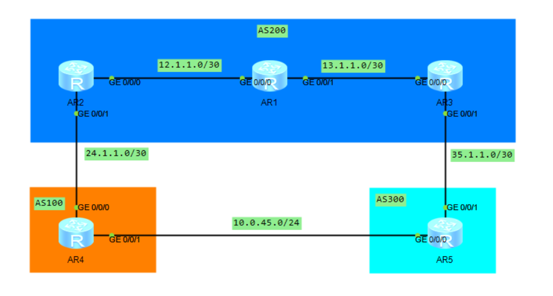

# DAY12：


当一台设备既有**EBGP邻居**也有**IBGP邻居**，需要对IBGP邻居设置`next-hop-local`修改下一跳目的地址为本机。

`connect-interface LoopBack0`和`next-hop-local`

携带这种参数的命令必须在如下**建立邻居之后**`peer <邻居地址> as-number <邻居AS号>`


### IBGP路由全网互传并防环的配置

#### 路由反射器RR

会使用的两个特殊路径属性（可选非过渡）

- Originator_ID（始发者ID）(BGP路由器防环)

- Cluster_List（簇列表）（RR簇内部防环）

##### BGP组的创建和在路由反射器上的使用

```
bgp 200                                      # 进入BGP视图
    group test internal                      # 创建内部BGP对等体组
    peer test reflect-client                 # 启用路由反射器功能（所有组成员成为客户端）
    peer test connect-interface LoopBack0    # 使用环回口0建立BGP连接（修正接口名）
    peer test next-hop-local                 # 推荐添加：修改下一跳为本地地址
    peer 2.2.2.2 group test                  # 添加客户端1
    peer 5.5.5.5 group test                  # 添加客户端2  
    peer 4.4.4.4 group test                  # 添加客户端3
    peer test timer keepalive 30 hold 90     # 推荐：调整BGP保活和保持计时器
    peer test route-update-interval 0        # 推荐：取消路由更新间隔限制（快速收敛）
    reflector cluster-id 10.0.0.1            # 推荐：如果有多个RR，设置相同集群ID避免环路
```

#### 联邦

##### 联邦的实际使用

内部防环方法：使用`AS_Path`来防环。

括号内部的说明其为联邦成员AS号

AS号的传递情况：

​	1.在内部使用联邦成员AS号

​	2.在外部直接使用AS联邦的AS号

联邦会使用的特殊AS_Path类型：

- `AS_Sequence`（默认的AS_Path列表）
  - AS_Path: 300 200 100
  - 说明：有序记录路由经过的所有AS号（按顺序从左到右）

- `AS_Set`（用于保留路由聚合的明细）
  - AS_Path: 300 {200 100}
  - 说明：无序集合，表示路由经过AS 200和100，但顺序无关紧要
  - 用途：路由聚合时保留被聚合路由的AS信息，防止环路

- `AS_Confed_Sequence`（联邦成员AS号的AS_Path列表）
  - AS_Path: (65001 65002) 300 200
  - 说明：有序记录联邦内部经过的成员AS号，用括号括起来
  - 特点：仅在联邦内部可见，离开联邦时被剥离

- `AS_Confed_Set`（联邦成员的AS号组合）
  - AS_Path: (65001 65002) 300 {200 100}
  - 说明：无序集合，记录联邦内部经过的成员AS号
  - 特点：顺序不重要，主要用于环路检测

##### 联邦内部的联邦成员AS之间的配置

正常还是使用回环口配置邻居，就要记得把`ebgp-max-hop`进行修改，因为默认为1，还没到回环口路由就已经死亡了。

使用**回环口或跨设备建立邻居时**需修改，命令例如：`peer 2.2.2.2 ebgp-max-hop 255`，**同时需配置connect-interface指定源接口，并确保路由可达**

##### 联邦的如何创建与配置

```
#拓扑
（AS 300（R3 --- R4）---（R5 --- R6））

#R3
bgp 64512
	router-id 3.3.3.3
	confederation id 300 #设置本机联邦AS号
	peer 4.4.4.4 as 64512
	
#R4
bgp 64512
	router-id 4.4.4.4
	confederation id 300       
	confederation peer-as 64513
	peer 3.3.3.3 as 64512
	peer 3.3.3.3 connect-interface loo0
	peer 5.5.5.5 as 64513 
    peer 5.5.5.5 connect-interface loo0
    peer 5.5.5.5 ebgp-max-hop 2
    
#R5
bgp 64513
	router-id 5.5.5.5
	confederation id 300   
	confederation peer-as 64512
	peer 4.4.4.4 as 64512
	peer 4.4.4.4 connect-interface loo0
	peer 4.4.4.4 ebgp-max-hop 2
	peer 4.4.4.4 next-hop-local
	peer 6.6.6.6 as 64513
	peer 6.6.6.6 connect-interface loo0
	peer 6.6.6.6 next-hop-local
	peer 25.1.1.1 as 200

#R6
bgp 64513
	router-id 6.6.6.6
	confederation id 300   
	peer 5.5.5.5 as 64513
	peer 5.5.5.5 connect-interface loo0
```


### BGP 路由选路

> 可以通过查看指定的路由条目看到为什么该路由条目不被优选
>
> display bgp routing-table 

BGP 的选路是依靠**路径属性**来判断的。

每条路由的路径属性是不影响路由器的，每条路由的路径属性和其是强绑定的。

BGP路由做路由选路时必须要**有效**。

BGP路由的选路默认是按照最优路径算法来选路的。

BGP选路分为：

自然选路（自动选路）：
  - 路由器根据BGP路径属性，按照11条规则自动计算最优路径
  - 无需人工干预，由协议自身决策
  - 对应规则的前8条，也就是口决对应的部分（P-L-L-A-O-M-E-N）

手动选路（人为控制）：
  - 通过修改路径属性，影响BGP的选路结果
  - 使用路由策略、策略路由（PBR）等工具
  - 对应最后3条（Cluster_List、Router-ID、Peer IP）通常不手动改

##### 选路规则

（面试才会背这个，太多了，正常不记忆，不过有个口诀：(漂亮老男人P L LAO MEN)

P(Pre_V) L(Local_P) L（Local）A(AS_Path) O（Origin） M（MED） E（EBGP） N（Next_hop））

1. 优选`Preferred_Value`属性值最大的路由。

   - 这个属性是**华为私有**的参数且**仅本地有效**，常在import入方向上修改

2. 优选`Local_Preference`属性值最大的路由。

   - 这个属性是**公认任意属性**
   - 该属性仅在IBGP内传播
   - EBGP路由可以在import入方向，在路由进入IBGP后修改其值。

   （1与2默认相同，默认情况1.2不影响选路，但修改了就影响了）

3. 本地始发的`BGP`路由优于从其他对等体学习到的路由。

   本地始发的路由类型按优先级从高到低的排列顺序为：

   - 通过手工汇总的方式发布的路由
   - 通过自动汇总的方式发布的路由
   - 通过`network`命令发布的路由
   - 通过`import-route`命令发布的路由

4. 优选`AS_Path`属性值最短的路由。

5. 优选`Origin`属性最优的路由，按优先级从高到低的排列顺序为：

   1. `IGP`
   2. `EGP`
   3. `Incomplete`

6. 优选`MED`属性值最小的路由。

7. 优选从`EBGP`对等体学来的路由（`EBGP`路由优先级高于`IBGP`路由）。

8. 优选到`Next_Hop`的`IGP`度量值最小的路由。（IGP内花费（如cost值）越小越优选）

   从第八条规则开始可以开启**负载分担模式**，就不会往下比较了，不过**默认是不开启负载分担**的。

9. 优选`Cluster_List`最短的路由。

10. 优选`Router-ID(Originator_ID)`最小的设备通告的路由。

11. 优选具有最小`IP`地址（`Peer`命令所指定的地址）的对等体通告的路由。

​	（9、10、11是无赖规则，完全不考虑谁好谁坏，只为了选出唯一选项）


从1-8条规则都是为了自然选路，而9-10都是为了强制选路


##### 必须记住的5个关键属性（从高到低）

| 优先级 | 属性                 | 作用                 | 怎么改       |
| :----- | :------------------- | :------------------- | :----------- |
| 1      | **Local_Pref**       | 越大越优（AS内传递） | 入方向修改   |
| 2      | **AS_Path**          | 越短越优             | 出方向添加AS |
| 3      | **MED**              | 越小越优（跨AS传递） | 出方向修改   |
| 4      | **EBGP > IBGP**      | 外部路由优于内部     | 架构决定     |
| 5      | **Next_Hop IGP度量** | 离我越近越好         | 优化底层IGP  |

------

##### 两大优化方向

text

```
入向优化（别人访问我）         出向优化（我访问别人）
      ↓                              ↓
   改 MED                       改 Local_Pref
  改 AS_Path                    改 负载分担
   (加长降权)                   (开负载分担)
```


------

##### 实用配置速查

bash

```
# 1. 入向：让邻居优先走我
route-policy SET_MED permit node 10
    apply cost 50                    # MED改小
#
bgp 200
    peer 1.1.1.1 route-policy SET_MED export

# 2. 出向：我优先走某出口
route-policy SET_PREF permit node 10
    apply local-preference 200       # Local_Pref改大
#
bgp 200
    peer 2.2.2.2 route-policy SET_PREF import

# 3. 负载分担
bgp 200
    maximum load-balancing 2
```


------

##### 故障排查3步走

bash

```
# 1. 查看路由详情
display bgp routing-table 10.0.0.0 24

# 2. 看为什么没优（找Best: No的原因）
# 常见原因：下一跳不可达、AS环路、被策略过滤

# 3. 查看选路过程
display bgp routing-table 10.0.0.0 24 verbose
```


------

##### 口诀记忆

> **本地MED，AS短，EBGP优先，下一跳近**
> （Local_Pref、MED、AS_Path、EBGP、Next_Hop）




###### 实验一：通过修改BGP路由的`Preferred_Value`进行选路

把因RID大没有被优选的AR3的`Preferred_Value`设置为1000，只能在入方向设置，仅本地

```
[AR1]ip ip-prefix test1 permit 10.0.45.0 24

[AR1]route-policy test1 permit node 10  
	if-match ip-prefix test1
	apply perferred_value 1000

[AR1]bgp 200
	peer 3.3.3.3 route-policy test1 import
```


##### 实验二：通过修改BGP路由的`Local_Perforence`进行选路

一般在export出方向配置,且该值只在同一个AS内的IBGP之间传播

为了应用到IBGP所有路由，这里应该在没有被优选并且引入该路由的AR3上配置

```
[AR3]ip ip-prefix test1 permit 10.0.45.0 24

[AR3]route-policy test1 permit node 10  
	if-match ip-prefix test1
	apply local_perforence 200
	
[AR3]route-policy test1 permit node 20 #要记得放行其他的路由，因为默认拒绝

[AR3]bgp 200
	peer 1.1.1.1 route-policy test1 export
```

不过也可以在AR1的import 入方向上配置，也可以让其更优选

```
[AR1]ip ip-prefix test1 permit 10.0.45.0 24

[AR1]route-policy test1 permit node 10  
	if-match ip-prefix test1
	apply local-preference 300
	quit

[AR1]route-policy test1 permit node 20
	quit

[AR1]bgp 200
	peer 2.2.2.2 route-policy test1 import 
	quit	
```


##### 实验三：本地始发最优路由

1. 当有多个路由器宣告了同一路由，本地宣告的路由最优
1. 当network宣告的路由和import-route引入的路由相同时，network宣告的更优
1. 当有手动汇总时，会优于network和import-route
1. 当自动汇总和手动汇总同时存在且相同时，手动汇总会更优


##### 实验四：AS_Path最短优选路由

可以在R2上看到10.0.54.0/24路由有两条，

可以使用策略给某条路由加一个AS号

```
[AR2]ip ip-prefix as_path permit 10.0.45.0 24

[AR2]route-policy as_path permit node 10
	if-match ip-prefix as_path
	apply as-path 400 additive


[AR2]bgp 200
	peer 1.1.1.1 route-policy as_path export

```

可以看到最短的被优选了


##### 实验五：Origin 始发地优选路由

可以在R2上宣告一个100.100.100.100，同时在R4上使用import宣告一样的IP（network会被认为是IGP路由）

可以在R3上看到R2的路由被优选了，因为是属于EGP


##### 实验六：MED值 小MED值优选路由

因为R4、R5的宣告的路由都是直连，为0，想体现优选规则，需要在R4、R5上配置

```
[AR4]ip ip-prefix med permit 10.0.45.0 24

[AR4]route-policy med permit node 10    
	if-match ip-prefix med    
	apply cost 200
[AR4]route-policy med permit node 20


[AR4]bgp 100
	peer 24.1.1.1 route-policy med export 


[AR5]ip ip-prefix med permit 10.0.45.0 24

[AR5]route-policy med permit node 10    
	if-match ip-prefix med
	apply cost 100
[AR5]route-policy med permit node 20

[AR5]bgp 300
	peer 35.1.1.1 route-policy med export 

```

可以看到R5被优选了，因为MED更小


实验七：路由类型优选路由（peer type）？？？？

当路由其他情况都相同时，路由类型是EBGP会比IBGP更优

可以通过在R1上新增一个静态路由，使用network来宣告（避开Origin规则），模拟IBGP和EBGP同时出现的情况，并且需要


实验八：Next_hop的IGP度量值最小优选路由

这个意思是下一跳的花费越小越优选

可以把R1的OSPF和R2直连的g0/0/0的cost值修改为100

```
[AR1]int g0/0/0
[AR1-GigabitEthernet0/0/0]ospf cost 100
```

就可以看到R3被优选了


实验九：负载分担配置

当以下8条规则匹配都相同的话：

1. `Preferred-Value`属性值相同。
2. `Local_Preference`属性值相同。
3. 都是聚合路由或者非聚合路由
4. `AS_Path`属性长度相同。
5. `Origin`类型相同。
6. `MED`属性值相同。
7. 都是`EBGP`路由或都是`IBGP`路由。
8. `AS`内部`IGP`的`Metric`相同。
9. `AS_Path`属性完全相同。

就可以在对应路由上开启负载分担了，需要配置负载分担的数量，最多几条路由可以负载分担

```
[AR3]bgp 200
	maximum load-balancing ibgp 2 #这里设置两条路由可以负载均衡
```

