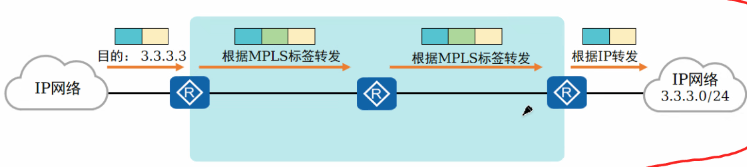

# MPLS

MPLS和MPLS VPN是两种东西

- **MPLS（多协议标签交换）**：是一种**转发机制**（技术）。它不关心你是IP流量、以太网流量还是帧中继流量，它通过给数据包打上“标签”来快速交换数据。它的核心目的是**提速**和**流量工程**。
- **MPLS VPN**：是基于 MPLS 网络基础设施提供的一种**虚拟专用网络服务**。它的核心目的是**隔离**和**私密性**，让多个不同企业的客户共享同一张物理骨干网，但彼此的路由和流量完全隔开。

MPLS VPN通过向公司的网关进行拨号，进行专线访问公司内网。

VPN专线：通过租用运营商专用的线路搭建企业VPN，就比如MPLS VPN 专线，增值服务需要付费。

MPLS VPN比传统的IPsec和Gre方式实现的VPN不同，传统方式会使用在私网IP头部再封装一层公网IP头部来实现路由互通，而MPLSVPN则是使用标签头部的方式进行封装，这个方式封装不再是IP头部，而在IP报文和二层之间再封装一层标签头部。

MPLSVPN 多协议标签转换：
	多协议：其可以承载多种网络协议，例如IPV4，IPV6等

​	标签转换：可以为IP报文增加标签信息，并且基于标签信息对报文进行转发，达到提高转发效率的目的。

路由传输方式：压入标签（Push）->交换标签(Swap)->弹出标签(Pop)

MPLS 通过标签转发表

LSR 分类：

​	入站LSR（Ingress LSR）：在报文中压入MPLS标签

​	中转LSR（Transit LSR）：交换MPLS标签

​	出站LSR（Egress LSR）：把报文中的MPLS标签弹出

- **入站LSR（Ingress LSR）：**通常是指向`IP`报文中压入`MPLS`头部并生成`MPLS`报文的`LSR`。
- **中转LSR（Transit LSR）：**通常是将`MPLS`报文进行例如标签置换操作，并将报文继续在`MPLS`域中转发的`LSR`。
- **出站LSR（Egress LSR）：**通常是将`MPLS`报文中的`MPLS`头部移除，还原为`IP`报文的`LSR`。

FEC转发等价类：

会为相同的路由分发相同的FEC，而不同的业务，如不同VPN的私网路由属于不同的FEC，这是一个分类概念。

实际上可以理解为是一个分类规则，路由分类靠这个规则来分类，分好类后就会进行分发标签。

标签这个概念是本地的，一台设备只需要维护自己的标签转发表就好。

LSP：当我确定了FEC是什么，确认要去的是哪个路由，就可以开始建立LSP，从最开始

### 1. MPLS 与 VPN（路 vs 车）

- **MPLS** 是高速公路（底层转发技术）。
- **MPLS VPN** 是高速上的隔离货柜（上层业务），靠 VRF（虚拟路由表）让不同客户的流量永不相通。

### 2. 标签三连招（Push → Swap → Pop）

- **入口（Push）**：贴上第一张标签。
- **中间（Swap）**：每跳换一张新标签（只管换，不管看）。
- **出口（Pop）**：撕掉最后一张标签，还原成 IP 包。

### 3. FEC（转发等价类）= 分类规则，不是转发表

- **FEC** 是大脑里的**“分类规矩”**（比如：去北京的归为一类）。
- **LFIB（标签转发表）** 是手上干的**“动作清单”**（比如：标签 100 换 200，从 1 口扔出去）。
- **记住**：FEC 决定“分到哪一组”，LFIB 决定“标签怎么换”。
- 要先建IGP后，有明细路由生效，符合规则，这条路由就变成了FEC（也就是按路由来分类）

### 4. LSP（标签交换路径）= 路是倒着修的（最关键）

- 路径不是从入口往出口修，而是**从出口往入口逆向分发标签**。
- 出口先发标签给中间，中间再发标签给入口。路修好了，数据包才能顺着往前跑。

### 5. 数据包的一生（终极串联）

> **控制平面（动脑子）**：出口定规矩（FEC）→ 倒着发标签（建 LSP）。
> **数据平面（跑数据）**：入口查 FEC 分类 → **Push** 标签 → 中间查 LFIB 做 **Swap** → 出口 **Pop** 标签 → 送达。

------

**一句话保命总结：**
**FEC 定分类，LSP 倒着建，标签正着换（Push-Swap-Pop），VPN 靠隔离。**

### 1. 标签结构（一张面单的“格子”）

一个 MPLS 标签是 **32 位（4 个字节）** 长，它被分成了 4 个小格子。你可以把它想象成一张**快递面单**，上面分了四个栏目：

| 字段名              | 长度      | 大白话作用                                                   |
| :------------------ | :-------- | :----------------------------------------------------------- |
| **Label（标签值）** | **20 位** | **真正的“单号”**。就是路由器用来查表转发的那个数字（比如之前例子里的 500 或 1000）。 |
| **TC（流量类别）**  | **3 位**  | **“加急/普件”标志**。以前叫 EXP，用来区分优先级（QoS），比如视频通话走加急，网页浏览走普件。 |
| **S（栈底标志）**   | **1 位**  | **“是不是最里层”**。这一位只有 0 或 1。1 代表“这是最里面的那张面单”（到底了），0 代表“外面还有面单”。 |
| **TTL（生存时间）** | **8 位**  | **“还能活几跳”**。和 IP 包里的 TTL 一样，每经过一台路由器减 1，防止数据包在网络里死循环。 |

------

### 2. 标签栈（贴了好几层“套娃”面单）

**标签栈**就是**多个标签像洋葱一样叠在一起**。

- **情况一（普通 MPLS）**：只贴 **1 层**标签。中间路由器只看这一层转发。
- **情况二（MPLS VPN）**：贴 **2 层**标签（这就是你之前问的 MPLS VPN 的核心表现）。
  - **外层标签（隧道标签）**：告诉中间路由器“下一站去哪”。（比如：把包裹从南京送到上海中转站）
  - **内层标签（VPN 标签）**：告诉出口路由器“这是哪个客户的包裹”。（比如：到了上海，查内层标签发现是华为的货，就送华为；发现是阿里的货，就送阿里）

**怎么区分这两层？** 就靠上面提到的 **S 位（栈底标志）**：

- 最外层的标签，S=0（表示下面还有一层）。
- 最里层的标签，S=1（表示这是最后一层，撕掉它就见 IP 包了）。

------

### 3. 标签空间（标签值的“数字池子”）

标签值（Label 字段的 20 位）能填的数字范围是 **0 ~ 1,048,575**（大约 100 多万个）。这个巨大的数字范围就叫**标签空间**。

为了统一管理，这些数字被分成了三段，各有各的用途：

| 标签值范围      | 官方叫法                 | 大白话用途                                                   |
| :-------------- | :----------------------- | :----------------------------------------------------------- |
| **0 ~ 15**      | **保留标签**（特殊标签） | **“专用暗号”**。不能随便分配给用户。比如 **标签 3** 代表“隐式空标签”（也就是告诉上一跳：你直接把标签弹掉吧，别给我了，这就是之前讲的 PHP 倒数第二跳弹出机制）。 |
| **16 ~ 1023**   | **静态/系统标签**        | **“手动档”**。通常留给管理员手动配置的静态 LSP，或者协议自己内部保留用。 |
| **1024 ~ 上限** | **动态标签**             | **“自动档”**。这是最大的池子，LDP（标签分发协议）或 BGP 自动给 FEC 分配标签时，**默认就从这里面随机取数字**。 |

------

### 📌 另外提一个“隐藏属性”（平台 vs 接口）

在技术文档里，你还会看到**“按平台分配”**和**“按接口分配”**：

- **按平台（最常见）**：整个路由器（一台设备）共用一个标签池。标签 1000 在整台设备上只能代表“去北京”这一个含义，不管从哪个口进来都一样。
- **按接口（少见）**：每个端口单独拥有一个标签池。同一个标签 1000，从 1 号口进来和从 2 号口进来，代表去往不同的目的地。

------

### 🔗 终极串联（把它们串进前面的故事里）

1. **入口路由器**：收到 IP 包，查 FEC 分好类，从**标签空间（动态池）**里挑一个数字，**压入（Push）** 一个**标签栈（假设外层+内层两层）**，S 位设为 0（告诉后面：还有内层）。
2. **中间路由器**：只换**外层标签**，内层不动。每跳把 TTL 减 1。
3. **倒数第二跳**：看到外层标签对面是出口，根据保留标签规则（标签 3），直接 **Pop（弹出）** 外层标签。此时栈顶只剩内层 VPN 标签，S 位变为 1。
4. **出口路由器**：看 S 位是 1，知道这是最后一张了，**Pop（弹出）** 内层标签，还原成 IP 包，发给客户。

------

现在，从 **“路（MPLS）”**、**“车（VPN）”**、**“分类（FEC）”**、**“修路（LSP）”** 到 **“面单（标签结构）”**，你已经凑齐了 MPLS 的完整拼图。

MPLS
	LSP建立时，标签是如何进行分发的，标签转发表

MPLS的体系结构

LSP的建立（控制平面）：标签分发的过程

静态LSP建立（没啥意义，可能这辈子都遇不到这种情况）：

**LDP（标签分发协议）**

- **工作机制**（它在整个网络里扮演什么角色）：
  它就是MPLS网络的**“标签快递员”**。主要负责两件事：① 给每个FEC（分类规则）分配一个具体的数字标签；② 把“这个FEC对应这个标签”的消息，主动告诉给所有邻居路由器。最终目的是让全网路由器统一口径，协同建立起LSP（标签交换路径）。

- **基本概念**（它由哪些核心零件组成）：

  - **LDP ID**（身份证）：路由器的MPLS身份标识，格式为 `Router-ID : 0`（如 `1.1.1.1:0`）。前面的IP是名字，后面的`0`代表“整台设备共用一套标签池”，记住最常见的写法就是后面跟个0。
  - **LDP会话**（电话线）：两台路由器之间用来交换标签信息的逻辑通道。基于 **TCP协议**（端口646）建立，因为要确保发标签的消息绝对不丢包。
  - **LDP消息**（说的话）：会话中传递的具体内容。主要有四种：**Hello**（打招呼发现邻居）、**Initialization**（商量参数规则）、**Keepalive**（保活，证明自己还在线）、**Label Mapping**（核心内容，即“FEC+标签”的配对信息）。
  - **LDP报文封装**（怎么打包发送）：LDP的消息内容，绝大多数（会话建立、标签传递）都被封装在**TCP报文**里发送；只有最开始的发现邻居（Hello消息）是用**UDP报文**发送的（组播形式）。

- **工作原理**（它是怎么一步步干活的）：

  - **LDP会话建立**（流程三步走）：
    1. **发现邻居**：路由器通过UDP Hello消息找到直连的MPLS邻居。
    2. **TCP握手**：双方发起三次握手，建立可靠的TCP连接（端口646）。
    3. **协商与运行**：互相发送Initialization协商参数，成功后互发Keepalive，会话正式进入运行状态。
  - **LDP邻居状态**（发现邻居时的状态变化）：
    - **Non Existent（不存在）**：还没收到对方的Hello消息。
    - **Discovered（已发现）**：收到了Hello消息，知道隔壁有邻居，但TCP连接还没建好。
  - **LDP会话状态**（TCP建立后的状态变化）：
    - **INITIALIZED（初始化）**：TCP已建好，正在交换Initialization消息协商参数。
    - **OPEN-SENT / OPEN-RECV（交换中）**：正在互发参数配置。
    - **OPERATIONAL（运行中）**：**最终目标状态**。参数协商成功，Keepalive正常，此时可以正常收发标签映射消息。
  - **LDP会话状态机**（整体宏观流转）：
    简单说就是：**不存在（没发现） -> 已发现（收到Hello） -> 初始化（TCP建链+协商） -> 运行中（Operational，正式工作）**。如果长时间收不到对方的Keepalive保活消息，状态就会自动回退到初始状态，断开会话。

  ### 📇 LDP 极简记忆卡

  | 模块                | 一句话记住它                                                 |
  | :------------------ | :----------------------------------------------------------- |
  | **身份 (LDP ID)**   | 身份证 = `Router-ID:0`（后面跟 0 就对了，代表整台设备共用标签）。 |
  | **通道 (LDP 会话)** | 电话线 = **TCP 646**（保证传标签不丢包）。                   |
  | **4 种消息**        | **Hello**（找人）、**Init**（定规矩）、**Keepalive**（报平安）、**Mapping**（给标签）。 |
  | **报文封装**        | **Hello 走 UDP**（广播喊一嗓子），**其他全走 TCP**（正儿八经谈业务）。 |

  ------

  ### 🔄 LDP 状态流转（两阶段记忆法）

  **阶段一：邻居状态（只看 Hello）**

  > **不存在**（没听见） → **已发现**（听见隔壁有人喊 MPLS）

  **阶段二：会话状态（看 TCP 和协商）**

  > **初始化**（正在谈条件、握手中） → **运行中**（谈妥了，正式互发标签）

  **整条链路最终目标**：就是为了让 **下游（出口）主动把标签往上推**，从而 **倒着建立 LSP**（路标从终点往起点发）。

LDP标签分发
	上下游

​	标签的分发和管理

​	标签发布方式
​	标签分配控制方式

​	标签保留方式

PHP机制（默认行为）：

​	在Ingress LSR --- Transit LSR ---Egress LSR 中，Egress LSR的压力最大

​	所以要应用一个机制：次末跳弹出机制（倒数第二个点提前弹出标签Label）-> PHP机制

### PHP 与空标签

**PHP（倒数第二跳弹出）**：出口路由器通知倒数第二跳，在转发前弹出顶层标签，以减轻出口的标签处理负担。

实现 PHP 使用两种特殊标签：

| 类型           | 标签值              | 倒数第二跳完成的操作            | 完成工序数 | 转发给出口的内容             |
| :------------- | :------------------ | :------------------------------ | :--------- | :--------------------------- |
| **隐式空标签** | 3                   | ① 弹出原顶层标签 ② 不压入新标签 | **2 项**   | 纯 IP 报文（无 MPLS 标签）   |
| **显式空标签** | 0（IPv4） 2（IPv6） | ① 弹出原顶层标签 ② 压入标签 0   | **1 项**   | 带 MPLS 标签（值为 0）的报文 |

### 关键差异

| 对比项                    | 隐式空标签（3）                              | 显式空标签（0）                                              |
| :------------------------ | :------------------------------------------- | :----------------------------------------------------------- |
| **倒数第二跳完成工序**    | 2 项（弹出 + 不封新标）                      | 1 项（仅弹出，必须封新标）                                   |
| **出口是否还需处理 MPLS** | 否，直接查路由表转发 IP                      | 是，需先处理标签 0                                           |
| **QoS 信息传递能力**      | **无法传递**（标签头已不存在，EXP 字段丢失） | **可以传递**（标签头仍存在，EXP 字段携带优先级信息到达出口） |

**结论**：隐式空标签优先转发性能（出口完全卸载 MPLS 处理）；显式空标签在出口仍需处理标签，但代价是可保留并传递 QoS/EXP 优先级信息至出口路由器。