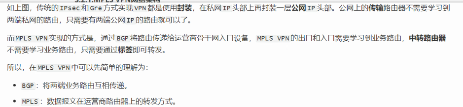

# MPLS基础配置随笔

配置

在边缘的设备，作为ingress 和egress的设备，处于MPLS和IP网络之间，只需要在MPLS连接的接口开启MPLS ldp即可

Transit设备必须要连入MPLS网络接口的全配置ldp

```
#全局命令
#配置LSR ID
[AR1]mpls lsr-id 1.1.1.1
#启用MPLS
[AR1]mpls
#全局视图 启用MPLS LDP，还需要再接口上打开
[AR1]mpls ldp

#边缘设备只在对应接入MPLS的接口开启

[AR1]int g0/0/1
	mpls ldp
	
#中间的Transit交换设备需要在所有接入MPLS的接口上配置
[AR2]int g0/0/2
	mpls ldp
[AR2]int g0/0/1
	mpls ldp
#...
#直到配置完所有接入网络的接口
```


LDP默认采用**host模式**，这意味着它**只为32位掩码的主机路由（即特定IP地址）建立LSP**。这主要是为了控制LSP的数量，节省设备资源

默认为host模式 不为非32位掩码设备服务

要想为ip客户端配置，必须要

```
mpls
#切换为ip-prefix 模式
	lsp trigger ip-prefix ldp
```


在ingress、egress、transit设备中，边缘的ingress/egress设备是最重要的


LSP（标签交换路径）的上下文中，**“Token”通常是一个设备内部使用的索引或标识符**，用于在数据平面快速定位和指导报文的转发。

你可以把它理解成一个“**快速转发指针**”。

### 它的主要作用

- **指导快速转发**：Token最主要的作用是**指导转发**。当设备收到一个带标签的MPLS报文时，它不会去复杂的三层路由表里查找，而是根据报文中的标签，快速找到对应的Token。然后，设备会直接依据这个Token所关联的转发信息（如下一跳、出标签等）进行处理，从而实现高效的标签交换。
- **设备内部标识**：Token是设备内部生成和使用的，用于在转发表（FIB）中唯一标识一条LSP。你可以通过`display mpls lsp verbose`等命令看到它。


transit设备在转发中不需要查路由表，只需要查询标签表之间转发即可

次末跳弹出机制（PHP）是在华为上默认开启的

FIB表 标签转发表

当一个LSP建立成功时，会从一个 tunnel ID的资源池（只是一个概念，可能是位图、数组）申请占用一个空闲的ID

Tunnel ID：是一个本地概念，用来建立LSP的索引，而Token是借用这个概念来给什么建索引

然后Tunnel ID分配成功后，会直接被复制为Token


CE：用户端设备，用于连接运营商的CE，用于传递和接受路由

PE：运营商设备，是运营商MPLS VPN骨干网的边缘设备，一面为不同的用户提供VPN接入的服务，另一面接入到MPLS VPN骨干网中

P：运营商设备，是运营商MPLS VPN骨干网的转发设备


CE传递路由到PE只需要和PE建立IBGP邻居即可，




拓扑：CEA — PEA — P1 — P2 — PEB — CEB
目标网络：192.168.20.0/24（CEB侧私网网段）

### 核心原则

路由与转发分离。控制平面负责“修路”，转发平面负责“跑数据”。

### 一、控制平面（修路）

CEA 通过静态路由或IGP协议，将去往 192.168.20.0/24 的路由通告给直连的 PEA。

PEA 与 PEB 之间运行 MP-BGP。PEB 将 192.168.20.0/24 导入对应的 VRF 实例，为该路由分配一个内层 VPN 标签（如 1024），然后通过 MP-BGP 将路由和标签一起发给 PEA。P1 和 P2 不参与私网路由的学习，对 192.168.20.0/24 一无所知。

PEA 收到后在 VRF 路由表中记录：目的 192.168.20.0/24 → 下一跳 PEB → VPN 标签 1024。

PEB 还需将 192.168.20.0/24 下发给 CEB，让 CEB 知道如何到达本地网络。

### 二、转发平面（跑数据）

CEA 发送目的 IP 为 192.168.20.1 的纯 IP 报文给 PEA。

PEA 查 VRF 路由表，发现下一跳是 PEB，于是压入两层标签：先压入内层 VPN 标签 1024（由 PEB 分配，用于标识 VRF），再压入外层公网标签（由 LDP 分发，用于公网逐跳转发）。封装后的报文为 [外层标签] [内层标签1024] [IP报文]，然后转发给 P1。

P1 收到报文后只看最外层标签，执行标签交换（Swap），将外层入标签换成新的外层出标签。内层标签 1024 和原始 IP 报文不动，转发给 P2。

P2 执行相同操作，再次交换外层标签后转发给 PEB。整个公网传输过程中，内层 VPN 标签 1024 和原始 IP 报文始终保持不变。

由于倒数第二跳弹出机制（PHP），P2 在转发前会弹出外层标签，所以 PEB 实际收到的是 [内层标签1024] [IP报文]。

PEB 根据内层标签 1024 唯一确定对应的 VRF 实例，弹出内层标签，还原为纯 IP 报文。然后查 VRF 路由表，将 IP 报文从连接 CEB 的接口转发出去。

CEB 收到纯 IP 报文后，最终送达目的主机 192.168.20.1。

### 三、路径简写

控制平面：
CEA → PEA（普通路由通告）
PEA → PEB（MP-BGP分发私网路由 + VPN标签1024）
PEB → CEB（普通路由下发）

转发平面：
CEA → PEA（纯IP包）
PEA → P1（压入双层标签）
P1 → P2（交换外层标签，内层不动）
P2 → PEB（交换外层标签，内层不动）
PEB → CEB（弹出内层VPN标签，还原纯IP包）

### 四、关键点

私网路由只通过 MP-BGP 在 PE 之间传递，P1 和 P2 完全不学习私网路由，这是 VPN 隔离的基础。

P1 和 P2 转发时只看外层公网标签，每跳只做标签交换（Swap），不看内层标签也不看私网 IP。这种机械式转发是 MPLS 高效的根源。

外层标签逐跳改变，内层 VPN 标签和原始 IP 报文在整个公网传输过程中始终不变。

PHP（倒数第二跳弹出）由 P2 执行，弹出外层标签后只将内层标签和 IP 报文给 PEB，减轻 PEB 负担。

内层 VPN 标签只在 PEB 上被终结，用于唯一确定报文属于哪个 VRF，实现 VPN 隔离。

核心思想是路由与转发分离：控制面在 PE 之间交换私网路由，转发面在 P 路由器上只换外层标签。


## Overlay 与 Underlay

一句话概括：**Underlay 是物理网络（修路），Overlay 是逻辑网络（在路上的专属隧道）。**

### Underlay（底层网络）

物理设备和链路 + 底层路由协议（OSPF/IS-IS/LDP）。

任务是保证公网 IP 可达，让 PEB 的环回口地址能 ping 通。

P1/P2 只在这层工作，机械地交换外层标签，不知道私网路由。

### Overlay（叠加网络）

在物理网络之上构建的逻辑网络，通过封装技术（MPLS/VXLAN/GRE）实现。

任务是承载私网数据和隔离不同客户。

PEA 和 PEB 之间通过 MP-BGP 交换私网路由，就属于这层。

### 关系

Overlay 依赖 Underlay，但 Underlay 对 Overlay 完全不知情。

### 打比方

Underlay = 高速公路 + 货车司机（只按转运码送货，不看箱子里是什么）
Overlay = 箱子里的快递 + 收发件人（只管私网路由，不管车怎么开）

### 对应 MPLS VPN

| 层级         | 对应内容                                   |
| :----------- | :----------------------------------------- |
| **Underlay** | P1/P2 逐跳交换外层标签，把报文送到 PEB     |
| **Overlay**  | PEA/PEB 通过 MP-BGP 交换私网路由 + VPN标签 |

路由与转发分离，本质上就是 Overlay 和 Underlay 的分离。

### 如果两个公司的CE接到同一个PE上，两家公司的私有网络IP网段是相同怎么解决？

##### 首先解决本地路由冲突的问题：使用不同的路由表来处理

VRF （VPN-Instance） 

虚拟路由转发，又称为VPN示例（VPN-Instance）

对于一台路由器，会有一个默认的VRF叫Public（就是默认的dis ip routing查询的那张）

怎么手动设置使用呢？

1.可以创建一个新的VRF

```
<Huawei> system-view
[Huawei] ip vpn-instance CompanyA
[Huawei-vpn-instance-CompanyA] ipv4-family
[Huawei-vpn-instance-CompanyA-af-ipv4] route-distinguisher 100:1
[Huawei-vpn-instance-CompanyA-af-ipv4] vpn-target 100:1 both
[Huawei-vpn-instance-CompanyA-af-ipv4] quit
[Huawei-vpn-instance-CompanyA] quit
```

2.然后把到用户CE连接的接口上绑定VRF

```
[Huawei] interface GigabitEthernet0/0/1
[Huawei-GigabitEthernet0/0/1] ip binding vpn-instance CompanyA
[Huawei-GigabitEthernet0/0/1] ip address 10.1.1.1 255.255.255.0
[Huawei-GigabitEthernet0/0/1] quit
```

3.在创建对应IGP，例如OSPF中，也要将OSPF进程绑定到这个VRF

```
[Huawei] ospf 100 vpn-instance CompanyA
[Huawei-ospf-100] area 0.0.0.0
[Huawei-ospf-100-area-0.0.0.0] network 10.1.1.0 0.0.0.255
[Huawei-ospf-100-area-0.0.0.0] quit
[Huawei-ospf-100] quit
```

验证命令：

```
display ip routing-table vpn-instance CompanyA
```

##### 其次使用RD对IPv4进行扩展，把IPv4路由转换为VPNv4路由，实现私网路由在骨干网上的唯一性

VPNv4路由 = RD + IPv4前缀（如 `100:1:192.168.1.0/24`）

RD的配置要求：在同一台PE上，每个VRF必须配置不同的RD，本地RD唯一。

在MP-BGP全局域内，RD + IPv4前缀必须唯一。如果RD相同但IPv4前缀不同（如 `100:1:192.168.1.0/24` 与 `100:1:10.1.1.0/24`），BGP可以区分。但如果RD相同且IPv4前缀也相同，两条路由在MP-BGP中就是完全相同的VPNv4路由，无法区分，引发冲突。

因此规范做法是：在整个MP-BGP域内为每个VRF分配全局唯一的RD（如使用AS号+编号格式），从根源上避免冲突。

##### 最后使用RT控制VPNv4路由的导入导出

RT用于解决"这条VPNv4路由到达对端PE后，该导入哪个VRF"的问题。RT分为Export Target（出方向）和Import Target（入方向）。本端PE发布路由时携带Export Target，对端PE收到后匹配本地VRF的Import Target，匹配成功则导入对应VRF，匹配失败则丢弃。

RT不解决VPNv4路由的冲突问题。如果两条VPNv4路由完全相同（RD和IP都一样），它们本就是同一条路由，RT无法区分。VPNv4路由的唯一性必须由RD保证，RT只负责分发方向控制。


### PE1 配置

```text
system-view

# VPNX
ip vpn-instance VPNX
 ipv4-family
  route-distinguisher 100:1
  vpn-target 100:10 export-extcommunity
  vpn-target 100:20 import-extcommunity

# VPNY
ip vpn-instance VPNY
 ipv4-family
  route-distinguisher 100:2
  vpn-target 100:30 export-extcommunity
  vpn-target 100:40 import-extcommunity

# 将接口绑定到 VPNX（连接 CE1）
interface GigabitEthernet0/0/1
 ip binding vpn-instance VPNX
 ip address 192.168.1.1 255.255.255.0

# 将接口绑定到 VPNY（连接 CE3）
interface GigabitEthernet0/0/2
 ip binding vpn-instance VPNY
 ip address 172.16.1.1 255.255.255.0
```

---

### PE2 配置

```text
system-view

# VPNX
ip vpn-instance VPNX
 ipv4-family
  route-distinguisher 100:3
  vpn-target 100:10 import-extcommunity
  vpn-target 100:20 export-extcommunity

# VPNY
ip vpn-instance VPNY
 ipv4-family
  route-distinguisher 100:4
  vpn-target 100:30 import-extcommunity
  vpn-target 100:40 export-extcommunity

# 将接口绑定到 VPNX（连接 CE2）
interface GigabitEthernet0/0/1
 ip binding vpn-instance VPNX
 ip address 192.168.1.1 255.255.255.0

# 将接口绑定到 VPNY（连接 CE4）
interface GigabitEthernet0/0/2
 ip binding vpn-instance VPNY
 ip address 172.16.1.1 255.255.255.0
```

---

### 配置汇总表

| 设备    | VPN实例 | RD    | Export RT | Import RT |
| :------ | :------ | :---- | :-------- | :-------- |
| **PE1** | VPNX    | 100:1 | 100:10    | 100:20    |
| **PE1** | VPNY    | 100:2 | 100:30    | 100:40    |
| **PE2** | VPNX    | 100:3 | 100:20    | 100:10    |
| **PE2** | VPNY    | 100:4 | 100:40    | 100:30    |

---

### 路由传递路径说明

- **VPNX**：PE1 发布路由时携带 Export RT `100:10`，PE2 的 Import RT `100:10` 匹配成功，导入 VPNX。PE2 发布路由时携带 Export RT `100:20`，PE1 的 Import RT `100:20` 匹配成功，导入 VPNX。
- **VPNY**：PE1 发布路由时携带 Export RT `100:30`，PE2 的 Import RT `100:30` 匹配成功，导入 VPNY。PE2 发布路由时携带 Export RT `100:40`，PE1 的 Import RT `100:40` 匹配成功，导入 VPNY。
- **隔离保证**：VPNX 使用 100:10/100:20，VPNY 使用 100:30/100:40，两组 RT 值不同，路由不会互相泄露。


## MPLS VPN的建立大纲

### 核心原则：先公网，后私网

公网是“路”，私网是“车”。路没修好，车没法跑。

### 第一步：打通公网底层（所有设备）

**目标**：让公网设备之间 IP 可达，MPLS 转发通道建立。

- 配置接口 IP（含环回口作为 LSR-ID）
- 运行 IGP（OSPF/IS-IS），确保环回口互通
- 全局使能 MPLS 和 LDP
- 在公网接口下使能 MPLS 和 LDP

**产出**：LDP 邻居建立，LSP 隧道形成。

### 第二步：创建 VPN 实例（仅在 PE 上）

**目标**：为每个客户创建独立的路由表（VRF），实现隔离。

- 创建 VRF，配置 RD（全局唯一，区分相同 IP）
- 配置 RT（控制路由的导入导出方向）
- 将连接 CE 的接口绑定到对应的 VRF
- 配置接口 IP（属于私网地址）

**产出**：每个 VPN 拥有独立的路由表，接口绑定到对应 VRF。

### 第三步：建立 MP-BGP 邻居（PE 之间）

**目标**：在 PE 之间建立 VPNv4 路由交换通道。

- 在 PE 之间建立 IBGP 邻居（使用环回口建立）
- 使能 VPNv4 地址族

**产出**：PE 之间可以交换私网路由。

### 第四步：私网路由引入 BGP（PE 上）

**目标**：让 PE 把从 CE 学到的私网路由，通过 BGP 通告给对端 PE。

- 在 PE 上，将私网路由（OSPF/静态/直连）引入对应 VPN 实例的 BGP 中

**产出**：私网路由被打上 RD 和 RT，变成 VPNv4 路由，通过 MP-BGP 传递给对端 PE。

### 第五步：对端 PE 接收并下发

**目标**：对端 PE 收到 VPNv4 路由后，根据 RT 导入正确的 VRF，再下发给 CE。

- 路由匹配 RT → 导入对应 VRF → 通过私网 IGP/静态路由下发给 CE

**产出**：两端私网路由互通，CE 之间可以通信。

### 一句话流程

> **公网打通 → VRF 隔离 → BGP 建邻居 → 私网路由引入 → 对端导入下发**

### 配置逻辑图

text

```
公网底层（OSPF + LDP）
        ↓
   PE 创建 VRF
   （RD + RT）
        ↓
  MP-BGP 邻居建立
 （VPNv4 地址族）
        ↓
  私网路由引入 BGP
   （变成 VPNv4）
        ↓
  对端导入对应 VRF
        ↓
     下发给 CE
```

## MPLS L3VPN 详细配置步骤

拓扑：CE1 — PE1 — P1 — PE2 — CE2

VPN实例：VPNX、VPNY


### 第一阶段：公网底层配置（所有设备：PE1、P1、PE2）

#### 步骤1：配置设备名称

```text
system-view
sysname PE1
```

#### 步骤2：配置环回口和互联接口IP

```text
# 环回口（用于LSR-ID和BGP邻居）
interface LoopBack1
 ip address 1.1.1.1 255.255.255.255
 quit

# 公网互联接口
interface GigabitEthernet0/0/0
 ip address 10.0.12.1 255.255.255.0
 quit
```

#### 步骤3：配置OSPF，保证环回口互通

```text
ospf 1
 area 0.0.0.0
  network 1.1.1.1 0.0.0.0
  network 10.0.12.0 0.0.0.255
 quit
```

#### 步骤4：全局使能MPLS和LDP

```text
mpls lsr-id 1.1.1.1
mpls
 mpls ldp
 quit
```

#### 步骤5：在公网接口上使能MPLS和LDP

```text
interface GigabitEthernet0/0/0
 mpls
 mpls ldp
 quit
```

#### 步骤6：验证公网底层

```text
display ip routing-table
display mpls ldp session
display mpls lsp
```


### 第二阶段：创建VPN实例（仅PE设备）

#### 步骤7：在PE上创建VRF

**PE1配置：**

```text
# VPNX
ip vpn-instance VPNX
 ipv4-family
  route-distinguisher 100:1
  vpn-target 100:10 export-extcommunity
  vpn-target 100:20 import-extcommunity
 quit
 quit

# VPNY
ip vpn-instance VPNY
 ipv4-family
  route-distinguisher 100:2
  vpn-target 100:30 export-extcommunity
  vpn-target 100:40 import-extcommunity
 quit
 quit
```

**PE2配置：**

```text
# VPNX
ip vpn-instance VPNX
 ipv4-family
  route-distinguisher 100:3
  vpn-target 100:10 import-extcommunity
  vpn-target 100:20 export-extcommunity
 quit
 quit

# VPNY
ip vpn-instance VPNY
 ipv4-family
  route-distinguisher 100:4
  vpn-target 100:30 import-extcommunity
  vpn-target 100:40 export-extcommunity
 quit
 quit
```

#### 步骤8：将接口绑定到VRF

```text
interface GigabitEthernet0/0/1
 ip binding vpn-instance VPNX
 ip address 192.168.1.1 255.255.255.0
 quit

interface GigabitEthernet0/0/2
 ip binding vpn-instance VPNY
 ip address 172.16.1.1 255.255.255.0
 quit
```

> 注意：执行 `ip binding vpn-instance` 会清除接口原有IP，需重新配置。

#### 步骤9：配置私网IGP（OSPF绑定到VRF）

```text
ospf 100 vpn-instance VPNX
 area 0.0.0.0
  network 192.168.1.0 0.0.0.255
 quit

ospf 200 vpn-instance VPNY
 area 0.0.0.0
  network 172.16.1.0 0.0.0.255
 quit
```


### 第三阶段：配置MP-BGP邻居（PE之间）

#### 步骤10：建立IBGP邻居，使能VPNv4地址族

**PE1配置：**

```text
bgp 100
 router-id 1.1.1.1
 peer 3.3.3.3 as-number 100
 peer 3.3.3.3 connect-interface LoopBack1

 ipv4-family vpnv4
  peer 3.3.3.3 enable
 quit
```

**PE2配置：**

```text
bgp 100
 router-id 3.3.3.3
 peer 1.1.1.1 as-number 100
 peer 1.1.1.1 connect-interface LoopBack1

 ipv4-family vpnv4
  peer 1.1.1.1 enable
 quit
```


### 第四阶段：私网路由引入BGP

#### 步骤11：在BGP中引入私网路由

**PE1配置：**

```text
bgp 100
 ipv4-family vpn-instance VPNX
  import-route ospf 100
  quit
 ipv4-family vpn-instance VPNY
  import-route ospf 200
  quit
```

**PE2配置：**

```text
bgp 100
 ipv4-family vpn-instance VPNX
  import-route ospf 100
  quit
 ipv4-family vpn-instance VPNY
  import-route ospf 200
  quit
```


### 第五阶段：验证配置

#### 步骤12：查看BGP邻居状态

```text
display bgp peer
```

#### 步骤13：查看VPNv4路由

```text
display bgp vpnv4 all routing-table
```

#### 步骤14：查看VPN实例路由表

```text
display ip routing-table vpn-instance VPNX
display ip routing-table vpn-instance VPNY
```

#### 步骤15：测试连通性

```text
ping -vpn-instance VPNX 192.168.2.1
ping -vpn-instance VPNY 172.16.2.1
```


### 配置汇总表

| 阶段     | 步骤  | 核心命令                                                     |
| :------- | :---- | :----------------------------------------------------------- |
| 公网底层 | 1-6   | `mpls lsr-id`、`mpls ldp`、`ospf`、`mpls`、`mpls ldp`        |
| VPN实例  | 7-9   | `ip vpn-instance`、`route-distinguisher`、`vpn-target`、`ip binding vpn-instance`、`ospf vpn-instance` |
| BGP邻居  | 10    | `bgp`、`peer`、`ipv4-family vpnv4`                           |
| 引入路由 | 11    | `import-route ospf`                                          |
| 验证     | 12-15 | `display bgp vpnv4`、`display ip routing-table vpn-instance`、`ping -vpn-instance` |


### 关键注意事项

- 公网底层（OSPF + LDP）必须提前打通，否则BGP邻居无法建立
- RD在同一台PE上必须唯一，不同PE可以相同（但建议全局唯一）
- RT控制路由导入导出：Export发布时携带，Import接收时匹配
- `ip binding vpn-instance` 会清除接口原有IP配置
- VPNX和VPNY使用不同RT，路由互不泄露