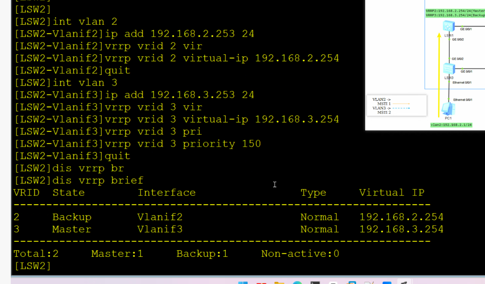

# DAY16 MSTP

如果想做更复杂的stp结构，如不同vlan采用不同的stp选路，不同的stp树

这时候stp和rstp都做不到，因为其是根据物理接口生成的stp树且只有一个

MSTP引入了新的概念Instance实例，可以为不同的vlan创建不同的实例

默认会有一个默认的实例0，所有的vlan默认都属于实例0（机制参考vlan 1）

MSTP Region（MST域）

可以把交换机划分到不同的MST域中，避免设备变动时影响到其他区域的设备，防止整个网络出现震荡。

每个域内都默认存在一个实例0，实例0在域内计算出的生成树称为IST（内部生成树）。
域内还可以创建多个MSTI（多生成树实例），每个实例关联不同的VLAN，实现流量负载分担。

域与域之间通过实例0的IST进行互联，最终在所有域之间形成一棵CST（公共生成树），
用来解决域间的环路问题。

**总结：**

1. `MST`域将全网划分成多个独立的计算域。例如，`instnace1`在`Region A`和`Regin B`中是完全独立的两棵树，互不干扰。
2. 不同`MST Region`中的`instance`映射关系也可以不一致。
3. 方便管理员设计和管理，也降低了网络故障的风险和复杂度。

**同一个MST域的设备具有以下特点：**

1. 都启动了`MSTP`
2. 具有相同的域名
3. 具有相同的`VLAN`到生成树实例映射配置
4. 具有相同的`MSTP`修订级别配置


MSTI：

CST：

IST：

CIST：

SST：

注：实例0很重要


域内设备角色：

**总根（CIST Root）：**是`CIST`的根桥，整个MSTP所有域的总根桥。

**域根（Regional Root）：**分别为`IST`域根和`MSTI`域根。

- `IST`域根，在`MST`域中`IST Instance0`生成树中距离总根最近（比桥ID）的交换设备是`IST`域根，如图中`SW2、SW3、SW4`。代表整个域与总根通信，决定域间路径。
- `MSTI`域根是每个多生成树实例的树根。也就是除了`Instance 0`外的其他实例的根桥，负责实例内部的路径选择

**主桥（Master Bridge）：**`IST Master`是域内距离总根最近的交换设备。如果总根在`MST`域中，则总根为该域的主桥。

`IST`域根 == 主桥


端口角色：

与RSTP一致


MSTP报文：

- Protocol Version Identifier：1 Byte，协议版本标识符，STP为0，RSTP为2，MSTP为3。

- BPDU Type：1 Byte，BPDU类型：

​	

MSTP的域配置内容，同一个域内的设备必须一模一样

```
stp region-region-configration
	region-name test
    revision-level 100
    instance 1 vlan 2
    instance 1 vlan 3
    active region-configration

#主根
stp instance 1 root primary
stp instance 2 root secondary
stp instance 0 root primary
#备份根
stp instance 2 root primary
stp instance 1 root secondary
stp instance 0 root primary
```

