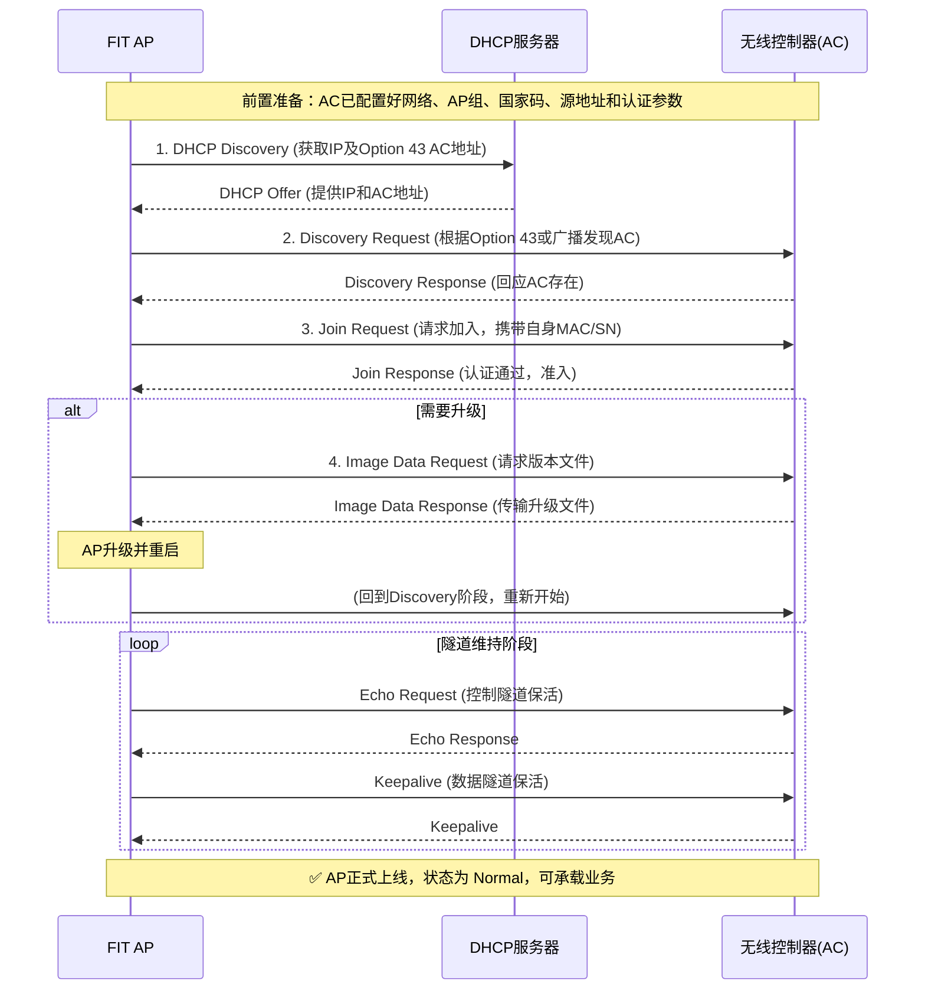

# DAY17 WLAN基础

WLAN 即WireLess LAN（无线局域网）

WLAN 广义上是之以无线电波、激光、红外线等无线信号来代替有线局域网中的部分或全部介质所构成的网络

无线不仅仅是 Wi-Fi,还有红外、蓝牙、ZigBee等。


WiFi在大多数场景下基本等同于802.11

IEEE 802.11第一个版本发表于1997年

wifi1-6速率越来越高

无线接入点（AccessPoint）一般支持以下三种：

FAT AP 自身可以进行管理，自身就可以完成接入到网络中

FIT AP 瘦AP，一般配合AC使用 统一管理，功能更丰富，需要接入到AC，AC接入到网络才可以使用

云管理：通过互联网连接到云端管理平台


家庭Wifi路由器更类似胖AP


AC+FIT AP架构是很常见的架构


### CAPWAP

CAPWAP 无线接入点控制和配置协议

AC和AP之间需要使用该协议建立CAPWAP隧道，基于UDP，可以下发配置

1.建立CAPWAP隧道需要先上线

2.推送配置

CAPWAP分两种流量：

业务数据流量：封装转发无线数据帧。通过CAPWAP隧道转发，使用UDP 5247

配置流量：下发配置的流量，使用5279


WLAN网络的转发方式

本地转发：

从用户端开始，用户数据由AP直接转发至上层网络，**不经过AC**

隧道转发方式（CAPWAP）：

在一开始该隧道只有管理流量，把管理流量封装进隧道，直接和AC进行隧道通信，但需要业务数据流量转发时，也会将其封装进隧道，使用管理的隧道进行转发业务数据（中间的设备在隧道上会直接把流量进行透明转发）

### WLAN隧道模式

**一句话**：用户所有上网数据都经过AC中转，AP只做“快递员”，AC才是“分拣中心”。

**数据流向**：

- 上行：用户 → AP → AC → 交换机 → 互联网
- 下行：互联网 → 交换机 → AC → AP → 用户

**核心机制**：AP把用户数据包整个装进CAPWAP“隧道”里发给AC，AC拆包后再转发出去。交换机在这个过程中只是透传，不处理用户数据内容。

**优缺点**：优点是安全、好管理，所有流量都经过AC，方便统一做审计和控制；缺点是AC压力大，可能成为瓶颈，时延也比本地转发略高。

**适用场景**：对安全性要求高的场合，比如企业办公网、公共Wi-Fi需要上网审计等。

**配置时注意**：AC和AP之间要三层互通，且UDP 5246、5247端口要放行，否则隧道建不起来。

可以避免建立过多的业务VLAN，只需要有管理VLAN就可以解决传输问题

在封装上，若管理vlan为100，业务为101，会先封装101，再封装100，类似VPN的标签封装


接入AP和交换机连接的接口配置：

隧道模式：	

```
#SW1
port link access
port def vlan 100

等价于

port link trunk
port trunk all vlan 100
port trunk pvid vlan 100 
```

本地转发模式：

```
#SW1
port link trunk
port trunk all vlan 100 101 102
port trunk pvid vlan 100
```

注：AP不会为业务数据配置管理vlan的vlan标签，需要配置pvid为无标签数据打上标签，管理流量实际上vlan是交给交换机自动补充的

- AP发送的管理报文（如DHCP请求、CAPWAP隧道包）本身是**不带VLAN标签**的。
- 交换机端口收到无标签报文时，会打上PVID（即VLAN 100）的标签，从而进入VLAN 100。
- 用户数据在隧道模式下被封装在CAPWAP隧道里，隧道包本身也是无标签的，同样被打上VLAN 100。


### AP-AC组网方式

二层组网

AP和AC直接的网络为直连或二层网络

在二层上AC通过广播报文发现AP

三层组网

AP和AC之间的网络为三层网络

在实际组网种一台AC可以连接数百台AP，大型组网一般采用三层组网

在三层上需要通过DHCP或DNS动态发现，或配置静态IP发现（单播发现）


AC连接方式

直连组网

旁挂式组网，把AC旁挂在AP与上行网络的直连网络当中，不再直接连接AP

一般情况下都是使用AP的旁挂式组网，因为直连方式下，业务数据的转发还是交给AC，性能负载太重，使用旁挂式可以交给组网来承载大部分的性能负载。

**直连组网**：AC串在AP和网络之间，适合小型或设备老旧场景，拓扑简单但AC故障会断网。
**旁挂组网**：AC挂在核心交换机旁，是大中型网络标准做法，AC故障不影响已有用户，扩容灵活、可靠性高。


无线信号波：

2.4GHz频段：

2.4 - 2.4835 GHz（总带宽 **83.5 MHz**）

频段窄、干扰大（蓝牙、微波炉、USB 3.0都挤在这），但穿墙能力强、覆盖距离远。

5GHz

5.15 - 5.85 GHz（各国略有差异，总可用带宽约 **900 MHz**）

频段宽、干扰小、速率快，但穿墙能力弱于2.4GHz，覆盖范围相对小。


### BSS/SSID/BSSID

#### BSS 基本服务集（Basic Service Set）

一个AP所覆盖的范围。

#### 基本服务集标识符BSSID(BSS identifier)

无线网络的身份标识，用AP的MAC地址标识。

#### 服务集标识符SSID（重点关注，我们配置关心的配置）

是无线网络的一个身份标识，用字符串表示。为了便于用户辨识不同的无线网络，用`SSID`代替`BSSID`。


### VAP

早期AP只支持一个BSS，要支持多个BSS，就要安装多个AP

现在的AP可以创建出多个虚拟AP（Virtual Acess Point，VAP）

VAP简化了WLAN的配置，只是一个隔离机制，可以看作一个无线VLAN

现在都需要做VAP，一个SSID也要配置


### ESS

用户从一个BSS移动到另一个BSS时，不能感知SSID的变化，就可以使用扩展服务集ESS来实现

由多个使用相同SSID的BSS组成，是采用相同SSID的多个BSS组成的更大规模的虚拟BSS


WLAN漫游：指STA在同一个ESS中从一个AP到另一个AP之间移动并保证业务不中断。


WLAN的工作原理

上线模式：

​	mac

​	ESN

​	none 什么也没有

### FIT AP上线完整流程

#### 前置准备：AC必须提前配置好的内容（基础条件）

在AP尝试上线之前，AC端必须完成以下关键配置，否则AP无法找到AC或通过认证：

1.  **配置网络互通（核心）**
    - 配置DHCP服务器（为AP和STA分配IP地址，通常也作为AP发现AC的手段）。
    - 确保AP到DHCP服务器和AC之间的网络路由可达。

2.  **创建AP组**
    - 每个AP必须加入且只能加入一个AP组，用于批量管理通用配置。

3.  **配置AC的国家码（域管理模板）**
    - 国家码决定射频特性（如信道、功率），必须正确设置以符合当地法规。

4.  **配置源接口/源地址（隧道终点）**
    - 为AC指定一个唯一的IP地址或接口，供AP发现并建立CAPWAP隧道。

5.  **配置AP上线自动升级（可选）**
    - 提前设置好AP版本检查与升级策略，确保AP上线时能自动匹配AC的版本。

6.  **添加AP设备（配置认证方式）**
    - 在AC上录入AP的信息（MAC/SN），并配置好认证模式（MAC、SN或None）。

---

#### 正式上线流程（五步走）

当AC端的“地基”打牢后，AP上电后开始执行以下自动流程：

---

##### 步骤一：AP获取IP地址
- **作用**：让AP获得网络身份，具备通信基础。
- **方式**：
    - **静态配置**：手工指定IP。
    - **DHCP方式（主流）**：从DHCP服务器自动获取IP。同时，DHCP服务器可通过**Option 43字段**告知AP：AC的IP地址在哪里。

---

##### 步骤二：AP发现AC并建立CAPWAP隧道
- **1. 发现AC（Discovery阶段）**：
    - **静态发现**：AP上预配的AC IP列表。
    - **动态发现**：通过DHCP Option 43、DNS域名或二层广播来寻找AC。
- **2. 建立CAPWAP隧道**：
    - **目的**：建立安全的双向通信通道。
    - **组成**：
        - **控制隧道**：传输管理控制报文（配置下发、状态查询）。
        - **数据隧道**：传输用户业务数据报文（集中转发模式）。

---

##### 步骤三：AP接入控制（认证）
- **目的**：AC校验AP的合法性，防止非法AP接入。
- **交互**：AP发`Join Request`，AC回复`Join Response`。
- **认证方式**：
    - **MAC认证**（最常用）：基于AP的物理MAC地址。
    - **SN（序列号）认证**（更安全）：基于设备唯一的ESN序列号。
    - **None（不认证）**（最不安全）：仅限测试环境。
- **添加方式**：
    - **离线导入**：提前录入MAC/SN，上线自动匹配。
    - **自动发现**：配置为不认证或加入白名单，AP自动上线。
    - **手工确认**：未授权AP进入“未认证列表”，需管理员手工批准。

---

##### 步骤四：AP版本升级（可选）
- **触发条件**：AP当前软件版本与AC的要求不一致。
- **升级场景**：
    - **自动升级**：上线过程中自动检查并升级。
    - **在线/定时升级**：在已上线并承载业务时，指定低峰时段升级。
- **文件来源**：
    - **AC模式**：从AC本地下载（适合AP少）。
    - **FTP模式**：从FTP服务器下载（明文，安全性低）。
    - **SFTP模式**：从SFTP服务器下载（加密，安全性高）。
- **结果**：升级完成后AP重启，重复步骤一至三，直至版本匹配。

---

##### 步骤五：CAPWAP隧道维持（最终状态）
- **目的**：确保持续、稳定的连接，即使网络有短暂波动也能恢复。
- **维持机制（双隧道保活）**：
    - **数据隧道维持**：AP与AC之间通过周期性交互**Keepalive报文**，来检测数据隧道的连通状态。
    - **控制隧道维持**：AP与AC通过周期性交互**Echo报文**，来检测控制隧道的连通状态。
- **作用**：一旦Keepalive或Echo超时未收到响应，双方会认为隧道中断，并尝试重新建立连接，从而实现网络的自愈。

---

### 全流程交互时序图




方便配置和维护WLAN，针对不同的功能和特性设计了各种类型的模板，统称为WLAN模板

域管理模板：

射频模板：

VAP模板：

其他模板：

射频参数配置：

### WLAN模板体系

AC通过“套模板”的方式管理AP，就像给AP发一套完整的配置套餐。

------

#### 核心三件套（必须配）

**第一个是域管理模板**
它的作用就一件事：告诉AP你在中国干活，信道和功率按中国的法规来。没了这个，AP可能发射违规信号。

**第二个是射频模板**
它管的是AP的“天线”怎么工作，比如用哪个信道、发射功率多大、频宽用20兆还是40兆。相当于调整AP的信号参数。

**第三个是VAP模板**
它决定了用户搜到的WiFi长什么样。这个模板最核心，因为它里面还要套两个子模板：一个叫SSID模板，管WiFi叫什么名字（比如“公司WiFi”）；另一个叫安全模板，管密码和加密方式（比如WPA2）。用户能搜到信号、输密码上网，全靠这个模板。

------

#### 其他模板（按需选用）

除了上面三个必配的，还有几个特殊用途的模板：

- AP系统模板：管AP自己的系统设置，比如日志存在哪里、管理VLAN是多少。
- WIDS模板：用来防非法AP蹭网，属于安全增强功能。
- 定位模板：做室内定位时用。
- Mesh模板：做Mesh组网时用。

这些不是必配，有需求才配。

------

#### 直接配置（不带模板，优先级最高）

还有一种方式不经过模板，直接在AP上手工指定信道和功率。这种配置的优先级比模板高，适合对个别AP做精细调整，比如某个AP附近干扰大，需要单独降功率。

------

### 一句话说清楚

域管理模板管合规，射频模板管信号质量，VAP模板管WiFi名和密码。把这三个模板绑到AP组上，AP上线就自动按这套配置干活。其他模板和直接配置都是附加项，大部分场景配好这三个就足够了。


### 重点关注VAP模板：

创建SSID模板：SSID用来指定不同的无线网络，STA看到的网络名称就是SSID

创建安全模板：配置WLAN安全策略，可以对无线终端（STA）进行身份验证，对用户的报文进行加密，保护WLAN网络和用户的安全。

配置数据转发方式：配置数据报文的转发模式。

配置业务VLAN：VAP下发给AP的二层业务数据报文中都会带有业务VLAN的VLAN ID。


实验

华为WLAN精简配置（VLAN100/101/102）

## 一、规划说明（精简版）

**VLAN分配**：VLAN100（AP接入管理）、VLAN101（无线业务）、VLAN102（LSW1与AR1互联）

**核心IP**：LSW1 Vlanif101（10.23.101.1/24）、LSW1 Vlanif102（11.1.1.1/30）、AC1 Vlanif100（10.24.100.1/24）、AR1 GE0/0/0（11.1.1.2/30）、AR1 LoopBack0（100.100.100.100/32）

**互联逻辑**：LSW1 GE0/0/1/2接AP（Access 100）、GE0/0/3接AC1（Trunk 100/101）、GE0/0/4接AR1（Access 102）；AP手动注册入group1，集中转发模式。

## 二、精简配置（可直接复制）

### 1. LSW1 三层交换机

```bash
system-view
sysname LSW1
vlan batch 100 101 102
# 二层接口配置
int g0/0/1
 port link-type access
 port default vlan 100
quit
int g0/0/2
 port link-type access
 port default vlan 100
quit
int g0/0/3
 port link-type trunk
 port trunk allow-pass vlan 100 101
quit
# 三层接口与路由
int Vlanif101
 ip add 10.23.101.1 24
quit
int Vlanif102
 ip add 11.1.1.1 30
quit
int g0/0/4
 port link-type access
 port default vlan 102
quit
ip route-static 0.0.0.0 0 11.1.1.2
# DHCP配置
dhcp enable
int Vlanif101
 dhcp select interface
quit
# 查看MAC地址（验证用）
dis mac-address
```

### 2. AC1 无线控制器

```bash
system-view
sysname AC1
vlan batch 100 101
int g0/0/1
 port link-type trunk
 port trunk allow-pass vlan 100 101
quit
# DHCP配置
dhcp enable
int Vlanif100
 ip add 10.24.100.1 24
 dhcp select interface
quit
# CAPWAP源接口
capwap source interface Vlanif100
# AP组与区域配置
wlan
 ap-group name group1
 quit
 regulatory-domain-profile name group1
 country-code cn
 quit
 ap-group name group1
 regulatory-domain-profile group1
 y
 quit
# 开启AP自动注册，无需手动录入MAC
 ap authentication mode auto
# 自动上线的AP默认划入group1
 ap auto-group group1
# 无线业务配置
 security-profile name group1
 security wpa-wpa2 psk pass-phrase Huawei@123 aes
 quit
 ssid-profile name group1
 ssid wlan-test
 quit
 vap-profile name group1
 forward-mode tunnel
 service-vlan vlan-id 101
 security-profile group1
 ssid-profile group1
 quit
 ap-group name group1
 vap-profile group1 wlan 1 radio 0
 vap-profile group1 wlan 1 radio 1
 quit
# 验证命令
display ap all
display vap ssid wlan-test
```

### 3. AR1 出口路由器

```bash
system-view
sysname AR1
int g0/0/0
 ip add 11.1.1.2 30
quit
undo info-center enable
ip route-static 0.0.0.0 0 11.1.1.1
int LoopBack0
 ip add 100.100.100.100 32
quit
# 连通性测试（可选）
ping 10.24.100.1
```

### 4. AP说明

Fit瘦AP零配置，上电后通过LSW1 Vlanif101获取管理IP，AC1开启自动注册模式，AP自动发现AC并加入group1，无需手动录入MAC，自动加载无线配置，发射WiFi（名称：wlan-test，密码：Huawei@123）。

## 三、验证测试（STA侧）

```bash
STA>ping 100.100.100.100
# 正常情况可收到回复，无丢包，证明全网互通
```