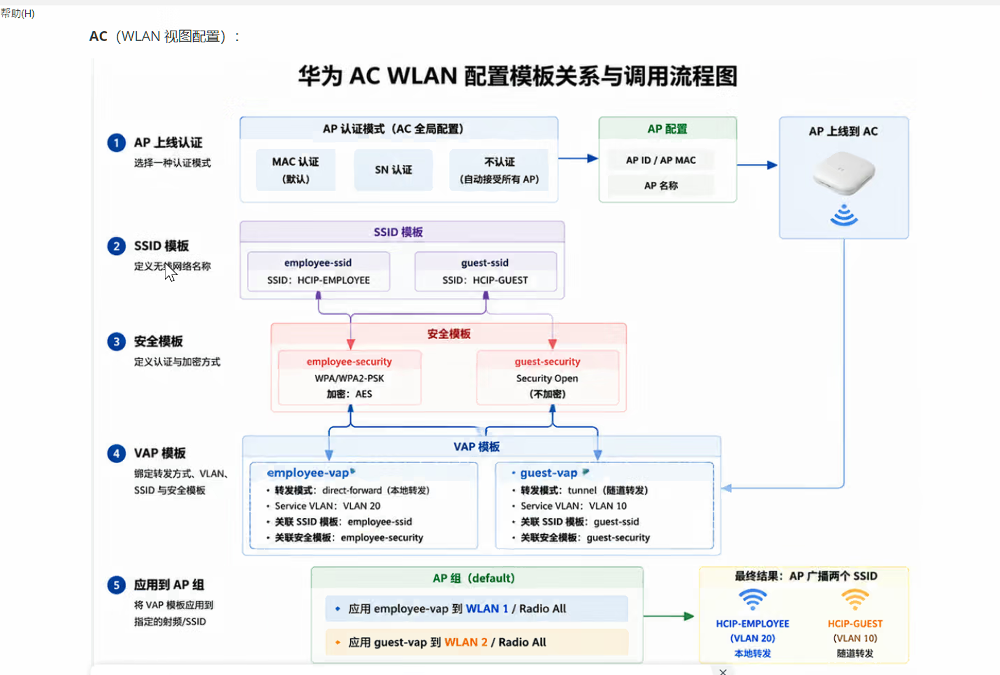

# DAY18：WLAN概念补充随笔

二层组网：所有AP和AC在同一个二层网络环境下。

三层组网：AP和AC不在一个二层网络中，处于三层网络互联的环境下。


DHCP的配置

#### 方式1：`dhcp select global`（全局地址池模式）

**判断逻辑**：设备会拿**接收请求的接口IP地址**，去和所有全局地址池的`network`段做**网段匹配**。

```bash
# 接口配置
interface Vlanif10
 ip address 192.168.10.1 255.255.255.0
 dhcp select global    # ← 告诉设备：用全局池，你自己去匹配

# 全局地址池
ip pool VLAN10
 network 192.168.10.0 mask 24    # ← 匹配！因为Vlanif10的IP属于这个网段
```

**匹配规则**：

- 请求从`Vlanif10`进来，它的IP是`192.168.10.1`
- 设备遍历所有全局池，找到`network 192.168.10.0/24`能包含`192.168.10.1`
- **就用这个池！**

> **关键点**：不需要显式绑定，设备自动“对号入座”。

------

#### 方式2：`dhcp select interface`（基于接口模式）

**判断逻辑**：直接使用**接口自身的IP地址网段**作为地址池，不需要另外创建`ip pool`。

```bash
interface Vlanif10
 ip address 192.168.10.1 255.255.255.0
 dhcp select interface    # ← 用接口自己的IP网段
 dhcp server dns-list 114.114.114.114
```

**效果**：

- 请求从`Vlanif10`进来 → 分配`192.168.10.2`-`192.168.10.254`（排除接口IP自己）
- 不需要创建`ip pool VLAN10`，系统自动生成一个隐含池

------

#### 方式3：`dhcp select relay`（中继模式）

**判断逻辑**：不自己分配，直接把请求**转发给指定的远端DHCP服务器**。

```bash
interface Vlanif10
 ip address 192.168.10.1 255.255.255.0
 dhcp select relay
 dhcp relay server-ip 10.10.10.100    # ← 转发给这个服务器
```

此时判断权在远端服务器，它会根据**请求报文中的网关地址（giaddr字段）**来选池。



### Wi-Fi安全协议对比

| 安全协议                     | 链路认证          | 接入认证             | 数据加密                  | 适用场景             | 安全级别 |
| :--------------------------- | :---------------- | :------------------- | :------------------------ | :------------------- | :------- |
| **WEP** (已淘汰)             | Open / Shared-Key | 不涉及               | 不加密 / WEP              | 无（极不安全）       | 🔴 危险   |
| **WPA/WPA2-802.1X** (企业级) | Open              | **802.1X (EAP)**     | **TKIP** / **CCMP (AES)** | 大型企业、政府、金融 | 🟢 高     |
| **WPA/WPA2-PSK** (个人级)    | Open              | **PSK (预共享密钥)** | **TKIP** / **CCMP (AES)** | 中小企业、家庭、SOHO | 🟡 中高   |


接口上使能ospf
```
interface Vlanif10
  ospf enable 1 area 0
```


### 三层组网的配置

Option43**概念**

1. Option43是DHCP协议中的一个标准选项字段，用于在DHCP服务器向客户端分配IP地址时携带额外的配置信息。
2. 在华为无线组网中，它专门用来携带AC的IP地址，让跨网段的AP能够获知AC的位置，从而建立CAPWAP隧道并上线。

**作用**

1. 解决三层组网中AP和AC不在同一网段时，AP无法通过广播方式自动发现AC的问题。
2. AP通过DHCP获取IP地址的同时，从Option43字段中解析出AC的IP地址，随后用单播方式发起连接请求。
3. 无需在AP上手工配置AC地址，实现AP的零配置上线。

**使用方法（以华为设备为例）**

1. 华为设备支持三种子选项格式，其中sub-option 3 ascii是最直观、最常用的方式，配置时直接写AC的IP地址字符串即可，不需要做十六进制转换。

2. 单个AC配置示例：假设AC的IP地址为`192.168.20.2`，在DHCP地址池视图下执行`option 43 sub-option 3 ascii 192.168.20.2`。

3. 多个AC配置示例：若有两个AC（`192.168.100.1`和`192.168.100.2`），用逗号分隔即可：`option 43 sub-option 3 ascii 192.168.100.1,192.168.100.2`。华为AP按指定顺序依次尝试连接，最多支持8个AC地址。

4. 在接口地址池中配置（接口视图）：
```
[L3-Vlanif2] dhcp server option 43 sub-option 3 ascii 192.168.20.2
```
这是在VLANIF接口下启用DHCP服务器功能后的配置方式。

5. 在全局地址池中配置（全局视图）：
```
[WAC-ip-pool-ap] option 43 sub-option 3 ascii 192.168.20.2
```
这是在创建全局地址池后的配置方式。

6. 其他可选格式：华为设备也支持sub-option 2 ip-address（直接填IP的十进制格式）和sub-option 1 hex（十六进制格式），但sub-option 3 ascii最为简洁直观。不同型号或版本对格式的兼容性可能有差异，建议以设备手册为准。


当处于三层网络时，也就是AC和AP被VLAN隔开的情况，假如AP处于业务VLAN100、200，AC被移动到处于VLAN10

当三层交换机有各个VLAN的IP时，此时有对应的直连路由，但此时AC没有回程路由，其找不到AP的路由，应该在AC上添加一个默认的回程路由


### 三层无线组网实验（AC跨VLAN管理AP）


#### 一、概念

1. Option43是DHCP协议中的一个标准选项字段，用于在DHCP服务器向客户端分配IP地址时携带额外的配置信息。
2. 在华为无线组网中，它专门用来携带AC的IP地址，让跨网段的AP能够获知AC的位置，从而建立CAPWAP隧道并上线。
3. 三层组网指的是AC和AP处于不同网段，中间隔着三层交换机，AP无法通过广播方式发现AC，必须借助Option43或DNS等方式获取AC地址。


#### 二、作用

1. 解决三层组网中AP和AC不在同一网段时，AP无法通过广播方式自动发现AC的问题。
2. AP通过DHCP获取IP地址的同时，从Option43字段中解析出AC的IP地址，随后用单播方式发起连接请求。
3. 无需在AP上手工配置AC地址，实现AP的零配置上线。
4. AC上配置默认路由指向三层交换机，确保AC发给AP的回包能够正确送达，避免每新增一个AP网段就加一条静态路由。


#### 三、使用方法（以华为设备为例）

1. 华为设备支持三种子选项格式，其中sub-option 3 ascii是最直观、最常用的方式，配置时直接写AC的IP地址字符串即可，不需要做十六进制转换。

2. 在接口地址池中配置（接口视图）：
```
[L3-Vlanif100] dhcp server option 43 sub-option 3 ascii 10.1.10.1
```

3. 在全局地址池中配置（全局视图）：
```
[WAC-ip-pool-ap] option 43 sub-option 3 ascii 10.1.10.1
```


#### 四、地址规划

| 设备 | VLAN    | 接口地址       | 说明        |
| ---- | ------- | -------------- | ----------- |
| AC   | VLAN10  | 10.1.10.1/24   | AC管理地址  |
| LSW1 | VLAN10  | 10.1.10.254/24 | AC网关      |
| LSW1 | VLAN100 | 10.1.100.1/24  | AP1管理网关 |
| LSW1 | VLAN200 | 10.1.200.1/24  | AP2管理网关 |
| LSW1 | VLAN102 | 11.1.1.1/30    | 与AR互联    |
| AR1  | VLAN102 | 11.1.1.2/30    | 与LSW1互联  |


#### 五、配置步骤

##### 1. LSW1（三层交换机）配置

```
vlan batch 10 100 200 102

# AP1接入端口（管理VLAN 100）
int g0/0/1
 port link-type trunk
 port trunk pvid vlan 100
 port trunk allow-pass vlan 100

# AP2接入端口（管理VLAN 200）
int g0/0/2
 port link-type trunk
 port trunk pvid vlan 200
 port trunk allow-pass vlan 200

# AC互联端口（放行VLAN10管理流量）
int g0/0/3
 port link-type trunk
 port trunk allow-pass vlan 10

# AR互联端口
int g0/0/4
 port link-type access
 port default vlan 102

# 各VLANIF接口配置
int Vlanif10
 ip add 10.1.10.254 24

int Vlanif100
 ip add 10.1.100.1 24
 dhcp select interface
 dhcp server option 43 sub-option 3 ascii 10.1.10.1

int Vlanif200
 ip add 10.1.200.1 24
 dhcp select interface
 dhcp server option 43 sub-option 3 ascii 10.1.10.1

int Vlanif102
 ip add 11.1.1.1 30

# 开启路由功能
ip routing

# 默认路由指向AR
ip route-static 0.0.0.0 0.0.0.0 11.1.1.2
```

##### 2. AC1（无线控制器）配置

```
vlan batch 10
int g0/0/1
 port link-type trunk
 port trunk allow-pass vlan 10

int Vlanif10
 ip add 10.1.10.1 24

# 指定CAPWAP隧道源接口
capwap source interface Vlanif10

# 默认路由指向三层交换机网关（关键：一条路由解决所有AP网段回程问题）
ip route-static 0.0.0.0 0.0.0.0 10.1.10.254

wlan
 ap auth-mode no-auth

 ap-group name group1

 regulatory-domain-profile name group1
  country-code cn

 ssid-profile name group1
  ssid wlan-test

 security-profile name group1
  security wpa-wpa2 psk pass-phrase Huawei@123 aes

 vap-profile name group1
  forward-mode tunnel
  service-vlan vlan-id 101
  security-profile group1
  ssid-profile group1

 ap-group name group1
  regulatory-domain-profile group1
  vap-profile group1 wlan 1 radio 0
  vap-profile group1 wlan 1 radio 1
```

##### 3. AR1（出口路由器）配置

```
int g0/0/0
 ip add 11.1.1.2 30

int LoopBack0
 ip add 100.100.100.100 32

# 回程路由指向LSW1
ip route-static 10.1.0.0 255.255.255.0 11.1.1.1
```


#### 六、AP上线配置

```
wlan
 ap-id 0
  ap-name AP1
  ap-group group1
 quit

 ap-id 1
  ap-name AP2
  ap-group group1
 quit
```


#### 七、验证命令

```
display ap all                       # 看AP状态是否为Normal
display ap unauthorized record       # 查看未认证AP连接记录
display vap ssid wlan-test           # 查看VAP是否生效
display ip routing-table             # AC上确认默认路由已配置
```


#### 八、流量走向说明

AP从DHCP获取地址时，通过Option43拿到AC的IP（10.1.10.1），随后发起CAPWAP请求。AC收到请求后需要回包，查询路由表发现去往AP网段（10.1.100.0/24、10.1.200.0/24）的下一跳全部指向默认路由10.1.10.254，即三层交换机。三层交换机拥有各AP管理VLAN的直连路由，将报文精确转发给对应AP，完成双向通信。


#### 九、关键点总结

| 关键点       | 说明                                                         |
| ------------ | ------------------------------------------------------------ |
| Option43配置 | 在三层交换机的AP管理VLAN地址池中配置，指向AC的IP             |
| AC默认路由   | 一条`0.0.0.0/0`指向三层交换机网关，解决所有AP网段回程问题，新增AP网段无需改AC |
| CAPWAP源接口 | AC上必须指定，告诉AP用哪个IP建隧道                           |
| 三层路由     | 交换机需开启`ip routing`，各网段之间路由可达                 |
| 安全模式     | 测试用no-auth，实际生产环境改成sn-auth或mac-auth             |


#### 十、与二层组网的区别

| 对比项       | 二层组网             | 三层组网                       |
| ------------ | -------------------- | ------------------------------ |
| AC与AP位置   | 同一网段             | 不同网段，中间隔三层交换机     |
| AP发现AC方式 | 广播自动发现         | 需通过Option43指定AC地址       |
| AC回程路由   | 不需要（同网段直连） | 需要（默认路由指向三层交换机） |
| 配置复杂度   | 简单                 | 稍复杂，需规划路由和Option43   |
| 适用场景     | 小型园区             | 大型园区，AP分布在不同网段     |


还可以在ENSP中添加Cloud ，与真机网卡桥接，然后就可以在网页中去访问AC的网页管理页面了
