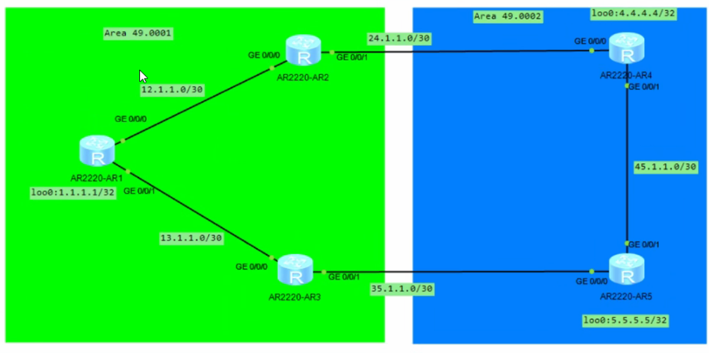

# ISIS

骨干区域：连续的level2设备相连组成区域的就是骨干区域，骨干区域的区域号可不相同

非骨干区域：区域号一致的Level-1设备组成的区域就是骨干区域


### 默认路由

当 L1/L2 路由器与 L2 设备相连时，它**会向所在的 L1 区域（非骨干区域）下发一条默认路由**（ATT 位置位），引导 L1 路由器将跨区域流量通过该 L1/L2 路由器转发到 L2 骨干


ATT位：在L1的邻居的LSP中，有一个ATT位的值，当其置为1时，就会自动生成指向邻居的默认路由

#### 1.手动设置Level 1-2设备的ATT

在 L 1-2 路由器上，可以使用该命令强制将自身的LSP的 ATT 位置为 1，不管它是否真的连接了 L2 骨干。收到此 LSP 的 L1 设备会无条件生成默认路由，也可以设置为0，也就是不生成默认路由。

```
isis 1
attached-bit advertise always #强制ATT置为1，L1收到会自动生成默认路由
attached-bit advertise never #强制ATT置为0，L1收到后默认不会理会
```

> **注意**：华为官方文档特别警告，如果在同一区域内多台设备都配置了 `always`，可能会引发**路由环路**。

#### 2.Level 1设备强制不生成默认路由

如果你不想让某一台 L1 设备学习默认路由（可能是为了防止次优路径或作为测试），可以在该 L1 设备上配置 `attached-bit avoid-learning`。这样即使收到 ATT=1 的 LSP，它也不会生成指向 L 1-2 的默认路由。

```
isis 1
attached-bit avoid-learning #强制不收默认路由
```

#### 3.发布默认路由

的边界L1路由R1可以向L1-2设备R2下发默认路由，也就是下（L1 R1）宣告上（L1-2 R2），R1告诉R2我有一个默认路由，不行可以路由到我这里。还可以添加avoid-learning参数不接收默认路由

```
default-route-advertise level-1 #向ISIS区域发布默认路由
default-route-advertise always avoid-learning ##向ISIS区域发布默认路由
```





### 路由渗透 ？？？ 没搞懂

可以通过import-route isis 把

```
[AR2]isis 1
[AR2-isis-1]import-route isis level-2 into level-1

[AR3]isis 1
[AR3-isis-1]import-route isis level-2 into level-1
```

isis 

ip perfix


### 路由认证

有三种认证

接口认证（L1、L2）

```  
[AR1]int g0/0/0 [AR1-GigabitEthernet0/0/0]isis authentication-mode md5 cipher Huawei@123 

[AR2]int g0/0/0 [AR2-GigabitEthernet0/0/0]isis authentication-mode md5 cipher Huawei@123
```

区域认证（L1）

``` [AR1-isis-1]area-authentication-mode md5 cipher Huawei@123
[AR2-isis-1]area-authentication-mode md5 cipher Huawei@123

[AR3-isis-1]area-authentication-mode md5 cipher Huawei@123 
```

路由域认证（L2）

```
[AR5-isis-1]domain-authentication-mode md5 cipher Huawei@123
```

**注意：**区域认证和路由域认证主要是用来防护开启该功能的设备的。

- 当本端开启了认证后，会对收到的`LSP`进行检查，如果这个`LSP`没有携带认证信息或者密码错误的话，都会被本地路由器忽略，不加入到`LSDB`。
- 本端发送的`LSP`中也会携带认证信息，如果一台没有开启认证的设备收到后，会加入到`LSDB`中，不会忽略。

有一个例外，如果你在配置认证时加了`all-send-only`参数后，本端路由器仅对发送的`PDU`进行身份验证，不检查接收到的`PDU`，也就是所有的`PDU`都收。

```
domain-authentication-mode md5 cipher Huawei@123 all-send-only
```


### 路由汇总

#### Level-1汇总

ISIS支持在路由所属的路由上进行路由汇总

比如L1上有三个Loop IP，对应会有三个对应的明细路由

这些路由有相同的大子网，没有必要分出三条

```
R1
192.168.1.254 255.255.255.0
192.168.2.254 255.255.255.0
192.168.3.254 255.255.255.0
```

此时会有三个路由指向R1，可以通过summary进行汇总，后面标注的是将其汇总为什么路由

```
[AR1]isis 1
[AR1-isis-1]summary 192.168.0.0 255.255.0.0 level-1
```

#### Level 1-2汇总

在L1-2 的设备R4上可以将L1区域内的某设备的多条可汇总的路由，例如R1上的多条路由，进行汇总

还是summary命令，该汇总的目的是给L2区域汇总L1区域的路由，所以标注为level 2路由

```
[AR4]isis 1
[AR4-isis-1]summary 192.168.0.0 255.255.0.0 level-2
```

#### Level2 汇总

在Level2的区域内，某路由设备上如果有多条相同大子网的明细路由，例如R6设备上宣告了3个回环口进入ISIS网络，

```
R6
172.16.10.254/32
172.16.20.254/32
172.16.30.254/32
```

如果不处理，相同L2区域的设备就会学习到三条明细路由，此时就可以在R6，也就是始发路由上进行汇总

```
[AR6]isis 1
[AR6-isis-1]summary 172.16.0.0 255.255.0.0 level-2
```

命令和L1-2是一致的，因为汇总的路由只有L1区域和L2区域之分，有设备类型之分。

#### 静默接口（Silent-Interface）

```
[AR5]int g0/0/0
[AR5-GigabitEthernet0/0/0]isis silent
```

- `advertise-zero-cost`：`IS-IS`会将该接口的直连网段以**开销=0**的形式通告出去。如果不加参数，以实际开销发布。